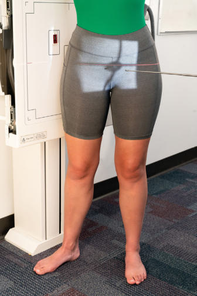
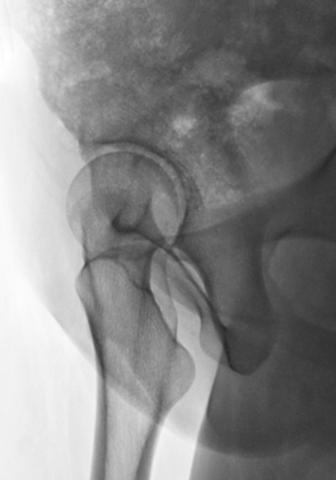

# Rx ACETABULUM Oblică (FALSE PROFILE METHOD6)

  📷 Radiografie Convențională (Rx)
  <strong>Actualizat:</strong> 2026-09-15
  <strong>Autor:</strong> Departamentul de Radiologie / Referință Bontrager

---

-   __1. Rezumat Clinic & Indicații__

    ---

    === "Indicații Clinice"

        - Șold dysplasia and instability
        - Femoroacetabular impingement (FAI) The concave area of the fovea capitis should be demonstrated, along with the superolateral aspect of the acetabulum.

    === "Ghid Național IRIS"

        !!! info "Referință Primară: Ghidul Național IRIS (Ordinul MS 1342/2012)"
            - **Capitol Ghid IRIS:** *Ghidul Național IRIS*
            - **Grad de Recomandare:** **De verificat pe indicație; fără grad atribuit automat**
            - **Nivel de Iradiere Estimată:** `De verificat pentru examinarea și populația selectate`

            [:octicons-search-16: Deschide Ghidul IRIS](../../iris.md){ .md-button .md-button--primary } [:material-open-in-new: Aplicația Oficială PWA](https://radiologie-pediatrica.ro/iris/){ .md-button target="_blank" rel="noopener" }
-   __2. Poziționare & Centrare Fascicul__

    ---

    - **Poziție Pacient:** Pacient: ObliqueFalse Profile Projection Patient Ortostatism or Decubit (Ortostatism recommended); Regiune anatomică: Place patient in posterior oblique, with both Bazin (Pelvis) and thorax rotated 65 degrees to the wall bucky (Fig. 7.64). Rotate dependent lower limb until Picior is parallel to IR (see
    - **Punct de Centrare Fascicul:** perpendicular to IR.
    - **Distanță Focar-Film (DFF / SID):** 100 cm
    - **Comandă Respiratorie:** Suspend respiration for the exposure. Bazin (Pelvis) SPECIAL Acetabulum and femoral head, including the fovea capitis Posterior axial oblique acetabulum (Teufel method) Oblique acetabulum (False profile method) Fig. 7.65 False profile projection. (From Atkins PR, Kobayashi EF, Anderson AE, Aoki SK, et al: Modified falseprofile radiograph of the Șold provides better visualization of the anterosuperior femoral headneck junction. Arthroscopy 34(4):1236–1243.) Fig. 7.64 False profile projection.

-   __3. Parametri Tehnici Expunere__

    ---

    | Parametru Tehnic | Valoare Configurare Generator / Tub |
    |:-----------------|:-------------------------------------|
    | **Tensiune Tub (kV)** | 75-85 kV |
    | **Sarcină / Produs Curent-Timp (mAs)** | DE CONFIGURAT PE APARAT |
    | **Distanță Focar-Film (DFF / SID)** | 100 cm |
    | **Grilă Antidifuzoare (Bucky)** | Cu grilă antidifuzoare Bucky |
    | **Dimensiune Focar** | Focar Mic (0.6 mm) |
    | **Camere de Ionizare AEC** | Camerele laterale (sau camera centrală funcție de regiune) |
    | **Colimare Fascicul** | Collimate on four sides to anatomy of interest. |
    | **Filtrare Tub** | Totală ≥ 2.5 mm Al echivalent |

-   __4. Criterii de Calitate & Reușită Imagine__

    ---

    - The superolateral aspect of acetabulum with the femoral head centered within it (Fig. 7.65). Proximal femoral head, neck and acetabulum is demonstrated Position:
    - Proper degree of obliquity is evidenced by visualization of the superolateral aspect of the acetabulum with the femoral head centered and in profile.
    - Collimation field size to area of interest. Exposure:
    - Optimal image receptor exposure and contrast of the bony margins and trabecular markings of the acetabulum and femoral head regions; such markings should appear sharp, indicating no motion.

-   __5. Protecție Radiologică (ALARA)__

    ---

    - Ecranare gonadică și a organelor radiosensibile conform procedurilor locale de radioprotecție ALARA.
    - Colimare strictă la aria de interes pentru limitarea radiației difuze.
    - Verificarea posibilității unei sarcini la pacientele de vârstă fertilă înainte de expunere.

!!! note "Observații Clinice & Tehnice"
    The modified false profile projection is positioned in the same manner but with the dependent lower limb and Picior rotated internally 35 degrees away from the IR (Figs. 7.66 and 7.67).

### 🖼️ Imagini

<figure class="protocol-image-card" markdown>

<figcaption><strong>Fig. 7.65 False profile projection. (From Atkins PR, Kobayashi EF,</strong> — Poziționare pacient conform Ghidului Bontrager (Fig. 7.65 False profile projection. (From Atkins PR, Kobayashi EF,)</figcaption>

</figure>

<figure class="protocol-image-card" markdown>

<figcaption><strong>Fig. 7.64 False profile projection.</strong> — Aspect radiografic de referință conform Ghidului Bontrager (Fig. 7.64 False profile projection.)</figcaption>

</figure>

=== "Ghid Rapid de Execuție"

    1. **Identificarea și verificarea pacientului:** verificare identitate, zonă de examinat, consimțământ conform procedurii și evaluarea posibilității unei sarcini, când este relevantă.
    2. **Pregătire:** îndepărtarea oricăror obiecte radiopace (bijuterii, agrafe, fermoare, proteze, pansamente dense).
    3. **Poziționare precisă:** alinierea receptorului de imagine și a tubului la distanța prescrisă (100 cm).
    4. **Colimare strictă:** adaptarea fasciculului strict la regiunea de diagnostic pentru scăderea iradierii și reducerea radiației difuze.
    5. **Radioprotecție:** verificarea [politicii RX](../radioprotectie.md), cu măsuri distincte pentru pacient, personal și însoțitor.

## Surse de documentare

- [Bontrager's Textbook of Radiographic Positioning (Ed. 9/10), Pagina 303](https://www.elsevier.com/books/textbook-of-radiographic-positioning-and-related-anatomy/lampignano/978-0-323-65367-1)
