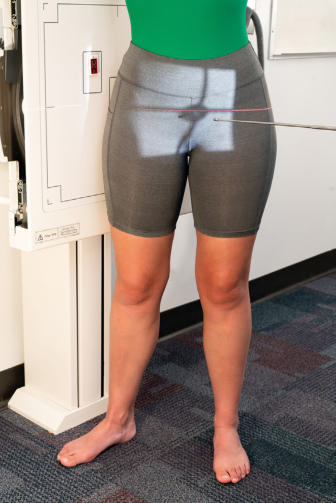
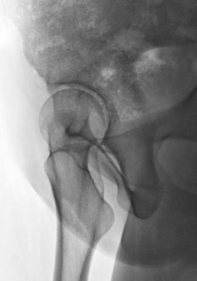

# Rx acetabul — incidență oblică (metoda falsului profil [6])

  📷 Radiografie Convențională (Rx)
  <strong>Actualizat:</strong> 2026-09-15
  <strong>Autor:</strong> Departamentul de Radiologie / Referință Bontrager

---

-   __1. Rezumat Clinic & Indicații__

    ---

    === "Indicații Clinice"

        - Displazie și instabilitate a șoldului
        - Conflict femuroacetabular (FAI): zona concavă a foveei capitis trebuie evidențiată, împreună cu aspectul superolateral al cotilului (acetabulului).

    === "Ghid Național IRIS"

        !!! info "Referință Primară: Ghidul Național IRIS (Ordinul MS 1342/2012)"
            - **Capitol Ghid IRIS:** *Aparat locomotor & Membru inferior*
            - **Grad de Recomandare:** **Grad A**
            - **Nivel de Iradiere Estimată:** `Clasa 1 (Minimă < 0.01 mSv)`

            [:octicons-search-16: Deschide Ghidul IRIS](../../iris.md){ .md-button .md-button--primary } [:material-open-in-new: Aplicația Oficială PWA](https://radiologie-pediatrica.ro/iris/){ .md-button target="_blank" rel="noopener" }

-   __2. Poziționare & Centrare Fascicul__

    ---

    - **Poziție Pacient:** Pacient: Incidență oblică de profil fals; pacientul în ortostatism sau decubit (ortostatism recomandat); Regiune anatomică: Se așază pacientul în oblic posterior, cu ambele hemibazine și toracele rotite la 65 de grade față de peretele Bucky (Fig. 7.64). Se rotește membrul inferior dependent până când piciorul este paralel cu receptorul de imagine (vezi
    - **Punct de Centrare Fascicul:** perpendicular pe receptorul de imagine.
    - **Distanță Focar-Film (DFF / SID):** 100 cm
    - **Comandă Respiratorie:** Apnee pe durata expunerii pentru expunere. Bazin (pelvis), SPECIAL cotil (acetabul) și cap femural, inclusiv fovea capitis; incidența axială oblică posterioară a cotilului (acetabulului) (metoda Teufel); incidența oblică a cotilului (acetabulului) (metoda profilului fals); Fig. 7.65 Incidența profilului fals. (după Atkins PR, Kobayashi EF, Anderson AE, Aoki SK și colab.: Radiografia profilului fals modificat a șoldului oferă o vizualizare mai bună a joncțiunii anterosuperioare cap femural-col femural. Arthroscopy 34(4):1236–1243.) Fig. 7.64 Incidența profilului fals.

-   __3. Parametri Tehnici Expunere__

    ---

    | Parametru Tehnic | Valoare Configurare Generator / Tub |
    |:-----------------|:-------------------------------------|
    | **Tensiune Tub (kV)** | 75-85 kV |
    | **Sarcină / Produs Curent-Timp (mAs)** | DE CONFIGURAT PE APARAT |
    | **Distanță Focar-Film (DFF / SID)** | 100 cm |
    | **Grilă Antidifuzoare (Bucky)** | Cu grilă antidifuzoare Bucky |
    | **Dimensiune Focar** | Focar Mic (0.6 mm) |
    | **Camere de Ionizare AEC** | Camerele laterale (sau camera centrală, în funcție de regiune) |
    | **Colimare Fascicul** | Colimați pe cele patru laturi la anatomia de interes. |
    | **Filtrare Tub** | Totală ≥ 2.5 mm Al echivalent |

-   __4. Criterii de Calitate & Reușită Imagine__

    ---

    - aspectul superolateral al cotilului (acetabulului), cu capul femural centrat în acesta (Fig. 7.65). Capul femural proximal, colul și cotilul (acetabulul) sunt evidențiate în poziție:
    - Gradul corect de oblicitate este evidențiat prin vizualizarea aspectului superolateral al cotilului (acetabulului), cu capul femural centrat și în profil.
    - Dimensiunea câmpului de colimare până la aria de interes diagnostic. Expunere:
    - Expunere optimă a receptorului de imagine și contrast pentru marginile osoase și desenul trabecular al regiunilor cotilului (acetabulului) și capului femural; aceste elemente trebuie să apară clare, indicând absența mișcării.

-   __5. Protecție Radiologică (ALARA)__

    ---

    - Ecranare gonadică și a organelor radiosensibile conform procedurilor locale de radioprotecție ALARA.
    - Colimare strictă la aria de interes pentru limitarea radiației difuze.
    - Verificarea posibilității unei sarcini la pacientele de vârstă fertilă înainte de expunere.

!!! note "Observații Clinice & Tehnice"
    Incidența de profil fals modificat este poziționată în același mod, dar cu membrul inferior dependent și piciorul rotit intern la 35 de grade în sens opus receptorului de imagine (Fig. 7.66 și 7.67).

### 🖼️ Imagini

<figure class="protocol-image-card" markdown>

<figcaption><strong>Fig. 7.65 Incidență de profil fals. (după Atkins PR, Kobayashi EF,</strong> — Poziționarea pacientului conform Ghidului Bontrager (Fig. 7.65 Incidență de profil fals. (după Atkins PR, Kobayashi EF,)</figcaption>

</figure>

<figure class="protocol-image-card" markdown>

<figcaption><strong>Fig. 7.64 Incidență de profil fals.</strong> — Aspect radiografic de referință conform Ghidului Bontrager (Fig. 7.64 Incidență de profil fals.)</figcaption>

</figure>

=== "Ghid Rapid de Execuție"

    1. **Identificarea și verificarea pacientului:** verificare identitate, zonă de examinat, consimțământ conform procedurii și evaluarea posibilității unei sarcini, când este relevantă.
    2. **Pregătire:** îndepărtarea oricăror obiecte radiopace (bijuterii, agrafe, fermoare, proteze, pansamente dense).
    3. **Poziționare precisă:** alinierea receptorului de imagine și a tubului la distanța prescrisă (100 cm).
    4. **Colimare strictă:** adaptarea fasciculului strict la regiunea de diagnostic pentru scăderea iradierii și reducerea radiației difuze.
    5. **Radioprotecție:** verificarea [politicii RX](../radioprotectie.md), cu măsuri distincte pentru pacient, personal și însoțitor.

## Surse de documentare

- [Bontrager's Textbook of Radiographic Positioning (Ed. 9/10), Pagina 303](https://www.elsevier.com/books/textbook-of-radiographic-positioning-and-related-anatomy/lampignano/978-0-323-65367-1)
