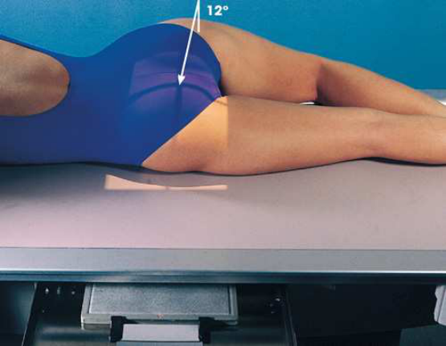
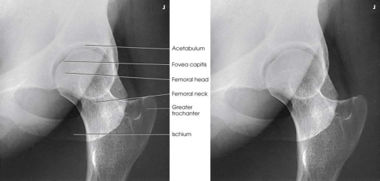

# Rx Acetabulum — Oblică Axială PA — Teufel Method RAO or Oblică Anterioară Stângă (OAS / LAO) (Merrill)

  📷 Radiografie Convențională (Rx)
  <strong>Actualizat:</strong> 2026-09-16
  <strong>Autor:</strong> Referință Merrill

---

-   __1. Rezumat Clinic & Indicații__

    ---

    === "Indicații Clinice"

        - Conform reperelor anatomice standard din tratat

    === "Ghid Național IRIS"

        !!! info "Referință Primară: Ghidul Național IRIS (Ordinul MS 1342/2012)"
            - **Capitol Ghid IRIS:** *Ghidul Național IRIS*
            - **Grad de Recomandare:** **De verificat pe indicație; fără grad atribuit automat**
            - **Nivel de Iradiere Estimată:** `De verificat pentru examinarea și populația selectate`

            [:octicons-search-16: Deschide Ghidul IRIS](../../iris.md){ .md-button .md-button--primary } [:material-open-in-new: Aplicația Oficială PWA](https://radiologie-pediatrica.ro/iris/){ .md-button target="_blank" rel="noopener" }
-   __2. Poziționare & Centrare Fascicul__

    ---

    - **Poziție Pacient:** Se instruiește pacientul să lie Decubit în anterior Incidență Oblică pe afected side.; se aliniază corp și se centrează Șold being examined la linia mediană grilă. Elevate unafected side astfel încât anterior surface de corp forms a 38-grade angle de la masa de examinare (Fig. 8.40). Se instruiește pacientul să support corp pe Antebraț și flectat Genunchi de ridicat side. cu receptorul de imagine în tăvița Bucky, se ajustează poziție de receptorul de imagine so that its midpoint coincides cu raza centrală centrală.
    - **Punct de Centrare Fascicul:** orientat through cotil (acetabul) la un unghi de 12 grade cranial. raza centrală enters corp la inferior level de Coccis și approximately 2 inches (5 cm) lateral la MSP spre side being examined.
    - **Distanță Focar-Film (DFF / SID):** Nespecificat în fragmentul extras; de verificat în sursă
    - **Comandă Respiratorie:** apnee (oprirea respirației).

-   __3. Parametri Tehnici Expunere__

    ---

    | Parametru Tehnic | Valoare Configurare Generator / Tub |
    |:-----------------|:-------------------------------------|
    | **Tensiune Tub (kV)** | DE CONFIGURAT PE APARAT |
    | **Sarcină / Produs Curent-Timp (mAs)** | DE CONFIGURAT PE APARAT |
    | **Distanță Focar-Film (DFF / SID)** | Nespecificat în fragmentul extras; de verificat în sursă |
    | **Grilă Antidifuzoare (Bucky)** | DE CONFIGURAT PE APARAT |
    | **Dimensiune Focar** | DE CONFIGURAT PE APARAT |
    | **Camere de Ionizare AEC** | DE CONFIGURAT PE APARAT |
    | **Colimare Fascicul** | Se ajustează câmpul de iradiere la formatul 24 × 30 cm pe colimator. Se plasează markerul de lateralitate în câmpul colimat. |
    | **Filtrare Tub** | DE CONFIGURAT PE APARAT |

-   __4. Criterii de Calitate & Reușită Imagine__

    ---

    - Criterii radiologice de calitate imaginii:
    - Colimare adecvată vizibilă și prezența markerului de lateralitate (D/S) plasat clear de anatomy de interest
    - Șold articulație și cotil (acetabul) near center de radiografie
    - cap femural în profile la show concave area de fovea capitis
    - Superoposterior perete de cotil (acetabul)
    - Bony detalii trabeculare osoase și surrounding soft tissues

-   __5. Protecție Radiologică (ALARA)__

    ---

    - Nespecificat în fragmentul extras; de verificat în sursă

!!! note "Observații Clinice & Tehnice"
    Conform reperelor anatomice standard din tratat

### 🖼️ Imagini

<figure class="protocol-image-card" markdown>

<figcaption><strong>Merrill — pagina PDF 635, imaginea 1</strong> — Imagine din fragmentul sursă; asocierea necesită revizie.</figcaption>

</figure>

<figure class="protocol-image-card" markdown>

<figcaption><strong>Merrill — pagina PDF 636, imaginea 2</strong> — Imagine din fragmentul sursă; asocierea necesită revizie.</figcaption>

</figure>

=== "Ghid Rapid de Execuție"

    1. **Identificarea și verificarea pacientului:** verificare identitate, zonă de examinat, consimțământ conform procedurii și evaluarea posibilității unei sarcini, când este relevantă.
    2. **Pregătire:** îndepărtarea oricăror obiecte radiopace (bijuterii, agrafe, fermoare, proteze, pansamente dense).
    3. **Poziționare precisă:** alinierea receptorului de imagine și a tubului la distanța prescrisă (Nespecificat în fragmentul extras; de verificat în sursă).
    4. **Colimare strictă:** adaptarea fasciculului strict la regiunea de diagnostic pentru scăderea iradierii și reducerea radiației difuze.
    5. **Radioprotecție:** verificarea [politicii RX](../radioprotectie.md), cu măsuri distincte pentru pacient, personal și însoțitor.

## Surse de documentare

- [Merrill’s Atlas, 8. Pelvis and Hip, pagini PDF 634–636](../../assets/protocols/sources/a56d45c16829_Merrills_Atlas_of_Radiographic_Positioning__Procedures_3Vol_Set.pdf#page=634)

## Fragmente sursă traduse (referință tehnică)

### anatomy

fovea capitis și superoposterior perete de cotil (acetabul) (Fig. 8.41).

### collimation

• Se ajustează câmpul de iradiere la formatul 24 × 30 cm pe colimator. Se plasează markerul de lateralitate în câmpul colimat.

### cr

• orientat through cotil (acetabul) la un unghi de 12 grade cranial. raza centrală enters corp la inferior level de coccyx
și approximately 2 inches (5 cm) lateral la MSP spre side being examined.

### criteria

Criterii radiologice de calitate imaginii:
• Colimare adecvată vizibilă și prezența markerului de lateralitate (D/S) plasat clear de anatomy de interest
• Hip articulație și cotil (acetabul) near center de radiografie
• cap femural în profile la show concave area de fovea capitis
• Superoposterior perete de cotil (acetabul)
• Bony detalii trabeculare osoase și surrounding soft tissues

### part_pos

• se aliniază corp și se centrează hip being examined la linia mediană grilă.
• Elevate unafected side astfel încât anterior surface de corp forms a 38-grade angle de la masa de examinare (Fig. 8.40).
• Se instruiește pacientul să support corp pe forearm și flectat genunchi de ridicat side.
• cu receptorul de imagine în tăvița Bucky, se ajustează poziție de receptorul de imagine so that its midpoint coincides cu raza centrală centrală.

### patient_pos

• Se instruiește pacientul să lie recumbent în anterior oblic poziție pe afected side.

### respiration

apnee (oprirea respirației).

### tech

poziționat prin manufacturer sau department protocol pentru corect anatomy display orientation; raza centrală plate: 10 × 12 inches (24 ×
30 cm) longitudinal.

