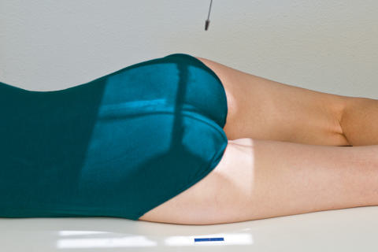
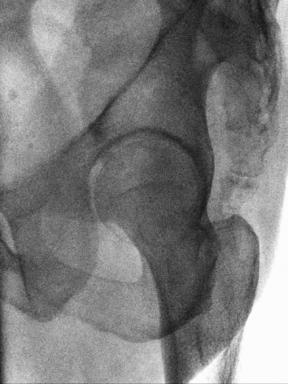
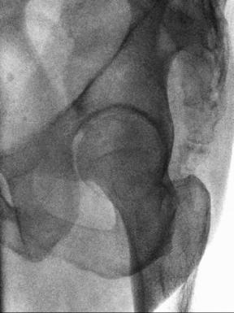

# Rx ACETABULUM PA AXIAL Oblică (TEUFEL METHOD)

  📷 Radiografie Convențională (Rx)
  <strong>Actualizat:</strong> 2026-09-15
  <strong>Autor:</strong> Departamentul de Radiologie / Referință Bontrager

---

-   __1. Rezumat Clinic & Indicații__

    ---

    === "Indicații Clinice"

        - Acetabular suspiciune de fractură, especially superoposterior perete de cotil (acetabul)
        - Congenital defects de cotil (acetabul) drept sau stâng posterior oblic este taken la evidențiază side de interest, centrat pe downside cotil (acetabul) la evidențiază Șold articulație și cotil (acetabul) în center de imagine, cu cap femural în profile. concave area de fovea capitis trebuie să fie evidențiat, along cu superoposterior perete de cotil (acetabul).

    === "Ghid Național IRIS"

        !!! info "Referință Primară: Ghidul Național IRIS (Ordinul MS 1342/2012)"
            - **Capitol Ghid IRIS:** *Ghidul Național IRIS*
            - **Grad de Recomandare:** **De verificat pe indicație; fără grad atribuit automat**
            - **Nivel de Iradiere Estimată:** `De verificat pentru examinarea și populația selectate`

            [:octicons-search-16: Deschide Ghidul IRIS](../../iris.md){ .md-button .md-button--primary } [:material-open-in-new: Aplicația Oficială PWA](https://radiologie-pediatrica.ro/iris/){ .md-button target="_blank" rel="noopener" }
-   __2. Poziționare & Centrare Fascicul__

    ---

    - **Poziție Pacient:** Pacient: axial oblic poziții cu pacient semiprone, provide pillow pentru cap și poziție pentru affected side down. poziție poate fie performed Ortostatism.; Regiune anatomică: Place pacient în anterior oblic, cu ambele Bazin (bazin (pelvis)) și thorax 35 la 40 grade de la tabletop sau perete bucky. Support cu wedge sponge (Fig. 7.61). Align cap femural și cotil (acetabul) de interest la midline de tabletop și/sau receptorul de imagine. Center receptorul de imagine longitudinally la raza centrală la level de cap femural.
    - **Punct de Centrare Fascicul:** When anatomy de interest este downside, direct Raza centrală perpendiculară și centrat pe 1 inch (2.5 cm) superior la level de marele trohanter, approximately 2 inches (5 cm) lateral la planul mediosagital. Angle raza centrală 12 grade cranial.
    - **Distanță Focar-Film (DFF / SID):** 100 cm
    - **Comandă Respiratorie:** Apnee pe durata expunerii pentru expunere. Fig. 7.62 PA axial oblic (Teufel) incidență. Bazin (bazin (pelvis)) SPECIAL cotil (acetabul) și cap femural, including fovea capitis posterior axial oblic cotil (acetabul) (Teufel method) Fig. 7.61 PA axial oblic (Teufel) incidență—12degree cranial angle.

-   __3. Parametri Tehnici Expunere__

    ---

    | Parametru Tehnic | Valoare Configurare Generator / Tub |
    |:-----------------|:-------------------------------------|
    | **Tensiune Tub (kV)** | 75-85 kV |
    | **Sarcină / Produs Curent-Timp (mAs)** | DE CONFIGURAT PE APARAT |
    | **Distanță Focar-Film (DFF / SID)** | 100 cm |
    | **Grilă Antidifuzoare (Bucky)** | Cu grilă antidifuzoare Bucky |
    | **Dimensiune Focar** | Focar Mic (0.6 mm) |
    | **Camere de Ionizare AEC** | Camerele laterale (sau camera centrală funcție de regiune) |
    | **Colimare Fascicul** | field size. Collimation field size la aria de interes diagnostic. expunere: optim receptorul de imagine expunere și contrast de bony margins și trabecular markings de cotil (acetabul) și cap femural regions; such markings trebuie să appear net, indicating fără mișcare. cotil (acetabul) marele trohanter Fovea capitis tuberozități ischiatice găuri obturatoare Fig. 7.63 PA axial oblic (Teufel) incidență. |
    | **Filtrare Tub** | Totală ≥ 2.5 mm Al echivalent |

-   __4. Criterii de Calitate & Reușită Imagine__

    ---

    - centrat pe downside cotil (acetabul), superoposterior perete de cotil (acetabul) este evidențiat (Figs. 7.62 și 7.63). poziție:
    - corect grade de obliquity este evidenced prin visualization de concave area de fovea capitis cu cap femural în profile.
    - găuri obturatoare trebuie să fie open, if rotit correctly. cotil (acetabul) trebuie să fie centrat pe receptorul de imagine și la

-   __5. Protecție Radiologică (ALARA)__

    ---

    - Ecranare gonadică și a organelor radiosensibile conform procedurilor locale de radioprotecție ALARA.
    - Colimare strictă la aria de interes pentru limitarea radiației difuze.
    - Verificarea posibilității unei sarcini la pacientele de vârstă fertilă înainte de expunere.

### 🖼️ Imagini

<figure class="protocol-image-card" markdown>

<figcaption><strong>Fig. 7.62 PA axial oblic (Teufel) incidență.</strong> — Poziționare pacient conform Ghidului Bontrager (Fig. 7.62 PA axial oblic (Teufel) incidență.)</figcaption>

</figure>

<figure class="protocol-image-card" markdown>

<figcaption><strong>Fig. 7.61 PA axial oblic (Teufel) incidență—12-</strong> — Aspect radiografic de referință conform Ghidului Bontrager (Fig. 7.61 PA axial oblic (Teufel) incidență—12-)</figcaption>

</figure>

<figure class="protocol-image-card" markdown>

<figcaption><strong>Fig. 7.63 PA axial oblic (Teufel) incidență.</strong> — Aspect radiografic de referință conform Ghidului Bontrager (Fig. 7.63 PA axial oblic (Teufel) incidență.)</figcaption>

</figure>

=== "Ghid Rapid de Execuție"

    1. **Identificarea și verificarea pacientului:** verificare identitate, zonă de examinat, consimțământ conform procedurii și evaluarea posibilității unei sarcini, când este relevantă.
    2. **Pregătire:** îndepărtarea oricăror obiecte radiopace (bijuterii, agrafe, fermoare, proteze, pansamente dense).
    3. **Poziționare precisă:** alinierea receptorului de imagine și a tubului la distanța prescrisă (100 cm).
    4. **Colimare strictă:** adaptarea fasciculului strict la regiunea de diagnostic pentru scăderea iradierii și reducerea radiației difuze.
    5. **Radioprotecție:** verificarea [politicii RX](../radioprotectie.md), cu măsuri distincte pentru pacient, personal și însoțitor.

## Surse de documentare

- [Bontrager's Textbook of Radiographic Positioning (Ed. 9/10), Pagina 302](https://www.elsevier.com/books/textbook-of-radiographic-positioning-and-related-anatomy/lampignano/978-0-323-65367-1)
