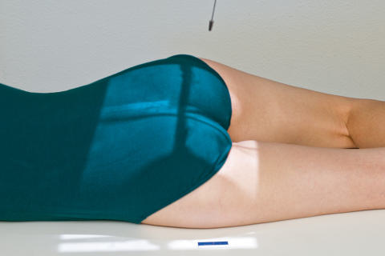
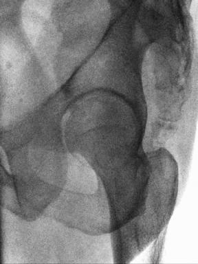
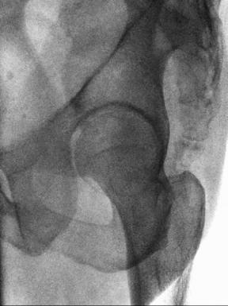

# Rx ACETABULUM Incidență oblică axială PA (METODA TEUFEL)

  📷 Radiografie Convențională (Rx)
  <strong>Actualizat:</strong> 2026-09-15
  <strong>Autor:</strong> Departamentul de Radiologie / Referință Bontrager

---

-   __1. Rezumat Clinic & Indicații__

    ---

    === "Indicații Clinice"

        - Suspiciune de fractură acetabulară, în special a peretelui superoposterior al cotilului (acetabulului)
        - Defecte congenitale ale cotilului (acetabulului) drept sau stâng. Se efectuează incidența oblică posterioară pentru a evidenția partea de interes, cu centrul pe cotilul (acetabulul) inferior, pentru a evidenția articulația șoldului și cotilul (acetabulul) în centrul imaginii, cu capul femural în profil. Zona concavă a foveei capitis trebuie evidențiată, împreună cu peretele superoposterior al cotilului (acetabulului).

    === "Ghid Național IRIS"

        !!! info "Referință Primară: Ghidul Național IRIS (Ordinul MS 1342/2012)"
            - **Capitol Ghid IRIS:** *Aparat locomotor & Membru inferior*
            - **Grad de Recomandare:** **Grad A**
            - **Nivel de Iradiere Estimată:** `Clasa 1 (Minimă < 0.01 mSv)`

            [:octicons-search-16: Deschide Ghidul IRIS](../../iris.md){ .md-button .md-button--primary } [:material-open-in-new: Aplicația Oficială PWA](https://radiologie-pediatrica.ro/iris/){ .md-button target="_blank" rel="noopener" }

-   __2. Poziționare & Centrare Fascicul__

    ---

    - **Poziție Pacient:** Pacient: poziții oblice axiale, cu pacientul semipron, cu o pernă pentru cap și cu partea afectată în jos. Poziția poate fi efectuată în ortostatism.; Regiune anatomică: Se așază pacientul în oblic anterior, cu ambele hemibazine și toracele la 35–40 de grade față de masa radiologică sau peretele Bucky. Se susține cu un burete în formă de pană (Fig. 7.61). Se aliniază capul femural și cotilul (acetabulul) de interes la linia mediană a mesei radiologice și/sau a receptorului de imagine. Se centrează longitudinal receptorul de imagine pe raza centrală, la nivelul capului femural.
    - **Punct de Centrare Fascicul:** Când anatomia de interes este în partea inferioară, se direcționează raza centrală perpendicular și se centrează la 1 țol (2.5 cm) superior de nivelul marelui trohanter, la aproximativ 2 țoli (5 cm) lateral de planul mediosagital. Se angulează raza centrală cu 12 grade cranial.
    - **Distanță Focar-Film (DFF / SID):** 100 cm
    - **Comandă Respiratorie:** Apnee pe durata expunerii. Fig. 7.62 Incidență oblică axială PA (Teufel). Bazin SPECIAL, cotil (acetabul) și cap femural, inclusiv fovea capitis; cotil posterior în oblic axial (metoda Teufel). Fig. 7.61 Incidență oblică axială PA (Teufel)—unghi cranial de 12 grade.

-   __3. Parametri Tehnici Expunere__

    ---

    | Parametru Tehnic | Valoare Configurare Generator / Tub |
    |:-----------------|:-------------------------------------|
    | **Tensiune Tub (kV)** | 75-85 kV |
    | **Sarcină / Produs Curent-Timp (mAs)** | DE CONFIGURAT PE APARAT |
    | **Distanță Focar-Film (DFF / SID)** | 100 cm |
    | **Grilă Antidifuzoare (Bucky)** | Cu grilă antidifuzoare Bucky |
    | **Dimensiune Focar** | Focar Mic (0.6 mm) |
    | **Camere de Ionizare AEC** | Camerele laterale (sau camera centrală, în funcție de regiune) |
    | **Colimare Fascicul** | dimensiunea câmpului. Se limitează câmpul de colimare la aria de interes diagnostic. Expunere: expunere optimă a receptorului de imagine și contrast pentru marginile osoase și desenul trabecular al regiunilor cotilului (acetabulului) și capului femural; aceste elemente trebuie să apară clare, indicând absența mișcării. cotilul (acetabulul), marele trohanter, fovea capitis, tuberozitățile ischiatice, găurile obturatoare. Fig. 7.63 Incidență oblică axială PA (Teufel). |
    | **Filtrare Tub** | Totală ≥ 2.5 mm Al echivalent |

-   __4. Criterii de Calitate & Reușită Imagine__

    ---

    - centrat pe cotilul (acetabulul) inferior; peretele superoposterior al cotilului (acetabulului) este evidențiat (Fig. 7.62 și 7.63). poziție:
    - Gradul corect de oblicitate este evidențiat prin vizualizarea zonei concave a foveei capitis, cu capul femural în profil.
    - găurile obturatoare trebuie să fie deschise dacă este rotit corect. Cotilul (acetabulul) trebuie să fie centrat pe receptorul de imagine și la

-   __5. Protecție Radiologică (ALARA)__

    ---

    - Ecranare gonadică și a organelor radiosensibile conform procedurilor locale de radioprotecție ALARA.
    - Colimare strictă la aria de interes pentru limitarea radiației difuze.
    - Verificarea posibilității unei sarcini la pacientele de vârstă fertilă înainte de expunere.

### 🖼️ Imagini

<figure class="protocol-image-card" markdown>

<figcaption><strong>Fig. 7.62 Incidență oblică axială PA (Teufel).</strong> — Poziționarea pacientului conform Ghidului Bontrager (Fig. 7.62 Incidență oblică axială PA (Teufel).)</figcaption>

</figure>

<figure class="protocol-image-card" markdown>

<figcaption><strong>Fig. 7.61 Incidență oblică axială PA (Teufel)—12-</strong> — Aspect radiografic de referință conform Ghidului Bontrager (Fig. 7.61 Incidență oblică axială PA (Teufel)—12-)</figcaption>

</figure>

<figure class="protocol-image-card" markdown>

<figcaption><strong>Fig. 7.63 Incidență oblică axială PA (Teufel).</strong> — Aspect radiografic de referință conform Ghidului Bontrager (Fig. 7.63 Incidență oblică axială PA (Teufel).)</figcaption>

</figure>

=== "Ghid Rapid de Execuție"

    1. **Identificarea și verificarea pacientului:** verificare identitate, zonă de examinat, consimțământ conform procedurii și evaluarea posibilității unei sarcini, când este relevantă.
    2. **Pregătire:** îndepărtarea oricăror obiecte radiopace (bijuterii, agrafe, fermoare, proteze, pansamente dense).
    3. **Poziționare precisă:** alinierea receptorului de imagine și a tubului la distanța prescrisă (100 cm).
    4. **Colimare strictă:** adaptarea fasciculului strict la regiunea de diagnostic pentru scăderea iradierii și reducerea radiației difuze.
    5. **Radioprotecție:** verificarea [politicii RX](../radioprotectie.md), cu măsuri distincte pentru pacient, personal și însoțitor.

## Surse de documentare

- [Bontrager's Textbook of Radiographic Positioning (Ed. 9/10), Pagina 302](https://www.elsevier.com/books/textbook-of-radiographic-positioning-and-related-anatomy/lampignano/978-0-323-65367-1)
