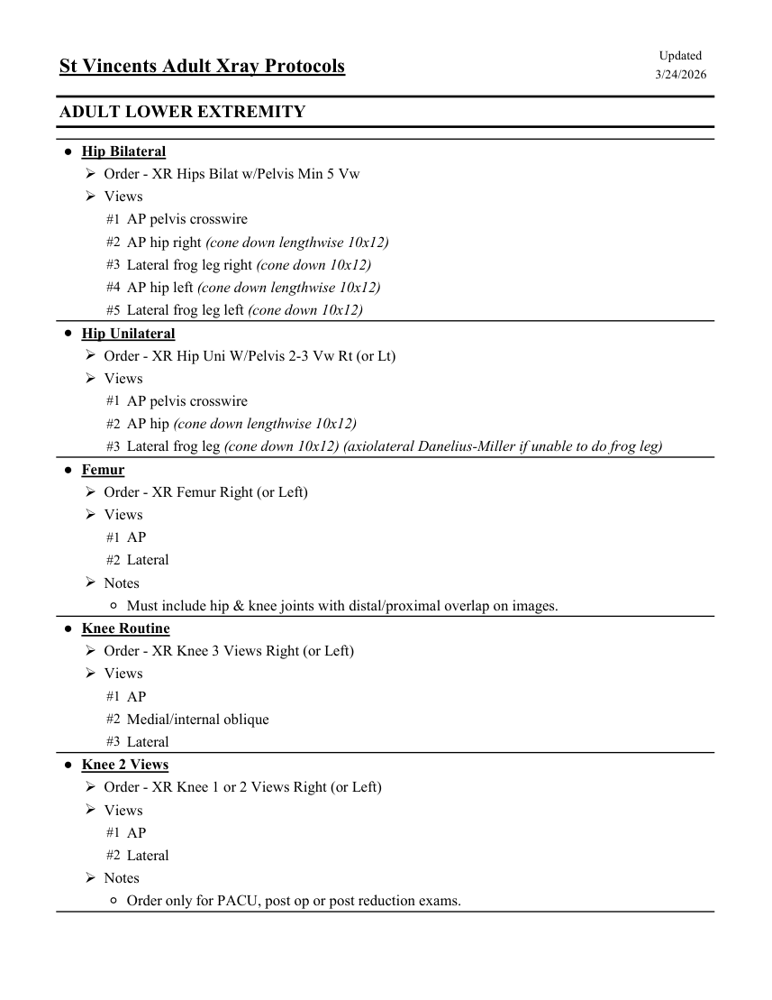
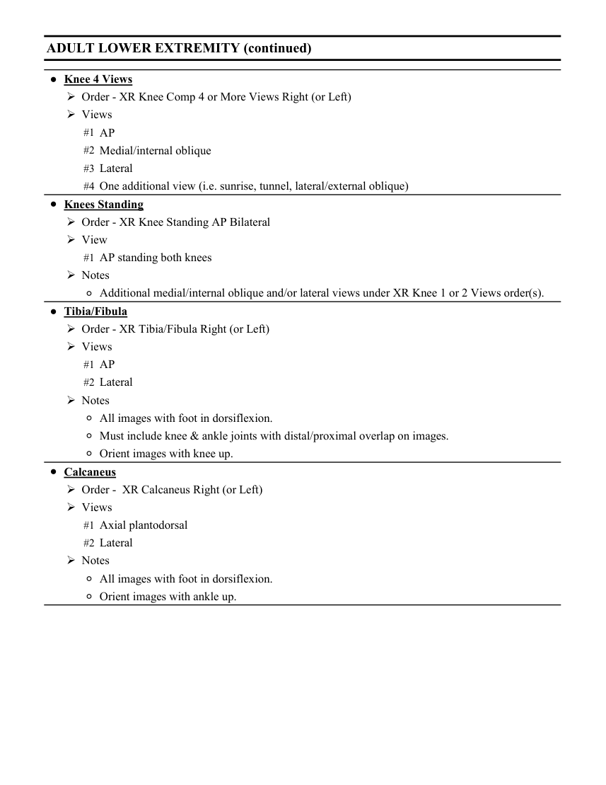
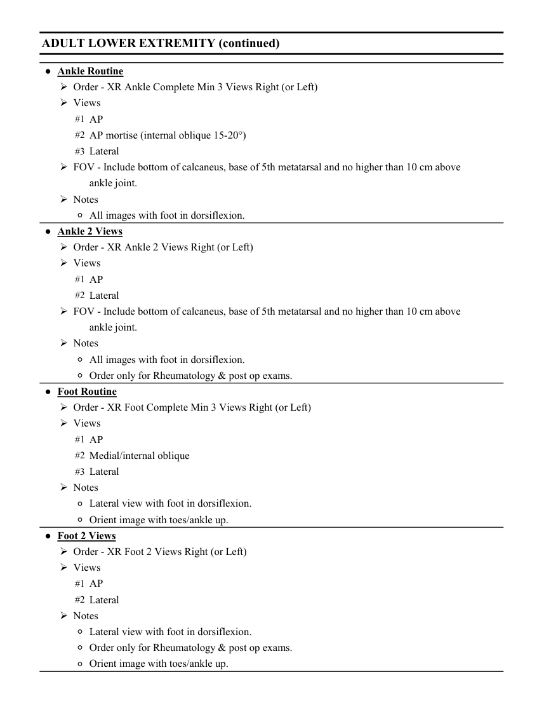
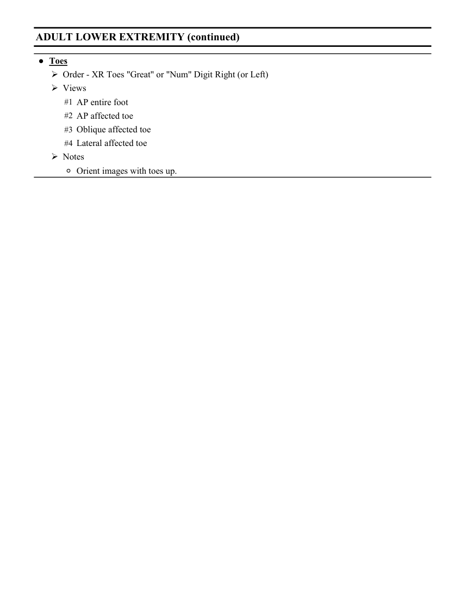

# RX — Adult: membru inferior (MCB)

## Documentul original MCB — Adult: membru inferior

**Colecție de protocoale · 4 pagini · consultat la 2026-09-27.**

[Descarcă PDF-ul integral](../../assets/mcb-modalities/rx-adult-membru-inferior-mcb/document.pdf) · [Sursa MCB](https://ref.mcbradiology.com/Protocols,%20Policies,%20Worksheets%20&%20Forms/Xray/Adult%20Protocols/6%20Adult%20Leg.pdf) · [Catalogul MCB pentru această modalitate](../mcb/index.md)

Instrucțiunile, valorile și ilustrațiile din documentul original sunt păstrate în **engleză**. Titlul și navigarea sunt în română.

### Pagina 1

{ loading=lazy }

### Pagina 2

{ loading=lazy }

### Pagina 3

{ loading=lazy }

### Pagina 4

{ loading=lazy }

## Textul documentului original

??? abstract "Pagina 1 — text în engleză"

    
Updated
    St Vincents Adult Xray Protocols
    3/24/2026
    ADULT LOWER EXTREMITY
    ●Hip Bilateral
    Order - XR Hips Bilat w/Pelvis Min 5 Vw
    Views
    #1 AP pelvis crosswire
    #2 AP hip right (cone down lengthwise 10x12)
    #3 Lateral frog leg right (cone down 10x12)
    #4 AP hip left (cone down lengthwise 10x12)
    #5 Lateral frog leg left (cone down 10x12)
    ●Hip Unilateral
    Order - XR Hip Uni W/Pelvis 2-3 Vw Rt (or Lt)
    Views
    #1 AP pelvis crosswire
    #2 AP hip (cone down lengthwise 10x12)
    #3 Lateral frog leg (cone down 10x12) (axiolateral Danelius-Miller if unable to do frog leg)
    ●Femur
    Order - XR Femur Right (or Left)
    Views
    #1 AP
    #2 Lateral
    Notes
    ◦Must include hip &amp; knee joints with distal/proximal overlap on images.
    ●Knee Routine
    Order - XR Knee 3 Views Right (or Left)
    Views
    #1 AP
    #2 Medial/internal oblique
    #3 Lateral
    ●Knee 2 Views
    Order - XR Knee 1 or 2 Views Right (or Left)
    Views
    #1 AP
    #2 Lateral
    Notes
    ◦Order only for PACU, post op or post reduction exams.
    

??? abstract "Pagina 2 — text în engleză"

    
ADULT LOWER EXTREMITY (continued)
    ●Knee 4 Views
    Order - XR Knee Comp 4 or More Views Right (or Left)
    Views
    #1 AP
    #2 Medial/internal oblique
    #3 Lateral
    #4 One additional view (i.e. sunrise, tunnel, lateral/external oblique)
    ●Knees Standing
    Order - XR Knee Standing AP Bilateral
    View
    #1 AP standing both knees
    Notes
    ◦Additional medial/internal oblique and/or lateral views under XR Knee 1 or 2 Views order(s).
    ●Tibia/Fibula
    Order - XR Tibia/Fibula Right (or Left)
    Views
    #1 AP
    #2 Lateral
    Notes
    ◦All images with foot in dorsiflexion. 
    ◦Must include knee &amp; ankle joints with distal/proximal overlap on images.
    ◦Orient images with knee up.
    ●Calcaneus
    Order -  XR Calcaneus Right (or Left)
    Views
    #1 Axial plantodorsal
    #2 Lateral
    Notes
    ◦All images with foot in dorsiflexion. 
    ◦Orient images with ankle up.
    

??? abstract "Pagina 3 — text în engleză"

    
ADULT LOWER EXTREMITY (continued)
    ●Ankle Routine
    Order - XR Ankle Complete Min 3 Views Right (or Left)
    Views
    #1 AP
    #2 AP mortise (internal oblique 15-20°)
    #3 Lateral
    FOV - Include bottom of calcaneus, base of 5th metatarsal and no higher than 10 cm above
    ankle joint.
    Notes
    ◦All images with foot in dorsiflexion. 
    ●Ankle 2 Views
    Order - XR Ankle 2 Views Right (or Left)
    Views
    #1 AP
    #2 Lateral
    FOV - Include bottom of calcaneus, base of 5th metatarsal and no higher than 10 cm above
    ankle joint.
    Notes
    ◦All images with foot in dorsiflexion. 
    ◦Order only for Rheumatology &amp; post op exams.
    ●Foot Routine
    Order - XR Foot Complete Min 3 Views Right (or Left)
    Views
    #1 AP
    #2 Medial/internal oblique
    #3 Lateral
    Notes
    ◦Lateral view with foot in dorsiflexion.
    ◦Orient image with toes/ankle up.
    ●Foot 2 Views
    Order - XR Foot 2 Views Right (or Left)
    Views
    #1 AP
    #2 Lateral
    Notes
    ◦Lateral view with foot in dorsiflexion.
    ◦Order only for Rheumatology &amp; post op exams.
    ◦Orient image with toes/ankle up.
    

??? abstract "Pagina 4 — text în engleză"

    
ADULT LOWER EXTREMITY (continued)
    ●Toes
    Order - XR Toes &quot;Great&quot; or &quot;Num&quot; Digit Right (or Left)
    Views
    #1 AP entire foot
    #2 AP affected toe
    #3 Oblique affected toe
    #4 Lateral affected toe
    Notes
    ◦Orient images with toes up.
    

