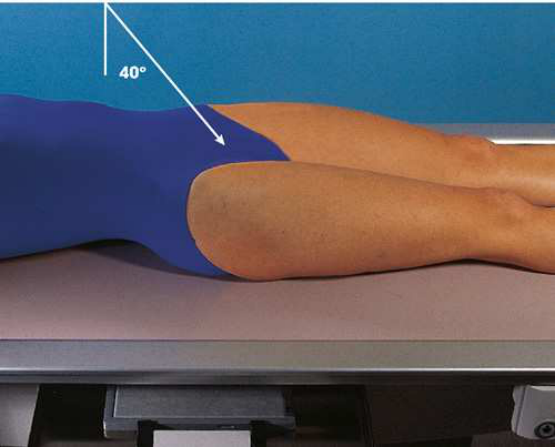

# Rx Anterior Pelvic Bones — Superoinferior Axial Inlet Incidență — BRIDGMAN Method 12 (Merrill)

  📷 Radiografie Convențională (Rx)
  <strong>Actualizat:</strong> 2026-09-16
  <strong>Autor:</strong> Referință Merrill

---

-   __1. Rezumat Clinic & Indicații__

    ---

    === "Indicații Clinice"

        - Conform reperelor anatomice standard din tratat

    === "Ghid Național IRIS"

        !!! info "Referință Primară: Ghidul Național IRIS (Ordinul MS 1342/2012)"
            - **Capitol Ghid IRIS:** *Ghidul Național IRIS*
            - **Grad de Recomandare:** **De verificat pe indicație; fără grad atribuit automat**
            - **Nivel de Iradiere Estimată:** `De verificat pentru examinarea și populația selectate`

            [:octicons-search-16: Deschide Ghidul IRIS](../../iris.md){ .md-button .md-button--primary } [:material-open-in-new: Aplicația Oficială PWA](https://radiologie-pediatrica.ro/iris/){ .md-button target="_blank" rel="noopener" }
-   __2. Poziționare & Centrare Fascicul__

    ---

    - **Poziție Pacient:** se poziționează pacientul pe masa radiologică în Decubit dorsal poziție.; se centrează MSP de pacientul’s corp la linia mediană grilă. se flectează genunchi slightly și support them la relieve strain. se ajustează Bazin (bazin (pelvis)) astfel încât ASISs sunt echidistant față de masa de examinare. cu receptorul de imagine în tăvița Bucky, center it la nivelul greater trochanters (Fig. 8.48).
    - **Punct de Centrare Fascicul:** orientat 40 grade caudal, entering linia mediană la nivelul spină iliacă antero-superioară (SIAS)
    - **Distanță Focar-Film (DFF / SID):** Nespecificat în fragmentul extras; de verificat în sursă
    - **Comandă Respiratorie:** apnee (oprirea respirației).

-   __3. Parametri Tehnici Expunere__

    ---

    | Parametru Tehnic | Valoare Configurare Generator / Tub |
    |:-----------------|:-------------------------------------|
    | **Tensiune Tub (kV)** | DE CONFIGURAT PE APARAT |
    | **Sarcină / Produs Curent-Timp (mAs)** | DE CONFIGURAT PE APARAT |
    | **Distanță Focar-Film (DFF / SID)** | Nespecificat în fragmentul extras; de verificat în sursă |
    | **Grilă Antidifuzoare (Bucky)** | DE CONFIGURAT PE APARAT |
    | **Dimensiune Focar** | DE CONFIGURAT PE APARAT |
    | **Camere de Ionizare AEC** | DE CONFIGURAT PE APARAT |
    | **Colimare Fascicul** | Se ajustează câmpul de iradiere la formatul 35 × 43 cm pe colimator. pentru smaller pacienți, collimate 1 inch (2.5 cm) beyond skin shadow pe sides. Se plasează markerul de lateralitate în câmpul colimat. |
    | **Filtrare Tub** | DE CONFIGURAT PE APARAT |

-   __4. Criterii de Calitate & Reușită Imagine__

    ---

    - Criterii radiologice de calitate imaginii:
    - Colimare adecvată vizibilă și prezența markerului de lateralitate (D/S) plasat clear de anatomy de interest
    - Medially superimposed superior și inferior rami de pubic bones
    - Nearly superimposed lateral two-thirds de pubic și ischial bones
    - simetric pubes și coloană vertebrală ischiatice
    - Șold articulații
    - anterior pelvic bones
    - Bony detalii trabeculare osoase și surrounding soft tissues

-   __5. Protecție Radiologică (ALARA)__

    ---

    - Nespecificat în fragmentul extras; de verificat în sursă

!!! note "Observații Clinice & Tehnice"
    Conform reperelor anatomice standard din tratat

### 🖼️ Imagini

<figure class="protocol-image-card" markdown>

<figcaption><strong>Merrill — pagina PDF 641, imaginea 1</strong> — Imagine din fragmentul sursă; asocierea necesită revizie.</figcaption>

</figure>

=== "Ghid Rapid de Execuție"

    1. **Identificarea și verificarea pacientului:** verificare identitate, zonă de examinat, consimțământ conform procedurii și evaluarea posibilității unei sarcini, când este relevantă.
    2. **Pregătire:** îndepărtarea oricăror obiecte radiopace (bijuterii, agrafe, fermoare, proteze, pansamente dense).
    3. **Poziționare precisă:** alinierea receptorului de imagine și a tubului la distanța prescrisă (Nespecificat în fragmentul extras; de verificat în sursă).
    4. **Colimare strictă:** adaptarea fasciculului strict la regiunea de diagnostic pentru scăderea iradierii și reducerea radiației difuze.
    5. **Radioprotecție:** verificarea [politicii RX](../radioprotectie.md), cu măsuri distincte pentru pacient, personal și însoțitor.

## Surse de documentare

- [Merrill’s Atlas, 8. Pelvis and Hip, pagini PDF 640–641](../../assets/protocols/sources/a56d45c16829_Merrills_Atlas_of_Radiographic_Positioning__Procedures_3Vol_Set.pdf#page=640)

## Fragmente sursă traduse (referință tehnică)

### anatomy

axial incidență de pelvic ring, sau inlet, în its entirety (Fig. 8.49).

### collimation

• Se ajustează câmpul de iradiere la formatul 35 × 43 cm pe colimator. pentru smaller pacienți, collimate 1 inch (2.5 cm) beyond skin
shadow pe sides. Se plasează markerul de lateralitate în câmpul colimat.

### cr

• orientat 40 grade caudal, entering linia mediană la nivelul spină iliacă antero-superioară (SIAS)

### criteria

Criterii radiologice de calitate imaginii:
• Colimare adecvată vizibilă și prezența markerului de lateralitate (D/S) plasat clear de anatomy de interest
• Medially superimposed superior și inferior rami de pubic bones
• Nearly superimposed lateral two-thirds de pubic și ischial bones
• simetric pubes și coloană vertebrală ischiatice
• Hip articulații
• anterior pelvic bones
• Bony detalii trabeculare osoase și surrounding soft tissues

### part_pos

• se centrează MSP de pacientul’s corp la linia mediană grilă.
• se flectează genunchi slightly și support them la relieve strain.
• se ajustează bazin (pelvis) astfel încât ASISs sunt echidistant față de masa de examinare.
• cu receptorul de imagine în tăvița Bucky, center it la nivelul greater trochanters (Fig. 8.48).

### patient_pos

• se poziționează pacientul pe masa radiologică în decubit dorsal.

### respiration

apnee (oprirea respirației).

### tech

poziționat prin manufacturer sau department protocol pentru corect anatomy display orientation; raza centrală plate: 14 × 17 inches (35 ×
43 cm) transversal.

