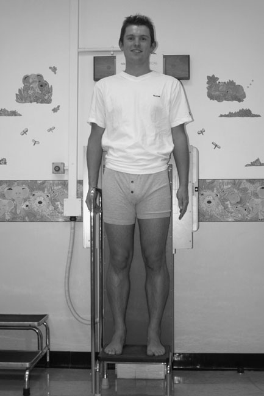
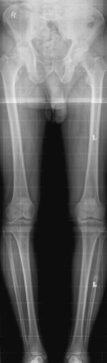
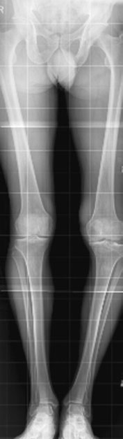
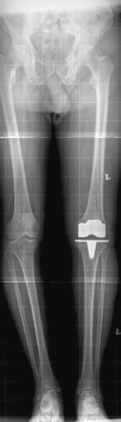

# Rx Axa Membrelor Inferioare (Ortostatism) Metoda Convențională Film/Ecran

  📷 Radiografie Convențională (Rx)
  <strong>Actualizat:</strong> 2026-09-16
  <strong>Autor:</strong> Departamentul de Radiologie / Referință Clark (Ed. 12)

---

-   __1. Rezumat Clinic & Indicații__

    ---

    === "Indicații Clinice"

        - imagine trebuie să evidențiază endpoints de mechanical axis clearly, i.e. toate three articulații (Șold, Genunchi și Gleznă (Articulație Talocrurală)) trebuie să fie exposed correctly și ambele membre inferioare trebuie să fie în correct neutral anatomical poziție, cu Rotulă (Patelă) facing forward și simetric. Limb alignment pe raza centrală evidențiind genu varus secondary la artroză / modificări degenerative articulare de Genunchi. This poate cause difficulty fitting whole de limbs onto one imagine Limb alignment pe raza centrală imagine following total Genunchi replacement (same pacient ca radiografie pe p. 138)

    === "Ghid Național IRIS"

        !!! info "Referință Primară: Ghidul Național IRIS (Ordinul MS 1342/2012)"
            - **Capitol Ghid IRIS:** *Ghidul Național IRIS*
            - **Grad de Recomandare:** **De verificat pe indicație; fără grad atribuit automat**
            - **Nivel de Iradiere Estimată:** `De verificat pentru examinarea și populația selectate`

            [:octicons-search-16: Deschide Ghidul IRIS](../../iris.md){ .md-button .md-button--primary } [:material-open-in-new: Aplicația Oficială PWA](https://radiologie-pediatrica.ro/iris/){ .md-button target="_blank" rel="noopener" }
-   __2. Poziționare & Centrare Fascicul__

    ---

    - **Poziție Pacient:** • pacientul stă în ortostatism pe low step, cu posterior aspect de picioarele pe / sprijinit de long casetă. brațele sunt folded across toracele. anterior superior iliac spines trebuie să fie echidistant față de caseta. medial plan sagital trebuie să fie vertical și coincident cu central longitudinal axis de caseta.
• picioarele trebuie să fie, ca far ca possible, în similar relationship la Bazin (bazin (pelvis)), cu picioarele separated astfel încât distance între Gleznă (Articulație Talocrurală) articulații este similar la distance între Șold articulații și cu Rotulă (Patelă) de fiecare Genunchi facing forward.
• Ideally, genunchii și Gleznă (Articulație Talocrurală) articulații trebuie să fie în anteroposterior poziție. However, if this impossible la achieve, it este more important that genunchii rather than Gleznă (Articulație Talocrurală) articulații sunt plasat în Antero-posterior (AP) poziție.
• Foam pads și săculeți cu nisip sunt used la stabilize picioarele și maintain poziție. If necessary, block poate fie poziționat below shortened membru inferior la ensure that there este fără pelvic tilt și that limbs sunt aliniat adequately.
    - **Punct de Centrare Fascicul:** • raza centrală orizontală centrală este orientat spre point midway între Genunchi articulații.
• X-ray fascicul este collimated la include ambele lower limbs de la Șold articulații la Gleznă (Articulație Talocrurală) articulații.
138 Preoperative raza centrală imagine la show limb alignment
    - **Distanță Focar-Film (DFF / SID):** 100 cm
    - **Comandă Respiratorie:** Apnee pe durata expunerii (apnee în inspir pentru torace; expir pentru Abdomen/bazin).

-   __3. Parametri Tehnici Expunere__

    ---

    | Parametru Tehnic | Valoare Configurare Generator / Tub |
    |:-----------------|:-------------------------------------|
    | **Tensiune Tub (kV)** | DE CONFIGURAT PE APARAT |
    | **Sarcină / Produs Curent-Timp (mAs)** | Conform AEC / grosime anatomică |
    | **Distanță Focar-Film (DFF / SID)** | 100 cm |
    | **Grilă Antidifuzoare (Bucky)** | Conform grosimii anatomice (> 10-12 cm cu grilă) |
    | **Dimensiune Focar** | Focar Mic (0.6 mm) |
    | **Camere de Ionizare AEC** | DE CONFIGURAT PE APARAT |
    | **Colimare Fascicul** | Colimare strictă adaptată pe receptor 35 x 105 cm |
    | **Filtrare Tub** | Totală ≥ 2.5 mm Al echivalent (conform Clark: 3.0 mm Al eq.) |

-   __4. Criterii de Calitate & Reușită Imagine__

    ---

    - Vizualizarea clară întregii arii anatomice (Axa Membrelor Inferioare (Ortostatism)).
    - Absența artefactelor de mișcare; trabeculație osoasă și contururi nete.
    - Densitate optică și contrast adecvate pentru diferențierea țesuturilor moi de structurile osoase.

-   __5. Protecție Radiologică (ALARA)__

    ---

    - Ecranare gonadică cu șorț plumbat dacă gonadele sunt în apropierea fasciculului util (regula ALARA).
    - Colimare precisă la dimensiunea anatomică strict necesară pentru reducerea dozei și a radiației difuze.
    - Verificarea posibilității unei sarcini la pacientele de vârstă fertilă înainte de expunere.

!!! note "Observații Clinice & Tehnice"
    Pregătirea pacientului prin îndepărtarea tuturor accesoriilor radio-opace.

### 🖼️ Imagini

<figure class="protocol-image-card" markdown>

<figcaption><strong>conventional film radiologic/screen și digital computed radiografie (raza centrală).</strong> — Poziționare pacient și centrare fascicul conform Clark (Ed. 12)</figcaption>

</figure>

<figure class="protocol-image-card" markdown>

<figcaption><strong>Assessment prin conventional film radiologic/screen radiografie este under-</strong> — Aspect radiografic / ghid de poziționare conform tratatului Clark (Ed. 12)</figcaption>

</figure>

<figure class="protocol-image-card" markdown>

<figcaption><strong>Digital computed radiografie</strong> — Aspect radiografic / ghid de poziționare conform tratatului Clark (Ed. 12)</figcaption>

</figure>

<figure class="protocol-image-card" markdown>

<figcaption><strong>poziție la allow Fascicul Orizontal radiografie using large FFD,</strong> — Aspect radiografic / ghid de poziționare conform tratatului Clark (Ed. 12)</figcaption>

</figure>

=== "Ghid Rapid de Execuție"

    1. **Identificarea și verificarea pacientului:** verificare identitate, zonă de examinat, consimțământ conform procedurii și evaluarea posibilității unei sarcini, când este relevantă.
    2. **Pregătire:** îndepărtarea oricăror obiecte radiopace (bijuterii, agrafe, fermoare, proteze, pansamente dense).
    3. **Poziționare precisă:** alinierea receptorului de imagine și a tubului la distanța prescrisă (100 cm).
    4. **Colimare strictă:** adaptarea fasciculului strict la regiunea de diagnostic pentru scăderea iradierii și reducerea radiației difuze.
    5. **Radioprotecție:** verificarea [politicii RX](../radioprotectie.md), cu măsuri distincte pentru pacient, personal și însoțitor.

## Surse de documentare

- [Clark's Positioning in Radiography (Ed. 12), Pagina 153](../../assets/protocols/sources/Clark___Positioning_in_Radiography__12th_edition.pdf#page=153)
