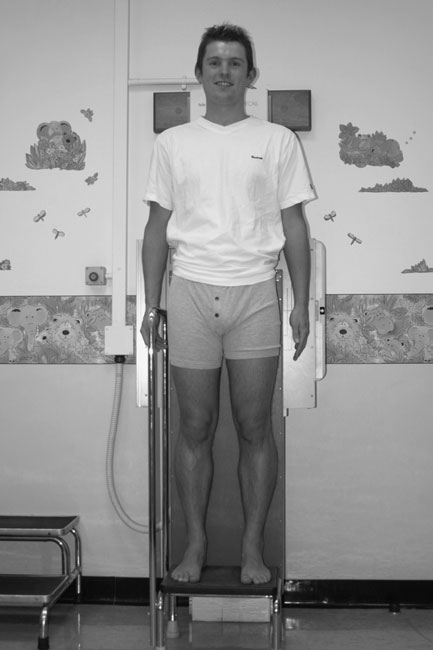
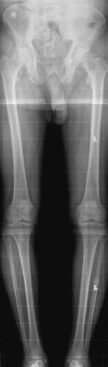
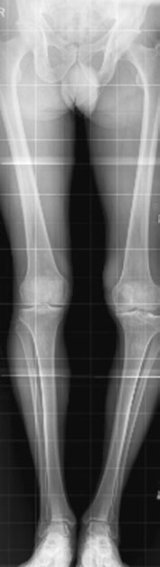
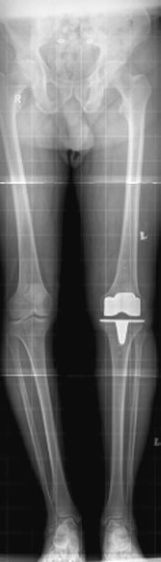

# Rx axa membrelor inferioare (ortostatism) — metoda convențională film/ecran

  📷 Radiografie Convențională (Rx)
  <strong>Actualizat:</strong> 2026-09-16
  <strong>Autor:</strong> Departamentul de Radiologie / Referință Clark (Ed. 12)

---

-   __1. Rezumat Clinic & Indicații__

    ---

    === "Indicații Clinice"

        - Imaginea trebuie să evidențieze clar extremitățile axei mecanice, adică toate cele trei articulații (șold, genunchi și gleznă [articulația talocrurală]) trebuie să fie expuse corect, iar ambele membre inferioare trebuie să fie în poziție anatomică neutră corectă, cu rotulele orientate anterior și simetric. Alinierea membrului pe imaginea razei centrale evidențiază genu varum secundar artrozei/modificărilor degenerative ale articulației genunchiului. Acest lucru poate cauza dificultăți în încadrarea membrelor în întregime pe o singură imagine. Imaginea razei centrale pentru alinierea membrului după protezarea totală a genunchiului (același pacient ca în radiografia de la p. 138)

    === "Ghid Național IRIS"

        !!! info "Referință Primară: Ghidul Național IRIS (Ordinul MS 1342/2012)"
            - **Capitol Ghid IRIS:** *Aparat locomotor & Membru inferior*
            - **Grad de Recomandare:** **Grad A**
            - **Nivel de Iradiere Estimată:** `Clasa 1 (Minimă < 0.01 mSv)`

            [:octicons-search-16: Deschide Ghidul IRIS](../../iris.md){ .md-button .md-button--primary } [:material-open-in-new: Aplicația Oficială PWA](https://radiologie-pediatrica.ro/iris/){ .md-button target="_blank" rel="noopener" }

-   __2. Poziționare & Centrare Fascicul__

    ---

    - **Poziție Pacient:**
        - Pacientul stă în ortostatism pe o treaptă joasă, cu fața posterioară a picioarelor pe/lângă caseta lungă. Brațele sunt încrucișate peste torace. Spinele iliace anterosuperioare trebuie să fie echidistante față de casetă. Planul sagital median trebuie să fie vertical și coincident cu axul longitudinal central al casetei.
        - Picioarele trebuie să fie, pe cât posibil, într-o relație similară cu bazinul, cu picioarele depărtate astfel încât distanța dintre articulațiile talocrurale să fie similară cu distanța dintre articulațiile coxofemurale, iar rotula fiecărui genunchi să fie orientată anterior.
        - Ideal, genunchii și articulațiile talocrurale trebuie să fie în poziție anteroposterioară. Totuși, dacă acest lucru nu este posibil, este mai important ca genunchii, și nu articulațiile talocrurale, să fie plasați în poziție anteroposterioară (AP).
        - Tampoanele de spumă și săculeții cu nisip sunt utilizați pentru stabilizarea picioarelor și menținerea poziției. Dacă este necesar, un bloc poate fi poziționat sub membrul inferior mai scurt pentru a asigura absența înclinării pelvine și alinierea adecvată a membrelor.
    - **Punct de Centrare Fascicul:**
        - Raza centrală orizontală este orientată spre punctul situat la jumătatea distanței dintre articulațiile genunchilor.
        - Fasciculul de raze X este colimat astfel încât să includă ambele membre inferioare, de la articulațiile coxofemurale la articulațiile talocrurale. 138 Imagine preoperatorie a razei centrale pentru evidențierea alinierii membrului
    - **Distanță Focar-Film (DFF / SID):** 100 cm
    - **Comandă Respiratorie:** Apnee pe durata expunerii (apnee în inspir pentru torace; expir pentru Abdomen/bazin).

-   __3. Parametri Tehnici Expunere__

    ---

    | Parametru Tehnic | Valoare Configurare Generator / Tub |
    |:-----------------|:-------------------------------------|
    | **Tensiune Tub (kV)** | DE CONFIGURAT PE APARAT |
    | **Sarcină / Produs Curent-Timp (mAs)** | Conform AEC / grosimii anatomice |
    | **Distanță Focar-Film (DFF / SID)** | 100 cm |
    | **Grilă Antidifuzoare (Bucky)** | Conform grosimii anatomice (> 10-12 cm cu grilă) |
    | **Dimensiune Focar** | Focar Mic (0.6 mm) |
    | **Camere de Ionizare AEC** | DE CONFIGURAT PE APARAT |
    | **Colimare Fascicul** | Colimare strictă adaptată receptorului de 35 x 105 cm |
    | **Filtrare Tub** | Totală ≥ 2.5 mm Al echivalent (conform Clark: 3.0 mm Al echivalent) |

-   __4. Criterii de Calitate & Reușită Imagine__

    ---

    - Vizualizarea clară a întregii arii anatomice (axa membrelor inferioare [ortostatism]).
    - Absența artefactelor de mișcare; trabeculație osoasă și contururi nete.
    - Densitate optică și contrast adecvate pentru diferențierea țesuturilor moi de structurile osoase.

-   __5. Protecție Radiologică (ALARA)__

    ---

    - Ecranare gonadică cu șorț plumbat dacă gonadele sunt în apropierea fasciculului util (regula ALARA).
    - Colimare precisă la dimensiunea anatomică strict necesară pentru reducerea dozei și a radiației difuze.
    - Verificarea posibilității unei sarcini la pacientele de vârstă fertilă înainte de expunere.

!!! note "Observații Clinice & Tehnice"
    Pregătirea pacientului prin îndepărtarea tuturor accesoriilor radio-opace.

### 🖼️ Imagini

<figure class="protocol-image-card" markdown>

<figcaption><strong>radiografie convențională film/ecran și radiografie digitală computerizată (raza centrală).</strong> — Poziționarea pacientului și centrarea fasciculului conform Clark (Ed. 12)</figcaption>

</figure>

<figure class="protocol-image-card" markdown>

<figcaption><strong>Evaluarea prin radiografie convențională film/ecran este sub-</strong> — Aspect radiografic / ghid de poziționare conform tratatului Clark (Ed. 12)</figcaption>

</figure>

<figure class="protocol-image-card" markdown>

<figcaption><strong>Radiografie digitală computerizată</strong> — Aspect radiografic / ghid de poziționare conform tratatului Clark (Ed. 12)</figcaption>

</figure>

<figure class="protocol-image-card" markdown>

<figcaption><strong>poziție pentru a permite radiografia cu fascicul orizontal utilizând o DFF mare,</strong> — Aspect radiografic / ghid de poziționare conform tratatului Clark (Ed. 12)</figcaption>

</figure>

=== "Ghid Rapid de Execuție"

    1. **Identificarea și verificarea pacientului:** verificare identitate, zonă de examinat, consimțământ conform procedurii și evaluarea posibilității unei sarcini, când este relevantă.
    2. **Pregătire:** îndepărtarea oricăror obiecte radiopace (bijuterii, agrafe, fermoare, proteze, pansamente dense).
    3. **Poziționare precisă:** alinierea receptorului de imagine și a tubului la distanța prescrisă (100 cm).
    4. **Colimare strictă:** adaptarea fasciculului strict la regiunea de diagnostic pentru scăderea iradierii și reducerea radiației difuze.
    5. **Radioprotecție:** verificarea [politicii RX](../radioprotectie.md), cu măsuri distincte pentru pacient, personal și însoțitor.

## Surse de documentare

- [Clark's Positioning in Radiography (Ed. 12), Pagina 153](https://books.google.com/books/about/Clark_s_Positioning_in_Radiography.html?id=Xxu6MwEACAAJ)
