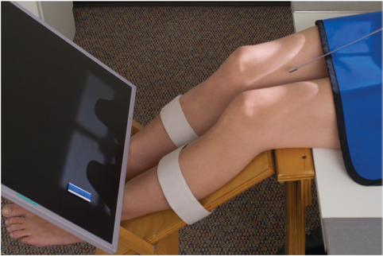
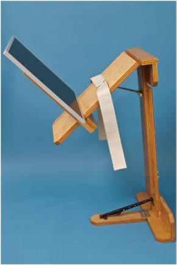
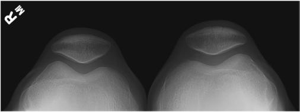
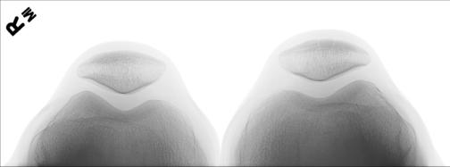

# Rx AXIAL OR SUNRISE/SKYLINE Incidență TANGENTIAL (Rotulă (Patelă) - BILATERAL Metoda Merchant)

  📷 Radiografie Convențională (Rx)
  <strong>Actualizat:</strong> 2026-09-15
  <strong>Autor:</strong> Departamentul de Radiologie / Referință Bontrager

---

-   __1. Rezumat Clinic & Indicații__

    ---

    === "Indicații Clinice"

        - Subluxation de Rotulă (Patelă) și other abnormalities de Rotulă (Patelă) și patellofemoral articulație

    === "Ghid Național IRIS"

        !!! info "Referință Primară: Ghidul Național IRIS (Ordinul MS 1342/2012)"
            - **Capitol Ghid IRIS:** *Ghidul Național IRIS*
            - **Grad de Recomandare:** **De verificat pe indicație; fără grad atribuit automat**
            - **Nivel de Iradiere Estimată:** `De verificat pentru examinarea și populația selectate`

            [:octicons-search-16: Deschide Ghidul IRIS](../../iris.md){ .md-button .md-button--primary } [:material-open-in-new: Aplicația Oficială PWA](https://radiologie-pediatrica.ro/iris/){ .md-button target="_blank" rel="noopener" }
-   __2. Poziționare & Centrare Fascicul__

    ---

    - **Poziție Pacient:** Pacient: Place pacient în Decubit dorsal poziție cu genunchi flectat 40° over end de masa de examinare, resting pe membru inferior support. pacient trebuie să fie comfortable și relaxat pentru quadriceps muscles la fie relaxat (see NOTE).; Regiune anatomică: Place support under genunchi la raise distal femurs ca needed so that they sunt paralel la tabletop. Place genunchi și picioare together și secure lower membre inferioare together la prevent rotație și la allow pacient la fie totally relaxat. Place receptorul de imagine pe edge against membre inferioare approximately 12 inches (30 cm) below genunchii, perpendicular la xray fascicul (Figs. 6.134 și 6.135).
    - **Punct de Centrare Fascicul:** Angle raza centrală caudal, 30° de la plan orizontal (raza centrală 30° la Femur). Adjust raza centrală angle if needed pentru true tangențial incidență de patellofemoral spații articulare. Raza centrală se orientează spre point midway între patellae.
    - **Distanță Focar-Film (DFF / SID):** 180 cm
    - **Comandă Respiratorie:** Apnee pe durata expunerii (sau conform cooperării pacientului)

-   __3. Parametri Tehnici Expunere__

    ---

    | Parametru Tehnic | Valoare Configurare Generator / Tub |
    |:-----------------|:-------------------------------------|
    | **Tensiune Tub (kV)** | 70-80 kV |
    | **Sarcină / Produs Curent-Timp (mAs)** | DE CONFIGURAT PE APARAT |
    | **Distanță Focar-Film (DFF / SID)** | 180 cm |
    | **Grilă Antidifuzoare (Bucky)** | Fără grilă (expunere directă) |
    | **Dimensiune Focar** | Focar Mare (1.0 - 1.2 mm) |
    | **Camere de Ionizare AEC** | DE CONFIGURAT PE APARAT |
    | **Colimare Fascicul** | Collimate tightly pe toate sides la patellae. |
    | **Filtrare Tub** | Totală ≥ 2.5 mm Al echivalent |

-   __4. Criterii de Calitate & Reușită Imagine__

    ---

    - Intercondylar sulcus (trochlear groove) și Rotulă (Patelă) de fiecare distal Femur trebuie să fie visualized în profile cu patellofemoral spații articulare open (Figs. 6.136 și 6.137). poziție:
    - Absența rotației anatomice: clavicule echidistante față de linia apofizelor spinoase de Genunchi este present, ca evidenced prin simetric appearance de Rotulă (Patelă), anterior femoral condyles, și intercondylar sulcus.
    - Correct raza centrală angle și centering sunt evidenced prin open patellofemoral spații articulare. expunere:
    - optim expunere trebuie să clearly visualize părți moi și spații articulare margins și trabecular markings de patellae.
    - Femoral condyles appear underexposed cu only anterior margins clearly defined. Fig. 6.136 Metoda Merchant—bilateral tangențial. (Courtesy Joss Wertz, DO.) stâng stâng Rotulă (Patelă) Femoropatellar spații articulare Intercondylar sulcus (trochlear groove) drept Rotulă (Patelă) Fig. 6.137 Metoda Merchant—bilateral tangențial. (Courtesy Joss Wertz, DO.)

-   __5. Protecție Radiologică (ALARA)__

    ---

    - Ecranare gonadică și a organelor radiosensibile conform procedurilor locale de radioprotecție ALARA.
    - Colimare strictă la aria de interes pentru limitarea radiației difuze.
    - Verificarea posibilității unei sarcini la pacientele de vârstă fertilă înainte de expunere.

!!! note "Observații Clinice & Tehnice"
    pacient comfort și total relaxation sunt essential. quadriceps femoris muscles trebuie să fie relaxat la prevent subluxation de patellae, wherein they sunt pulled into intercondylar sulcus sau groove, which poate result în false readings.7 Fig. 6.134 Metoda Merchant—bilateral tangențial, genunchi flectat 40°. Rotulă (Patelă) tangențial Fig. 6.135 Adjustabletype membru inferior support și receptorul de imagine holder. (Courtesy St. Joseph’s Hospital și Medical Center, Phoenix, AZ.)

### 🖼️ Imagini

<figure class="protocol-image-card" markdown>

<figcaption><strong>Fig. 6.134 Metoda Merchant—bilateral tangențial, genunchi flectat 40°.</strong> — Poziționare pacient conform Ghidului Bontrager (Fig. 6.134 Merchant method—bilateral tangențial, genunchi flectat 40°.)</figcaption>

</figure>

<figure class="protocol-image-card" markdown>

<figcaption><strong>Fig. 6.135 Adjustable-</strong> — Aspect radiografic de referință conform Ghidului Bontrager (Fig. 6.135 Adjustable-)</figcaption>

</figure>

<figure class="protocol-image-card" markdown>

<figcaption><strong>Fig. 6.136 Metoda Merchant—bilateral tangențial. (Courtesy Joss</strong> — Aspect radiografic de referință conform Ghidului Bontrager (Fig. 6.136 Merchant method—bilateral tangențial. (Courtesy Joss)</figcaption>

</figure>

<figure class="protocol-image-card" markdown>

<figcaption><strong>Fig. 6.137 Metoda Merchant—bilateral tangențial. (Courtesy Joss Wertz,</strong> — Aspect radiografic de referință conform Ghidului Bontrager (Fig. 6.137 Merchant method—bilateral tangențial. (Courtesy Joss Wertz,)</figcaption>

</figure>

=== "Ghid Rapid de Execuție"

    1. **Identificarea și verificarea pacientului:** verificare identitate, zonă de examinat, consimțământ conform procedurii și evaluarea posibilității unei sarcini, când este relevantă.
    2. **Pregătire:** îndepărtarea oricăror obiecte radiopace (bijuterii, agrafe, fermoare, proteze, pansamente dense).
    3. **Poziționare precisă:** alinierea receptorului de imagine și a tubului la distanța prescrisă (180 cm).
    4. **Colimare strictă:** adaptarea fasciculului strict la regiunea de diagnostic pentru scăderea iradierii și reducerea radiației difuze.
    5. **Radioprotecție:** verificarea [politicii RX](../radioprotectie.md), cu măsuri distincte pentru pacient, personal și însoțitor.

## Surse de documentare

- [Bontrager's Textbook of Radiographic Positioning (Ed. 9/10), Pagina 273](https://www.elsevier.com/books/textbook-of-radiographic-positioning-and-related-anatomy/lampignano/978-0-323-65367-1)
