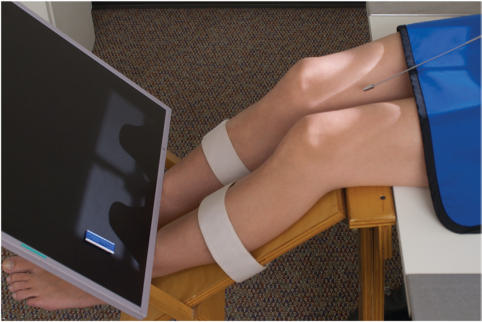
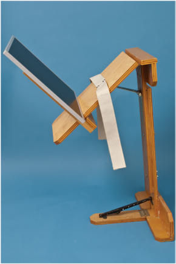
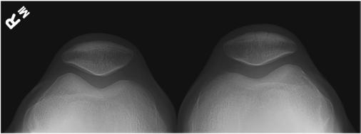
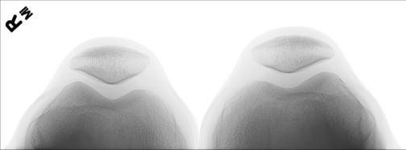

# Rx incidență axială sau sunrise/skyline, tangențială (rotula — bilateral), metoda Merchant

  📷 Radiografie Convențională (Rx)
  <strong>Actualizat:</strong> 2026-09-15
  <strong>Autor:</strong> Departamentul de Radiologie / Referință Bontrager

---

-   __1. Rezumat Clinic & Indicații__

    ---

    === "Indicații Clinice"

        - Subluxația rotulei și alte anomalii ale rotulei și articulației patelofemurale

    === "Ghid Național IRIS"

        !!! info "Referință Primară: Ghidul Național IRIS (Ordinul MS 1342/2012)"
            - **Capitol Ghid IRIS:** *Aparat locomotor & Membru inferior*
            - **Grad de Recomandare:** **Grad A**
            - **Nivel de Iradiere Estimată:** `Clasa 1 (Minimă < 0.05 mSv)`

            [:octicons-search-16: Deschide Ghidul IRIS](../../iris.md){ .md-button .md-button--primary } [:material-open-in-new: Aplicația Oficială PWA](https://radiologie-pediatrica.ro/iris/){ .md-button target="_blank" rel="noopener" }

-   __2. Poziționare & Centrare Fascicul__

    ---

    - **Poziție Pacient:** Pacient: Se plasează pacientul în decubit dorsal, cu genunchii flectați la 40° peste marginea mesei de examinare, sprijiniți pe suportul pentru membrele inferioare. Pacientul trebuie să fie confortabil și relaxat, pentru ca mușchii cvadriceps să fie relaxați (vezi NOTA).; Regiune anatomică: Se plasează suportul sub genunchi pentru a ridica femururile distale după necesitate, astfel încât acestea să fie paralele cu blatul mesei. Se apropie genunchii și picioarele și se fixează membrele inferioare împreună pentru a preveni rotația și a permite pacientului să fie complet relaxat. Se plasează receptorul de imagine pe margine, lipit de membrele inferioare, la aproximativ 12 țoli (30 cm) sub genunchi, perpendicular pe fasciculul de raze X (Fig. 6.134 și 6.135).
    - **Punct de Centrare Fascicul:** Unghiul razei centrale caudal, 30° față de planul orizontal (raza centrală la 30° față de femur). Se ajustează unghiul razei centrale dacă este necesar pentru o incidență tangențială adevărată a spațiilor articulare patelofemurale. Raza centrală se orientează spre punctul situat la jumătatea distanței dintre rotule.
    - **Distanță Focar-Film (DFF / SID):** 180 cm
    - **Comandă Respiratorie:** Apnee pe durata expunerii (sau conform cooperării pacientului)

-   __3. Parametri Tehnici Expunere__

    ---

    | Parametru Tehnic | Valoare Configurare Generator / Tub |
    |:-----------------|:-------------------------------------|
    | **Tensiune Tub (kV)** | 70-80 kV |
    | **Sarcină / Produs Curent-Timp (mAs)** | DE CONFIGURAT PE APARAT |
    | **Distanță Focar-Film (DFF / SID)** | 180 cm |
    | **Grilă Antidifuzoare (Bucky)** | Fără grilă (expunere directă) |
    | **Dimensiune Focar** | Focar Mare (1.0 - 1.2 mm) |
    | **Camere de Ionizare AEC** | DE CONFIGURAT PE APARAT |
    | **Colimare Fascicul** | Se colimează strâns pe toate laturile până la nivelul rotulelor. |
    | **Filtrare Tub** | Totală ≥ 2.5 mm Al echivalent |

-   __4. Criterii de Calitate & Reușită Imagine__

    ---

    - Șanțul intercondilian (șanțul trohlear) și rotula fiecărui femur distal trebuie să fie vizualizate de profil, cu spațiile articulare patelofemurale deschise (Fig. 6.136 și 6.137). Poziție:
    - Absența rotației anatomice: claviculele echidistante față de linia apofizelor spinoase ale genunchiului sunt prezente, evidențiate prin aspectul simetric al rotulei, condililor femurali anteriori și șanțului intercondilian.
    - Unghiul corect al razei centrale și centrarea sunt evidențiate prin spațiile articulare patelofemurale deschise. Expunere:
    - Expunerea optimă trebuie să vizualizeze clar părțile moi, marginile spațiilor articulare și desenul trabecular al rotulelor.
    - Condilii femurali apar subexpuși, cu numai marginile anterioare clar definite. Fig. 6.136 Metoda Merchant — tangențial bilateral. (Cu amabilitatea lui Joss Wertz, DO.) stânga stânga rotulă spații articulare femoropatelare șanț intercondilian (șanț trohlear) dreapta rotulă Fig. 6.137 Metoda Merchant — tangențial bilateral. (Cu amabilitatea lui Joss Wertz, DO.)

-   __5. Protecție Radiologică (ALARA)__

    ---

    - Ecranare gonadică și a organelor radiosensibile conform procedurilor locale de radioprotecție ALARA.
    - Colimare strictă la aria de interes pentru limitarea radiației difuze.
    - Verificarea posibilității unei sarcini la pacientele de vârstă fertilă înainte de expunere.

!!! note "Observații Clinice & Tehnice"
    Confortul pacientului și relaxarea totală sunt esențiale. Mușchii cvadriceps femural trebuie să fie relaxați pentru a preveni subluxația rotulelor, deoarece acestea sunt trase în șanțul intercondilian, ceea ce poate duce la interpretări eronate.7 Fig. 6.134 Metoda Merchant — tangențial bilateral, genunchii flectați la 40°. Tangențială a rotulei. Fig. 6.135 Suport reglabil pentru membrul inferior și suport pentru receptorul de imagine. (Cu amabilitatea St. Joseph’s Hospital and Medical Center, Phoenix, AZ.)

### 🖼️ Imagini

<figure class="protocol-image-card" markdown>

<figcaption><strong>Fig. 6.134 Metoda Merchant — tangențial bilateral, genunchii flectați la 40°.</strong> — Poziționarea pacientului conform Ghidului Bontrager (Fig. 6.134 Metoda Merchant — tangențial bilateral, genunchii flectați la 40°.)</figcaption>

</figure>

<figure class="protocol-image-card" markdown>

<figcaption><strong>Fig. 6.135 Suport reglabil pentru</strong> — Aspect radiografic de referință conform Ghidului Bontrager (Fig. 6.135 Suport reglabil pentru)</figcaption>

</figure>

<figure class="protocol-image-card" markdown>

<figcaption><strong>Fig. 6.136 Metoda Merchant — tangențial bilateral. (Cu amabilitatea lui Joss</strong> — Aspect radiografic de referință conform Ghidului Bontrager (Fig. 6.136 Metoda Merchant — tangențial bilateral. (Cu amabilitatea lui Joss)</figcaption>

</figure>

<figure class="protocol-image-card" markdown>

<figcaption><strong>Fig. 6.137 Metoda Merchant — tangențial bilateral. (Cu amabilitatea lui Joss Wertz,</strong> — Aspect radiografic de referință conform Ghidului Bontrager (Fig. 6.137 Metoda Merchant — tangențial bilateral. (Cu amabilitatea lui Joss Wertz,)</figcaption>

</figure>

=== "Ghid Rapid de Execuție"

    1. **Identificarea și verificarea pacientului:** verificare identitate, zonă de examinat, consimțământ conform procedurii și evaluarea posibilității unei sarcini, când este relevantă.
    2. **Pregătire:** îndepărtarea oricăror obiecte radiopace (bijuterii, agrafe, fermoare, proteze, pansamente dense).
    3. **Poziționare precisă:** alinierea receptorului de imagine și a tubului la distanța prescrisă (180 cm).
    4. **Colimare strictă:** adaptarea fasciculului strict la regiunea de diagnostic pentru scăderea iradierii și reducerea radiației difuze.
    5. **Radioprotecție:** verificarea [politicii RX](../radioprotectie.md), cu măsuri distincte pentru pacient, personal și însoțitor.

## Surse de documentare

- [Bontrager's Textbook of Radiographic Positioning (Ed. 9/10), Pagina 273](https://www.elsevier.com/books/textbook-of-radiographic-positioning-and-related-anatomy/lampignano/978-0-323-65367-1)
