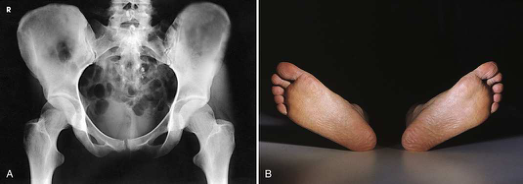
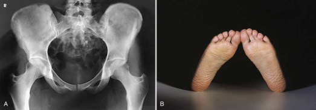
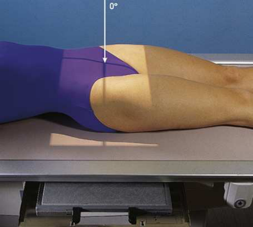
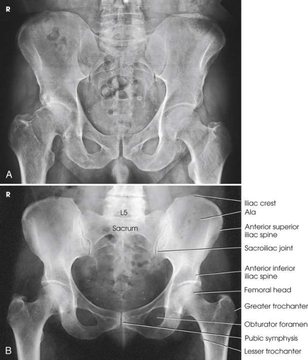
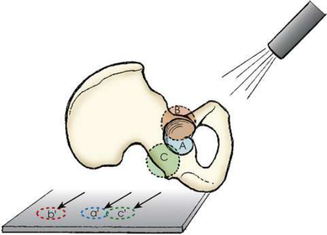

# Rx Bazin (Pelvis) and Proximal Femora — Incidență Antero-Posterioară (AP) (Merrill)

  📷 Radiografie Convențională (Rx)
  <strong>Actualizat:</strong> 2026-09-16
  <strong>Autor:</strong> Referință Merrill

---

-   __1. Rezumat Clinic & Indicații__

    ---

    === "Indicații Clinice"

        - Conform reperelor anatomice standard din tratat

    === "Ghid Național IRIS"

        !!! info "Referință Primară: Ghidul Național IRIS (Ordinul MS 1342/2012)"
            - **Capitol Ghid IRIS:** *Ghidul Național IRIS*
            - **Grad de Recomandare:** **De verificat pe indicație; fără grad atribuit automat**
            - **Nivel de Iradiere Estimată:** `De verificat pentru examinarea și populația selectate`

            [:octicons-search-16: Deschide Ghidul IRIS](../../iris.md){ .md-button .md-button--primary } [:material-open-in-new: Aplicația Oficială PWA](https://radiologie-pediatrica.ro/iris/){ .md-button target="_blank" rel="noopener" }
-   __2. Poziționare & Centrare Fascicul__

    ---

    - **Poziție Pacient:** se poziționează pacientul pe masa de examinare în Decubit dorsal poziție.; se centrează MSP de corp la linia mediană grilă și adjust it în true Decubit dorsal poziție. Unless contraindicated because de Traumatism / Regim Urgență sau pathologic factors, medially se rotește picioare și lower limbs approximately 15 la 20 grade la place femoral necks paralel cu plane de receptorul de imagine (receptorul de imagine) (Figs. 8.13 și 8.14). rotație internă (medială) este easier pentru pacientul la maintain if genunchii sunt sprijinit. heels trebuie să fie plasat approximately 8 la 10 inches (20 la 24 cm) apart. se imobilizează membre inferioare cu săculeți cu nisip across ankles if necessary. Check distance de la spină iliacă antero-superioară (SIAS) la tabletop pe fiecare side la ensure that Bazin (bazin (pelvis)) este nu rotit. se centrează receptorul de imagine la nivelul părți moi depression just above palpable prominence de mare trohanter (approximately 1.5 inches [3.8 cm]), which este also midway între spină iliacă antero-superioară (SIAS) și simfiză pubiană. în average-sized pacienți, center de receptorul de imagine este approximately 2 inches (5 cm) inferior la spină iliacă antero-superioară (SIAS) și 2 inches (5 cm) superior la simfiză pubiană (Fig. 8.15). If Bazin (bazin (pelvis)) este deep, palpate pentru crestele iliace și se ajustează poziție de receptorul de imagine so that its upper margine projects 1 la 1.5 inches (2.5 la 3.8 cm) above crest.
    - **Punct de Centrare Fascicul:** perpendicular pe midpoint de receptorul de imagine.
    - **Distanță Focar-Film (DFF / SID):** Nespecificat în fragmentul extras; de verificat în sursă
    - **Comandă Respiratorie:** apnee (oprirea respirației).

-   __3. Parametri Tehnici Expunere__

    ---

    | Parametru Tehnic | Valoare Configurare Generator / Tub |
    |:-----------------|:-------------------------------------|
    | **Tensiune Tub (kV)** | DE CONFIGURAT PE APARAT |
    | **Sarcină / Produs Curent-Timp (mAs)** | DE CONFIGURAT PE APARAT |
    | **Distanță Focar-Film (DFF / SID)** | Nespecificat în fragmentul extras; de verificat în sursă |
    | **Grilă Antidifuzoare (Bucky)** | DE CONFIGURAT PE APARAT |
    | **Dimensiune Focar** | DE CONFIGURAT PE APARAT |
    | **Camere de Ionizare AEC** | DE CONFIGURAT PE APARAT |
    | **Colimare Fascicul** | Se ajustează câmpul de iradiere la formatul 35 × 43 cm pe colimator. pentru smaller pacienți, collimate 1 inch (2.5 cm) beyond skin shadow pe sides. Se plasează markerul de lateralitate în câmpul colimat. |
    | **Filtrare Tub** | DE CONFIGURAT PE APARAT |

-   __4. Criterii de Calitate & Reușită Imagine__

    ---

    - Criterii radiologice de calitate imaginii:
    - Colimare adecvată vizibilă și prezența markerului de lateralitate (D/S) plasat clear de anatomy de interest
    - Entire Bazin (bazin (pelvis)) și proximal femora
    - ambele ilia și greater trochanters echidistant față de edge de radiografie
    - Lower coloană vertebrală centrat pe middle de radiografie
    - Absența rotației anatomice (simetrie bilaterală perfectă) de Bazin (bazin (pelvis))
    - simetric ilia
    - simetric găuri obturatoare
    - coloană vertebrală ischiatice equally seen
    - Sacru și Coccis aliniat cu simfiză pubiană
    - corect rotație de proximal femora
    - Femoral necks în their full extent fără superimposition
    - Greater trochanters în profile
    - Lesser trochanters, if seen, vizibil pe medial margine de femora
    - Bony detalii trabeculare osoase și surrounding soft tissues Congenital luxație articulară de Șold Martz și Taylor 3 recommended two AP incidențe de Bazin (bazin (pelvis)) la show relationship de cap femural la cotil (acetabul) în pacienți cu congenital luxație articulară de Șold. first incidență este obtained cu raza centrală centrală orientat perpendicular pe simfiză pubiană la detect orice lateral sau superior displacement de cap femural. second incidență este obtained cu raza centrală centrală orientat la simfiză pubiană la cephalic angulation de 45 grade (Fig. 8.17). This angulation casts shadow de anteriorly displaced cap femural above that de cotil (acetabul) și shadow de posteriorly displaced cap below that de cotil (acetabul).

-   __5. Protecție Radiologică (ALARA)__

    ---

    - Nespecificat în fragmentul extras; de verificat în sursă

!!! note "Observații Clinice & Tehnice"
    Conform reperelor anatomice standard din tratat

### 🖼️ Imagini

<figure class="protocol-image-card" markdown>

<figcaption><strong>Merrill — pagina PDF 611, imaginea 1</strong> — Imagine din fragmentul sursă; asocierea necesită revizie.</figcaption>

</figure>

<figure class="protocol-image-card" markdown>

<figcaption><strong>Merrill — pagina PDF 611, imaginea 2</strong> — Imagine din fragmentul sursă; asocierea necesită revizie.</figcaption>

</figure>

<figure class="protocol-image-card" markdown>

<figcaption><strong>Merrill — pagina PDF 612, imaginea 3</strong> — Imagine din fragmentul sursă; asocierea necesită revizie.</figcaption>

</figure>

<figure class="protocol-image-card" markdown>

<figcaption><strong>Merrill — pagina PDF 613, imaginea 4</strong> — Imagine din fragmentul sursă; asocierea necesită revizie.</figcaption>

</figure>

<figure class="protocol-image-card" markdown>

<figcaption><strong>Merrill — pagina PDF 614, imaginea 5</strong> — Imagine din fragmentul sursă; asocierea necesită revizie.</figcaption>

</figure>

=== "Ghid Rapid de Execuție"

    1. **Identificarea și verificarea pacientului:** verificare identitate, zonă de examinat, consimțământ conform procedurii și evaluarea posibilității unei sarcini, când este relevantă.
    2. **Pregătire:** îndepărtarea oricăror obiecte radiopace (bijuterii, agrafe, fermoare, proteze, pansamente dense).
    3. **Poziționare precisă:** alinierea receptorului de imagine și a tubului la distanța prescrisă (Nespecificat în fragmentul extras; de verificat în sursă).
    4. **Colimare strictă:** adaptarea fasciculului strict la regiunea de diagnostic pentru scăderea iradierii și reducerea radiației difuze.
    5. **Radioprotecție:** verificarea [politicii RX](../radioprotectie.md), cu măsuri distincte pentru pacient, personal și însoțitor.

## Surse de documentare

- [Merrill’s Atlas, 8. Pelvis and Hip, pagini PDF 610–614](../../assets/protocols/sources/a56d45c16829_Merrills_Atlas_of_Radiographic_Positioning__Procedures_3Vol_Set.pdf#page=610)

## Fragmente sursă traduse (referință tehnică)

### anatomy

AP incidență de bazinul și de capul, neck, trochanters, și proximal one-third sau one-fourth de shaft de femora (Fig. 8.16).

### collimation

• Se ajustează câmpul de iradiere la formatul 35 × 43 cm pe colimator. pentru smaller pacienți, collimate 1 inch (2.5 cm) beyond skin
shadow pe sides. Se plasează markerul de lateralitate în câmpul colimat.

### cr

• perpendicular pe midpoint de receptorul de imagine.

### criteria

Criterii radiologice de calitate imaginii:
• Colimare adecvată vizibilă și prezența markerului de lateralitate (D/S) plasat clear de anatomy de interest
• Entire bazin (pelvis) și proximal femora
• ambele ilia și greater trochanters echidistant față de edge de radiografie
• Lower coloană vertebrală centrat pe middle de radiografie
• Absența rotației anatomice (simetrie bilaterală perfectă) de bazin (pelvis)
• simetric ilia
• simetric găuri obturatoare
• coloană vertebrală ischiatice equally seen
• sacru și coccis aliniat cu simfiză pubiană
• corect rotație de proximal femora
• Femoral necks în their full extent fără superimposition
• Greater trochanters în profile
• Lesser trochanters, if seen, vizibil pe medial margine de femora
• Bony detalii trabeculare osoase și surrounding soft tissues
Congenital luxație articulară de hip
Martz și Taylor 3 recommended two AP incidențe de bazinul la show relationship de cap femural la cotil (acetabul) în pacienți
cu congenital luxație articulară de hip. first incidență este obtained cu raza centrală centrală orientat perpendicular pe simfiză pubiană la
detect orice lateral sau superior displacement de cap femural. second incidență este obtained cu raza centrală centrală orientat la pubic
simfiză la cephalic angulation de 45 grade (Fig. 8.17). This angulation casts shadow de anteriorly displaced cap femural above that de
cotil (acetabul) și shadow de posteriorly displaced cap below that de cotil (acetabul).

### part_pos

• se centrează MSP de corp la linia mediană grilă și adjust it în true decubit dorsal.
• Unless contraindicated because de trauma sau pathologic factors, medially se rotește picioare și lower limbs approximately 15 la 20 grade
la place femoral necks paralel cu plane de receptorul de imagine (receptorul de imagine) (Figs. 8.13 și 8.14). rotație internă (medială) este easier pentru pacient la maintain if genunchii sunt sprijinit. heels trebuie să fie plasat approximately 8 la 10 inches (20 la 24 cm) apart.
• se imobilizează membre inferioare cu săculeți cu nisip across ankles if necessary.
• Check distance de la spină iliacă antero-superioară (SIAS) la tabletop pe fiecare side la ensure that bazinul este nu rotit.
• se centrează receptorul de imagine la nivelul părți moi depression just above palpable prominence de mare trohanter (approximately 1.5
inches [3.8 cm]), which este also midway între spină iliacă antero-superioară (SIAS) și simfiză pubiană. în average-sized pacienți, center de receptorul de imagine este
approximately 2 inches (5 cm) inferior la spină iliacă antero-superioară (SIAS) și 2 inches (5 cm) superior la simfiză pubiană (Fig. 8.15).
• If bazinul este deep, palpate pentru crestele iliace și se ajustează poziție de receptorul de imagine so that its upper margine projects 1 la 1.5 inches (2.5 la 3.8
cm) above crest.

### patient_pos

• se poziționează pacientul pe masa de examinare în decubit dorsal.

### respiration

apnee (oprirea respirației).

### tech

poziționat prin manufacturer sau department protocol pentru corect anatomy display orientation; raza centrală plate 14 × 17 inches (35 ×
43 cm) transversal.

