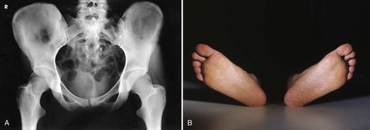
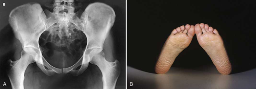
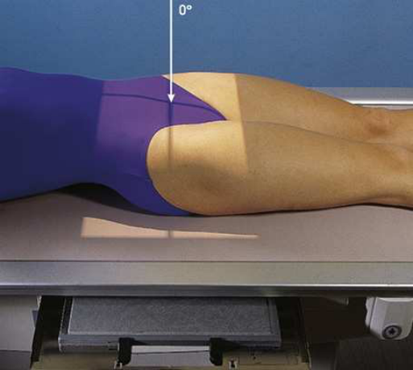
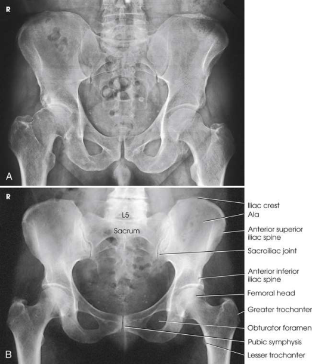
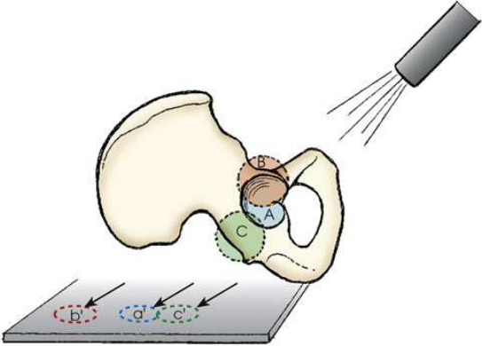

# Rx bazin și femure proximale — incidență antero-posterioară (AP) (Merrill)

  📷 Radiografie Convențională (Rx)
  <strong>Actualizat:</strong> 2026-09-16
  <strong>Autor:</strong> Referință Merrill

---

-   __1. Rezumat Clinic & Indicații__

    ---

    === "Indicații Clinice"

        - Conform reperelor anatomice standard din tratat

    === "Ghid Național IRIS"

        !!! info "Referință Primară: Ghidul Național IRIS (Ordinul MS 1342/2012)"
            - **Capitol Ghid IRIS:** *Aparat locomotor & Bazin*
            - **Grad de Recomandare:** **Grad A**
            - **Nivel de Iradiere Estimată:** `Clasa 2 (Foarte mică ~ 0.8 - 1.0 mSv)`

            [:octicons-search-16: Deschide Ghidul IRIS](../../iris.md){ .md-button .md-button--primary } [:material-open-in-new: Aplicația Oficială PWA](https://radiologie-pediatrica.ro/iris/){ .md-button target="_blank" rel="noopener" }

-   __2. Poziționare & Centrare Fascicul__

    ---

    - **Poziție Pacient:** se poziționează pacientul pe masa de examinare în decubit dorsal; se centrează MSP al corpului pe linia mediană a grilei și se ajustează în poziție de decubit dorsal adevărată. Cu excepția cazurilor contraindicate din cauza traumatismului / regimului de urgență sau a factorilor patologici, se rotesc medial picioarele și membrele inferioare aproximativ 15 la 20 de grade pentru a poziționa colurile femurale paralel cu planul receptorului de imagine (receptorul de imagine) (Figs. 8.13 și 8.14). Rotația internă (medială) este mai ușor de menținut de către pacient dacă genunchii sunt sprijiniți. Călcâiele trebuie plasate la aproximativ 8 la 10 țoli (20 la 24 cm) unul de celălalt. Se imobilizează membrele inferioare cu săculeți cu nisip peste glezne, dacă este necesar. Se verifică distanța de la spina iliacă antero-superioară (SIAS) la masa de examinare, pe fiecare parte, pentru a se asigura că bazinul nu este rotit. Se centrează receptorul de imagine la nivelul depresiunii țesuturilor moi situate imediat deasupra proeminenței palpabile a marelui trohanter (aproximativ 1.5 țoli [3.8 cm]), care este, de asemenea, la jumătatea distanței dintre spina iliacă antero-superioară (SIAS) și simfiza pubiană. La pacienții cu dimensiuni medii, centrul receptorului de imagine se află aproximativ 2 țoli (5 cm) inferior față de spina iliacă antero-superioară (SIAS) și 2 țoli (5 cm) superior față de simfiza pubiană (Fig. 8.15). Dacă bazinul este profund, se palpează crestele iliace și se ajustează poziția receptorului de imagine astfel încât marginea sa superioară să se proiecteze la 1 la 1.5 țoli (2.5 la 3.8 cm) deasupra crestei.
    - **Punct de Centrare Fascicul:** perpendicular pe mijlocul receptorului de imagine.
    - **Distanță Focar-Film (DFF / SID):** Nespecificat în fragmentul extras; de verificat în sursă
    - **Comandă Respiratorie:** apnee (oprirea respirației).

-   __3. Parametri Tehnici Expunere__

    ---

    | Parametru Tehnic | Valoare Configurare Generator / Tub |
    |:-----------------|:-------------------------------------|
    | **Tensiune Tub (kV)** | DE CONFIGURAT PE APARAT |
    | **Sarcină / Produs Curent-Timp (mAs)** | DE CONFIGURAT PE APARAT |
    | **Distanță Focar-Film (DFF / SID)** | Nespecificat în fragmentul extras; de verificat în sursă |
    | **Grilă Antidifuzoare (Bucky)** | DE CONFIGURAT PE APARAT |
    | **Dimensiune Focar** | DE CONFIGURAT PE APARAT |
    | **Camere de Ionizare AEC** | DE CONFIGURAT PE APARAT |
    | **Colimare Fascicul** | Se ajustează câmpul de iradiere la formatul 35 × 43 cm pe colimator. Pentru pacienții mai mici, se colimează la 1 țol (2.5 cm) dincolo de umbra cutanată pe părți. Se plasează markerul de lateralitate în câmpul colimat. |
    | **Filtrare Tub** | DE CONFIGURAT PE APARAT |

-   __4. Criterii de Calitate & Reușită Imagine__

    ---

    - Criterii radiologice de calitate a imaginii:
    - Colimare adecvată vizibilă și prezența markerului de lateralitate (D/S) plasat în afara structurilor anatomice de interes
    - Întregul bazin și femurele proximale
    - ambele aripi iliace și marii trohanteri echidistanți față de marginea radiografiei
    - Coloana vertebrală lombară centrată pe mijlocul radiografiei
    - Absența rotației anatomice a bazinului (simetrie bilaterală perfectă)
    - aripi iliace simetrice
    - găuri obturatoare simetrice
    - coloana vertebrală și ischioanele vizibile în mod egal
    - Sacrul și coccisul aliniate cu simfiza pubiană
    - rotația corectă a femurelor proximale
    - Colurile femurale vizibile în întregime, fără suprapunere
    - Marii trohanteri în profil
    - Micii trohanteri, dacă sunt vizibili, vizibili pe marginea medială a femurelor
    - Detalii osoase trabeculare și țesuturile moi înconjurătoare. Luxația congenitală a șoldului. Martz și Taylor 3 au recomandat două incidențe AP ale bazinului pentru a evidenția relația capului femural cu cotilul (acetabulul) la pacienții cu luxație congenitală a șoldului. Prima incidență se efectuează cu raza centrală orientată perpendicular pe simfiza pubiană pentru a detecta orice deplasare laterală sau superioară a capului femural. A doua incidență se efectuează cu raza centrală orientată spre simfiza pubiană, cu o angulație cefalică de 45 grade (Fig. 8.17). Această angulație proiectează umbra capului femural deplasat anterior deasupra umbrei cotilului (acetabulului) și umbra capului deplasat posterior sub umbra cotilului (acetabulului).

-   __5. Protecție Radiologică (ALARA)__

    ---

    - Nespecificat în fragmentul extras; de verificat în sursă

!!! note "Observații Clinice & Tehnice"
    Conform reperelor anatomice standard din tratat

### 🖼️ Imagini

<figure class="protocol-image-card" markdown>

<figcaption><strong>Merrill — pagina 611, imaginea 1</strong> — Imagine din fragmentul sursă; asocierea necesită revizie.</figcaption>

</figure>

<figure class="protocol-image-card" markdown>

<figcaption><strong>Merrill — pagina 611, imaginea 2</strong> — Imagine din fragmentul sursă; asocierea necesită revizie.</figcaption>

</figure>

<figure class="protocol-image-card" markdown>

<figcaption><strong>Merrill — pagina 612, imaginea 3</strong> — Imagine din fragmentul sursă; asocierea necesită revizie.</figcaption>

</figure>

<figure class="protocol-image-card" markdown>

<figcaption><strong>Merrill — pagina 613, imaginea 4</strong> — Imagine din fragmentul sursă; asocierea necesită revizie.</figcaption>

</figure>

<figure class="protocol-image-card" markdown>

<figcaption><strong>Merrill — pagina 614, imaginea 5</strong> — Imagine din fragmentul sursă; asocierea necesită revizie.</figcaption>

</figure>

=== "Ghid Rapid de Execuție"

    1. **Identificarea și verificarea pacientului:** verificare identitate, zonă de examinat, consimțământ conform procedurii și evaluarea posibilității unei sarcini, când este relevantă.
    2. **Pregătire:** îndepărtarea oricăror obiecte radiopace (bijuterii, agrafe, fermoare, proteze, pansamente dense).
    3. **Poziționare precisă:** alinierea receptorului de imagine și a tubului la distanța prescrisă (Nespecificat în fragmentul extras; de verificat în sursă).
    4. **Colimare strictă:** adaptarea fasciculului strict la regiunea de diagnostic pentru scăderea iradierii și reducerea radiației difuze.
    5. **Radioprotecție:** verificarea [politicii RX](../radioprotectie.md), cu măsuri distincte pentru pacient, personal și însoțitor.

## Surse de documentare

- [Merrill’s Atlas, 8. Pelvis and Hip, pagini 610–614](https://books.google.com/books/about/Merrill_s_Atlas_of_Radiographic_Position.html?id=BM0lEQAAQBAJ)
