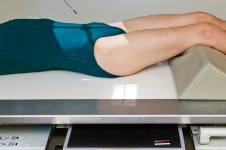
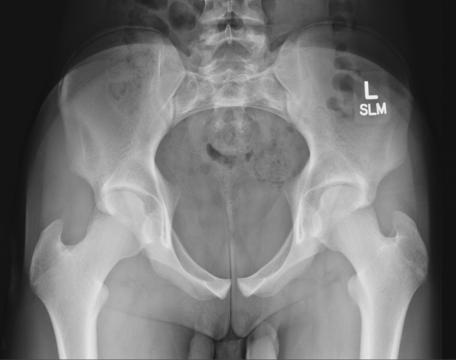
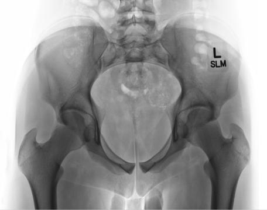

# Rx Bazin (Pelvis) AP AXIAL INLET PROJECTION7

  📷 Radiografie Convențională (Rx)
  <strong>Actualizat:</strong> 2026-09-15
  <strong>Autor:</strong> Departamentul de Radiologie / Referință Bontrager

---

-   __1. Rezumat Clinic & Indicații__

    ---

    === "Indicații Clinice"

        - Assessment de pelvic traumatism acuttism / Regim Urgență pentru posterior displacement sau inward sau outward rotație de anterior Bazin (bazin (pelvis))

    === "Ghid Național IRIS"

        !!! info "Referință Primară: Ghidul Național IRIS (Ordinul MS 1342/2012)"
            - **Capitol Ghid IRIS:** *Ghidul Național IRIS*
            - **Grad de Recomandare:** **De verificat pe indicație; fără grad atribuit automat**
            - **Nivel de Iradiere Estimată:** `De verificat pentru examinarea și populația selectate`

            [:octicons-search-16: Deschide Ghidul IRIS](../../iris.md){ .md-button .md-button--primary } [:material-open-in-new: Aplicația Oficială PWA](https://radiologie-pediatrica.ro/iris/){ .md-button target="_blank" rel="noopener" }
-   __2. Poziționare & Centrare Fascicul__

    ---

    - **Poziție Pacient:** Pacient: cu pacient Decubit dorsal, provide pillow pentru cap. cu pacient’s membre inferioare extins, place support under genunchi pentru comfort (Fig. 7.50).; Regiune anatomică: Align plan mediosagital la raza centrală și la linia mediană mesei și/sau receptorul de imagine. Ensure Absența rotației anatomice: clavicule echidistante față de linia apofizelor spinoase de Bazin (bazin (pelvis)) (ASISto- tabletop distance equal pe ambele părți (bilateral)). Se centrează receptorul de imagine pe proiecția razei centrale.
    - **Punct de Centrare Fascicul:** Fig. 7.50 AP axial inlet incidență—raza centrală 40 grade caudal (Raza centrală perpendiculară la pelvic inlet).
    - **Distanță Focar-Film (DFF / SID):** 100 cm
    - **Comandă Respiratorie:** Apnee pe durata expunerii. Bazin (bazin (pelvis)) SPECIAL AP axial outlet incidență AP axial inlet incidență x x Plane de inlet Sacru

-   __3. Parametri Tehnici Expunere__

    ---

    | Parametru Tehnic | Valoare Configurare Generator / Tub |
    |:-----------------|:-------------------------------------|
    | **Tensiune Tub (kV)** | 80-90 kV |
    | **Sarcină / Produs Curent-Timp (mAs)** | DE CONFIGURAT PE APARAT |
    | **Distanță Focar-Film (DFF / SID)** | 100 cm |
    | **Grilă Antidifuzoare (Bucky)** | Cu grilă antidifuzoare Bucky |
    | **Dimensiune Focar** | Focar Mare (1.0 - 1.2 mm) |
    | **Camere de Ionizare AEC** | Camerele laterale (sau camera centrală funcție de regiune) |
    | **Colimare Fascicul** | Collimate closely pe four sides la aria de interes diagnostic. |
    | **Filtrare Tub** | Totală ≥ 2.5 mm Al echivalent |

-   __4. Criterii de Calitate & Reușită Imagine__

    ---

    - axial incidență that evidențiază pelvic ring sau inlet (superior aperture) în its entirety (Figs. 7.51 și 7.52) poziție:
    - Absența rotației anatomice: clavicule echidistante față de linia apofizelor spinoase: coloană vertebrală ischiatice sunt fully evidențiat și equal în size și shape. corect centering și angulation sunt evidenced prin demonstration de superimposed anterior și posterior portions de pelvic ring.
    - Center de pelvic inlet trebuie să fie la center de câmp colimat.
    - Collimation field size la aria de interes diagnostic. expunere:
    - optim receptorul de imagine expunere și contrast de superimposed anterior și posterior portions de pelvic ring. lateral aspects de ala generally sunt overexposed.
    - Bony margins și trabecular markings de pubic și ischial bones appear net, indicating fără mișcare. Bazin (bazin (pelvis)) inlet (superior aperture) cap femural superior ramus de pubis Ala de ilium coloană vertebrală ischiatice Ramus de ischium Fig. 7.52 AP axial inlet incidență. Fig. 7.51 AP axial inlet incidență.

-   __5. Protecție Radiologică (ALARA)__

    ---

    - Ecranare gonadică și a organelor radiosensibile conform procedurilor locale de radioprotecție ALARA.
    - Colimare strictă la aria de interes pentru limitarea radiației difuze.
    - Verificarea posibilității unei sarcini la pacientele de vârstă fertilă înainte de expunere.

### 🖼️ Imagini

<figure class="protocol-image-card" markdown>

<figcaption><strong>Fig. 7.50 AP axial inlet incidență—raza centrală 40 grade caudal (raza centrală</strong> — Poziționare pacient conform Ghidului Bontrager (Fig. 7.50 AP axial inlet incidență—raza centrală 40 grade caudal (raza centrală)</figcaption>

</figure>

<figure class="protocol-image-card" markdown>

<figcaption><strong>Fig. 7.52 AP axial inlet incidență.</strong> — Aspect radiografic de referință conform Ghidului Bontrager (Fig. 7.52 AP axial inlet incidență.)</figcaption>

</figure>

<figure class="protocol-image-card" markdown>

<figcaption><strong>Fig. 7.51 AP axial inlet incidență.</strong> — Aspect radiografic de referință conform Ghidului Bontrager (Fig. 7.51 AP axial inlet incidență.)</figcaption>

</figure>

=== "Ghid Rapid de Execuție"

    1. **Identificarea și verificarea pacientului:** verificare identitate, zonă de examinat, consimțământ conform procedurii și evaluarea posibilității unei sarcini, când este relevantă.
    2. **Pregătire:** îndepărtarea oricăror obiecte radiopace (bijuterii, agrafe, fermoare, proteze, pansamente dense).
    3. **Poziționare precisă:** alinierea receptorului de imagine și a tubului la distanța prescrisă (100 cm).
    4. **Colimare strictă:** adaptarea fasciculului strict la regiunea de diagnostic pentru scăderea iradierii și reducerea radiației difuze.
    5. **Radioprotecție:** verificarea [politicii RX](../radioprotectie.md), cu măsuri distincte pentru pacient, personal și însoțitor.

## Surse de documentare

- [Bontrager's Textbook of Radiographic Positioning (Ed. 9/10), Pagina 299](https://www.elsevier.com/books/textbook-of-radiographic-positioning-and-related-anatomy/lampignano/978-0-323-65367-1)
