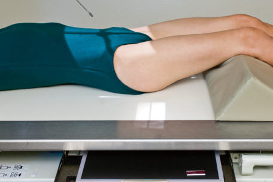
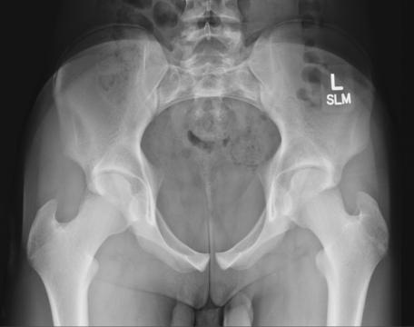
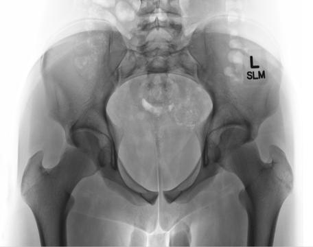

# Rx bazin — incidență AP axială de intrare7

  📷 Radiografie Convențională (Rx)
  <strong>Actualizat:</strong> 2026-09-15
  <strong>Autor:</strong> Departamentul de Radiologie / Referință Bontrager

---

-   __1. Rezumat Clinic & Indicații__

    ---

    === "Indicații Clinice"

        - Evaluarea traumatismului pelvin acut / regim de urgență pentru deplasarea posterioară sau rotația spre interior sau spre exterior a bazinului anterior

    === "Ghid Național IRIS"

        !!! info "Referință Primară: Ghidul Național IRIS (Ordinul MS 1342/2012)"
            - **Capitol Ghid IRIS:** *Aparat locomotor & Bazin*
            - **Grad de Recomandare:** **Grad A**
            - **Nivel de Iradiere Estimată:** `Clasa 2 (Foarte mică ~ 0.8 - 1.0 mSv)`

            [:octicons-search-16: Deschide Ghidul IRIS](../../iris.md){ .md-button .md-button--primary } [:material-open-in-new: Aplicația Oficială PWA](https://radiologie-pediatrica.ro/iris/){ .md-button target="_blank" rel="noopener" }

-   __2. Poziționare & Centrare Fascicul__

    ---

    - **Poziție Pacient:** Pacient: cu pacientul în decubit dorsal, se pune o pernă pentru cap. Cu membrele inferioare extinse, se plasează un suport sub genunchi pentru confort (Fig. 7.50).; Regiune anatomică: se aliniază planul mediosagital cu raza centrală și cu linia mediană a mesei și/sau a receptorului de imagine. Se asigură absența rotației anatomice: claviculele echidistante față de linia apofizelor spinoase ale bazinului (distanța SIAS–masă de examinare egală pe ambele părți (bilateral)). Se centrează receptorul de imagine pe proiecția razei centrale.
    - **Punct de Centrare Fascicul:** Fig. 7.50 Incidență AP axială de intrare — raza centrală 40 grade caudal (raza centrală perpendiculară pe intrarea pelvină).
    - **Distanță Focar-Film (DFF / SID):** 100 cm
    - **Comandă Respiratorie:** Apnee pe durata expunerii. Bazin SPECIAL incidență AP axială de evacuare incidență AP axială de intrare x x Planul intrării Sacru

-   __3. Parametri Tehnici Expunere__

    ---

    | Parametru Tehnic | Valoare Configurare Generator / Tub |
    |:-----------------|:-------------------------------------|
    | **Tensiune Tub (kV)** | 80-90 kV |
    | **Sarcină / Produs Curent-Timp (mAs)** | DE CONFIGURAT PE APARAT |
    | **Distanță Focar-Film (DFF / SID)** | 100 cm |
    | **Grilă Antidifuzoare (Bucky)** | Cu grilă antidifuzoare Bucky |
    | **Dimensiune Focar** | Focar Mare (1.0 - 1.2 mm) |
    | **Camere de Ionizare AEC** | Camerele laterale (sau camera centrală, în funcție de regiune) |
    | **Colimare Fascicul** | Se colimează strâns pe toate cele patru laturi până la aria de interes diagnostic. |
    | **Filtrare Tub** | Totală ≥ 2.5 mm Al echivalent |

-   __4. Criterii de Calitate & Reușită Imagine__

    ---

    - incidență axială care evidențiază inelul pelvin sau intrarea pelvină (apertura superioară) în întregime (Figs. 7.51 și 7.52) poziție:
    - Absența rotației anatomice: claviculele echidistante față de linia apofizelor spinoase: coloana vertebrală și ischioanele sunt evidențiate complet și sunt egale ca dimensiune și formă. Centrarea și angulația corecte sunt evidențiate prin demonstrarea porțiunilor anterioare și posterioare suprapuse ale inelului pelvin.
    - Centrul intrării pelvine trebuie să se afle în centrul câmpului colimat.
    - Dimensiunea câmpului de colimare până la aria de interes diagnostic. Expunere:
    - Expunere optimă a receptorului de imagine și contrast al porțiunilor anterioare și posterioare suprapuse ale inelului pelvin. Aspectele laterale ale aripilor sunt, în general, supraexpuse.
    - Marginile osoase și desenul trabecular al oaselor pubiene și ischiatice apar nete, indicând absența mișcării. Bazin (intrare pelvină) cap femural ram superior al pubisului aripă a ilionului coloana vertebrală ischiatică ram al ischionului Fig. 7.52 Incidență AP axială de intrare. Fig. 7.51 Incidență AP axială de intrare.

-   __5. Protecție Radiologică (ALARA)__

    ---

    - Ecranare gonadică și a organelor radiosensibile conform procedurilor locale de radioprotecție ALARA.
    - Colimare strictă la aria de interes pentru limitarea radiației difuze.
    - Verificarea posibilității unei sarcini la pacientele de vârstă fertilă înainte de expunere.

### 🖼️ Imagini

<figure class="protocol-image-card" markdown>

<figcaption><strong>Fig. 7.50 Incidență AP axială de intrare — raza centrală 40 grade caudal (raza centrală</strong> — Poziționarea pacientului conform Ghidului Bontrager (Fig. 7.50 Incidență AP axială de intrare — raza centrală 40 grade caudal (raza centrală)</figcaption>

</figure>

<figure class="protocol-image-card" markdown>

<figcaption><strong>Fig. 7.52 Incidență AP axială de intrare.</strong> — Aspect radiografic de referință conform Ghidului Bontrager (Fig. 7.52 Incidență AP axială de intrare.)</figcaption>

</figure>

<figure class="protocol-image-card" markdown>

<figcaption><strong>Fig. 7.51 Incidență AP axială de intrare.</strong> — Aspect radiografic de referință conform Ghidului Bontrager (Fig. 7.51 Incidență AP axială de intrare.)</figcaption>

</figure>

=== "Ghid Rapid de Execuție"

    1. **Identificarea și verificarea pacientului:** verificare identitate, zonă de examinat, consimțământ conform procedurii și evaluarea posibilității unei sarcini, când este relevantă.
    2. **Pregătire:** îndepărtarea oricăror obiecte radiopace (bijuterii, agrafe, fermoare, proteze, pansamente dense).
    3. **Poziționare precisă:** alinierea receptorului de imagine și a tubului la distanța prescrisă (100 cm).
    4. **Colimare strictă:** adaptarea fasciculului strict la regiunea de diagnostic pentru scăderea iradierii și reducerea radiației difuze.
    5. **Radioprotecție:** verificarea [politicii RX](../radioprotectie.md), cu măsuri distincte pentru pacient, personal și însoțitor.

## Surse de documentare

- [Bontrager's Textbook of Radiographic Positioning (Ed. 9/10), Pagina 299](https://www.elsevier.com/books/textbook-of-radiographic-positioning-and-related-anatomy/lampignano/978-0-323-65367-1)
