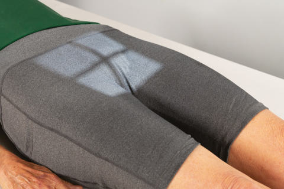
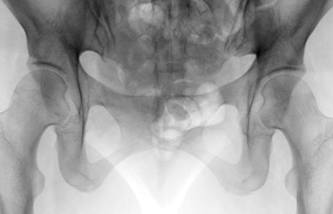

# Rx Bazin (Pelvis) AP AXIAL OUTLET PROJECTION7 (INFERIOR PELVIC BONES) (TAYLOR METHOD)

  📷 Radiografie Convențională (Rx)
  <strong>Actualizat:</strong> 2026-09-15
  <strong>Autor:</strong> Departamentul de Radiologie / Referință Bontrager

---

-   __1. Rezumat Clinic & Indicații__

    ---

    === "Indicații Clinice"

        - Bilateral view of the bilateral pubis and ischium to allow assessment of pelvic traumatism acuttism / Regim Urgență for suspiciune de fractură and displacement

    === "Ghid Național IRIS"

        !!! info "Referință Primară: Ghidul Național IRIS (Ordinul MS 1342/2012)"
            - **Capitol Ghid IRIS:** *Ghidul Național IRIS*
            - **Grad de Recomandare:** **De verificat pe indicație; fără grad atribuit automat**
            - **Nivel de Iradiere Estimată:** `De verificat pentru examinarea și populația selectate`

            [:octicons-search-16: Deschide Ghidul IRIS](../../iris.md){ .md-button .md-button--primary } [:material-open-in-new: Aplicația Oficială PWA](https://radiologie-pediatrica.ro/iris/){ .md-button target="_blank" rel="noopener" }
-   __2. Poziționare & Centrare Fascicul__

    ---

    - **Poziție Pacient:** Pacient: With patient Decubit Dorsal, provide pillow for head. With patient’s legs extended, place support under knees for comfort (Fig. 7.47).; Regiune anatomică: Align midsagittal plane to CR and to midline of table and/or IR. Ensure Absența rotației anatomice: clavicule echidistante față de linia apofizelor spinoase of Bazin (Pelvis) (ASISto- tabletop distance equal on both sides). Center IR to projected CR.
    - **Punct de Centrare Fascicul:** Angle CR cephalad 20 to 35 degrees for males and 30 to 45 degrees for females. (These different angles are caused by differences in the shape of male and female pelvises. See section Male versus Female Bazin (Pelvis) Differences on pp. 271–272.) Direct CR to a midline point 1 to 2 inches (2.5 to 5 cm) distal to the superior border of the simfiza pubiană or marele trohanters.
    - **Distanță Focar-Film (DFF / SID):** 100 cm
    - **Comandă Respiratorie:** Suspend respiration during exposure. Bazin (Pelvis) SPECIAL AP axial outlet projection Fig. 7.47 AP axial outlet projection—CR 40 degrees cephalad.

-   __3. Parametri Tehnici Expunere__

    ---

    | Parametru Tehnic | Valoare Configurare Generator / Tub |
    |:-----------------|:-------------------------------------|
    | **Tensiune Tub (kV)** | 80-90 kV |
    | **Sarcină / Produs Curent-Timp (mAs)** | DE CONFIGURAT PE APARAT |
    | **Distanță Focar-Film (DFF / SID)** | 100 cm |
    | **Grilă Antidifuzoare (Bucky)** | Cu grilă antidifuzoare Bucky |
    | **Dimensiune Focar** | Focar Mare (1.0 - 1.2 mm) |
    | **Camere de Ionizare AEC** | Camerele laterale (sau camera centrală funcție de regiune) |
    | **Colimare Fascicul** | Collimate on four sides to anatomy of interest. |
    | **Filtrare Tub** | Totală ≥ 2.5 mm Al echivalent |

-   __4. Criterii de Calitate & Reușită Imagine__

    ---

    - Superior and inferior rami of pubis and body and ramus of ischium are demonstrated well, with minimal foreshortening or superimposition (Figs. 7.48 and 7.49). Position:
    - Absența rotației anatomice: clavicule echidistante față de linia apofizelor spinoase: Obturator foramina and bilateral ischia are equal in size and shape. Correct CR angle evidenced by demonstration of the anterior/inferior pelvic bones, with minimal foreshortening. Midpoint of symphysis joint should be at center of collimated field.
    - Collimation field size to area of interest. Exposure:
    - Body and superior rami of pubis are well demonstrated without overexposure of ischial rami.
    - Bony margins and trabecular markings of pubic and ischial bones appear sharp, indicating no motion. R MM Decubit Dorsal Fig. 7.48 AP axial outlet projection. (Courtesy Joss Wertz, DO.) R MM Decubit Dorsal Obturator foramen Body of pubis Superior ramus of the pubis Acetabulum Illium Lower body of ischium Ischial tuberosity Ramus of ischium Inferior ramus of pubis Fig. 7.49 AP axial outlet projection. (Courtesy Joss Wertz, DO.)

-   __5. Protecție Radiologică (ALARA)__

    ---

    - Ecranare gonadică și a organelor radiosensibile conform procedurilor locale de radioprotecție ALARA.
    - Colimare strictă la aria de interes pentru limitarea radiației difuze.
    - Verificarea posibilității unei sarcini la pacientele de vârstă fertilă înainte de expunere.

### 🖼️ Imagini

<figure class="protocol-image-card" markdown>

<figcaption><strong>Fig. 7.47 AP axial outlet projection—CR 40 degrees cephalad.</strong> — Poziționare pacient conform Ghidului Bontrager (Fig. 7.47 AP axial outlet projection—CR 40 degrees cephalad.)</figcaption>

</figure>

<figure class="protocol-image-card" markdown>

<figcaption><strong>Fig. 7.48 AP axial outlet projection. (Courtesy Joss Wertz, DO.)</strong> — Aspect radiografic de referință conform Ghidului Bontrager (Fig. 7.48 AP axial outlet projection. (Courtesy Joss Wertz, DO.))</figcaption>

</figure>

<figure class="protocol-image-card" markdown>

<figcaption><strong>Fig. 7.49 AP axial outlet projection. (Courtesy Joss Wertz, DO.)</strong> — Aspect radiografic de referință conform Ghidului Bontrager (Fig. 7.49 AP axial outlet projection. (Courtesy Joss Wertz, DO.))</figcaption>

</figure>

=== "Ghid Rapid de Execuție"

    1. **Identificarea și verificarea pacientului:** verificare identitate, zonă de examinat, consimțământ conform procedurii și evaluarea posibilității unei sarcini, când este relevantă.
    2. **Pregătire:** îndepărtarea oricăror obiecte radiopace (bijuterii, agrafe, fermoare, proteze, pansamente dense).
    3. **Poziționare precisă:** alinierea receptorului de imagine și a tubului la distanța prescrisă (100 cm).
    4. **Colimare strictă:** adaptarea fasciculului strict la regiunea de diagnostic pentru scăderea iradierii și reducerea radiației difuze.
    5. **Radioprotecție:** verificarea [politicii RX](../radioprotectie.md), cu măsuri distincte pentru pacient, personal și însoțitor.

## Surse de documentare

- [Bontrager's Textbook of Radiographic Positioning (Ed. 9/10), Pagina 298](https://www.elsevier.com/books/textbook-of-radiographic-positioning-and-related-anatomy/lampignano/978-0-323-65367-1)
