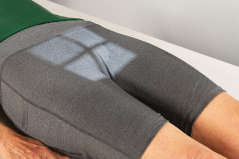
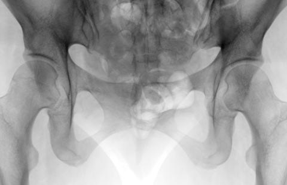

# Rx bazin — incidență AP axială de evacuare7 (oasele pelvine inferioare) (metoda Taylor)

  📷 Radiografie Convențională (Rx)
  <strong>Actualizat:</strong> 2026-09-15
  <strong>Autor:</strong> Departamentul de Radiologie / Referință Bontrager

---

-   __1. Rezumat Clinic & Indicații__

    ---

    === "Indicații Clinice"

        - incidență bilaterală a pubisului și ischionului bilateral pentru a permite evaluarea traumatismului pelvin acut / regim de urgență pentru suspiciune de fractură și deplasare

    === "Ghid Național IRIS"

        !!! info "Referință Primară: Ghidul Național IRIS (Ordinul MS 1342/2012)"
            - **Capitol Ghid IRIS:** *Aparat locomotor & Bazin*
            - **Grad de Recomandare:** **Grad A**
            - **Nivel de Iradiere Estimată:** `Clasa 2 (Foarte mică ~ 0.8 - 1.0 mSv)`

            [:octicons-search-16: Deschide Ghidul IRIS](../../iris.md){ .md-button .md-button--primary } [:material-open-in-new: Aplicația Oficială PWA](https://radiologie-pediatrica.ro/iris/){ .md-button target="_blank" rel="noopener" }

-   __2. Poziționare & Centrare Fascicul__

    ---

    - **Poziție Pacient:** Pacient: cu pacientul în decubit dorsal, se pune o pernă pentru cap. Cu membrele inferioare extinse, se plasează un suport sub genunchi pentru confort (Fig. 7.47).; Regiune anatomică: se aliniază planul mediosagital cu raza centrală și cu linia mediană a mesei și/sau a receptorului de imagine. Se asigură absența rotației anatomice: claviculele echidistante față de linia apofizelor spinoase ale bazinului (distanța SIAS–masă de examinare egală pe ambele părți (bilateral)). Se centrează receptorul de imagine pe proiecția razei centrale.
    - **Punct de Centrare Fascicul:** Unghiul razei centrale: cranial 20 la 35 grade pentru bărbați și 30 la 45 grade pentru femei. (Aceste unghiuri diferite sunt cauzate de diferențele de formă ale bazinelor masculin și feminin. A se vedea secțiunea Diferențe între bazinul masculin și cel feminin la pp. 271–272.) Raza centrală se orientează spre punctul median situat la 1 la 2 țoli (2.5 la 5 cm) distal față de marginea superioară a simfizei pubiene sau a marilor trohanteri.
    - **Distanță Focar-Film (DFF / SID):** 100 cm
    - **Comandă Respiratorie:** Apnee pe durata expunerii. Bazin SPECIAL incidență AP axială de evacuare Fig. 7.47 Incidență AP axială de evacuare — raza centrală 40 grade cranial.

-   __3. Parametri Tehnici Expunere__

    ---

    | Parametru Tehnic | Valoare Configurare Generator / Tub |
    |:-----------------|:-------------------------------------|
    | **Tensiune Tub (kV)** | 80-90 kV |
    | **Sarcină / Produs Curent-Timp (mAs)** | DE CONFIGURAT PE APARAT |
    | **Distanță Focar-Film (DFF / SID)** | 100 cm |
    | **Grilă Antidifuzoare (Bucky)** | Cu grilă antidifuzoare Bucky |
    | **Dimensiune Focar** | Focar Mare (1.0 - 1.2 mm) |
    | **Camere de Ionizare AEC** | Camerele laterale (sau camera centrală, în funcție de regiune) |
    | **Colimare Fascicul** | Colimați pe cele patru laturi la anatomia de interes. |
    | **Filtrare Tub** | Totală ≥ 2.5 mm Al echivalent |

-   __4. Criterii de Calitate & Reușită Imagine__

    ---

    - ramurile superioare și inferioare ale pubisului și corpul și ramul ischionului sunt evidențiate bine, cu scurtare sau suprapunere minimă (Figs. 7.48 și 7.49). poziție:
    - Absența rotației anatomice: claviculele echidistante față de linia apofizelor spinoase: găurile obturatoare și ischioanele bilateral sunt egale ca dimensiune și formă. Unghiul corect al razei centrale este evidențiat prin demonstrarea oaselor pelvine anterioare/inferioare, cu scurtare minimă. Mijlocul simfizei articulare trebuie să se afle în centrul câmpului colimat.
    - Dimensiunea câmpului de colimare până la aria de interes diagnostic. Expunere:
    - corpul și ramurile superioare ale pubisului sunt bine evidențiate, fără supraexpunerea ramurilor ischiatice.
    - Marginile osoase și desenul trabecular al oaselor pubiene și ischiatice apar nete, indicând absența mișcării. R MM Decubit dorsal Fig. 7.48 Incidență AP axială de evacuare. (Cu amabilitatea lui Joss Wertz, DO.) R MM Decubit dorsal găuri obturatoare corpul pubisului ramul superior al pubisului cotil (acetabul) Ilion corpul inferior al ischionului tuberozități ischiatice ramul ischionului ramul inferior al pubisului Fig. 7.49 Incidență AP axială de evacuare. (Cu amabilitatea lui Joss Wertz, DO.)

-   __5. Protecție Radiologică (ALARA)__

    ---

    - Ecranare gonadică și a organelor radiosensibile conform procedurilor locale de radioprotecție ALARA.
    - Colimare strictă la aria de interes pentru limitarea radiației difuze.
    - Verificarea posibilității unei sarcini la pacientele de vârstă fertilă înainte de expunere.

### 🖼️ Imagini

<figure class="protocol-image-card" markdown>

<figcaption><strong>Fig. 7.47 Incidență AP axială de evacuare — raza centrală 40 grade cranial.</strong> — Poziționarea pacientului conform Ghidului Bontrager (Fig. 7.47 Incidență AP axială de evacuare — raza centrală 40 grade cranial.)</figcaption>

</figure>

<figure class="protocol-image-card" markdown>

<figcaption><strong>Fig. 7.48 Incidență AP axială de evacuare. (Cu amabilitatea lui Joss Wertz, DO.)</strong> — Aspect radiografic de referință conform Ghidului Bontrager (Fig. 7.48 Incidență AP axială de evacuare. (Cu amabilitatea lui Joss Wertz, DO.))</figcaption>

</figure>

<figure class="protocol-image-card" markdown>

<figcaption><strong>Fig. 7.49 Incidență AP axială de evacuare. (Cu amabilitatea lui Joss Wertz, DO.)</strong> — Aspect radiografic de referință conform Ghidului Bontrager (Fig. 7.49 Incidență AP axială de evacuare. (Cu amabilitatea lui Joss Wertz, DO.))</figcaption>

</figure>

=== "Ghid Rapid de Execuție"

    1. **Identificarea și verificarea pacientului:** verificare identitate, zonă de examinat, consimțământ conform procedurii și evaluarea posibilității unei sarcini, când este relevantă.
    2. **Pregătire:** îndepărtarea oricăror obiecte radiopace (bijuterii, agrafe, fermoare, proteze, pansamente dense).
    3. **Poziționare precisă:** alinierea receptorului de imagine și a tubului la distanța prescrisă (100 cm).
    4. **Colimare strictă:** adaptarea fasciculului strict la regiunea de diagnostic pentru scăderea iradierii și reducerea radiației difuze.
    5. **Radioprotecție:** verificarea [politicii RX](../radioprotectie.md), cu măsuri distincte pentru pacient, personal și însoțitor.

## Surse de documentare

- [Bontrager's Textbook of Radiographic Positioning (Ed. 9/10), Pagina 298](https://www.elsevier.com/books/textbook-of-radiographic-positioning-and-related-anatomy/lampignano/978-0-323-65367-1)
