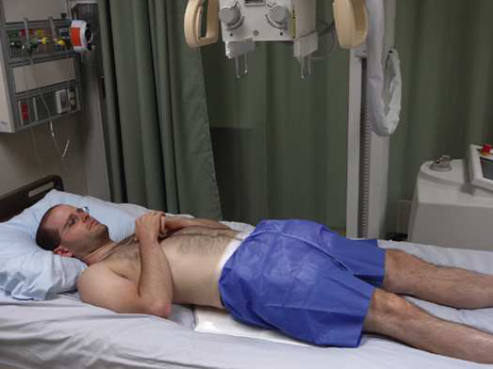

# Rx Bazin (Pelvis) — Incidență Antero-Posterioară (AP) f (Merrill)

  📷 Radiografie Convențională (Rx)
  <strong>Actualizat:</strong> 2026-09-16
  <strong>Autor:</strong> Referință Merrill

---

-   __1. Rezumat Clinic & Indicații__

    ---

    === "Indicații Clinice"

        - Conform reperelor anatomice standard din tratat

    === "Ghid Național IRIS"

        !!! info "Referință Primară: Ghidul Național IRIS (Ordinul MS 1342/2012)"
            - **Capitol Ghid IRIS:** *Ghidul Național IRIS*
            - **Grad de Recomandare:** **De verificat pe indicație; fără grad atribuit automat**
            - **Nivel de Iradiere Estimată:** `De verificat pentru examinarea și populația selectate`

            [:octicons-search-16: Deschide Ghidul IRIS](../../iris.md){ .md-button .md-button--primary } [:material-open-in-new: Aplicația Oficială PWA](https://radiologie-pediatrica.ro/iris/){ .md-button target="_blank" rel="noopener" }
-   __2. Poziționare & Centrare Fascicul__

    ---

    - **Poziție Pacient:** se ajustează pacient’s bed horizontally astfel încât pacient este în Decubit dorsal poziție. Move pacientul’s brațe out de region de Bazin (bazin (pelvis)).; poziție grila under Bazin (bazin (pelvis)) astfel încât center este midway între spină iliacă antero-superioară (SIAS) (spină iliacă antero-superioară (SIAS)) și simfiză pubiană. This este about 2 inches (5 cm) inferior la spină iliacă antero-superioară (SIAS) și 2 inches (5 cm) superior la simfiză pubiană. Se centrează planul mediosagital al pacientului pe linia mediană grilei antidifuzoare. Bazin (bazin (pelvis)) trebuie să nu fie rotit. se rotește pacient’s membre inferioare medially approximately 15 grade when nu contraindicated (Fig. 20.18).
    - **Punct de Centrare Fascicul:** perpendicular pe midpoint de grila, entering planul mediosagital. raza centrală trebuie să enter pacientul 2 inches (5 cm) above simfiză pubiană și 2 inches (5 cm) below spină iliacă antero-superioară (SIAS).
    - **Distanță Focar-Film (DFF / SID):** Nespecificat în fragmentul extras; de verificat în sursă
    - **Comandă Respiratorie:** Suspended.

-   __3. Parametri Tehnici Expunere__

    ---

    | Parametru Tehnic | Valoare Configurare Generator / Tub |
    |:-----------------|:-------------------------------------|
    | **Tensiune Tub (kV)** | DE CONFIGURAT PE APARAT |
    | **Sarcină / Produs Curent-Timp (mAs)** | DE CONFIGURAT PE APARAT |
    | **Distanță Focar-Film (DFF / SID)** | Nespecificat în fragmentul extras; de verificat în sursă |
    | **Grilă Antidifuzoare (Bucky)** | DE CONFIGURAT PE APARAT |
    | **Dimensiune Focar** | DE CONFIGURAT PE APARAT |
    | **Camere de Ionizare AEC** | DE CONFIGURAT PE APARAT |
    | **Colimare Fascicul** | Adjust la 14 × 17 inches (35 × 43 cm) pe collimator. |
    | **Filtrare Tub** | DE CONFIGURAT PE APARAT |

-   __4. Criterii de Calitate & Reușită Imagine__

    ---

    - Conform reperelor anatomice standard din tratat

-   __5. Protecție Radiologică (ALARA)__

    ---

    - Nespecificat în fragmentul extras; de verificat în sursă

!!! note "Observații Clinice & Tehnice"
    Conform reperelor anatomice standard din tratat

### 🖼️ Imagini

<figure class="protocol-image-card" markdown>

<figcaption><strong>Merrill — pagina PDF 1492, imaginea 1</strong> — Imagine din fragmentul sursă; asocierea necesită revizie.</figcaption>

</figure>

=== "Ghid Rapid de Execuție"

    1. **Identificarea și verificarea pacientului:** verificare identitate, zonă de examinat, consimțământ conform procedurii și evaluarea posibilității unei sarcini, când este relevantă.
    2. **Pregătire:** îndepărtarea oricăror obiecte radiopace (bijuterii, agrafe, fermoare, proteze, pansamente dense).
    3. **Poziționare precisă:** alinierea receptorului de imagine și a tubului la distanța prescrisă (Nespecificat în fragmentul extras; de verificat în sursă).
    4. **Colimare strictă:** adaptarea fasciculului strict la regiunea de diagnostic pentru scăderea iradierii și reducerea radiației difuze.
    5. **Radioprotecție:** verificarea [politicii RX](../radioprotectie.md), cu măsuri distincte pentru pacient, personal și însoțitor.

## Surse de documentare

- [Merrill’s Atlas, 20. Mobile Radiography, pagini PDF 1491–1492](../../assets/protocols/sources/a56d45c16829_Merrills_Atlas_of_Radiographic_Positioning__Procedures_3Vol_Set.pdf#page=1491)

## Fragmente sursă traduse (referință tehnică)

### anatomy

This incidență shows bazinul, including ambele hip bones; sacru și coccis; și capul, neck, trochanters, și proximal portion de femora (Fig. 20.19).

### collimation

• Adjust la 14 × 17 inches (35 × 43 cm) pe collimator.

### cr

• perpendicular pe midpoint de grila, entering planul mediosagital. raza centrală trebuie să enter pacientul 2 inches (5 cm) above
simfiză pubiană și 2 inches (5 cm) below spină iliacă antero-superioară (SIAS).

### part_pos

• poziție grila under bazinul astfel încât center este midway între spină iliacă antero-superioară (SIAS) (spină iliacă antero-superioară (SIAS)) și pubic
simfiză. This este about 2 inches (5 cm) inferior la spină iliacă antero-superioară (SIAS) și 2 inches (5 cm) superior la simfiză pubiană.
• Se centrează planul mediosagital al pacientului pe linia mediană grilei antidifuzoare. bazinul trebuie să nu fie rotit.
• se rotește pacient’s membre inferioare medially approximately 15 grade when nu contraindicated (Fig. 20.18).

### patient_pos

• se ajustează pacient’s bed horizontally astfel încât pacient este în decubit dorsal.
• Move pacientul’s brațe out de region de bazinul.

### respiration

Suspended.

### tech

receptorul de imagine trebuie să fie 14 × 17 inches (35 × 43 cm) cu grilă transversal.

