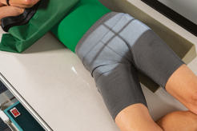
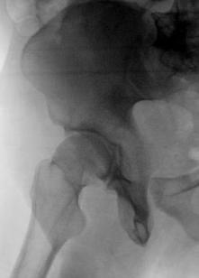
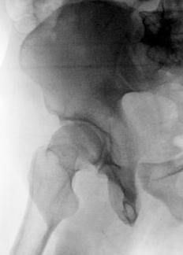

# Rx Bazin (Pelvis) POSTERIOR Oblică (ACETABULUM - JUDET METHOD)

  📷 Radiografie Convențională (Rx)
  <strong>Actualizat:</strong> 2026-09-15
  <strong>Autor:</strong> Departamentul de Radiologie / Referință Bontrager

---

-   __1. Rezumat Clinic & Indicații__

    ---

    === "Indicații Clinice"

        - Acetabular suspiciune de fractură
        - Pelvic ring suspiciune de fractură Generally, drept și stâng oblic incidențe sunt taken pentru comparison, cu ambele centrat pentru upside sau ambele pentru downside cotil (acetabul). cu possible pelvic ring suspiciune de fractură due la contrecoup injury, entire Bazin (bazin (pelvis)) trebuie să fie included. în this case, centering trebuie să fie ajustat la include ambele hips.

    === "Ghid Național IRIS"

        !!! info "Referință Primară: Ghidul Național IRIS (Ordinul MS 1342/2012)"
            - **Capitol Ghid IRIS:** *Ghidul Național IRIS*
            - **Grad de Recomandare:** **De verificat pe indicație; fără grad atribuit automat**
            - **Nivel de Iradiere Estimată:** `De verificat pentru examinarea și populația selectate`

            [:octicons-search-16: Deschide Ghidul IRIS](../../iris.md){ .md-button .md-button--primary } [:material-open-in-new: Aplicația Oficială PWA](https://radiologie-pediatrica.ro/iris/){ .md-button target="_blank" rel="noopener" }
-   __2. Poziționare & Centrare Fascicul__

    ---

    - **Poziție Pacient:** Pacient: posterior oblic poziții cu pacient semisupine, provide pillow pentru cap și poziție pentru affected side up sau down, depending pe anatomy la fie evidențiat.; Regiune anatomică: Place pacient în 45 grade posterior oblic, cu ambele Bazin (bazin (pelvis)) și thorax 45 grade de la tabletop. Support cu wedge sponge. Align cap femural și cotil (acetabul) de interest la midline de tabletop și/sau receptorul de imagine. Center receptorul de imagine longitudinally la raza centrală la level de cap femural.
    - **Punct de Centrare Fascicul:** cotil (acetabul) Affected side down: direct Raza centrală perpendiculară și centrat pe 2 inches (5 cm) distal și 2 inches (5 cm) medial la downside spină iliacă antero-superioară (SIAS) (Fig. 7.53, insert). Affected side up: direct perpendicular și centrat pe 2 inches (5 cm) directly distal la upside spină iliacă antero-superioară (SIAS) (Fig. 7.54, insert). Pelvic Ring Direct Raza centrală perpendiculară și centrat pe 2 inches (5 cm) inferior de la level de spină iliacă antero-superioară (SIAS) și 2 inches (5 cm) medial la upside spină iliacă antero-superioară (SIAS) (see Figs. 7.53 și 7.54).
    - **Distanță Focar-Film (DFF / SID):** 100 cm
    - **Comandă Respiratorie:** Apnee pe durata expunerii pentru expunere. Bazin (bazin (pelvis)) SPECIAL AP axial outlet AP axial inlet posterior oblic cotil (acetabul) (Judet method) posterior axial oblic cotil (acetabul) (Teufel method) oblic (false profile method) Fig. 7.53 RPO—centrat pentru drept (downside) cotil (acetabul). Fig. 7.54 LPO—centrat pentru drept (upside) cotil (acetabul).

-   __3. Parametri Tehnici Expunere__

    ---

    | Parametru Tehnic | Valoare Configurare Generator / Tub |
    |:-----------------|:-------------------------------------|
    | **Tensiune Tub (kV)** | 80-90 kV |
    | **Sarcină / Produs Curent-Timp (mAs)** | DE CONFIGURAT PE APARAT |
    | **Distanță Focar-Film (DFF / SID)** | 100 cm |
    | **Grilă Antidifuzoare (Bucky)** | Cu grilă antidifuzoare Bucky |
    | **Dimensiune Focar** | Focar Mare (1.0 - 1.2 mm) |
    | **Camere de Ionizare AEC** | Camerele laterale (sau camera centrală funcție de regiune) |
    | **Colimare Fascicul** | Collimate pe four sides la anatomy de interest. |
    | **Filtrare Tub** | Totală ≥ 2.5 mm Al echivalent |

-   __4. Criterii de Calitate & Reușită Imagine__

    ---

    - cotil (acetabul):
    - When centrat pe downside cotil (acetabul), anterior rim de cotil (acetabul) și posterior (ilioischial) column sunt evidențiat. iliac wing este also well visualized (Figs. 7.55 și 7.56).
    - When centrat pe upside cotil (acetabul), posterior rim de cotil (acetabul) și anterior (iliopubic) column sunt evidențiat. găuri obturatoare este also visualized (Figs. 7.57 și 7.58). Pelvic Ring:
    - incidențe will evidențiază ilioischial și iliopubic columns, along cu other aspects de pelvic ring (Figs. 7.59 și 7.60). poziție:
    - corect grade de obliquity este evidenced prin open și uniform Șold spații articulare la rim de cotil (acetabul) cap femural.
    - găuri obturatoare trebuie să fie open, if rotit correctly, pentru upside oblic, și trebuie să appear closed pe downside oblic. cotil (acetabul) (sau Bazin (bazin (pelvis))) trebuie să fie centrat pe receptorul de imagine și la collimation field size.
    - Collimation field size la aria de interes diagnostic. expunere:
    - optim receptorul de imagine expunere și contrast de bony margins și trabecular markings de cotil (acetabul) și cap femural regions; such markings trebuie să appear net, indicating fără mișcare. R Fig. 7.55 RPO—downside (anterior rim și posterior [ilioischial] column). Iliac wing (elongated) R posterior ilioischial column cap femural Area de anterior rim de cotil (acetabul), partially superimposed prin cap femural Fig. 7.56 RPO—downside cotil (acetabul).

-   __5. Protecție Radiologică (ALARA)__

    ---

    - Ecranare gonadică și a organelor radiosensibile conform procedurilor locale de radioprotecție ALARA.
    - Colimare strictă la aria de interes pentru limitarea radiației difuze.
    - Verificarea posibilității unei sarcini la pacientele de vârstă fertilă înainte de expunere.

### 🖼️ Imagini

<figure class="protocol-image-card" markdown>

<figcaption><strong>Fig. 7.53 RPO—centrat pentru</strong> — Poziționare pacient conform Ghidului Bontrager (Fig. 7.53 RPO—centrat pentru)</figcaption>

</figure>

<figure class="protocol-image-card" markdown>

<figcaption><strong>Fig. 7.54 LPO—centrat pentru drept</strong> — Aspect radiografic de referință conform Ghidului Bontrager (Fig. 7.54 LPO—centrat pentru drept)</figcaption>

</figure>

<figure class="protocol-image-card" markdown>

<figcaption><strong>Fig. 7.55 RPO—downside</strong> — Aspect radiografic de referință conform Ghidului Bontrager (Fig. 7.55 RPO—downside)</figcaption>

</figure>

<figure class="protocol-image-card" markdown>

<figcaption><strong>Fig. 7.56 RPO—downside</strong> — Aspect radiografic de referință conform Ghidului Bontrager (Fig. 7.56 RPO—downside)</figcaption>

</figure>

=== "Ghid Rapid de Execuție"

    1. **Identificarea și verificarea pacientului:** verificare identitate, zonă de examinat, consimțământ conform procedurii și evaluarea posibilității unei sarcini, când este relevantă.
    2. **Pregătire:** îndepărtarea oricăror obiecte radiopace (bijuterii, agrafe, fermoare, proteze, pansamente dense).
    3. **Poziționare precisă:** alinierea receptorului de imagine și a tubului la distanța prescrisă (100 cm).
    4. **Colimare strictă:** adaptarea fasciculului strict la regiunea de diagnostic pentru scăderea iradierii și reducerea radiației difuze.
    5. **Radioprotecție:** verificarea [politicii RX](../radioprotectie.md), cu măsuri distincte pentru pacient, personal și însoțitor.

## Surse de documentare

- [Bontrager's Textbook of Radiographic Positioning (Ed. 9/10), Pagina 300](https://www.elsevier.com/books/textbook-of-radiographic-positioning-and-related-anatomy/lampignano/978-0-323-65367-1)
