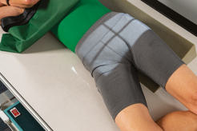
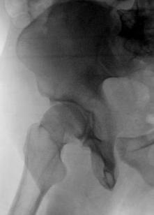
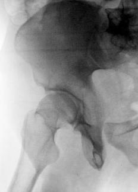

# Rx bazin (pelvis) — oblică posterioară (acetabulum — metoda Judet)

  📷 Radiografie Convențională (Rx)
  <strong>Actualizat:</strong> 2026-09-15
  <strong>Autor:</strong> Departamentul de Radiologie / Referință Bontrager

---

-   __1. Rezumat Clinic & Indicații__

    ---

    === "Indicații Clinice"

        - Suspiciune de fractură a cotilului (acetabulului)
        - Suspiciune de fractură a inelului pelvin. În general, se efectuează incidențe oblice dreaptă și stângă pentru comparație, ambele fiind centrate pentru cotilul de pe partea opusă mesei sau ambele pentru cotilul de pe partea în contact cu masa. În cazul unei posibile fracturi a inelului pelvin cauzate de o leziune prin contrecoup, trebuie inclus întregul bazin. În acest caz, centrarea trebuie ajustată pentru a include ambele șolduri.

    === "Ghid Național IRIS"

        !!! info "Referință Primară: Ghidul Național IRIS (Ordinul MS 1342/2012)"
            - **Capitol Ghid IRIS:** *Aparat locomotor & Bazin*
            - **Grad de Recomandare:** **Grad A**
            - **Nivel de Iradiere Estimată:** `Clasa 2 (Foarte mică ~ 0.8 - 1.0 mSv)`

            [:octicons-search-16: Deschide Ghidul IRIS](../../iris.md){ .md-button .md-button--primary } [:material-open-in-new: Aplicația Oficială PWA](https://radiologie-pediatrica.ro/iris/){ .md-button target="_blank" rel="noopener" }

-   __2. Poziționare & Centrare Fascicul__

    ---

    - **Poziție Pacient:** Pacient: poziții oblice posterioare, cu pacientul semisupin, se asigură o pernă pentru cap și se poziționează partea afectată în sus sau în jos, în funcție de anatomia care trebuie evidențiată. Regiune anatomică: Pacientul este așezat în oblică posterioară de 45 grade, cu bazinul și toracele la 45 grade față de masa radiologică. Se sprijină cu o pernă triunghiulară. Se aliniază capul femural și cotilul de interes cu linia mediană a mesei și/sau a receptorului de imagine. Se centrează receptorul de imagine longitudinal față de raza centrală, la nivelul capului femural.
    - **Punct de Centrare Fascicul:** Cotil (acetabul): partea afectată în jos: direcție perpendiculară, cu raza centrală centrată la 2 țoli (5 cm) distal și la 2 țoli (5 cm) medial față de spina iliacă antero-superioară (SIAS) de pe partea în contact cu masa (Fig. 7.53, imagine inserată). Partea afectată în sus: direcție perpendiculară, cu raza centrală centrată la 2 țoli (5 cm) direct distal față de spina iliacă antero-superioară (SIAS) de pe partea opusă mesei (Fig. 7.54, imagine inserată). Inel pelvin: raza centrală direcționată perpendicular și centrată la 2 țoli (5 cm) inferior față de nivelul spinei iliace antero-superioare (SIAS) și la 2 țoli (5 cm) medial față de spina iliacă antero-superioară (SIAS) de pe partea opusă mesei (vezi Fig. 7.53 și 7.54).
    - **Distanță Focar-Film (DFF / SID):** 100 cm
    - **Comandă Respiratorie:** Apnee pe durata expunerii. Bazin (pelvis): AP axială outlet; AP axială inlet; oblică posterioară a cotilului (metoda Judet); oblică axială posterioară a cotilului (metoda Teufel); oblică (metoda false profile). Fig. 7.53 RPO—centrat pentru cotilul drept (partea în contact cu masa). Fig. 7.54 LPO—centrat pentru cotilul drept (partea opusă mesei).

-   __3. Parametri Tehnici Expunere__

    ---

    | Parametru Tehnic | Valoare Configurare Generator / Tub |
    |:-----------------|:-------------------------------------|
    | **Tensiune Tub (kV)** | 80-90 kV |
    | **Sarcină / Produs Curent-Timp (mAs)** | DE CONFIGURAT PE APARAT |
    | **Distanță Focar-Film (DFF / SID)** | 100 cm |
    | **Grilă Antidifuzoare (Bucky)** | Cu grilă antidifuzoare Bucky |
    | **Dimensiune Focar** | Focar Mare (1.0 - 1.2 mm) |
    | **Camere de Ionizare AEC** | Camerele laterale (sau camera centrală, în funcție de regiune) |
    | **Colimare Fascicul** | Colimați pe cele patru laturi la anatomia de interes. |
    | **Filtrare Tub** | Totală ≥ 2.5 mm Al echivalent |

-   __4. Criterii de Calitate & Reușită Imagine__

    ---

    - Cotil (acetabul):
    - Când centrarea se face pe cotilul de pe partea în contact cu masa, sunt evidențiate marginea anterioară a cotilului și coloana posterioară (ilioischiatică). Aripa iliacă este, de asemenea, bine vizualizată (Fig. 7.55 și 7.56).
    - Când centrarea se face pe cotilul de pe partea opusă mesei, sunt evidențiate marginea posterioară a cotilului și coloana anterioară (iliopubiană). Găurile obturatoare sunt, de asemenea, vizualizate (Fig. 7.57 și 7.58). Inel pelvin:
    - Incidențele vor evidenția coloanele ilioischiatică și iliopubiană, împreună cu alte componente ale inelului pelvin (Fig. 7.59 și 7.60). Poziție:
    - Gradul corect de oblicitate este evidențiat prin spații articulare ale șoldului deschise și uniforme la nivelul marginii cotilului și al capului femural.
    - Găurile obturatoare trebuie să fie deschise dacă rotația este corectă pentru oblica de pe partea opusă mesei și trebuie să apară închise pe oblica de pe partea în contact cu masa. Cotilul (sau bazinul) trebuie să fie centrat pe receptorul de imagine și în câmpul de colimare.
    - Dimensiunea câmpului de colimare până la aria de interes diagnostic. Expunere:
    - Expunerea și contrastul optime ale receptorului de imagine permit evidențierea marginilor osoase și a desenului trabecular al regiunilor cotilului și capului femural; aceste desene trebuie să apară clare, indicând absența mișcării. R Fig. 7.55 RPO—partea în contact cu masa (marginea anterioară și coloana posterioară [ilioischiatică]). Aripă iliacă (alungită). R coloană posterioară ilioischiatică. Cap femural. Zonă a marginii anterioare a cotilului, parțial suprapusă de capul femural. Fig. 7.56 RPO—cotilul de pe partea în contact cu masa.

-   __5. Protecție Radiologică (ALARA)__

    ---

    - Ecranare gonadică și a organelor radiosensibile conform procedurilor locale de radioprotecție ALARA.
    - Colimare strictă la aria de interes pentru limitarea radiației difuze.
    - Verificarea posibilității unei sarcini la pacientele de vârstă fertilă înainte de expunere.

### 🖼️ Imagini

<figure class="protocol-image-card" markdown>

<figcaption><strong>Fig. 7.53 RPO—centrat pentru</strong> — Poziționarea pacientului conform Ghidului Bontrager (Fig. 7.53 RPO—centrat pentru)</figcaption>

</figure>

<figure class="protocol-image-card" markdown>

<figcaption><strong>Fig. 7.54 LPO—centrat pentru drept</strong> — Aspect radiografic de referință conform Ghidului Bontrager (Fig. 7.54 LPO—centrat pentru drept)</figcaption>

</figure>

<figure class="protocol-image-card" markdown>

<figcaption><strong>Fig. 7.55 RPO—partea în contact cu masa</strong> — Aspect radiografic de referință conform Ghidului Bontrager (Fig. 7.55 RPO—partea în contact cu masa)</figcaption>

</figure>

<figure class="protocol-image-card" markdown>

<figcaption><strong>Fig. 7.56 RPO—partea în contact cu masa</strong> — Aspect radiografic de referință conform Ghidului Bontrager (Fig. 7.56 RPO—partea în contact cu masa)</figcaption>

</figure>

=== "Ghid Rapid de Execuție"

    1. **Identificarea și verificarea pacientului:** verificare identitate, zonă de examinat, consimțământ conform procedurii și evaluarea posibilității unei sarcini, când este relevantă.
    2. **Pregătire:** îndepărtarea oricăror obiecte radiopace (bijuterii, agrafe, fermoare, proteze, pansamente dense).
    3. **Poziționare precisă:** alinierea receptorului de imagine și a tubului la distanța prescrisă (100 cm).
    4. **Colimare strictă:** adaptarea fasciculului strict la regiunea de diagnostic pentru scăderea iradierii și reducerea radiației difuze.
    5. **Radioprotecție:** verificarea [politicii RX](../radioprotectie.md), cu măsuri distincte pentru pacient, personal și însoțitor.

## Surse de documentare

- [Bontrager's Textbook of Radiographic Positioning (Ed. 9/10), Pagina 300](https://www.elsevier.com/books/textbook-of-radiographic-positioning-and-related-anatomy/lampignano/978-0-323-65367-1)
