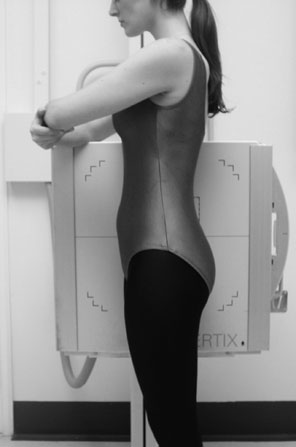
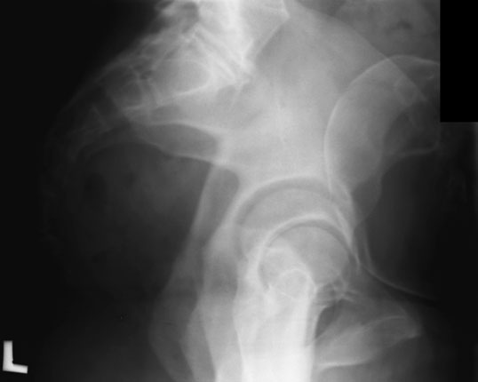

# Rx Bazin (Pelvis) Profil (Lateral)

  📷 Radiografie Convențională (Rx)
  <strong>Actualizat:</strong> 2026-09-16
  <strong>Autor:</strong> Departamentul de Radiologie / Referință Clark (Ed. 12)

---

-   __1. Rezumat Clinic & Indicații__

    ---

    === "Indicații Clinice"

        - 157 5 Bazin (bazin (pelvis)) Profil (lateral) pacientul poate fie examined în Ortostatism, Profil (lateral) decubit sau Decubit dorsal poziție. incidență este uncommon pentru general imaging, ca it will deliver high radiation dose pentru limited diagnostic value. It poate fie used ca part de specific pelvimetry series pentru assessing pelvic inlet și outlet during pregnancy, but this este now rarely practiced. pentru assessment de major pelvic trauma, CT este usually preferred option. Ortostatism incidență only este described.

    === "Ghid Național IRIS"

        !!! info "Referință Primară: Ghidul Național IRIS (Ordinul MS 1342/2012)"
            - **Capitol Ghid IRIS:** *Ghidul Național IRIS*
            - **Grad de Recomandare:** **De verificat pe indicație; fără grad atribuit automat**
            - **Nivel de Iradiere Estimată:** `De verificat pentru examinarea și populația selectate`

            [:octicons-search-16: Deschide Ghidul IRIS](../../iris.md){ .md-button .md-button--primary } [:material-open-in-new: Aplicația Oficială PWA](https://radiologie-pediatrica.ro/iris/){ .md-button target="_blank" rel="noopener" }
-   __2. Poziționare & Centrare Fascicul__

    ---

    - **Poziție Pacient:** poziție)
• pacientul stă în ortostatism cu either side în contact cu stativ vertical Bucky, which este ajustat vertically la pelvic level.
• la ensure that pacientul’s stance este firm, picioarele sunt separated.
• planul mediosagital este paralel și plan coronal este perpendicular pe receptorul de imagine.
• careful check trebuie să fie made la ensure that Coloană Vertebrală este paralel cu receptorul de imagine și that plan coronal este în unghi drept față de receptorul de imagine. latter poate fie assessed prin palpating either anterior sau posterior superior iliac spines și rotating pacientul ca necessary so that imaginary line joining two sides este în unghi drept față de receptorul de imagine.
• brațele sunt folded across toracele și braț nearest Bucky poate rest pe top de Bucky pentru support.
    - **Punct de Centrare Fascicul:** • casetă de suitable size este plasat horizontally în stativ vertical Bucky.
• raza centrală este Orientat orizontal la depression immediately superior la mare trohanter și collimated pentru include simfiză pubiană, ischium și crestele iliace.
Profil (lateral) Ortostatism radiografie de Bazin (bazin (pelvis)) la full term de pregnancy (pelvimetry)
    - **Distanță Focar-Film (DFF / SID):** 100 cm
    - **Comandă Respiratorie:** Apnee pe durata expunerii (apnee în inspir pentru torace; expir pentru Abdomen/bazin).

-   __3. Parametri Tehnici Expunere__

    ---

    | Parametru Tehnic | Valoare Configurare Generator / Tub |
    |:-----------------|:-------------------------------------|
    | **Tensiune Tub (kV)** | DE CONFIGURAT PE APARAT |
    | **Sarcină / Produs Curent-Timp (mAs)** | Conform AEC / grosime anatomică |
    | **Distanță Focar-Film (DFF / SID)** | 100 cm |
    | **Grilă Antidifuzoare (Bucky)** | Cu grilă antidifuzoare Bucky |
    | **Dimensiune Focar** | Focar Mic (0.6 mm) |
    | **Camere de Ionizare AEC** | Camerele laterale (sau camera centrală funcție de regiune) |
    | **Colimare Fascicul** | Colimare strictă la aria anatomică de interes diagnostic |
    | **Filtrare Tub** | Totală ≥ 2.5 mm Al echivalent (conform Clark: 3.0 mm Al eq.) |

-   __4. Criterii de Calitate & Reușită Imagine__

    ---

    - Vizualizarea clară întregii arii anatomice (Bazin (bazin (pelvis))).
    - Absența artefactelor de mișcare; trabeculație osoasă și contururi nete.
    - Densitate optică și contrast adecvate pentru diferențierea țesuturilor moi de structurile osoase.

-   __5. Protecție Radiologică (ALARA)__

    ---

    - Ecranare gonadică cu șorț plumbat dacă gonadele sunt în apropierea fasciculului util (regula ALARA).
    - Colimare precisă la dimensiunea anatomică strict necesară pentru reducerea dozei și a radiației difuze.
    - Verificarea posibilității unei sarcini la pacientele de vârstă fertilă înainte de expunere.

!!! note "Observații Clinice & Tehnice"
    Pregătirea pacientului prin îndepărtarea tuturor accesoriilor radio-opace.

### 🖼️ Imagini

<figure class="protocol-image-card" markdown>

<figcaption><strong>Profil (lateral) Ortostatism radiografie de Bazin (bazin (pelvis)) la full term de pregnancy (pelvimetry)</strong> — Poziționare pacient și centrare fascicul conform Clark (Ed. 12)</figcaption>

</figure>

<figure class="protocol-image-card" markdown>

<figcaption><strong>Figura 2: Aspect radiografic / Poziționare (Clark Ed. 12)</strong> — Aspect radiografic / ghid de poziționare conform tratatului Clark (Ed. 12)</figcaption>

</figure>

=== "Ghid Rapid de Execuție"

    1. **Identificarea și verificarea pacientului:** verificare identitate, zonă de examinat, consimțământ conform procedurii și evaluarea posibilității unei sarcini, când este relevantă.
    2. **Pregătire:** îndepărtarea oricăror obiecte radiopace (bijuterii, agrafe, fermoare, proteze, pansamente dense).
    3. **Poziționare precisă:** alinierea receptorului de imagine și a tubului la distanța prescrisă (100 cm).
    4. **Colimare strictă:** adaptarea fasciculului strict la regiunea de diagnostic pentru scăderea iradierii și reducerea radiației difuze.
    5. **Radioprotecție:** verificarea [politicii RX](../radioprotectie.md), cu măsuri distincte pentru pacient, personal și însoțitor.

## Surse de documentare

- [Clark's Positioning in Radiography (Ed. 12), Pagina 172](../../assets/protocols/sources/Clark___Positioning_in_Radiography__12th_edition.pdf#page=172)
