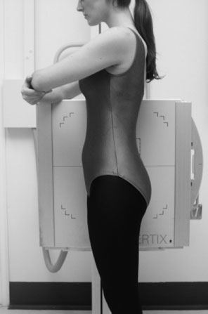
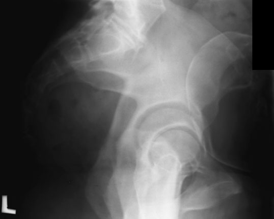

# Rx bazin (pelvis) — profil (lateral)

  📷 Radiografie Convențională (Rx)
  <strong>Actualizat:</strong> 2026-09-16
  <strong>Autor:</strong> Departamentul de Radiologie / Referință Clark (Ed. 12)

---

-   __1. Rezumat Clinic & Indicații__

    ---

    === "Indicații Clinice"

        - 157 5 Bazin (pelvis), profil: pacientul poate fi examinat în ortostatism, în decubit lateral sau în decubit dorsal. Incidența este neobișnuită pentru imagistica generală, deoarece furnizează o doză mare de radiații pentru o valoare diagnostică limitată. Poate fi utilizată ca parte a unei serii specifice de pelvimetrie pentru evaluarea strâmtorii superioare și a strâmtorii inferioare pelvine în timpul sarcinii, dar aceasta este practicată în prezent rareori. Pentru evaluarea traumatismelor pelvine majore, CT este de obicei opțiunea preferată. Este descrisă numai incidența în ortostatism.

    === "Ghid Național IRIS"

        !!! info "Referință Primară: Ghidul Național IRIS (Ordinul MS 1342/2012)"
            - **Capitol Ghid IRIS:** *Aparat locomotor & Bazin*
            - **Grad de Recomandare:** **Grad A**
            - **Nivel de Iradiere Estimată:** `Clasa 2 (Foarte mică ~ 0.8 - 1.0 mSv)`

            [:octicons-search-16: Deschide Ghidul IRIS](../../iris.md){ .md-button .md-button--primary } [:material-open-in-new: Aplicația Oficială PWA](https://radiologie-pediatrica.ro/iris/){ .md-button target="_blank" rel="noopener" }

-   __2. Poziționare & Centrare Fascicul__

    ---

    - **Poziție Pacient:**
        Poziție)

        - Pacientul stă în ortostatism, cu oricare parte în contact cu stativul vertical Bucky, care este ajustat vertical la nivelul bazinului.
        - Pentru a asigura stabilitatea poziției pacientului, picioarele sunt depărtate.
        - Planul mediosagital este paralel, iar planul coronal este perpendicular pe receptorul de imagine.
        - Trebuie efectuată o verificare atentă pentru a asigura că coloana vertebrală este paralelă cu receptorul de imagine și că planul coronal este în unghi drept față de receptorul de imagine. Acesta din urmă poate fi evaluat prin palparea oricăror spine iliace antero-superioare sau postero-superioare și prin rotirea pacientului după cum este necesar, astfel încât linia imaginară care unește cele două părți să fie în unghi drept față de receptorul de imagine.
        - Brațele sunt încrucișate peste torace, iar brațul cel mai apropiat de Bucky se poate sprijini pe partea superioară a acestuia pentru susținere.
    - **Punct de Centrare Fascicul:**
        - O casetă de dimensiune adecvată este plasată orizontal în stativul vertical Bucky.
        - Raza centrală este orientată orizontal spre depresiunea imediat superioară trohanterului mare și colimată pentru a include simfiza pubiană, ischionul și crestele iliace. Radiografie de bazin în ortostatism, de profil, la termenul complet al sarcinii (pelvimetrie)
    - **Distanță Focar-Film (DFF / SID):** 100 cm
    - **Comandă Respiratorie:** Apnee pe durata expunerii (apnee în inspir pentru torace; expir pentru Abdomen/bazin).

-   __3. Parametri Tehnici Expunere__

    ---

    | Parametru Tehnic | Valoare Configurare Generator / Tub |
    |:-----------------|:-------------------------------------|
    | **Tensiune Tub (kV)** | DE CONFIGURAT PE APARAT |
    | **Sarcină / Produs Curent-Timp (mAs)** | Conform AEC / grosimii anatomice |
    | **Distanță Focar-Film (DFF / SID)** | 100 cm |
    | **Grilă Antidifuzoare (Bucky)** | Cu grilă antidifuzoare Bucky |
    | **Dimensiune Focar** | Focar Mic (0.6 mm) |
    | **Camere de Ionizare AEC** | Camerele laterale (sau camera centrală, în funcție de regiune) |
    | **Colimare Fascicul** | Colimare strictă la aria anatomică de interes diagnostic |
    | **Filtrare Tub** | Totală ≥ 2.5 mm Al echivalent (conform Clark: 3.0 mm Al echivalent) |

-   __4. Criterii de Calitate & Reușită Imagine__

    ---

    - Vizualizarea clară a întregii arii anatomice (bazin (pelvis)).
    - Absența artefactelor de mișcare; trabeculație osoasă și contururi nete.
    - Densitate optică și contrast adecvate pentru diferențierea țesuturilor moi de structurile osoase.

-   __5. Protecție Radiologică (ALARA)__

    ---

    - Ecranare gonadică cu șorț plumbat dacă gonadele sunt în apropierea fasciculului util (regula ALARA).
    - Colimare precisă la dimensiunea anatomică strict necesară pentru reducerea dozei și a radiației difuze.
    - Verificarea posibilității unei sarcini la pacientele de vârstă fertilă înainte de expunere.

!!! note "Observații Clinice & Tehnice"
    Pregătirea pacientului prin îndepărtarea tuturor accesoriilor radio-opace.

### 🖼️ Imagini

<figure class="protocol-image-card" markdown>

<figcaption><strong>Radiografie de bazin în ortostatism, de profil, la termenul complet al sarcinii (pelvimetrie)</strong> — Poziționarea pacientului și centrarea fasciculului conform Clark (Ed. 12)</figcaption>

</figure>

<figure class="protocol-image-card" markdown>

<figcaption><strong>Figura 2: Aspect radiografic / Poziționare (Clark Ed. 12)</strong> — Aspect radiografic / ghid de poziționare conform tratatului Clark (Ed. 12)</figcaption>

</figure>

=== "Ghid Rapid de Execuție"

    1. **Identificarea și verificarea pacientului:** verificare identitate, zonă de examinat, consimțământ conform procedurii și evaluarea posibilității unei sarcini, când este relevantă.
    2. **Pregătire:** îndepărtarea oricăror obiecte radiopace (bijuterii, agrafe, fermoare, proteze, pansamente dense).
    3. **Poziționare precisă:** alinierea receptorului de imagine și a tubului la distanța prescrisă (100 cm).
    4. **Colimare strictă:** adaptarea fasciculului strict la regiunea de diagnostic pentru scăderea iradierii și reducerea radiației difuze.
    5. **Radioprotecție:** verificarea [politicii RX](../radioprotectie.md), cu măsuri distincte pentru pacient, personal și însoțitor.

## Surse de documentare

- [Clark's Positioning in Radiography (Ed. 12), Pagina 172](https://books.google.com/books/about/Clark_s_Positioning_in_Radiography.html?id=Xxu6MwEACAAJ)
