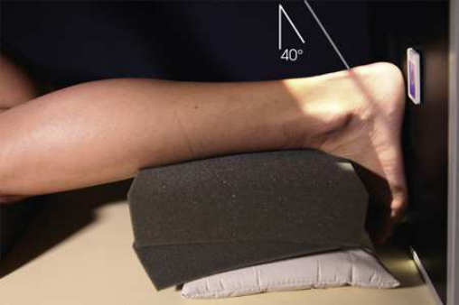
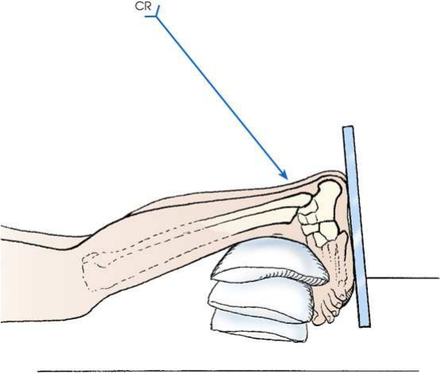
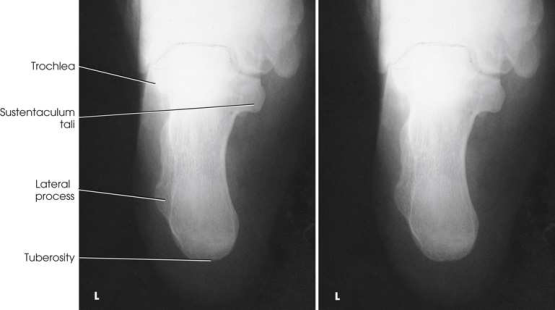
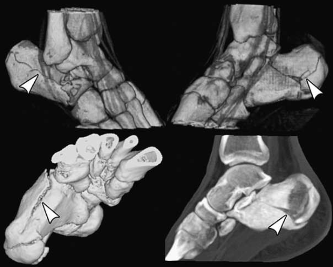
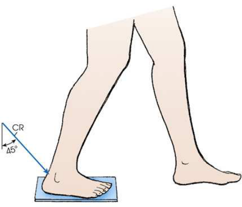

# Rx Calcaneu — Axial Incidență — Dorsoplantar (Merrill)

  📷 Radiografie Convențională (Rx)
  <strong>Actualizat:</strong> 2026-09-16
  <strong>Autor:</strong> Referință Merrill

---

-   __1. Rezumat Clinic & Indicații__

    ---

    === "Indicații Clinice"

        - Conform reperelor anatomice standard din tratat

    === "Ghid Național IRIS"

        !!! info "Referință Primară: Ghidul Național IRIS (Ordinul MS 1342/2012)"
            - **Capitol Ghid IRIS:** *Ghidul Național IRIS*
            - **Grad de Recomandare:** **De verificat pe indicație; fără grad atribuit automat**
            - **Nivel de Iradiere Estimată:** `De verificat pentru examinarea și populația selectate`

            [:octicons-search-16: Deschide Ghidul IRIS](../../iris.md){ .md-button .md-button--primary } [:material-open-in-new: Aplicația Oficială PWA](https://radiologie-pediatrica.ro/iris/){ .md-button target="_blank" rel="noopener" }
-   __2. Poziționare & Centrare Fascicul__

    ---

    - **Poziție Pacient:** se așază pacientul în Decubit ventral poziție. se așază pacientul în ortostatism-ortostatism.; Elevate pacientul’s Gleznă (Articulație Talocrurală) pe săculeți cu nisip. se ajustează height și poziție de săculeți cu nisip under Gleznă (Articulație Talocrurală) în such way that pacientul poate dorsiflex Gleznă (Articulație Talocrurală) enough la place axa longitudinală de Picior perpendicular pe tabletop. Place receptorul de imagine pe / sprijinit de plantar surface de Picior și support it în poziție cu săculeți cu nisip sau portable receptorul de imagine holder (Figs. 7.76 și 7.77). se efectuează ecranarea gonadelor cu șorț plumbat. se centrează receptorul de imagine la axa longitudinală de Calcaneu, cu posterior surface de heel la edge de receptorul de imagine. la prevent superimposition de membru inferior shadow, Se instruiește pacientul să place opposite Picior one step forward (Fig. 7.80).
    - **Punct de Centrare Fascicul:** Orientat spre punctul central al receptorului de imagine la caudal angle (enters posterior surface și spre heel) de 40 grade la axa longitudinală de Picior. raza centrală enters dorsal surface de Gleznă (Articulație Talocrurală) articulație. înclinat 45 grade anteriorly și orientat through posterior surface de flectat Gleznă (Articulație Talocrurală) la point pe plantar surface la nivelul base de fifth metatarsal.
    - **Distanță Focar-Film (DFF / SID):** Nespecificat în fragmentul extras; de verificat în sursă
    - **Comandă Respiratorie:** Conform reperelor anatomice standard din tratat

-   __3. Parametri Tehnici Expunere__

    ---

    | Parametru Tehnic | Valoare Configurare Generator / Tub |
    |:-----------------|:-------------------------------------|
    | **Tensiune Tub (kV)** | DE CONFIGURAT PE APARAT |
    | **Sarcină / Produs Curent-Timp (mAs)** | DE CONFIGURAT PE APARAT |
    | **Distanță Focar-Film (DFF / SID)** | Nespecificat în fragmentul extras; de verificat în sursă |
    | **Grilă Antidifuzoare (Bucky)** | DE CONFIGURAT PE APARAT |
    | **Dimensiune Focar** | DE CONFIGURAT PE APARAT |
    | **Camere de Ionizare AEC** | DE CONFIGURAT PE APARAT |
    | **Colimare Fascicul** | se ajustează câmp de iradiere la 1 inch (2.5 cm) pe three sides de shadow de Calcaneu și pentru include fifth metatarsal base. Se plasează markerul de lateralitate în câmpul colimat. Compensating Filter This incidență poate fie improved significantly cu use de compensating filter because de increased thickness de midportion de Picior. |
    | **Filtrare Tub** | DE CONFIGURAT PE APARAT |

-   __4. Criterii de Calitate & Reușită Imagine__

    ---

    - Criterii radiologice de calitate imaginii:
    - Evidence de corect collimation și presence de marker de lateralitate (D/S) plasat clear de anatomy de interest
    - Calcaneu și talocalcaneal articulație
    - Absența rotației anatomice (simetrie bilaterală perfectă) de Calcaneu
    - Sustentaculum tali în profile pe medial side
    - first sau fifth oase metatarsiene nu vizibil pe either side
    - Bony detalii trabeculare osoase și surrounding soft tissues În Încărcare (Ortostatism) Coalition (Harris-Beath) Method This În Încărcare (Ortostatism) method, first described prin Lilienfeld 10 (cit. Holzknecht), has come into use la show calcaneotalar coalition. 11–13 pentru this reason, it has been called coalition poziție. It poate also fie called Harris–Beath method. 11 It este more commonly used în podiatry.

-   __5. Protecție Radiologică (ALARA)__

    ---

    - Nespecificat în fragmentul extras; de verificat în sursă

!!! note "Observații Clinice & Tehnice"
    Conform reperelor anatomice standard din tratat

### 🖼️ Imagini

<figure class="protocol-image-card" markdown>

<figcaption><strong>Merrill — pagina PDF 506, imaginea 1</strong> — Imagine din fragmentul sursă; asocierea necesită revizie.</figcaption>

</figure>

<figure class="protocol-image-card" markdown>

<figcaption><strong>Merrill — pagina PDF 507, imaginea 2</strong> — Imagine din fragmentul sursă; asocierea necesită revizie.</figcaption>

</figure>

<figure class="protocol-image-card" markdown>

<figcaption><strong>Merrill — pagina PDF 507, imaginea 3</strong> — Imagine din fragmentul sursă; asocierea necesită revizie.</figcaption>

</figure>

<figure class="protocol-image-card" markdown>

<figcaption><strong>Merrill — pagina PDF 508, imaginea 4</strong> — Imagine din fragmentul sursă; asocierea necesită revizie.</figcaption>

</figure>

<figure class="protocol-image-card" markdown>

<figcaption><strong>Merrill — pagina PDF 509, imaginea 5</strong> — Imagine din fragmentul sursă; asocierea necesită revizie.</figcaption>

</figure>

=== "Ghid Rapid de Execuție"

    1. **Identificarea și verificarea pacientului:** verificare identitate, zonă de examinat, consimțământ conform procedurii și evaluarea posibilității unei sarcini, când este relevantă.
    2. **Pregătire:** îndepărtarea oricăror obiecte radiopace (bijuterii, agrafe, fermoare, proteze, pansamente dense).
    3. **Poziționare precisă:** alinierea receptorului de imagine și a tubului la distanța prescrisă (Nespecificat în fragmentul extras; de verificat în sursă).
    4. **Colimare strictă:** adaptarea fasciculului strict la regiunea de diagnostic pentru scăderea iradierii și reducerea radiației difuze.
    5. **Radioprotecție:** verificarea [politicii RX](../radioprotectie.md), cu măsuri distincte pentru pacient, personal și însoțitor.

## Surse de documentare

- [Merrill’s Atlas, 7. Lower Extremity, pagini PDF 505–509](../../assets/protocols/sources/a56d45c16829_Merrills_Atlas_of_Radiographic_Positioning__Procedures_3Vol_Set.pdf#page=505)

## Fragmente sursă traduse (referință tehnică)

### anatomy

axial incidență de calcaneu și talocalcaneal articulație (Fig. 7.78). Computed tomography (CT) este often used la show this anatomy (Fig.
7.79).

### collimation

• se ajustează câmp de iradiere la 1 inch (2.5 cm) pe three sides de shadow de calcaneu și pentru include fifth metatarsal base. Place
marker de lateralitate (D/S) în collimated expunere field.
Compensating Filter
This incidență poate fie improved significantly cu use de compensating filter because de increased thickness de midportion de picior.

### cr

• Orientat spre punctul central al receptorului de imagine la caudal angle (enters posterior surface și spre heel) de 40 grade la axa longitudinală de picior. raza centrală enters dorsal surface de ankle articulație.
• înclinat 45 grade anteriorly și orientat through posterior surface de flectat ankle la point pe plantar surface la level
de base de fifth metatarsal.

### criteria

Criterii radiologice de calitate imaginii:
• Evidence de corect collimation și presence de marker de lateralitate (D/S) plasat clear de anatomy de interest
• calcaneu și talocalcaneal articulație
• Absența rotației anatomice (simetrie bilaterală perfectă) de calcaneu
• Sustentaculum tali în profile pe medial side
• first sau fifth oase metatarsiene nu vizibil pe either side
• Bony detalii trabeculare osoase și surrounding soft tissues
Weight-Bearing Coalition (Harris-Beath) Method
This weight-bearing method, first described prin Lilienfeld 10 (cit. Holzknecht), has come into use la show calcaneotalar coalition. 11–13 pentru this
reason, it has been called coalition poziție. It poate also fie called Harris–Beath method. 11 It este more commonly used în podiatry.

### part_pos

• Elevate pacientul’s ankle pe săculeți cu nisip.
• se ajustează height și poziție de săculeți cu nisip under ankle în such way that pacientul poate dorsiflex ankle enough la place
axa longitudinală de picior perpendicular pe tabletop.
• Place receptorul de imagine pe / sprijinit de plantar surface de picior și support it în poziție cu săculeți cu nisip sau portable receptorul de imagine holder (Figs. 7.76 și 7.77).
• se efectuează ecranarea gonadelor cu șorț plumbat.
• se centrează receptorul de imagine la axa longitudinală de calcaneu, cu posterior surface de heel la edge de receptorul de imagine.
• la prevent superimposition de membru inferior shadow, Se instruiește pacientul să place opposite picior one step forward (Fig. 7.80).

### patient_pos

• se așază pacientul în decubit ventral.
• se așază pacientul în ortostatism-ortostatism.

### tech

poziționat prin manufacturer sau department protocol pentru corect anatomy display orientation; raza centrală plate: 10 × 12 inches (24 × 30 cm) longitudinal.

