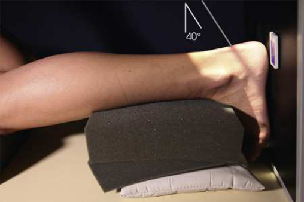
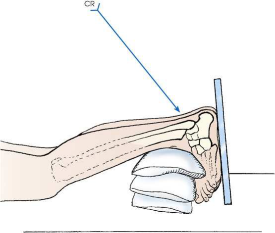
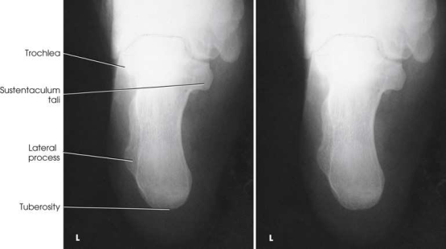
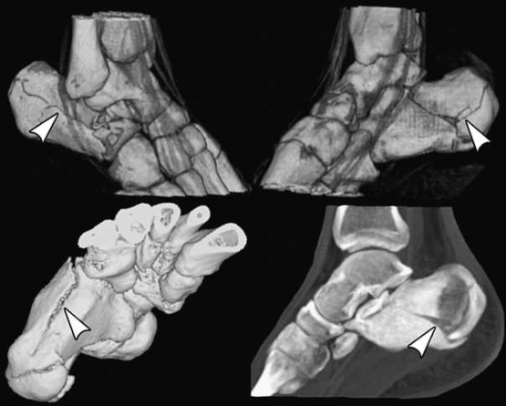
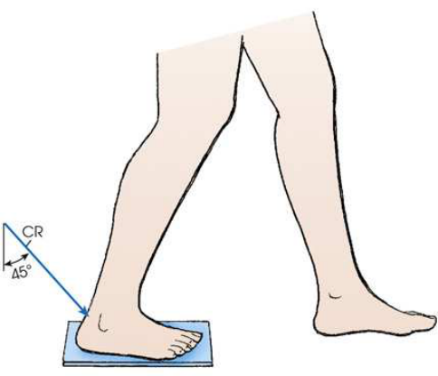

# Rx calcaneu — incidență axială — dorsoplantară (Merrill)

  📷 Radiografie Convențională (Rx)
  <strong>Actualizat:</strong> 2026-09-16
  <strong>Autor:</strong> Referință Merrill

---

-   __1. Rezumat Clinic & Indicații__

    ---

    === "Indicații Clinice"

        - Conform reperelor anatomice standard din tratat

    === "Ghid Național IRIS"

        !!! info "Referință Primară: Ghidul Național IRIS (Ordinul MS 1342/2012)"
            - **Capitol Ghid IRIS:** *Aparat locomotor & Membru inferior*
            - **Grad de Recomandare:** **Grad A**
            - **Nivel de Iradiere Estimată:** `Clasa 1 (Minimă < 0.01 mSv)`

            [:octicons-search-16: Deschide Ghidul IRIS](../../iris.md){ .md-button .md-button--primary } [:material-open-in-new: Aplicația Oficială PWA](https://radiologie-pediatrica.ro/iris/){ .md-button target="_blank" rel="noopener" }

-   __2. Poziționare & Centrare Fascicul__

    ---

    - **Poziție Pacient:** Se așază pacientul în decubit ventral. Se așază pacientul în ortostatism-ortostatism. Se ridică glezna pacientului pe săculeți cu nisip. Se ajustează înălțimea și poziția săculeților cu nisip sub gleznă, astfel încât pacientul să poată dorsiflecta glezna suficient pentru a plasa axa longitudinală a piciorului perpendicular pe masa radiologică. Se plasează receptorul de imagine pe suprafața plantară a piciorului și se fixează în poziție cu săculeți cu nisip sau cu un suport portabil pentru receptorul de imagine (Fig. 7.76 și 7.77). Se efectuează ecranarea gonadelor cu șorț plumbat. Se centrează receptorul de imagine pe axa longitudinală a calcaneului, cu suprafața posterioară a călcâiului la marginea receptorului de imagine. Pentru a preveni suprapunerea umbrei membrului inferior, pacientului i se indică să plaseze piciorul opus cu un pas înainte (Fig. 7.80).
    - **Punct de Centrare Fascicul:** Orientată spre punctul central al receptorului de imagine, cu un unghi caudal (intră pe suprafața posterioară și este orientată spre călcâi) de 40 grade față de axa longitudinală a piciorului. Raza centrală intră pe suprafața dorsală a articulației gleznei. Înclinată cu 45 grade anterior și orientată prin suprafața posterioară a gleznei flectate către un punct de pe suprafața plantară, la nivelul bazei celui de-al cincilea metatarsian.
    - **Distanță Focar-Film (DFF / SID):** Nespecificat în fragmentul extras; de verificat în sursă
    - **Comandă Respiratorie:** Conform reperelor anatomice standard din tratat

-   __3. Parametri Tehnici Expunere__

    ---

    | Parametru Tehnic | Valoare Configurare Generator / Tub |
    |:-----------------|:-------------------------------------|
    | **Tensiune Tub (kV)** | DE CONFIGURAT PE APARAT |
    | **Sarcină / Produs Curent-Timp (mAs)** | DE CONFIGURAT PE APARAT |
    | **Distanță Focar-Film (DFF / SID)** | Nespecificat în fragmentul extras; de verificat în sursă |
    | **Grilă Antidifuzoare (Bucky)** | DE CONFIGURAT PE APARAT |
    | **Dimensiune Focar** | DE CONFIGURAT PE APARAT |
    | **Camere de Ionizare AEC** | DE CONFIGURAT PE APARAT |
    | **Colimare Fascicul** | se ajustează câmpul de iradiere la 1 țol (2.5 cm) pe trei laturi ale imaginii calcaneului și pentru a include baza celui de-al cincilea metatarsian. Se plasează markerul de lateralitate în câmpul colimat. Filtru compensator. Această incidență poate fi îmbunătățită semnificativ prin utilizarea unui filtru compensator datorită grosimii crescute a porțiunii medii a piciorului. |
    | **Filtrare Tub** | DE CONFIGURAT PE APARAT |

-   __4. Criterii de Calitate & Reușită Imagine__

    ---

    - Criterii radiologice de calitate a imaginii:
    - Evidențierea colimării corecte și prezența markerului de lateralitate (D/S), plasat fără a se suprapune peste anatomia de interes
    - Calcaneu și articulația talocalcaneală
    - Absența rotației anatomice (simetrie bilaterală perfectă) a calcaneului
    - Sustentaculum tali în profil pe partea medială
    - Primul sau al cincilea os metatarsian nu este vizibil pe niciuna dintre părți
    - Detalii trabeculare osoase și țesuturile moi din jur. În încărcare (ortostatism). Metoda coaliției (Harris-Beath). Această metodă în încărcare (ortostatism), descrisă pentru prima dată de Lilienfeld 10 (citat de Holzknecht), a intrat în uz pentru evidențierea coaliției calcaneotalare. 11–13 Din acest motiv, a fost denumită poziția pentru coaliție. Poate fi numită și metoda Harris–Beath. 11 Este utilizată mai frecvent în podiatrie.

-   __5. Protecție Radiologică (ALARA)__

    ---

    - Nespecificat în fragmentul extras; de verificat în sursă

!!! note "Observații Clinice & Tehnice"
    Conform reperelor anatomice standard din tratat

### 🖼️ Imagini

<figure class="protocol-image-card" markdown>

<figcaption><strong>Merrill — pagina 506, imaginea 1</strong> — Imagine din fragmentul sursă; asocierea necesită revizie.</figcaption>

</figure>

<figure class="protocol-image-card" markdown>

<figcaption><strong>Merrill — pagina 507, imaginea 2</strong> — Imagine din fragmentul sursă; asocierea necesită revizie.</figcaption>

</figure>

<figure class="protocol-image-card" markdown>

<figcaption><strong>Merrill — pagina 507, imaginea 3</strong> — Imagine din fragmentul sursă; asocierea necesită revizie.</figcaption>

</figure>

<figure class="protocol-image-card" markdown>

<figcaption><strong>Merrill — pagina 508, imaginea 4</strong> — Imagine din fragmentul sursă; asocierea necesită revizie.</figcaption>

</figure>

<figure class="protocol-image-card" markdown>

<figcaption><strong>Merrill — pagina 509, imaginea 5</strong> — Imagine din fragmentul sursă; asocierea necesită revizie.</figcaption>

</figure>

=== "Ghid Rapid de Execuție"

    1. **Identificarea și verificarea pacientului:** verificare identitate, zonă de examinat, consimțământ conform procedurii și evaluarea posibilității unei sarcini, când este relevantă.
    2. **Pregătire:** îndepărtarea oricăror obiecte radiopace (bijuterii, agrafe, fermoare, proteze, pansamente dense).
    3. **Poziționare precisă:** alinierea receptorului de imagine și a tubului la distanța prescrisă (Nespecificat în fragmentul extras; de verificat în sursă).
    4. **Colimare strictă:** adaptarea fasciculului strict la regiunea de diagnostic pentru scăderea iradierii și reducerea radiației difuze.
    5. **Radioprotecție:** verificarea [politicii RX](../radioprotectie.md), cu măsuri distincte pentru pacient, personal și însoțitor.

## Surse de documentare

- [Merrill’s Atlas, 7. Lower Extremity, pagini 505–509](https://books.google.com/books/about/Merrill_s_Atlas_of_Radiographic_Position.html?id=BM0lEQAAQBAJ)
