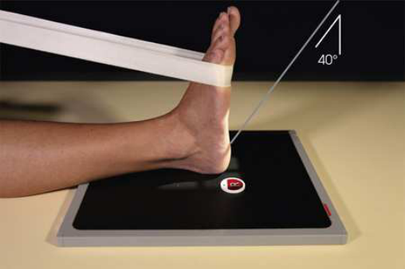
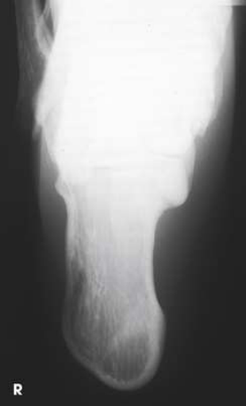
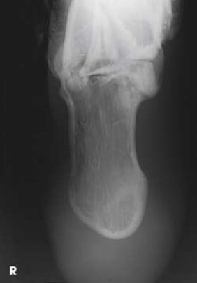

# Rx Calcaneu — Axial Incidență — Plantodorsal (Merrill)

  📷 Radiografie Convențională (Rx)
  <strong>Actualizat:</strong> 2026-09-16
  <strong>Autor:</strong> Referință Merrill

---

-   __1. Rezumat Clinic & Indicații__

    ---

    === "Indicații Clinice"

        - Conform reperelor anatomice standard din tratat

    === "Ghid Național IRIS"

        !!! info "Referință Primară: Ghidul Național IRIS (Ordinul MS 1342/2012)"
            - **Capitol Ghid IRIS:** *Ghidul Național IRIS*
            - **Grad de Recomandare:** **De verificat pe indicație; fără grad atribuit automat**
            - **Nivel de Iradiere Estimată:** `De verificat pentru examinarea și populația selectate`

            [:octicons-search-16: Deschide Ghidul IRIS](../../iris.md){ .md-button .md-button--primary } [:material-open-in-new: Aplicația Oficială PWA](https://radiologie-pediatrica.ro/iris/){ .md-button target="_blank" rel="noopener" }
-   __2. Poziționare & Centrare Fascicul__

    ---

    - **Poziție Pacient:** se așază pacientul în Decubit dorsal sau Poziție Șezândă poziție cu picioarele fully extins.; Place receptorul de imagine under pacientul’s Gleznă (Articulație Talocrurală), centrat pe linia mediană Gleznă (Articulație Talocrurală) (Figs. 7.73 și 7.74). Place long strip de gauze around ball de Picior. Se instruiește pacientul să grasp gauze la hold Gleznă (Articulație Talocrurală) în drept-angle dorsiflexion. If pacientul’s ankles cannot fie flectat enough la place plantar surface de Picior perpendicular pe receptorul de imagine (RI), elevate membru inferior pe săculeți cu nisip la obtain correct poziție. se efectuează ecranarea gonadelor cu șorț plumbat.
    - **Punct de Centrare Fascicul:** Orientat spre punctul central al receptorului de imagine la cephalic angle (entering plantar surface și spre heel) de 40 grade la axa longitudinală de Picior. raza centrală enters near base de third metatarsal.
    - **Distanță Focar-Film (DFF / SID):** Nespecificat în fragmentul extras; de verificat în sursă
    - **Comandă Respiratorie:** Conform reperelor anatomice standard din tratat

-   __3. Parametri Tehnici Expunere__

    ---

    | Parametru Tehnic | Valoare Configurare Generator / Tub |
    |:-----------------|:-------------------------------------|
    | **Tensiune Tub (kV)** | DE CONFIGURAT PE APARAT |
    | **Sarcină / Produs Curent-Timp (mAs)** | DE CONFIGURAT PE APARAT |
    | **Distanță Focar-Film (DFF / SID)** | Nespecificat în fragmentul extras; de verificat în sursă |
    | **Grilă Antidifuzoare (Bucky)** | DE CONFIGURAT PE APARAT |
    | **Dimensiune Focar** | DE CONFIGURAT PE APARAT |
    | **Camere de Ionizare AEC** | DE CONFIGURAT PE APARAT |
    | **Colimare Fascicul** | se ajustează câmp de iradiere la 1 inch (2.5 cm) pe three sides de shadow de Calcaneu și pentru include fifth metatarsal base. Se plasează markerul de lateralitate în câmpul colimat. Compensating Filter This incidență poate fie improved significantly cu use de compensating filter because de increased thickness de midportion de Picior. |
    | **Filtrare Tub** | DE CONFIGURAT PE APARAT |

-   __4. Criterii de Calitate & Reușită Imagine__

    ---

    - Criterii radiologice de calitate imaginii:
    - Evidence de corect collimation și presence de marker de lateralitate (D/S) plasat clear de anatomy de interest
    - Calcaneu și talocalcaneal articulație
    - Absența rotației anatomice (simetrie bilaterală perfectă) de Calcaneu
    - Sustentaculum tali în profile pe medial side
    - first sau fifth oase metatarsiene nu vizibil pe either side
    - Bony detalii trabeculare osoase și surrounding soft tissues

-   __5. Protecție Radiologică (ALARA)__

    ---

    - Nespecificat în fragmentul extras; de verificat în sursă

!!! note "Observații Clinice & Tehnice"
    Conform reperelor anatomice standard din tratat

### 🖼️ Imagini

<figure class="protocol-image-card" markdown>

<figcaption><strong>Merrill — pagina PDF 504, imaginea 1</strong> — Imagine din fragmentul sursă; asocierea necesită revizie.</figcaption>

</figure>

<figure class="protocol-image-card" markdown>

<figcaption><strong>Merrill — pagina PDF 505, imaginea 2</strong> — Imagine din fragmentul sursă; asocierea necesită revizie.</figcaption>

</figure>

<figure class="protocol-image-card" markdown>

<figcaption><strong>Merrill — pagina PDF 505, imaginea 3</strong> — Imagine din fragmentul sursă; asocierea necesită revizie.</figcaption>

</figure>

=== "Ghid Rapid de Execuție"

    1. **Identificarea și verificarea pacientului:** verificare identitate, zonă de examinat, consimțământ conform procedurii și evaluarea posibilității unei sarcini, când este relevantă.
    2. **Pregătire:** îndepărtarea oricăror obiecte radiopace (bijuterii, agrafe, fermoare, proteze, pansamente dense).
    3. **Poziționare precisă:** alinierea receptorului de imagine și a tubului la distanța prescrisă (Nespecificat în fragmentul extras; de verificat în sursă).
    4. **Colimare strictă:** adaptarea fasciculului strict la regiunea de diagnostic pentru scăderea iradierii și reducerea radiației difuze.
    5. **Radioprotecție:** verificarea [politicii RX](../radioprotectie.md), cu măsuri distincte pentru pacient, personal și însoțitor.

## Surse de documentare

- [Merrill’s Atlas, 7. Lower Extremity, pagini PDF 503–505](../../assets/protocols/sources/a56d45c16829_Merrills_Atlas_of_Radiographic_Positioning__Procedures_3Vol_Set.pdf#page=503)

## Fragmente sursă traduse (referință tehnică)

### anatomy

axial incidență de calcaneu, talocalcaneal articulație, și sustentaculum tali în profile. (Fig. 7.75).

### collimation

• se ajustează câmp de iradiere la 1 inch (2.5 cm) pe three sides de shadow de calcaneu și pentru include fifth metatarsal base. Place
marker de lateralitate (D/S) în collimated expunere field.
Compensating Filter
This incidență poate fie improved significantly cu use de compensating filter because de increased thickness de midportion de picior.

### cr

• Orientat spre punctul central al receptorului de imagine la cephalic angle (entering plantar surface și spre heel) de 40 grade la axa longitudinală
de picior. raza centrală enters near base de third metatarsal.

### criteria

Criterii radiologice de calitate imaginii:
• Evidence de corect collimation și presence de marker de lateralitate (D/S) plasat clear de anatomy de interest
• calcaneu și talocalcaneal articulație
• Absența rotației anatomice (simetrie bilaterală perfectă) de calcaneu
• Sustentaculum tali în profile pe medial side
• first sau fifth oase metatarsiene nu vizibil pe either side
• Bony detalii trabeculare osoase și surrounding soft tissues

### part_pos

• Place receptorul de imagine under pacientul’s ankle, centrat pe linia mediană ankle (Figs. 7.73 și 7.74).
• Place long strip de gauze around ball de picior. Se instruiește pacientul să grasp gauze la hold ankle în drept-angle dorsiflexion.
• If pacientul’s ankles cannot fie flectat enough la place plantar surface de picior perpendicular pe receptorul de imagine (RI), elevate membru inferior pe
săculeți cu nisip la obtain correct poziție.
• se efectuează ecranarea gonadelor cu șorț plumbat.

### patient_pos

• se așază pacientul în decubit dorsal sau așezat pe scaun poziție cu picioarele fully extins.

### tech

poziționat prin manufacturer sau department protocol pentru corect anatomy display orientation; raza centrală plate: 10 × 12 inches (24 × 30 cm) longitudinal.

