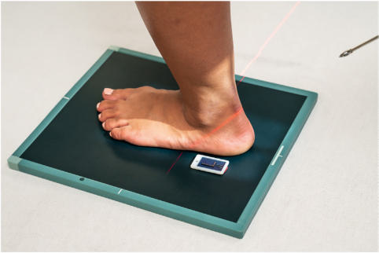
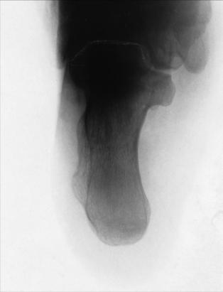

# Rx Calcaneu DORSOPLANTAR (AXIAL) În Încărcare (Ortostatism) PROJECTION

  📷 Radiografie Convențională (Rx)
  <strong>Actualizat:</strong> 2026-09-15
  <strong>Autor:</strong> Departamentul de Radiologie / Referință Bontrager

---

-   __1. Rezumat Clinic & Indicații__

    ---

    === "Indicații Clinice"

        - Pathologies or suspiciune de fractură with medial or lateral displacement
        - Evaluate talocalcaneal coalition under weightbearing conditions4

    === "Ghid Național IRIS"

        !!! info "Referință Primară: Ghidul Național IRIS (Ordinul MS 1342/2012)"
            - **Capitol Ghid IRIS:** *Ghidul Național IRIS*
            - **Grad de Recomandare:** **De verificat pe indicație; fără grad atribuit automat**
            - **Nivel de Iradiere Estimată:** `De verificat pentru examinarea și populația selectate`

            [:octicons-search-16: Deschide Ghidul IRIS](../../iris.md){ .md-button .md-button--primary } [:material-open-in-new: Aplicația Oficială PWA](https://radiologie-pediatrica.ro/iris/){ .md-button target="_blank" rel="noopener" }
-   __2. Poziționare & Centrare Fascicul__

    ---

    - **Poziție Pacient:** Pacient: Place patient in the standing upright position with weight placed on affected Picior. Have the patient place the opposite Picior one step forward and lean forward as far as possible while still maintaining full contact of the plantar surface of the affected Picior with the IR.; Regiune anatomică: Center the IR to the long axis of the Calcaneu with the posterior surface of the heel at the edge of the IR (Fig. 6.78)
    - **Punct de Centrare Fascicul:** Angle the CR 45° anteriorly and directed through the posterior surface of flexed Gleznă (Articulație Talocrurală) Direct CR to emerge at the level of the base of the 5th metatarsal.
    - **Distanță Focar-Film (DFF / SID):** 100 cm
    - **Comandă Respiratorie:** Apnee pe durata expunerii (sau conform cooperării pacientului)

-   __3. Parametri Tehnici Expunere__

    ---

    | Parametru Tehnic | Valoare Configurare Generator / Tub |
    |:-----------------|:-------------------------------------|
    | **Tensiune Tub (kV)** | 65-75 kV |
    | **Sarcină / Produs Curent-Timp (mAs)** | DE CONFIGURAT PE APARAT |
    | **Distanță Focar-Film (DFF / SID)** | 100 cm |
    | **Grilă Antidifuzoare (Bucky)** | Fără grilă (expunere directă) |
    | **Dimensiune Focar** | Focar Mic (0.6 mm) |
    | **Camere de Ionizare AEC** | DE CONFIGURAT PE APARAT |
    | **Colimare Fascicul** | Collimate closely to region of Calcaneu. Calcaneu SPECIAL Dorsoplantar (axial) weightbearing Fig. 6.78 Dorsoplantar (axial) weightbearing projection: calcaneuspositioning. |
    | **Filtrare Tub** | Totală ≥ 2.5 mm Al echivalent |

-   __4. Criterii de Calitate & Reușită Imagine__

    ---

    - Entire Calcaneu should be visualized from tuberosity posteriorly to talocalcaneal joint anteriorly ( Figs. 6.79 and 6.80). Position:
    - Absența rotației anatomice: clavicule echidistante față de linia apofizelor spinoase; a portion of the sustentaculum tali should appear in profile medially.
    - With the Picior in proper flexion, correct alignment and angulation of CR are evidenced by open talocalcaneal joint space, no distortion of the calcaneal tuberosity, and adequate elongation of the Calcaneu.
    - Collimation to area of interest. Exposure:
    - Optimal image receptor exposure and contrast with no motion to demonstrate sharp bony margins and trabecular markings and at least faintly visualize talocalcaneal joint without overexposing distal tuberosity area. L Fig. 6.79 Dorsoplantar (axial) weightbearing projection: calcaneusradiograph. (Adapted from Rollins J, Long BW, Curtis T, et al: Merrill’s atlas of radiographic positioning and procedures, ed 15, St Louis, 2023, Elsevier.) Lateral process Tuberosity Sustentaculum tali Trochlea L Fig. 6.80 Dorsoplantar (axial) weightbearing projection: calcaneusradiograph. (Adapted from Rollins J, Long BW, Curtis T, et al: Merrill’s atlas of radiographic positioning and procedures, ed 15, St Louis, 2023, Elsevier.)

-   __5. Protecție Radiologică (ALARA)__

    ---

    - Ecranare gonadică și a organelor radiosensibile conform procedurilor locale de radioprotecție ALARA.
    - Colimare strictă la aria de interes pentru limitarea radiației difuze.
    - Verificarea posibilității unei sarcini la pacientele de vârstă fertilă înainte de expunere.

### 🖼️ Imagini

<figure class="protocol-image-card" markdown>

<figcaption><strong>Fig. 6.78 Dorsoplantar (axial) weight-</strong> — Poziționare pacient conform Ghidului Bontrager (Fig. 6.78 Dorsoplantar (axial) weight-)</figcaption>

</figure>

<figure class="protocol-image-card" markdown>

<figcaption><strong>Fig. 6.79 Dorsoplantar (axial) weight-</strong> — Aspect radiografic de referință conform Ghidului Bontrager (Fig. 6.79 Dorsoplantar (axial) weight-)</figcaption>

</figure>

<figure class="protocol-image-card" markdown>

<figcaption><strong>Fig. 6.80 Dorsoplantar (axial) weight-</strong> — Aspect radiografic de referință conform Ghidului Bontrager (Fig. 6.80 Dorsoplantar (axial) weight-)</figcaption>

</figure>

<figure class="protocol-image-card" markdown>

<figcaption><strong>Figura 4</strong> — Aspect radiografic de referință conform Ghidului Bontrager (Figura 4)</figcaption>

</figure>

=== "Ghid Rapid de Execuție"

    1. **Identificarea și verificarea pacientului:** verificare identitate, zonă de examinat, consimțământ conform procedurii și evaluarea posibilității unei sarcini, când este relevantă.
    2. **Pregătire:** îndepărtarea oricăror obiecte radiopace (bijuterii, agrafe, fermoare, proteze, pansamente dense).
    3. **Poziționare precisă:** alinierea receptorului de imagine și a tubului la distanța prescrisă (100 cm).
    4. **Colimare strictă:** adaptarea fasciculului strict la regiunea de diagnostic pentru scăderea iradierii și reducerea radiației difuze.
    5. **Radioprotecție:** verificarea [politicii RX](../radioprotectie.md), cu măsuri distincte pentru pacient, personal și însoțitor.

## Surse de documentare

- [Bontrager's Textbook of Radiographic Positioning (Ed. 9/10), Pagina 253](https://www.elsevier.com/books/textbook-of-radiographic-positioning-and-related-anatomy/lampignano/978-0-323-65367-1)
