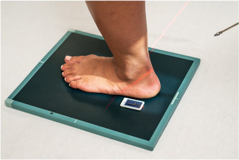
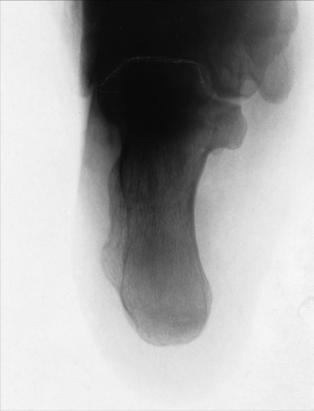

# Rx calcaneu — incidență DORSOPLANTARĂ (AXIALĂ) în ÎNCĂRCARE (ORTOSTATISM)

  📷 Radiografie Convențională (Rx)
  <strong>Actualizat:</strong> 2026-09-15
  <strong>Autor:</strong> Departamentul de Radiologie / Referință Bontrager

---

-   __1. Rezumat Clinic & Indicații__

    ---

    === "Indicații Clinice"

        - Patologii sau suspiciune de fractură cu deplasare medială sau laterală
        - Evaluarea coaliției talocalcaneene în condiții de încărcare4

    === "Ghid Național IRIS"

        !!! info "Referință Primară: Ghidul Național IRIS (Ordinul MS 1342/2012)"
            - **Capitol Ghid IRIS:** *Aparat locomotor & Membru inferior*
            - **Grad de Recomandare:** **Grad A**
            - **Nivel de Iradiere Estimată:** `Clasa 1 (Minimă < 0.01 mSv)`

            [:octicons-search-16: Deschide Ghidul IRIS](../../iris.md){ .md-button .md-button--primary } [:material-open-in-new: Aplicația Oficială PWA](https://radiologie-pediatrica.ro/iris/){ .md-button target="_blank" rel="noopener" }

-   __2. Poziționare & Centrare Fascicul__

    ---

    - **Poziție Pacient:** Pacient: Se plasează pacientul în ortostatism, cu greutatea plasată pe piciorul afectat. Pacientul este instruit să plaseze piciorul opus cu un pas înainte și să se aplece înainte cât mai mult posibil, menținând în același timp contactul complet al suprafeței plantare a piciorului afectat cu receptorul de imagine.; Regiune anatomică: se centrează receptorul de imagine pe axa longitudinală a calcaneului, cu suprafața posterioară a călcâiului la marginea receptorului de imagine (Fig. 6.78)
    - **Punct de Centrare Fascicul:** Unghiul razei centrale: 45° anterior și orientată prin suprafața posterioară a gleznei (articulației talocrurale) flectate. Raza centrală este orientată astfel încât să iasă la nivelul bazei celui de-al 5-lea metatarsian.
    - **Distanță Focar-Film (DFF / SID):** 100 cm
    - **Comandă Respiratorie:** Apnee pe durata expunerii (sau conform cooperării pacientului)

-   __3. Parametri Tehnici Expunere__

    ---

    | Parametru Tehnic | Valoare Configurare Generator / Tub |
    |:-----------------|:-------------------------------------|
    | **Tensiune Tub (kV)** | 65-75 kV |
    | **Sarcină / Produs Curent-Timp (mAs)** | DE CONFIGURAT PE APARAT |
    | **Distanță Focar-Film (DFF / SID)** | 100 cm |
    | **Grilă Antidifuzoare (Bucky)** | Fără grilă (expunere directă) |
    | **Dimensiune Focar** | Focar Mic (0.6 mm) |
    | **Camere de Ionizare AEC** | DE CONFIGURAT PE APARAT |
    | **Colimare Fascicul** | Se colimează strâns la nivelul regiunii calcaneului. Calcaneu SPECIAL Dorsoplantară (axială) în încărcare Fig. 6.78 Incidență dorsoplantară (axială) în încărcare: poziționarea calcaneului. |
    | **Filtrare Tub** | Totală ≥ 2.5 mm Al echivalent |

-   __4. Criterii de Calitate & Reușită Imagine__

    ---

    - Întregul calcaneu trebuie să fie vizualizat de la tuberozitatea posterioară până la articulația talocalcaneană anterioară (Fig. 6.79 și 6.80). Poziție:
    - Absența rotației anatomice: claviculele echidistante față de linia apofizelor spinoase; porțiunea de sustentaculum tali trebuie să apară în profil medial.
    - Cu piciorul în flexie corectă, alinierea corectă și angulația razei centrale sunt evidențiate prin spații articulare talocalcaneene deschise, fără deformarea tuberozității calcaneene și cu alungirea adecvată a calcaneului.
    - Colimare la aria de interes diagnostic. Expunere:
    - Expunere și contrast optime ale receptorului de imagine, fără mișcare, pentru a evidenția clar marginile osoase și marcajele trabeculare și pentru a vizualiza cel puțin vag articulația talocalcaneană, fără supraexpunerea zonei tuberozității distale. L Fig. 6.79 Incidență dorsoplantară (axială) în încărcare: radiografie a calcaneului. (Adaptat după Rollins J, Long BW, Curtis T et al.: Merrill’s atlas de poziționare și proceduri radiografice, ed. 15, St Louis, 2023, Elsevier.) Proces lateral; Tuberozitate; Sustentaculum tali; Trohlee. L Fig. 6.80 Incidență dorsoplantară (axială) în încărcare: radiografie a calcaneului. (Adaptat după Rollins J, Long BW, Curtis T et al.: Merrill’s atlas de poziționare și proceduri radiografice, ed. 15, St Louis, 2023, Elsevier.)

-   __5. Protecție Radiologică (ALARA)__

    ---

    - Ecranare gonadică și a organelor radiosensibile conform procedurilor locale de radioprotecție ALARA.
    - Colimare strictă la aria de interes pentru limitarea radiației difuze.
    - Verificarea posibilității unei sarcini la pacientele de vârstă fertilă înainte de expunere.

### 🖼️ Imagini

<figure class="protocol-image-card" markdown>

<figcaption><strong>Fig. 6.78 Incidență dorsoplantară (axială) în încărcare-</strong> — Poziționarea pacientului conform Ghidului Bontrager (Fig. 6.78 Incidență dorsoplantară (axială) în încărcare-)</figcaption>

</figure>

<figure class="protocol-image-card" markdown>

<figcaption><strong>Fig. 6.79 Incidență dorsoplantară (axială) în încărcare-</strong> — Aspect radiografic de referință conform Ghidului Bontrager (Fig. 6.79 Incidență dorsoplantară (axială) în încărcare-)</figcaption>

</figure>

<figure class="protocol-image-card" markdown>

<figcaption><strong>Fig. 6.80 Incidență dorsoplantară (axială) în încărcare-</strong> — Aspect radiografic de referință conform Ghidului Bontrager (Fig. 6.80 Incidență dorsoplantară (axială) în încărcare-)</figcaption>

</figure>

<figure class="protocol-image-card" markdown>

<figcaption><strong>Figura 4</strong> — Aspect radiografic de referință conform Ghidului Bontrager (Figura 4)</figcaption>

</figure>

=== "Ghid Rapid de Execuție"

    1. **Identificarea și verificarea pacientului:** verificare identitate, zonă de examinat, consimțământ conform procedurii și evaluarea posibilității unei sarcini, când este relevantă.
    2. **Pregătire:** îndepărtarea oricăror obiecte radiopace (bijuterii, agrafe, fermoare, proteze, pansamente dense).
    3. **Poziționare precisă:** alinierea receptorului de imagine și a tubului la distanța prescrisă (100 cm).
    4. **Colimare strictă:** adaptarea fasciculului strict la regiunea de diagnostic pentru scăderea iradierii și reducerea radiației difuze.
    5. **Radioprotecție:** verificarea [politicii RX](../radioprotectie.md), cu măsuri distincte pentru pacient, personal și însoțitor.

## Surse de documentare

- [Bontrager's Textbook of Radiographic Positioning (Ed. 9/10), Pagina 253](https://www.elsevier.com/books/textbook-of-radiographic-positioning-and-related-anatomy/lampignano/978-0-323-65367-1)
