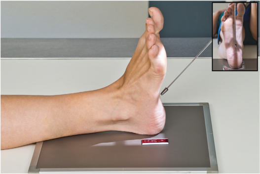
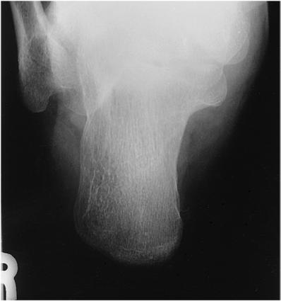
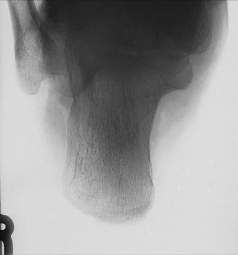

# Rx Calcaneu PLANTODORSAL (AXIAL) PROJECTION

  📷 Radiografie Convențională (Rx)
  <strong>Actualizat:</strong> 2026-09-15
  <strong>Autor:</strong> Departamentul de Radiologie / Referință Bontrager

---

-   __1. Rezumat Clinic & Indicații__

    ---

    === "Indicații Clinice"

        - Pathologies or suspiciune de fractură with medial or lateral displacement

    === "Ghid Național IRIS"

        !!! info "Referință Primară: Ghidul Național IRIS (Ordinul MS 1342/2012)"
            - **Capitol Ghid IRIS:** *Ghidul Național IRIS*
            - **Grad de Recomandare:** **De verificat pe indicație; fără grad atribuit automat**
            - **Nivel de Iradiere Estimată:** `De verificat pentru examinarea și populația selectate`

            [:octicons-search-16: Deschide Ghidul IRIS](../../iris.md){ .md-button .md-button--primary } [:material-open-in-new: Aplicația Oficială PWA](https://radiologie-pediatrica.ro/iris/){ .md-button target="_blank" rel="noopener" }
-   __2. Poziționare & Centrare Fascicul__

    ---

    - **Poziție Pacient:** Pacient: Place patient Decubit Dorsal or Poziție Șezândă on table with leg fully extended.; Regiune anatomică: Center and align Gleznă (Articulație Talocrurală) joint to CR and to portion of IR being exposed. Dorsiflex Picior so that plantar surface is near perpendicular to IR (Fig. 6.72).
    - **Punct de Centrare Fascicul:** Direct CR to base of third metatarsal to emerge at a level just distal to lateral malleolus. Angle CR 40° cephalad from long axis of Picior (which also would be 40° from vertical if long axis of Picior is perpendicular to IR). (See NOTE.)
    - **Distanță Focar-Film (DFF / SID):** 100 cm
    - **Comandă Respiratorie:** Apnee pe durata expunerii (sau conform cooperării pacientului)

-   __3. Parametri Tehnici Expunere__

    ---

    | Parametru Tehnic | Valoare Configurare Generator / Tub |
    |:-----------------|:-------------------------------------|
    | **Tensiune Tub (kV)** | 65-75 kV |
    | **Sarcină / Produs Curent-Timp (mAs)** | DE CONFIGURAT PE APARAT |
    | **Distanță Focar-Film (DFF / SID)** | 100 cm |
    | **Grilă Antidifuzoare (Bucky)** | Fără grilă (expunere directă) |
    | **Dimensiune Focar** | Focar Mic (0.6 mm) |
    | **Camere de Ionizare AEC** | DE CONFIGURAT PE APARAT |
    | **Colimare Fascicul** | Collimate closely to region of Calcaneu. |
    | **Filtrare Tub** | Totală ≥ 2.5 mm Al echivalent |

-   __4. Criterii de Calitate & Reușită Imagine__

    ---

    - Entire Calcaneu should be visualized from tuberosity posteriorly to subtalar joint anteriorly (Figs. 6.73 and 6.74). Position:
    - Absența rotației anatomice: clavicule echidistante față de linia apofizelor spinoase; a portion of the sustentaculum tali should appear in profile medially.
    - With the Picior in proper 90° flexion, correct alignment and angulation of CR are evidenced by open talocalcaneal joint space, no distortion of the calcaneal tuberosity, and adequate elongation of the Calcaneu.
    - Collimation to area of interest. Exposure:
    - Optimal image receptor exposure and contrast with no motion demonstrate sharp bony margins and trabecular markings and at least faintly visualize talocalcaneal joint without overexposing distal tuberosity area. Fig. 6.73 Plantodorsal (axial) projection. Gleznă (Articulație Talocrurală) joint Peroneal trochlea (trochlear process) Sustentaculum tali Tuberosity Lateral process Fig. 6.74 Plantodorsal (axial) projection.

-   __5. Protecție Radiologică (ALARA)__

    ---

    - Ecranare gonadică și a organelor radiosensibile conform procedurilor locale de radioprotecție ALARA.
    - Colimare strictă la aria de interes pentru limitarea radiației difuze.
    - Verificarea posibilității unei sarcini la pacientele de vârstă fertilă înainte de expunere.

!!! note "Observații Clinice & Tehnice"
    CR angulation must be increased if long axis of plantar surface of Picior is not perpendicular to IR. Calcaneu ROUTINE Plantodorsal (axial) Lateral Fig. 6.72 Plantodorsal (axial) projection of Calcaneu.

### 🖼️ Imagini

<figure class="protocol-image-card" markdown>

<figcaption><strong>Fig. 6.72 Plantodorsal (axial) projection of Calcaneu.</strong> — Poziționare pacient conform Ghidului Bontrager (Fig. 6.72 Plantodorsal (axial) projection of calcaneus.)</figcaption>

</figure>

<figure class="protocol-image-card" markdown>

<figcaption><strong>Fig. 6.73 Plantodorsal (axial) projection.</strong> — Aspect radiografic de referință conform Ghidului Bontrager (Fig. 6.73 Plantodorsal (axial) projection.)</figcaption>

</figure>

<figure class="protocol-image-card" markdown>

<figcaption><strong>Fig. 6.74 Plantodorsal (axial) projection.</strong> — Aspect radiografic de referință conform Ghidului Bontrager (Fig. 6.74 Plantodorsal (axial) projection.)</figcaption>

</figure>

=== "Ghid Rapid de Execuție"

    1. **Identificarea și verificarea pacientului:** verificare identitate, zonă de examinat, consimțământ conform procedurii și evaluarea posibilității unei sarcini, când este relevantă.
    2. **Pregătire:** îndepărtarea oricăror obiecte radiopace (bijuterii, agrafe, fermoare, proteze, pansamente dense).
    3. **Poziționare precisă:** alinierea receptorului de imagine și a tubului la distanța prescrisă (100 cm).
    4. **Colimare strictă:** adaptarea fasciculului strict la regiunea de diagnostic pentru scăderea iradierii și reducerea radiației difuze.
    5. **Radioprotecție:** verificarea [politicii RX](../radioprotectie.md), cu măsuri distincte pentru pacient, personal și însoțitor.

## Surse de documentare

- [Bontrager's Textbook of Radiographic Positioning (Ed. 9/10), Pagina 251](https://www.elsevier.com/books/textbook-of-radiographic-positioning-and-related-anatomy/lampignano/978-0-323-65367-1)
