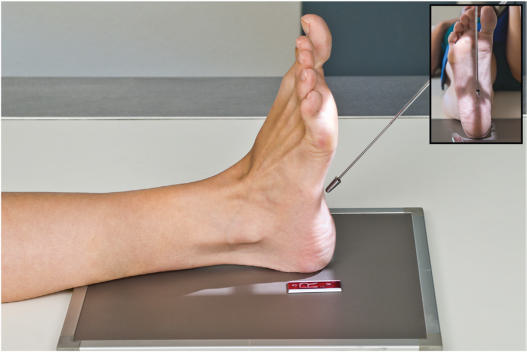
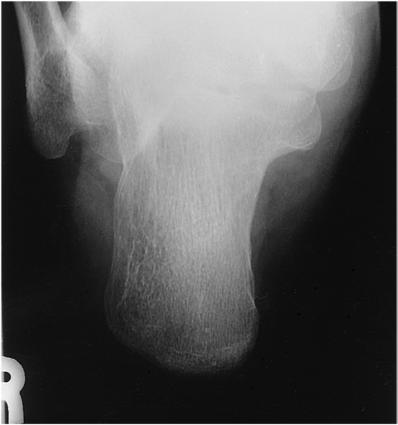
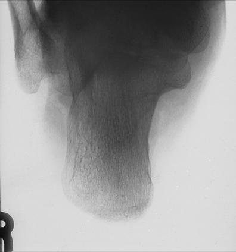

# Rx calcaneu — incidență PLANTODORSALĂ (AXIALĂ)

  📷 Radiografie Convențională (Rx)
  <strong>Actualizat:</strong> 2026-09-15
  <strong>Autor:</strong> Departamentul de Radiologie / Referință Bontrager

---

-   __1. Rezumat Clinic & Indicații__

    ---

    === "Indicații Clinice"

        - Patologii sau suspiciune de fractură cu deplasare medială sau laterală

    === "Ghid Național IRIS"

        !!! info "Referință Primară: Ghidul Național IRIS (Ordinul MS 1342/2012)"
            - **Capitol Ghid IRIS:** *Aparat locomotor & Membru inferior*
            - **Grad de Recomandare:** **Grad A**
            - **Nivel de Iradiere Estimată:** `Clasa 1 (Minimă < 0.01 mSv)`

            [:octicons-search-16: Deschide Ghidul IRIS](../../iris.md){ .md-button .md-button--primary } [:material-open-in-new: Aplicația Oficială PWA](https://radiologie-pediatrica.ro/iris/){ .md-button target="_blank" rel="noopener" }

-   __2. Poziționare & Centrare Fascicul__

    ---

    - **Poziție Pacient:** Pacient: Se așază pacientul în decubit dorsal sau în poziție șezândă pe masă, cu membrul inferior complet extins.; Regiune anatomică: Se centrează și se aliniază articulația gleznei (talocrurală) față de raza centrală și față de porțiunea receptorului de imagine care urmează să fie expusă. Se efectuează dorsiflexia piciorului astfel încât suprafața plantară să fie aproape perpendiculară pe receptorul de imagine (Fig. 6.72).
    - **Punct de Centrare Fascicul:** Raza centrală se orientează spre baza celui de-al treilea metatarsian, pentru a ieși la nivelul situat imediat distal de maleola laterală (fibulară). Raza centrală se înclină 40° cranial (spre cap) față de axa longitudinală a piciorului (ceea ce ar corespunde, de asemenea, la 40° față de verticală dacă axa longitudinală a piciorului este perpendiculară pe receptorul de imagine). (A se vedea NOTA.)
    - **Distanță Focar-Film (DFF / SID):** 100 cm
    - **Comandă Respiratorie:** Apnee pe durata expunerii (sau conform cooperării pacientului)

-   __3. Parametri Tehnici Expunere__

    ---

    | Parametru Tehnic | Valoare Configurare Generator / Tub |
    |:-----------------|:-------------------------------------|
    | **Tensiune Tub (kV)** | 65-75 kV |
    | **Sarcină / Produs Curent-Timp (mAs)** | DE CONFIGURAT PE APARAT |
    | **Distanță Focar-Film (DFF / SID)** | 100 cm |
    | **Grilă Antidifuzoare (Bucky)** | Fără grilă (expunere directă) |
    | **Dimensiune Focar** | Focar Mic (0.6 mm) |
    | **Camere de Ionizare AEC** | DE CONFIGURAT PE APARAT |
    | **Colimare Fascicul** | Se colimează strâns la nivelul regiunii calcaneului. |
    | **Filtrare Tub** | Totală ≥ 2.5 mm Al echivalent |

-   __4. Criterii de Calitate & Reușită Imagine__

    ---

    - Întregul calcaneu trebuie vizualizat de la tuberozitatea posterioară până la articulația subtalară anterioară (Fig. 6.73 și 6.74). poziție:
    - Absența rotației anatomice: claviculele echidistante față de linia apofizelor spinoase; porțiunea de sustentaculum tali trebuie să apară în profil medial.
    - Cu piciorul în flexie corectă de 90°, alinierea corectă și angulația razei centrale sunt evidențiate prin spații articulare talocalcaneene deschise, fără deformarea tuberozității calcaneene și cu alungirea adecvată a calcaneului.
    - Colimare la aria de interes diagnostic. Expunere:
    - Expunerea optimă a receptorului de imagine și contrastul, fără mișcare, evidențiază clar marginile osoase și desenul trabecular și vizualizează cel puțin discret articulația talocalcaneană, fără supraexpunerea zonei tuberozității distale. Fig. 6.73 Incidență plantodorsală (axială). Articulația gleznei (talocrurală), trohleea peronieră (procesul trohlear), sustentaculum tali, tuberozitatea, procesul lateral. Fig. 6.74 Incidență plantodorsală (axială).

-   __5. Protecție Radiologică (ALARA)__

    ---

    - Ecranare gonadică și a organelor radiosensibile conform procedurilor locale de radioprotecție ALARA.
    - Colimare strictă la aria de interes pentru limitarea radiației difuze.
    - Verificarea posibilității unei sarcini la pacientele de vârstă fertilă înainte de expunere.

!!! note "Observații Clinice & Tehnice"
    Angulația razei centrale trebuie mărită dacă axa longitudinală a suprafeței plantare a piciorului nu este perpendiculară pe receptorul de imagine. Calcaneu — RUTINĂ — plantodorsală (axială), laterală, Fig. 6.72 Incidență plantodorsală (axială) a calcaneului.

### 🖼️ Imagini

<figure class="protocol-image-card" markdown>

<figcaption><strong>Fig. 6.72 Incidență plantodorsală (axială) a calcaneului.</strong> — Poziționarea pacientului conform Ghidului Bontrager (Fig. 6.72 Incidență plantodorsală (axială) a calcaneului.)</figcaption>

</figure>

<figure class="protocol-image-card" markdown>

<figcaption><strong>Fig. 6.73 Incidență plantodorsală (axială).</strong> — Aspect radiografic de referință conform Ghidului Bontrager (Fig. 6.73 Incidență plantodorsală (axială).)</figcaption>

</figure>

<figure class="protocol-image-card" markdown>

<figcaption><strong>Fig. 6.74 Incidență plantodorsală (axială).</strong> — Aspect radiografic de referință conform Ghidului Bontrager (Fig. 6.74 Incidență plantodorsală (axială).)</figcaption>

</figure>

=== "Ghid Rapid de Execuție"

    1. **Identificarea și verificarea pacientului:** verificare identitate, zonă de examinat, consimțământ conform procedurii și evaluarea posibilității unei sarcini, când este relevantă.
    2. **Pregătire:** îndepărtarea oricăror obiecte radiopace (bijuterii, agrafe, fermoare, proteze, pansamente dense).
    3. **Poziționare precisă:** alinierea receptorului de imagine și a tubului la distanța prescrisă (100 cm).
    4. **Colimare strictă:** adaptarea fasciculului strict la regiunea de diagnostic pentru scăderea iradierii și reducerea radiației difuze.
    5. **Radioprotecție:** verificarea [politicii RX](../radioprotectie.md), cu măsuri distincte pentru pacient, personal și însoțitor.

## Surse de documentare

- [Bontrager's Textbook of Radiographic Positioning (Ed. 9/10), Pagina 251](https://www.elsevier.com/books/textbook-of-radiographic-positioning-and-related-anatomy/lampignano/978-0-323-65367-1)
