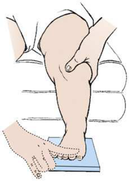
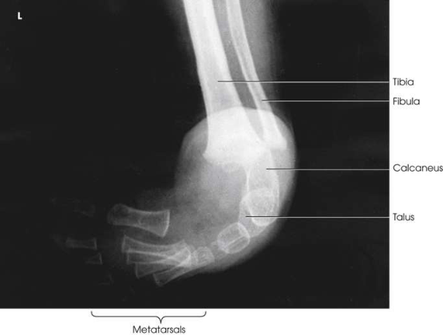

# Rx Congenital Clubfoot — Incidență Antero-Posterioară (AP) — Kite Method (Merrill)

  📷 Radiografie Convențională (Rx)
  <strong>Actualizat:</strong> 2026-09-16
  <strong>Autor:</strong> Referință Merrill

---

-   __1. Rezumat Clinic & Indicații__

    ---

    === "Indicații Clinice"

        - Conform reperelor anatomice standard din tratat

    === "Ghid Național IRIS"

        !!! info "Referință Primară: Ghidul Național IRIS (Ordinul MS 1342/2012)"
            - **Capitol Ghid IRIS:** *Ghidul Național IRIS*
            - **Grad de Recomandare:** **De verificat pe indicație; fără grad atribuit automat**
            - **Nivel de Iradiere Estimată:** `De verificat pentru examinarea și populația selectate`

            [:octicons-search-16: Deschide Ghidul IRIS](../../iris.md){ .md-button .md-button--primary } [:material-open-in-new: Aplicația Oficială PWA](https://radiologie-pediatrica.ro/iris/){ .md-button target="_blank" rel="noopener" }
-   __2. Poziționare & Centrare Fascicul__

    ---

    - **Poziție Pacient:** Place infant în Decubit dorsal poziție, cu șoldurile și genunchi flectat la permit Picior la rest flat pe receptorul de imagine. Elevate corp pe firm pillows la Genunchi height la simplify gonad shielding și membru inferior adjustment.; Rest picioarele flat pe receptorul de imagine cu ankles extins slightly la prevent superimposition de membru inferior shadow. Hold infant’s genunchi together sau în such way that picioarele sunt exactly vertical (i.e., so that they do nu lean medially sau laterally). Using lead glove, hold infant’s Degete Picior. When adduction deformity este too great la permit correct placement de picioarele și picioare pentru bilateral imagini fără overlap de picioarele, fiecare Picior trebuie să fie examined separately (Figs. 7.64 și 7.65). se efectuează ecranarea gonadelor cu șorț plumbat.
    - **Punct de Centrare Fascicul:** perpendicular pe oase tarsiene, midway între tarsal areas pentru bilateral incidență. approximately 15-grade posterior angle este generally required pentru raza centrală la fie perpendicular pe oase tarsiene. Kite 4, 5 stressed importance de directing raza centrală vertically pentru purpose de projecting true relationship de bones și ossification centers.
    - **Distanță Focar-Film (DFF / SID):** Nespecificat în fragmentul extras; de verificat în sursă
    - **Comandă Respiratorie:** Conform reperelor anatomice standard din tratat

-   __3. Parametri Tehnici Expunere__

    ---

    | Parametru Tehnic | Valoare Configurare Generator / Tub |
    |:-----------------|:-------------------------------------|
    | **Tensiune Tub (kV)** | DE CONFIGURAT PE APARAT |
    | **Sarcină / Produs Curent-Timp (mAs)** | DE CONFIGURAT PE APARAT |
    | **Distanță Focar-Film (DFF / SID)** | Nespecificat în fragmentul extras; de verificat în sursă |
    | **Grilă Antidifuzoare (Bucky)** | DE CONFIGURAT PE APARAT |
    | **Dimensiune Focar** | DE CONFIGURAT PE APARAT |
    | **Camere de Ionizare AEC** | DE CONFIGURAT PE APARAT |
    | **Colimare Fascicul** | Conform reperelor anatomice standard din tratat |
    | **Filtrare Tub** | DE CONFIGURAT PE APARAT |

-   __4. Criterii de Calitate & Reușită Imagine__

    ---

    - Conform reperelor anatomice standard din tratat

-   __5. Protecție Radiologică (ALARA)__

    ---

    - Nespecificat în fragmentul extras; de verificat în sursă

!!! note "Observații Clinice & Tehnice"
    Conform reperelor anatomice standard din tratat

### 🖼️ Imagini

<figure class="protocol-image-card" markdown>

<figcaption><strong>Merrill — pagina PDF 498, imaginea 1</strong> — Imagine din fragmentul sursă; asocierea necesită revizie.</figcaption>

</figure>

<figure class="protocol-image-card" markdown>

<figcaption><strong>Merrill — pagina PDF 498, imaginea 2</strong> — Imagine din fragmentul sursă; asocierea necesită revizie.</figcaption>

</figure>

=== "Ghid Rapid de Execuție"

    1. **Identificarea și verificarea pacientului:** verificare identitate, zonă de examinat, consimțământ conform procedurii și evaluarea posibilității unei sarcini, când este relevantă.
    2. **Pregătire:** îndepărtarea oricăror obiecte radiopace (bijuterii, agrafe, fermoare, proteze, pansamente dense).
    3. **Poziționare precisă:** alinierea receptorului de imagine și a tubului la distanța prescrisă (Nespecificat în fragmentul extras; de verificat în sursă).
    4. **Colimare strictă:** adaptarea fasciculului strict la regiunea de diagnostic pentru scăderea iradierii și reducerea radiației difuze.
    5. **Radioprotecție:** verificarea [politicii RX](../radioprotectie.md), cu măsuri distincte pentru pacient, personal și însoțitor.

## Surse de documentare

- [Merrill’s Atlas, 7. Lower Extremity, pagini PDF 497–498](../../assets/protocols/sources/a56d45c16829_Merrills_Atlas_of_Radiographic_Positioning__Procedures_3Vol_Set.pdf#page=497)

## Fragmente sursă traduse (referință tehnică)

### cr

• perpendicular pe oase tarsiene, midway între tarsal areas pentru bilateral incidență.
• approximately 15-grade posterior angle este generally required pentru raza centrală la fie perpendicular pe oase tarsiene.
• Kite 4, 5 stressed importance de directing raza centrală vertically pentru purpose de projecting true relationship de bones
și ossification centers.

### part_pos

• Rest picioarele flat pe receptorul de imagine cu ankles extins slightly la prevent superimposition de membru inferior shadow.
• Hold infant’s genunchi together sau în such way that picioarele sunt exactly vertical (i.e., so that they do nu lean medially sau laterally).
• Using lead glove, hold infant’s toes. When adduction deformity este too great la permit correct placement de picioarele și picioare
pentru bilateral imagini fără overlap de picioarele, fiecare picior trebuie să fie examined separately (Figs. 7.64 și 7.65).
• se efectuează ecranarea gonadelor cu șorț plumbat.

### patient_pos

• Place infant în decubit dorsal, cu șoldurile și genunchi flectat la permit picior la rest flat pe receptorul de imagine. Elevate corp pe firm
pillows la genunchi height la simplify gonad shielding și membru inferior adjustment.

### tech

poziționat prin manufacturer sau department protocol pentru corect anatomy display orientation; raza centrală plate: 10 × 12 inches (24 × 30 cm) longitudinal.

