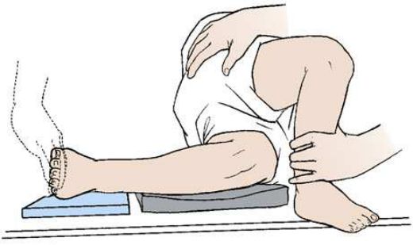
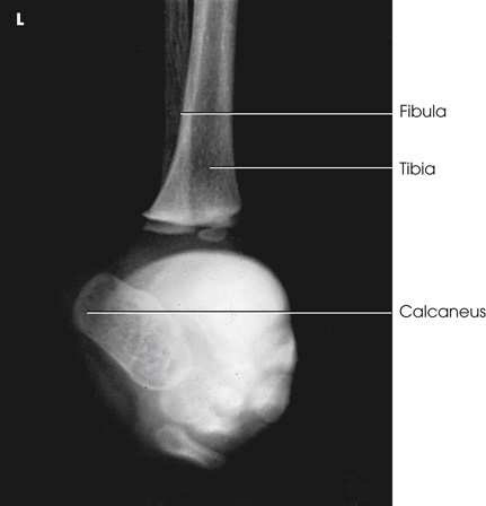
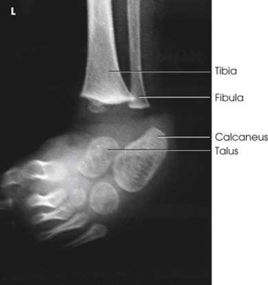
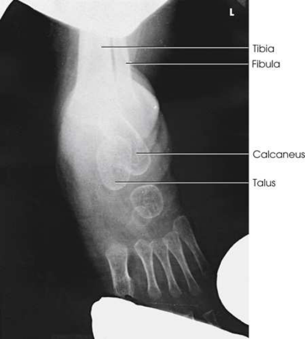
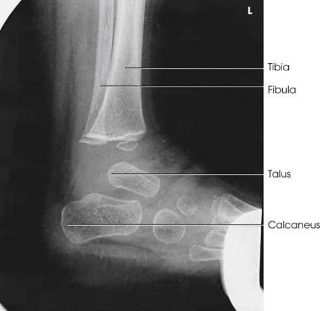

# Rx Congenital Clubfoot — Incidență de Profil (Lateral) — Medio-Lateral Kite Method (Merrill)

  📷 Radiografie Convențională (Rx)
  <strong>Actualizat:</strong> 2026-09-16
  <strong>Autor:</strong> Referință Merrill

---

-   __1. Rezumat Clinic & Indicații__

    ---

    === "Indicații Clinice"

        - Conform reperelor anatomice standard din tratat

    === "Ghid Național IRIS"

        !!! info "Referință Primară: Ghidul Național IRIS (Ordinul MS 1342/2012)"
            - **Capitol Ghid IRIS:** *Ghidul Național IRIS*
            - **Grad de Recomandare:** **De verificat pe indicație; fără grad atribuit automat**
            - **Nivel de Iradiere Estimată:** `De verificat pentru examinarea și populația selectate`

            [:octicons-search-16: Deschide Ghidul IRIS](../../iris.md){ .md-button .md-button--primary } [:material-open-in-new: Aplicația Oficială PWA](https://radiologie-pediatrica.ro/iris/){ .md-button target="_blank" rel="noopener" }
-   __2. Poziționare & Centrare Fascicul__

    ---

    - **Poziție Pacient:** Place infant pe his sau her side în ca near Incidență de Profil (lateral) ca possible. se flectează uppermost extremity, draw it forward, și hold it în place.; After adjusting receptorul de imagine under Picior, place support that has same thickness ca receptorul de imagine under infant’s Genunchi la prevent angulation de Picior și la ensure lateral Picior poziție. Hold infant’s Degete Picior în poziție cu tape sau protected Mână (Figs. 7.66 through 7.70). se efectuează ecranarea gonadelor cu șorț plumbat.
    - **Punct de Centrare Fascicul:** perpendicular pe midtarsal area.
    - **Distanță Focar-Film (DFF / SID):** Nespecificat în fragmentul extras; de verificat în sursă
    - **Comandă Respiratorie:** Conform reperelor anatomice standard din tratat

-   __3. Parametri Tehnici Expunere__

    ---

    | Parametru Tehnic | Valoare Configurare Generator / Tub |
    |:-----------------|:-------------------------------------|
    | **Tensiune Tub (kV)** | DE CONFIGURAT PE APARAT |
    | **Sarcină / Produs Curent-Timp (mAs)** | DE CONFIGURAT PE APARAT |
    | **Distanță Focar-Film (DFF / SID)** | Nespecificat în fragmentul extras; de verificat în sursă |
    | **Grilă Antidifuzoare (Bucky)** | DE CONFIGURAT PE APARAT |
    | **Dimensiune Focar** | DE CONFIGURAT PE APARAT |
    | **Camere de Ionizare AEC** | DE CONFIGURAT PE APARAT |
    | **Colimare Fascicul** | Conform reperelor anatomice standard din tratat |
    | **Filtrare Tub** | DE CONFIGURAT PE APARAT |

-   __4. Criterii de Calitate & Reușită Imagine__

    ---

    - Criterii radiologice de calitate imaginii:
    - Evidence de corect collimation și presence de marker de lateralitate (D/S) plasat clear de anatomy de interest
    - fără medial sau lateral angulation de membru inferior
    - Fibula în Incidență de Profil (lateral) overlapping posterior half de tibia
    - need pentru repeat examination if slight variations în rotație sunt seen în either imagine compared cu previous radiografii
    - astragal (talus), Calcaneu, și oase metatarsiene la allow assessment de alignment variations
    - Bony detalii trabeculare osoase și surrounding soft tissues

-   __5. Protecție Radiologică (ALARA)__

    ---

    - Nespecificat în fragmentul extras; de verificat în sursă

!!! note "Observații Clinice & Tehnice"
    Freiberger et al. 7 recommended that dorsiflexion de infant’s Picior could fie obtained prin pressing small plywood board pe / sprijinit de sole de Picior. older child sau adult este plasat în ortostatism pentru orizontal incidență. cu ortostatism, pacientul leans membru inferior forward la dorsiflex Picior. Conway și Cowell 8 recommended tomography la show coalition la middle facet și particularly hidden coalition involving anterior facet.

### 🖼️ Imagini

<figure class="protocol-image-card" markdown>

<figcaption><strong>Merrill — pagina PDF 499, imaginea 1</strong> — Imagine din fragmentul sursă; asocierea necesită revizie.</figcaption>

</figure>

<figure class="protocol-image-card" markdown>

<figcaption><strong>Merrill — pagina PDF 500, imaginea 2</strong> — Imagine din fragmentul sursă; asocierea necesită revizie.</figcaption>

</figure>

<figure class="protocol-image-card" markdown>

<figcaption><strong>Merrill — pagina PDF 500, imaginea 3</strong> — Imagine din fragmentul sursă; asocierea necesită revizie.</figcaption>

</figure>

<figure class="protocol-image-card" markdown>

<figcaption><strong>Merrill — pagina PDF 501, imaginea 4</strong> — Imagine din fragmentul sursă; asocierea necesită revizie.</figcaption>

</figure>

<figure class="protocol-image-card" markdown>

<figcaption><strong>Merrill — pagina PDF 502, imaginea 5</strong> — Imagine din fragmentul sursă; asocierea necesită revizie.</figcaption>

</figure>

=== "Ghid Rapid de Execuție"

    1. **Identificarea și verificarea pacientului:** verificare identitate, zonă de examinat, consimțământ conform procedurii și evaluarea posibilității unei sarcini, când este relevantă.
    2. **Pregătire:** îndepărtarea oricăror obiecte radiopace (bijuterii, agrafe, fermoare, proteze, pansamente dense).
    3. **Poziționare precisă:** alinierea receptorului de imagine și a tubului la distanța prescrisă (Nespecificat în fragmentul extras; de verificat în sursă).
    4. **Colimare strictă:** adaptarea fasciculului strict la regiunea de diagnostic pentru scăderea iradierii și reducerea radiației difuze.
    5. **Radioprotecție:** verificarea [politicii RX](../radioprotectie.md), cu măsuri distincte pentru pacient, personal și însoțitor.

## Surse de documentare

- [Merrill’s Atlas, 7. Lower Extremity, pagini PDF 498–502](../../assets/protocols/sources/a56d45c16829_Merrills_Atlas_of_Radiographic_Positioning__Procedures_3Vol_Set.pdf#page=498)

## Fragmente sursă traduse (referință tehnică)

### cr

• perpendicular pe midtarsal area.

### criteria

Criterii radiologice de calitate imaginii:
• Evidence de corect collimation și presence de marker de lateralitate (D/S) plasat clear de anatomy de interest
• fără medial sau lateral angulation de membru inferior
• Fibula în lateral incidență overlapping posterior half de tibia
• need pentru repeat examination if slight variations în rotație sunt seen în either imagine compared cu previous radiografii
• astragal (talus), calcaneu, și oase metatarsiene la allow assessment de alignment variations
• Bony detalii trabeculare osoase și surrounding soft tissues

### notes

Freiberger et al. 7 recommended that dorsiflexion de infant’s picior could fie obtained prin pressing small plywood board pe / sprijinit de sole de picior. older child
sau adult este plasat în ortostatism pentru orizontal incidență. cu ortostatism, pacientul leans membru inferior forward la dorsiflex picior.
Conway și Cowell 8 recommended tomography la show coalition la middle facet și particularly hidden coalition involving anterior facet.

### part_pos

• After adjusting receptorul de imagine under picior, place support that has same thickness ca receptorul de imagine under infant’s genunchi la prevent
angulation de picior și la ensure lateral picior poziție.
• Hold infant’s toes în poziție cu tape sau protected mână (Figs. 7.66 through 7.70).
• se efectuează ecranarea gonadelor cu șorț plumbat.

### patient_pos

• Place infant pe his sau her side în ca near poziție de profil (lateral) ca possible.
• se flectează uppermost extremity, draw it forward, și hold it în place.

