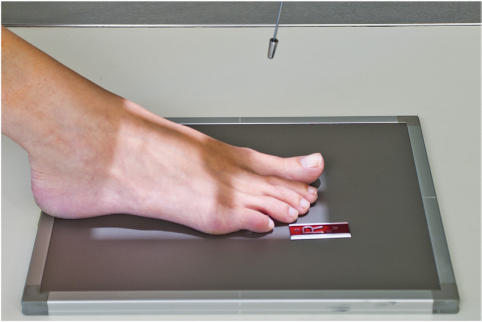
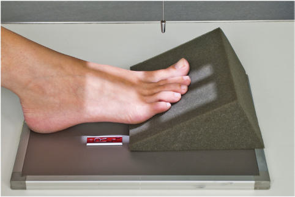
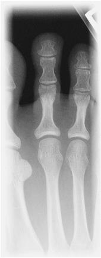
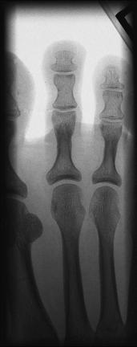

# Rx Degete Picior AP (Antero-Posterior)

  📷 Radiografie Convențională (Rx)
  <strong>Actualizat:</strong> 2026-09-15
  <strong>Autor:</strong> Departamentul de Radiologie / Referință Bontrager

---

-   __1. Rezumat Clinic & Indicații__

    ---

    === "Indicații Clinice"

        - suspiciune de fractură sau luxație / subluxație articulară de falange de falange în question
        - Pathologies such ca artroză / modificări degenerative articulare și gouty arthritis (gout), especially în first falange

    === "Ghid Național IRIS"

        !!! info "Referință Primară: Ghidul Național IRIS (Ordinul MS 1342/2012)"
            - **Capitol Ghid IRIS:** *Ghidul Național IRIS*
            - **Grad de Recomandare:** **De verificat pe indicație; fără grad atribuit automat**
            - **Nivel de Iradiere Estimată:** `De verificat pentru examinarea și populația selectate`

            [:octicons-search-16: Deschide Ghidul IRIS](../../iris.md){ .md-button .md-button--primary } [:material-open-in-new: Aplicația Oficială PWA](https://radiologie-pediatrica.ro/iris/){ .md-button target="_blank" rel="noopener" }
-   __2. Poziționare & Centrare Fascicul__

    ---

    - **Poziție Pacient:** Pacient: Place pacient Decubit dorsal sau Poziție Șezândă pe table; Genunchi trebuie să fie flectat cu plantar surface de Picior resting pe receptorul de imagine.; Regiune anatomică: Center și align axa longitudinală de falange la raza centrală și axa longitudinală de portion de receptorul de imagine being exposed. Ensure that articulații metatarsofalangiene (MTF) de falange în question este centrat pe raza centrală.
    - **Punct de Centrare Fascicul:** Angle raza centrală 10° la 15° spre Calcaneu (Raza centrală perpendiculară la falange) (Fig. 6.39). If a 15° wedge este plasat under Picior pentru paralel partfilm alignment, raza centrală este perpendicular pe receptorul de imagine (RI) (Fig. 6.40). Center raza centrală la articulații metatarsofalangiene (MTF) în question.
    - **Distanță Focar-Film (DFF / SID):** 100 cm
    - **Comandă Respiratorie:** Apnee pe durata expunerii (sau conform cooperării pacientului)

-   __3. Parametri Tehnici Expunere__

    ---

    | Parametru Tehnic | Valoare Configurare Generator / Tub |
    |:-----------------|:-------------------------------------|
    | **Tensiune Tub (kV)** | 50-65 kV |
    | **Sarcină / Produs Curent-Timp (mAs)** | DE CONFIGURAT PE APARAT |
    | **Distanță Focar-Film (DFF / SID)** | 100 cm |
    | **Grilă Antidifuzoare (Bucky)** | Fără grilă (expunere directă) |
    | **Dimensiune Focar** | Focar Mic (0.6 mm) |
    | **Camere de Ionizare AEC** | DE CONFIGURAT PE APARAT |
    | **Colimare Fascicul** | Collimate pe four sides la aria de interes diagnostic. pe side margins, include minimum de la least part de one falange pe fiecare side de falange în question. Degete Picior ROUTINE AP oblic lateral Fig. 6.39 Second falange (raza centrală, 10° la 15°). Fig. 6.40 AP second falange cu wedge (Raza centrală perpendiculară). |
    | **Filtrare Tub** | Totală ≥ 2.5 mm Al echivalent |

-   __4. Criterii de Calitate & Reușită Imagine__

    ---

    - falange de interest și minimum de distal half de oase metatarsiene trebuie să fie included (Figs. 6.41 și 6.42). poziție:
    - Individual falange trebuie să fie separated cu fără overlapping de soft tissues.
    - axa longitudinală de Picior este aliniat la axa longitudinală de portion de receptorul de imagine being exposed.
    - Absența rotației anatomice: clavicule echidistante față de linia apofizelor spinoase este present if shafts de falange și distal oase metatarsiene appear equally concave pe ambele părți (bilateral).
    - rotație appears ca one side being more concave than other.
    - Side cu increased concavity has been rolled away de la receptorul de imagine.4
    - IP și articulații metatarsofalangiene (MTF) spaces sunt open. Incorrect raza centrală angulation sau insufficient elevation de forefoot poate distort sau close spații articulare.4
    - Collimation la aria de interes diagnostic. expunere:
    - fără mișcare ca evidenced prin sharply defined cortical margins de bone și detailed bony trabeculae.
    - optim receptorul de imagine expunere și contrast will allow visualization de bony cortical margins și trabeculae și părți moi structures. Fig. 6.41 AP second falange. distal phalanx Middle phalanx 2nd articulații metatarsofalangiene (MTF) (raza centrală) distal 2nd metatarsal proximal phalanx Fig. 6.42 AP second falange.

-   __5. Protecție Radiologică (ALARA)__

    ---

    - Ecranare gonadică și a organelor radiosensibile conform procedurilor locale de radioprotecție ALARA.
    - Colimare strictă la aria de interes pentru limitarea radiației difuze.
    - Verificarea posibilității unei sarcini la pacientele de vârstă fertilă înainte de expunere.

!!! note "Observații Clinice & Tehnice"
    Some departmental routines include centering și collimation pentru AP Degete Picior la include toate Degete Picior și distal oase metatarsiene. Most routines involve centering la toe de interest cu closer collimation la include only one falange pe fiecare side de injury.

### 🖼️ Imagini

<figure class="protocol-image-card" markdown>

<figcaption><strong>Fig. 6.39 Second falange (raza centrală, 10° la 15°).</strong> — Poziționare pacient conform Ghidului Bontrager (Fig. 6.39 Second falange (raza centrală, 10° la 15°).)</figcaption>

</figure>

<figure class="protocol-image-card" markdown>

<figcaption><strong>Fig. 6.40 AP second falange cu wedge (Raza centrală perpendiculară).</strong> — Aspect radiografic de referință conform Ghidului Bontrager (Fig. 6.40 AP second falange cu wedge (raza centrală perpendicular).)</figcaption>

</figure>

<figure class="protocol-image-card" markdown>

<figcaption><strong>Fig. 6.41 AP second</strong> — Aspect radiografic de referință conform Ghidului Bontrager (Fig. 6.41 AP second)</figcaption>

</figure>

<figure class="protocol-image-card" markdown>

<figcaption><strong>Fig. 6.42 AP second falange.</strong> — Aspect radiografic de referință conform Ghidului Bontrager (Fig. 6.42 AP second falange.)</figcaption>

</figure>

=== "Ghid Rapid de Execuție"

    1. **Identificarea și verificarea pacientului:** verificare identitate, zonă de examinat, consimțământ conform procedurii și evaluarea posibilității unei sarcini, când este relevantă.
    2. **Pregătire:** îndepărtarea oricăror obiecte radiopace (bijuterii, agrafe, fermoare, proteze, pansamente dense).
    3. **Poziționare precisă:** alinierea receptorului de imagine și a tubului la distanța prescrisă (100 cm).
    4. **Colimare strictă:** adaptarea fasciculului strict la regiunea de diagnostic pentru scăderea iradierii și reducerea radiației difuze.
    5. **Radioprotecție:** verificarea [politicii RX](../radioprotectie.md), cu măsuri distincte pentru pacient, personal și însoțitor.

## Surse de documentare

- [Bontrager's Textbook of Radiographic Positioning (Ed. 9/10), Pagina 242](https://www.elsevier.com/books/textbook-of-radiographic-positioning-and-related-anatomy/lampignano/978-0-323-65367-1)
