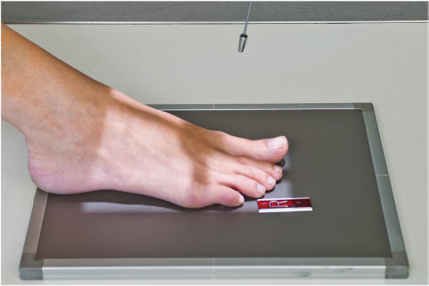
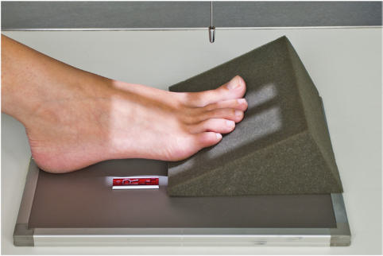
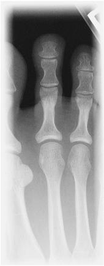
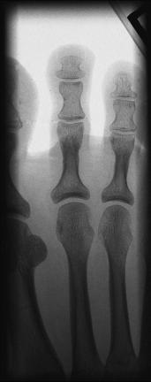

# Rx degete picior AP (anteroposterioară)

  📷 Radiografie Convențională (Rx)
  <strong>Actualizat:</strong> 2026-09-15
  <strong>Autor:</strong> Departamentul de Radiologie / Referință Bontrager

---

-   __1. Rezumat Clinic & Indicații__

    ---

    === "Indicații Clinice"

        - suspiciune de fractură sau luxație / subluxație articulară a falangei în cauză
        - Patologii precum artroza / modificările degenerative articulare și artrita gutoasă (gută), în special la nivelul primei falange

    === "Ghid Național IRIS"

        !!! info "Referință Primară: Ghidul Național IRIS (Ordinul MS 1342/2012)"
            - **Capitol Ghid IRIS:** *Aparat locomotor & Membru inferior*
            - **Grad de Recomandare:** **Grad A**
            - **Nivel de Iradiere Estimată:** `Clasa 1 (Minimă < 0.01 mSv)`

            [:octicons-search-16: Deschide Ghidul IRIS](../../iris.md){ .md-button .md-button--primary } [:material-open-in-new: Aplicația Oficială PWA](https://radiologie-pediatrica.ro/iris/){ .md-button target="_blank" rel="noopener" }

-   __2. Poziționare & Centrare Fascicul__

    ---

    - **Poziție Pacient:** Pacient: Se așază pacientul în decubit dorsal sau în poziție șezândă pe masă; genunchiul trebuie flectat, cu suprafața plantară a piciorului sprijinită pe receptorul de imagine.; Regiune anatomică: Se centrează și se aliniază axa longitudinală a falangei față de raza centrală și față de axa longitudinală a porțiunii receptorului de imagine care urmează să fie expusă. Se asigură centrarea articulației metatarsofalangiene (MTF) a falangei în cauză pe raza centrală.
    - **Punct de Centrare Fascicul:** Înclinați raza centrală cu 10° la 15° spre calcaneu (raza centrală perpendiculară pe falange) (Fig. 6.39). Dacă o pană de 15° este plasată sub picior pentru alinierea paralelă cu filmul, raza centrală este perpendiculară pe receptorul de imagine (RI) (Fig. 6.40). Centrați raza centrală la nivelul articulațiilor metatarsofalangiene (MTF) în cauză.
    - **Distanță Focar-Film (DFF / SID):** 100 cm
    - **Comandă Respiratorie:** Apnee pe durata expunerii (sau conform cooperării pacientului)

-   __3. Parametri Tehnici Expunere__

    ---

    | Parametru Tehnic | Valoare Configurare Generator / Tub |
    |:-----------------|:-------------------------------------|
    | **Tensiune Tub (kV)** | 50-65 kV |
    | **Sarcină / Produs Curent-Timp (mAs)** | DE CONFIGURAT PE APARAT |
    | **Distanță Focar-Film (DFF / SID)** | 100 cm |
    | **Grilă Antidifuzoare (Bucky)** | Fără grilă (expunere directă) |
    | **Dimensiune Focar** | Focar Mic (0.6 mm) |
    | **Camere de Ionizare AEC** | DE CONFIGURAT PE APARAT |
    | **Colimare Fascicul** | Se colimează pe toate cele patru laturi la aria de interes diagnostic. La marginile laterale, se include cel puțin o parte a unei falange de fiecare parte a falangei examinate. Degetele piciorului — INCIDENȚE DE RUTINĂ: AP, oblică, profil. Fig. 6.39 A doua falangă (raza centrală, 10° la 15°). Fig. 6.40 AP a celei de-a doua falange cu suport în formă de pană (raza centrală perpendiculară). |
    | **Filtrare Tub** | Totală ≥ 2.5 mm Al echivalent |

-   __4. Criterii de Calitate & Reușită Imagine__

    ---

    - Falanga de interes și cel puțin jumătatea distală a oaselor metatarsiene trebuie incluse (Fig. 6.41 și 6.42). poziție:
    - Falangele individuale trebuie separate, fără suprapunerea țesuturilor moi.
    - Axa longitudinală a piciorului este aliniată cu axa longitudinală a porțiunii receptorului de imagine care urmează să fie expusă.
    - Absența rotației anatomice: claviculele echidistante față de linia apofizelor spinoase este prezentă dacă diafizele falangelor și oasele metatarsiene distale apar la fel de concave pe ambele părți (bilateral).
    - Rotația apare ca o parte mai concavă decât cealaltă.
    - Partea cu concavitatea crescută a fost rulată în sens opus față de receptorul de imagine.4
    - Spațiile IP și metatarsofalangiene (MTF) sunt deschise. Angulația incorectă a razei centrale sau ridicarea insuficientă a antepiciorului pot deforma sau închide spațiile articulare.4
    - Colimare la aria de interes diagnostic. Expunere:
    - fără mișcare, evidențiată prin marginile corticale bine definite ale osului și trabeculele osoase detaliate.
    - Expunerea optimă a receptorului de imagine și contrastul vor permite vizualizarea marginilor corticale osoase și a trabeculelor, precum și a structurilor țesuturilor moi. Fig. 6.41 AP falanga a doua. Falanga distală, falanga mijlocie, a 2-a articulație metatarsofalangiană (MTF) (raza centrală), metatarsianul 2 distal, falanga proximală. Fig. 6.42 AP falanga a doua.

-   __5. Protecție Radiologică (ALARA)__

    ---

    - Ecranare gonadică și a organelor radiosensibile conform procedurilor locale de radioprotecție ALARA.
    - Colimare strictă la aria de interes pentru limitarea radiației difuze.
    - Verificarea posibilității unei sarcini la pacientele de vârstă fertilă înainte de expunere.

!!! note "Observații Clinice & Tehnice"
    Unele protocoale departamentale includ centrarea și colimarea pentru incidența AP a degetelor piciorului, astfel încât să includă toate degetele piciorului și oasele metatarsiene distale. Majoritatea protocoalelor presupun centrarea pe degetul de interes, cu colimare strânsă pentru a include o singură falangă de fiecare parte a leziunii.

### 🖼️ Imagini

<figure class="protocol-image-card" markdown>

<figcaption><strong>Fig. 6.39 A doua falangă (raza centrală, 10° la 15°).</strong> — Poziționarea pacientului conform Ghidului Bontrager (Fig. 6.39 A doua falangă (raza centrală, 10° la 15°).)</figcaption>

</figure>

<figure class="protocol-image-card" markdown>

<figcaption><strong>Fig. 6.40 AP falanga a doua cu pană (raza centrală perpendiculară).</strong> — Aspect radiografic de referință conform Ghidului Bontrager (Fig. 6.40 AP a celei de-a doua falange cu pană (raza centrală perpendiculară).)</figcaption>

</figure>

<figure class="protocol-image-card" markdown>

<figcaption><strong>Fig. 6.41 AP a celei de-a doua</strong> — Aspect radiografic de referință conform Ghidului Bontrager (Fig. 6.41 AP a celei de-a doua)</figcaption>

</figure>

<figure class="protocol-image-card" markdown>

<figcaption><strong>Fig. 6.42 AP a celei de-a doua falange.</strong> — Aspect radiografic de referință conform Ghidului Bontrager (Fig. 6.42 AP a celei de-a doua falange.)</figcaption>

</figure>

=== "Ghid Rapid de Execuție"

    1. **Identificarea și verificarea pacientului:** verificare identitate, zonă de examinat, consimțământ conform procedurii și evaluarea posibilității unei sarcini, când este relevantă.
    2. **Pregătire:** îndepărtarea oricăror obiecte radiopace (bijuterii, agrafe, fermoare, proteze, pansamente dense).
    3. **Poziționare precisă:** alinierea receptorului de imagine și a tubului la distanța prescrisă (100 cm).
    4. **Colimare strictă:** adaptarea fasciculului strict la regiunea de diagnostic pentru scăderea iradierii și reducerea radiației difuze.
    5. **Radioprotecție:** verificarea [politicii RX](../radioprotectie.md), cu măsuri distincte pentru pacient, personal și însoțitor.

## Surse de documentare

- [Bontrager's Textbook of Radiographic Positioning (Ed. 9/10), Pagina 242](https://www.elsevier.com/books/textbook-of-radiographic-positioning-and-related-anatomy/lampignano/978-0-323-65367-1)
