# Rx Degete Picior Profil (Lateral) (basic) - hallux

  📷 Radiografie Convențională (Rx)
  <strong>Actualizat:</strong> 2026-09-16
  <strong>Autor:</strong> Departamentul de Radiologie / Referință Clark (Ed. 12)

---

-   __1. Rezumat Clinic & Indicații__

    ---

    === "Indicații Clinice"

        - 113 4 Degete Picior Profil (lateral) (basic) – hallux Antero-posterior (AP) – basic (Mortice incidență)

    === "Ghid Național IRIS"

        !!! info "Referință Primară: Ghidul Național IRIS (Ordinul MS 1342/2012)"
            - **Capitol Ghid IRIS:** *Ghidul Național IRIS*
            - **Grad de Recomandare:** **De verificat pe indicație; fără grad atribuit automat**
            - **Nivel de Iradiere Estimată:** `De verificat pentru examinarea și populația selectate`

            [:octicons-search-16: Deschide Ghidul IRIS](../../iris.md){ .md-button .md-button--primary } [:material-open-in-new: Aplicația Oficială PWA](https://radiologie-pediatrica.ro/iris/){ .md-button target="_blank" rel="noopener" }
-   __2. Poziționare & Centrare Fascicul__

    ---

    - **Poziție Pacient:** • de la Dorso-Plantară poziție, Picior este rotit medially until medial aspect de hallux este în contact cu caseta. bandage este plasat around remaining Degete Picior (provided that fără injury este suspected) și they sunt gently pulled forwards prin pacientul la clear hallux. Alternatively, they poate fie pulled backwards; this shows articulații metatarsofalangiene (MTF) more clearly.

• pacientul este either Decubit dorsal sau așezat pe scaun pe masa radiologică cu ambele membre inferioare extins.
• pad poate fie plasat under Genunchi pentru comfort.
• affected Gleznă (Articulație Talocrurală) este sprijinit în dorsiflexion prin firm 90-grade pad plasat pe / sprijinit de plantar aspect de Picior.
limb este rotit medially (approximately 20 grade) until medial și Profil (lateral) malleoli sunt echidistant față de caseta.
• lower edge de caseta este poziționat just below plantar aspect de heel.
    - **Punct de Centrare Fascicul:** • Centre la sesamoid bones cu raza centrală centrală projected tangentially la first metatarso-phalangeal articulație.
Normal Profil (lateral) basic incidență de hallux Profil (lateral) incidență de first metatarsal sesamoids, note exostosis pe medial sesamoid Normal Axială incidență de first metatarsal sesamoids

• Centre midway între malleoli cu raza centrală verticală centrală la 90 grade la imaginary line joining malleoli.
    - **Distanță Focar-Film (DFF / SID):** 100 cm
    - **Comandă Respiratorie:** Apnee pe durata expunerii (apnee în inspir pentru torace; expir pentru Abdomen/bazin).

-   __3. Parametri Tehnici Expunere__

    ---

    | Parametru Tehnic | Valoare Configurare Generator / Tub |
    |:-----------------|:-------------------------------------|
    | **Tensiune Tub (kV)** | DE CONFIGURAT PE APARAT |
    | **Sarcină / Produs Curent-Timp (mAs)** | Conform AEC / grosime anatomică |
    | **Distanță Focar-Film (DFF / SID)** | 100 cm |
    | **Grilă Antidifuzoare (Bucky)** | Conform grosimii anatomice (> 10-12 cm cu grilă) |
    | **Dimensiune Focar** | Focar Mic (0.6 mm) |
    | **Camere de Ionizare AEC** | DE CONFIGURAT PE APARAT |
    | **Colimare Fascicul** | Colimare strictă adaptată pe receptor 18 x 24 cm |
    | **Filtrare Tub** | Totală ≥ 2.5 mm Al echivalent (conform Clark: 3.0 mm Al eq.) |

-   __4. Criterii de Calitate & Reușită Imagine__

    ---

    - lower third de Gambă (Tibie și Peroneu) trebuie să fie included.
    - clear spații articulare între tibia, fibula și astragal (talus) trebuie să fie evidențiat (commonly called Mortice incidență).
    - Erori de evitat / remedii: Insufficient dorsiflexion results în Calcaneu being superimposed pe Profil (lateral) malleolus.
    - Erori de evitat / remedii: Insufficient rotație internă (medială) causes overshadowing de tibiofibular articulație cu result that spații articulare între fibula și astragal (talus) este nu clar evidențiat(e). 114 Insufficient rotație internă (medială) Insufficient dorsiflexion Normal Antero-posterior (AP) radiografie de Gleznă (Articulație Talocrurală) Tibia Gleznă (Articulație Talocrurală) articulație maleolă medială (tibială) Fibula Tibiofibular synchondrosis Trochlear surface (dome) de astragal (talus) Profil (lateral) malleolus Malleolar fossa Annotated Antero-posterior (AP) radiografie
    - Erori de evitat / remedii: If intern rotație de limb este difficult, then raza centrală este înclinat la compensate, making sure that it este still la 90 grade la imaginary line joining malleoli.

-   __5. Protecție Radiologică (ALARA)__

    ---

    - Ecranare gonadică cu șorț plumbat dacă gonadele sunt în apropierea fasciculului util (regula ALARA).
    - Colimare precisă la dimensiunea anatomică strict necesară pentru reducerea dozei și a radiației difuze.
    - Verificarea posibilității unei sarcini la pacientele de vârstă fertilă înainte de expunere.

!!! note "Observații Clinice & Tehnice"
    Pregătirea pacientului prin îndepărtarea tuturor accesoriilor radio-opace.

### 🖼️ Imagini

<figure class="protocol-image-card" markdown>

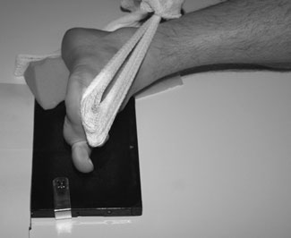

<figcaption><strong>Normal Profil (lateral) basic</strong> — Poziționare pacient și centrare fascicul conform Clark (Ed. 12)</figcaption>

</figure>

<figure class="protocol-image-card" markdown>

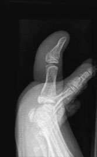

<figcaption><strong>Normal Axială incidență de first</strong> — Aspect radiografic / ghid de poziționare conform tratatului Clark (Ed. 12)</figcaption>

</figure>

<figure class="protocol-image-card" markdown>

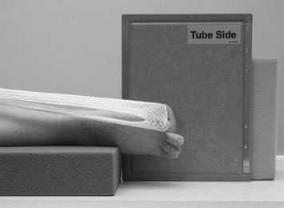

<figcaption><strong>Figura 3: Aspect radiografic / Poziționare (Clark Ed. 12)</strong> — Aspect radiografic / ghid de poziționare conform tratatului Clark (Ed. 12)</figcaption>

</figure>

<figure class="protocol-image-card" markdown>

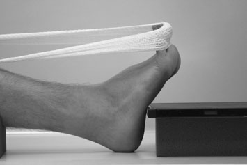

<figcaption><strong>Figura 4: Aspect radiografic / Poziționare (Clark Ed. 12)</strong> — Aspect radiografic / ghid de poziționare conform tratatului Clark (Ed. 12)</figcaption>

</figure>

<figure class="protocol-image-card" markdown>

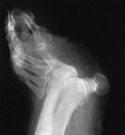

<figcaption><strong>Figura 5: Aspect radiografic / Poziționare (Clark Ed. 12)</strong> — Aspect radiografic / ghid de poziționare conform tratatului Clark (Ed. 12)</figcaption>

</figure>

<figure class="protocol-image-card" markdown>

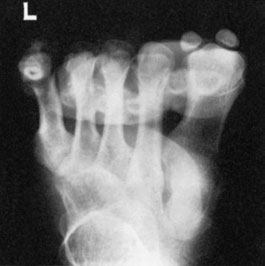

<figcaption><strong>Figura 6: Aspect radiografic / Poziționare (Clark Ed. 12)</strong> — Aspect radiografic / ghid de poziționare conform tratatului Clark (Ed. 12)</figcaption>

</figure>

<figure class="protocol-image-card" markdown>

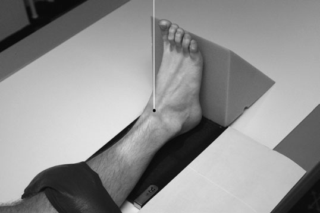

<figcaption><strong>• clear spații articulare între tibia, fibula și astragal (talus) trebuie să</strong> — Aspect radiografic / ghid de poziționare conform tratatului Clark (Ed. 12)</figcaption>

</figure>

<figure class="protocol-image-card" markdown>

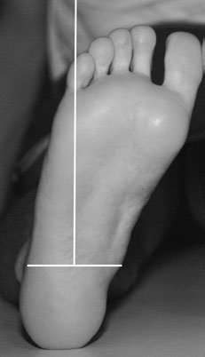

<figcaption><strong>fibular articulație cu result that spații articulare între</strong> — Aspect radiografic / ghid de poziționare conform tratatului Clark (Ed. 12)</figcaption>

</figure>

<figure class="protocol-image-card" markdown>

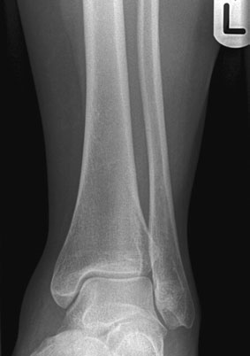

<figcaption><strong>Normal Antero-posterior (AP) radiografie de</strong> — Aspect radiografic / ghid de poziționare conform tratatului Clark (Ed. 12)</figcaption>

</figure>

<figure class="protocol-image-card" markdown>

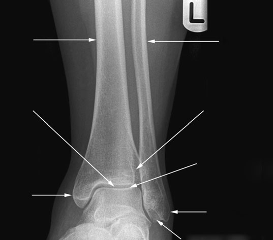

<figcaption><strong>Annotated Antero-posterior (AP) radiografie</strong> — Aspect radiografic / ghid de poziționare conform tratatului Clark (Ed. 12)</figcaption>

</figure>

<figure class="protocol-image-card" markdown>

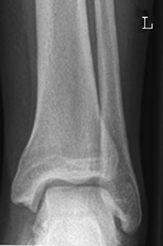

<figcaption><strong>Figura 11: Aspect radiografic / Poziționare (Clark Ed. 12)</strong> — Aspect radiografic / ghid de poziționare conform tratatului Clark (Ed. 12)</figcaption>

</figure>

<figure class="protocol-image-card" markdown>

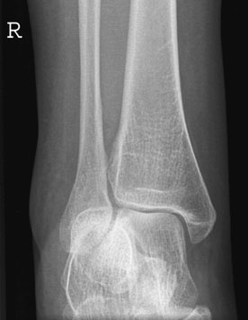

<figcaption><strong>Figura 12: Aspect radiografic / Poziționare (Clark Ed. 12)</strong> — Aspect radiografic / ghid de poziționare conform tratatului Clark (Ed. 12)</figcaption>

</figure>

=== "Ghid Rapid de Execuție"

    1. **Identificarea și verificarea pacientului:** verificare identitate, zonă de examinat, consimțământ conform procedurii și evaluarea posibilității unei sarcini, când este relevantă.
    2. **Pregătire:** îndepărtarea oricăror obiecte radiopace (bijuterii, agrafe, fermoare, proteze, pansamente dense).
    3. **Poziționare precisă:** alinierea receptorului de imagine și a tubului la distanța prescrisă (100 cm).
    4. **Colimare strictă:** adaptarea fasciculului strict la regiunea de diagnostic pentru scăderea iradierii și reducerea radiației difuze.
    5. **Radioprotecție:** verificarea [politicii RX](../radioprotectie.md), cu măsuri distincte pentru pacient, personal și însoțitor.

## Surse de documentare

- [Clark's Positioning in Radiography (Ed. 12), Pagina 128](../../assets/protocols/sources/Clark___Positioning_in_Radiography__12th_edition.pdf#page=128)
