# Rx Degete Picior Profil (Lateral) (de bază) - haluce

  📷 Radiografie Convențională (Rx)
  <strong>Actualizat:</strong> 2026-09-16
  <strong>Autor:</strong> Departamentul de Radiologie / Referință Clark (Ed. 12)

---

-   __1. Rezumat Clinic & Indicații__

    ---

    === "Indicații Clinice"

        - 113 4 Degete de la picior Profil (lateral) (de bază) – haluce Antero-posterior (AP) – de bază (incidență de mortaisă)

    === "Ghid Național IRIS"

        !!! info "Referință Primară: Ghidul Național IRIS (Ordinul MS 1342/2012)"
            - **Capitol Ghid IRIS:** *Aparat locomotor & Membru inferior*
            - **Grad de Recomandare:** **Grad A**
            - **Nivel de Iradiere Estimată:** `Clasa 1 (Minimă < 0.01 mSv)`

            [:octicons-search-16: Deschide Ghidul IRIS](../../iris.md){ .md-button .md-button--primary } [:material-open-in-new: Aplicația Oficială PWA](https://radiologie-pediatrica.ro/iris/){ .md-button target="_blank" rel="noopener" }

-   __2. Poziționare & Centrare Fascicul__

    ---

    - **Poziție Pacient:**
        - Din poziția dorso-plantară, piciorul este rotit medial până când aspectul medial al halucelui este în contact cu caseta. Se aplică un bandaj în jurul celorlalte degete de la picior (cu condiția să nu fie suspectată nicio leziune), iar acestea sunt trase ușor înainte de către pacient pentru a elibera halucele. Alternativ, acestea pot fi trase înapoi; aceasta evidențiază mai clar articulațiile metatarsofalangiene (MTF).
        - Pacientul este fie în decubit dorsal, fie așezat pe masa radiologică, cu ambele membre inferioare extinse.
        - Pentru confort, se poate plasa un suport sub genunchi.
        - Glezna afectată (articulația talocrurală) este menținută în dorsiflexie printr-un suport ferm de 90 de grade, plasat pe sau sprijinit de aspectul plantar al piciorului. Membrul este rotit medial (aproximativ 20 de grade) până când maleolele medială și laterală sunt echidistante față de casetă.
        - Marginea inferioară a casetei este poziționată imediat sub aspectul plantar al călcâiului.
    - **Punct de Centrare Fascicul:**
        - Se centrează oasele sesamoide, cu raza centrală proiectată tangențial la prima articulație metatarsofalangiană. Incidență de profil (laterală) normală, de bază, a halucelui Incidență de profil (laterală) a sesamoidelor primului metatarsian, observând exostoza pe sesamoidul medial Incidență axială normală a sesamoidelor primului metatarsian
        - Se centrează la jumătatea distanței dintre maleole, cu raza centrală verticală la 90 de grade față de linia imaginară care unește maleolele.
    - **Distanță Focar-Film (DFF / SID):** 100 cm
    - **Comandă Respiratorie:** Apnee pe durata expunerii (apnee în inspir pentru torace; expir pentru Abdomen/bazin).

-   __3. Parametri Tehnici Expunere__

    ---

    | Parametru Tehnic | Valoare Configurare Generator / Tub |
    |:-----------------|:-------------------------------------|
    | **Tensiune Tub (kV)** | DE CONFIGURAT PE APARAT |
    | **Sarcină / Produs Curent-Timp (mAs)** | Conform AEC / grosimii anatomice |
    | **Distanță Focar-Film (DFF / SID)** | 100 cm |
    | **Grilă Antidifuzoare (Bucky)** | Conform grosimii anatomice (> 10-12 cm cu grilă) |
    | **Dimensiune Focar** | Focar Mic (0.6 mm) |
    | **Camere de Ionizare AEC** | DE CONFIGURAT PE APARAT |
    | **Colimare Fascicul** | Colimare strictă adaptată pe receptor 18 x 24 cm |
    | **Filtrare Tub** | Totală ≥ 2.5 mm Al echivalent (conform Clark: 3.0 mm Al echivalent) |

-   __4. Criterii de Calitate & Reușită Imagine__

    ---

    - Treimea inferioară a gambei (tibia și peroneul) trebuie inclusă.
    - Spațiile articulare clare dintre tibie, fibulă și astragal (talus) trebuie evidențiate (denumită în mod obișnuit incidență de mortaisă).
    - Erori de evitat / remedii: Dorsiflexia insuficientă are ca rezultat suprapunerea calcaneului peste maleola laterală.
    - Erori de evitat / remedii: Rotația internă (medială) insuficientă determină suprapunerea articulației tibiofibulare, astfel încât spațiile articulare dintre fibulă și astragal (talus) nu sunt evidențiate clar. 114 Rotație internă (medială) insuficientă Dorsiflexie insuficientă Radiografie antero-posterioară (AP) normală a gleznei (articulației talocrurale) Tibie Glezna (articulația talocrurală) Maleolă medială (tibială) Fibulă Sincondroză tibiofibulară Suprafața trohleară (domul) astragalului (talusului) Maleolă laterală Fosa maleolară Radiografie antero-posterioară (AP) adnotată
    - Erori de evitat / remedii: Dacă rotația internă a membrului este dificilă, atunci raza centrală este înclinată pentru compensare, asigurându-se că rămâne la 90 de grade față de linia imaginară care unește maleolele.

-   __5. Protecție Radiologică (ALARA)__

    ---

    - Ecranare gonadică cu șorț plumbat dacă gonadele sunt în apropierea fasciculului util (regula ALARA).
    - Colimare precisă la dimensiunea anatomică strict necesară pentru reducerea dozei și a radiației difuze.
    - Verificarea posibilității unei sarcini la pacientele de vârstă fertilă înainte de expunere.

!!! note "Observații Clinice & Tehnice"
    Pregătirea pacientului prin îndepărtarea tuturor accesoriilor radio-opace.

### 🖼️ Imagini

<figure class="protocol-image-card" markdown>

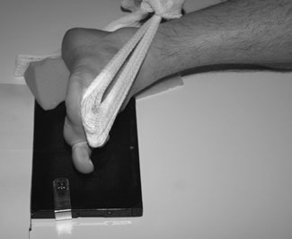

<figcaption><strong>Profil (lateral) normal, de bază</strong> — Poziționarea pacientului și centrarea fasciculului conform Clark (Ed. 12)</figcaption>

</figure>

<figure class="protocol-image-card" markdown>

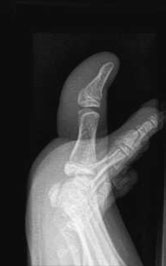

<figcaption><strong>Incidență axială normală a primului</strong> — Aspect radiografic / ghid de poziționare conform tratatului Clark (Ed. 12)</figcaption>

</figure>

<figure class="protocol-image-card" markdown>

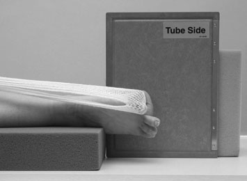

<figcaption><strong>Figura 3: Aspect radiografic / Poziționare (Clark Ed. 12)</strong> — Aspect radiografic / ghid de poziționare conform tratatului Clark (Ed. 12)</figcaption>

</figure>

<figure class="protocol-image-card" markdown>

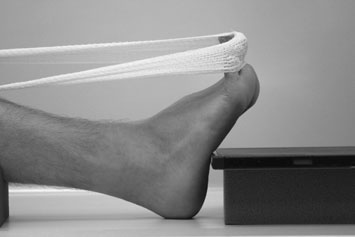

<figcaption><strong>Figura 4: Aspect radiografic / Poziționare (Clark Ed. 12)</strong> — Aspect radiografic / ghid de poziționare conform tratatului Clark (Ed. 12)</figcaption>

</figure>

<figure class="protocol-image-card" markdown>

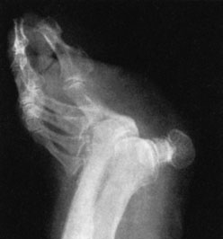

<figcaption><strong>Figura 5: Aspect radiografic / Poziționare (Clark Ed. 12)</strong> — Aspect radiografic / ghid de poziționare conform tratatului Clark (Ed. 12)</figcaption>

</figure>

<figure class="protocol-image-card" markdown>

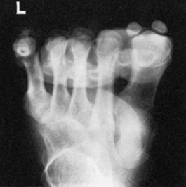

<figcaption><strong>Figura 6: Aspect radiografic / Poziționare (Clark Ed. 12)</strong> — Aspect radiografic / ghid de poziționare conform tratatului Clark (Ed. 12)</figcaption>

</figure>

<figure class="protocol-image-card" markdown>

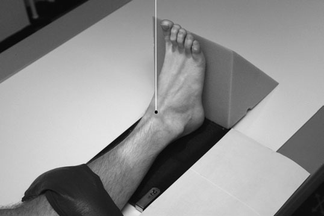

<figcaption><strong>• Spațiile articulare clare dintre tibie, fibulă și astragal (talus) trebuie</strong> — Aspect radiografic / ghid de poziționare conform tratatului Clark (Ed. 12)</figcaption>

</figure>

<figure class="protocol-image-card" markdown>

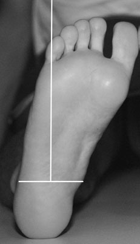

<figcaption><strong>articulația fibulară, astfel încât spațiile articulare dintre</strong> — Aspect radiografic / ghid de poziționare conform tratatului Clark (Ed. 12)</figcaption>

</figure>

<figure class="protocol-image-card" markdown>

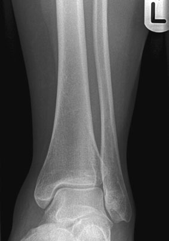

<figcaption><strong>Radiografie antero-posterioară (AP) normală a</strong> — Aspect radiografic / ghid de poziționare conform tratatului Clark (Ed. 12)</figcaption>

</figure>

<figure class="protocol-image-card" markdown>

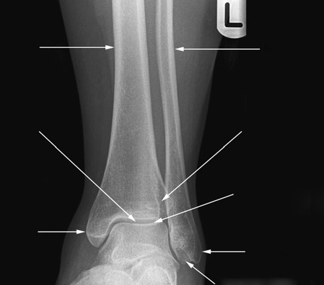

<figcaption><strong>Radiografie antero-posterioară (AP) adnotată</strong> — Aspect radiografic / ghid de poziționare conform tratatului Clark (Ed. 12)</figcaption>

</figure>

<figure class="protocol-image-card" markdown>

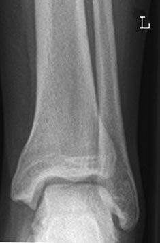

<figcaption><strong>Figura 11: Aspect radiografic / Poziționare (Clark Ed. 12)</strong> — Aspect radiografic / ghid de poziționare conform tratatului Clark (Ed. 12)</figcaption>

</figure>

<figure class="protocol-image-card" markdown>

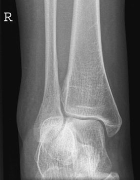

<figcaption><strong>Figura 12: Aspect radiografic / Poziționare (Clark Ed. 12)</strong> — Aspect radiografic / ghid de poziționare conform tratatului Clark (Ed. 12)</figcaption>

</figure>

=== "Ghid Rapid de Execuție"

    1. **Identificarea și verificarea pacientului:** verificare identitate, zonă de examinat, consimțământ conform procedurii și evaluarea posibilității unei sarcini, când este relevantă.
    2. **Pregătire:** îndepărtarea oricăror obiecte radiopace (bijuterii, agrafe, fermoare, proteze, pansamente dense).
    3. **Poziționare precisă:** alinierea receptorului de imagine și a tubului la distanța prescrisă (100 cm).
    4. **Colimare strictă:** adaptarea fasciculului strict la regiunea de diagnostic pentru scăderea iradierii și reducerea radiației difuze.
    5. **Radioprotecție:** verificarea [politicii RX](../radioprotectie.md), cu măsuri distincte pentru pacient, personal și însoțitor.

## Surse de documentare

- [Clark's Positioning in Radiography (Ed. 12), Pagina 128](https://books.google.com/books/about/Clark_s_Positioning_in_Radiography.html?id=Xxu6MwEACAAJ)
