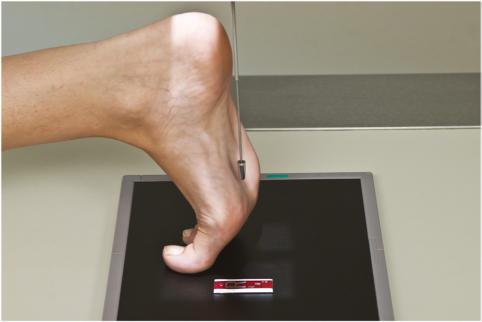
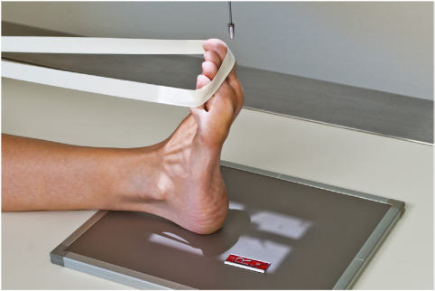
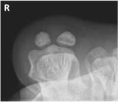
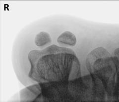

# Rx Degete Picior TANGENTIAL Incidență (SESAMOIDS)

  📷 Radiografie Convențională (Rx)
  <strong>Actualizat:</strong> 2026-09-15
  <strong>Autor:</strong> Departamentul de Radiologie / Referință Bontrager

---

-   __1. Rezumat Clinic & Indicații__

    ---

    === "Indicații Clinice"

        - This incidență provides profile imagine de sesamoid bones la first articulații metatarsofalangiene (MTF) pentru evaluation de extent de injury.

    === "Ghid Național IRIS"

        !!! info "Referință Primară: Ghidul Național IRIS (Ordinul MS 1342/2012)"
            - **Capitol Ghid IRIS:** *Ghidul Național IRIS*
            - **Grad de Recomandare:** **De verificat pe indicație; fără grad atribuit automat**
            - **Nivel de Iradiere Estimată:** `De verificat pentru examinarea și populația selectate`

            [:octicons-search-16: Deschide Ghidul IRIS](../../iris.md){ .md-button .md-button--primary } [:material-open-in-new: Aplicația Oficială PWA](https://radiologie-pediatrica.ro/iris/){ .md-button target="_blank" rel="noopener" }
-   __2. Poziționare & Centrare Fascicul__

    ---

    - **Poziție Pacient:** Pacient: Place pacient Decubit ventral; provide pillow pentru pacient’s cap și small sponge sau folded towel under Gambă pentru comfort.; Regiune anatomică: Dorsiflex Picior astfel încât plantar surface de Picior forms a 15° la 20° angle de la vertical (Figs. 6.52 și 6.53). Dorsiflex first falange (great toe) și rest pe receptorul de imagine la maintain poziție. Ensure that axa longitudinală de Picior este nu rotit; place săculeți cu nisip sau other support pe ambele părți (bilateral) de Picior la prevent movement.
    - **Punct de Centrare Fascicul:** would fie orientat tangențial pe posterior aspect de first articulații metatarsofalangiene (MTF). Use support la prevent mișcare. However, this este nu desirable incidență because de increased object–receptorul de imagine distance (OID) cu accompanying magnification și loss de definition. Degete Picior SPECIAL Sesamoids (tangențial) Fig. 6.54 tangențial incidență. (Courtesy Joss Wertz, DO.) Tibial și fibular sesamoids distal 1st metatarsal Fig. 6.55 tangențial incidență. (Courtesy Joss Wertz, DO.)
    - **Distanță Focar-Film (DFF / SID):** 100 cm
    - **Comandă Respiratorie:** Apnee pe durata expunerii (sau conform cooperării pacientului)

-   __3. Parametri Tehnici Expunere__

    ---

    | Parametru Tehnic | Valoare Configurare Generator / Tub |
    |:-----------------|:-------------------------------------|
    | **Tensiune Tub (kV)** | 50-60 kV |
    | **Sarcină / Produs Curent-Timp (mAs)** | DE CONFIGURAT PE APARAT |
    | **Distanță Focar-Film (DFF / SID)** | 100 cm |
    | **Grilă Antidifuzoare (Bucky)** | Fără grilă (expunere directă) |
    | **Dimensiune Focar** | Focar Mic (0.6 mm) |
    | **Camere de Ionizare AEC** | DE CONFIGURAT PE APARAT |
    | **Colimare Fascicul** | field (raza centrală) la posterior portion de first articulații metatarsofalangiene (MTF) (Figs. 6.54 și 6.55). poziție: margini de posterior margins de first la third distal oase metatarsiene sunt seen în profile, indicating correct dorsiflexion de Picior. Centering și raza centrală angulation sunt correct if sesamoids sunt liber de orice bony superimposition și open space este evidențiat între sesamoids și first metatarsal. expunere: fără mișcare ca evidenced prin net bony cortical margins și detailed trabeculae. optim receptorul de imagine expunere și contrast will allow visualization de bony cortical margins și trabeculae și părți moi structures fără sesamoids appearing overexposed. Fig. 6.52 tangențial incidență—pacient Decubit ventral. Fig. 6.53 Alternative incidență—pacient Decubit dorsal. |
    | **Filtrare Tub** | Totală ≥ 2.5 mm Al echivalent |

-   __4. Criterii de Calitate & Reușită Imagine__

    ---

    - Sesamoids trebuie să fie seen în profile liber de superimposition.
    - minimum de first three distal oase metatarsiene trebuie să fie included în collimation field pentru possible sesamoids, cu center de foursided

-   __5. Protecție Radiologică (ALARA)__

    ---

    - Ecranare gonadică și a organelor radiosensibile conform procedurilor locale de radioprotecție ALARA.
    - Colimare strictă la aria de interes pentru limitarea radiației difuze.
    - Verificarea posibilității unei sarcini la pacientele de vârstă fertilă înainte de expunere.

!!! note "Observații Clinice & Tehnice"
    This este uncomfortable și often painful poziție; do nu keep pacient în this poziție longer than necessary.

### 🖼️ Imagini

<figure class="protocol-image-card" markdown>

<figcaption><strong>Fig. 6.54 tangențial incidență.</strong> — Poziționare pacient conform Ghidului Bontrager (Fig. 6.54 tangențial incidență.)</figcaption>

</figure>

<figure class="protocol-image-card" markdown>

<figcaption><strong>Fig. 6.55 tangențial incidență.</strong> — Aspect radiografic de referință conform Ghidului Bontrager (Fig. 6.55 tangențial incidență.)</figcaption>

</figure>

<figure class="protocol-image-card" markdown>

<figcaption><strong>Fig. 6.52 tangențial incidență—pacient Decubit ventral.</strong> — Aspect radiografic de referință conform Ghidului Bontrager (Fig. 6.52 tangențial incidență—pacient în decubit ventral.)</figcaption>

</figure>

<figure class="protocol-image-card" markdown>

<figcaption><strong>Fig. 6.53 Alternative incidență—pacient Decubit dorsal.</strong> — Aspect radiografic de referință conform Ghidului Bontrager (Fig. 6.53 Alternative incidență—pacient în decubit dorsal.)</figcaption>

</figure>

=== "Ghid Rapid de Execuție"

    1. **Identificarea și verificarea pacientului:** verificare identitate, zonă de examinat, consimțământ conform procedurii și evaluarea posibilității unei sarcini, când este relevantă.
    2. **Pregătire:** îndepărtarea oricăror obiecte radiopace (bijuterii, agrafe, fermoare, proteze, pansamente dense).
    3. **Poziționare precisă:** alinierea receptorului de imagine și a tubului la distanța prescrisă (100 cm).
    4. **Colimare strictă:** adaptarea fasciculului strict la regiunea de diagnostic pentru scăderea iradierii și reducerea radiației difuze.
    5. **Radioprotecție:** verificarea [politicii RX](../radioprotectie.md), cu măsuri distincte pentru pacient, personal și însoțitor.

## Surse de documentare

- [Bontrager's Textbook of Radiographic Positioning (Ed. 9/10), Pagina 245](https://www.elsevier.com/books/textbook-of-radiographic-positioning-and-related-anatomy/lampignano/978-0-323-65367-1)
