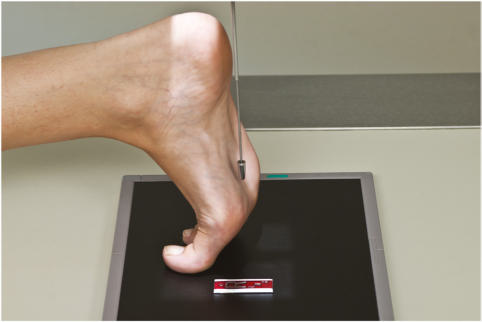
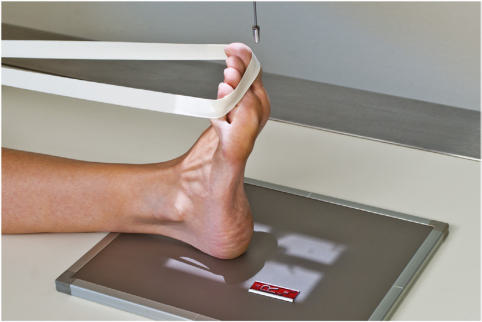
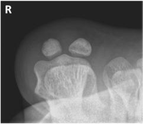
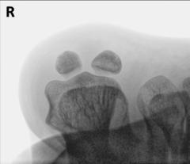

# Rx Degete Picior Incidență TANGENȚIALĂ (SESAMOIDE)

  📷 Radiografie Convențională (Rx)
  <strong>Actualizat:</strong> 2026-09-15
  <strong>Autor:</strong> Departamentul de Radiologie / Referință Bontrager

---

-   __1. Rezumat Clinic & Indicații__

    ---

    === "Indicații Clinice"

        - Această incidență oferă o imagine de profil a oaselor sesamoide la prima articulație metatarsofalangiană (MTF) pentru evaluarea extinderii leziunii.

    === "Ghid Național IRIS"

        !!! info "Referință Primară: Ghidul Național IRIS (Ordinul MS 1342/2012)"
            - **Capitol Ghid IRIS:** *Aparat locomotor & Membru inferior*
            - **Grad de Recomandare:** **Grad A**
            - **Nivel de Iradiere Estimată:** `Clasa 1 (Minimă < 0.01 mSv)`

            [:octicons-search-16: Deschide Ghidul IRIS](../../iris.md){ .md-button .md-button--primary } [:material-open-in-new: Aplicația Oficială PWA](https://radiologie-pediatrica.ro/iris/){ .md-button target="_blank" rel="noopener" }

-   __2. Poziționare & Centrare Fascicul__

    ---

    - **Poziție Pacient:** Pacient: Așezați pacientul în decubit ventral; asigurați o pernă pentru capul pacientului și un burete mic sau un prosop împăturit sub gambă pentru confort.; Regiune anatomică: Efectuați dorsiflexia piciorului astfel încât suprafața plantară a piciorului să formeze un unghi de 15° până la 20° față de verticală (Fig. 6.52 și 6.53). Efectuați dorsiflexia primei falange (degetul mare) și sprijiniți-o pe receptorul de imagine pentru menținerea poziției. Asigurați-vă că axa longitudinală a piciorului nu este rotită; plasați săculeți cu nisip sau alt suport pe ambele părți ale piciorului pentru prevenirea mișcării.
    - **Punct de Centrare Fascicul:** [Fragment trunchiat în sursă] ar fi orientat tangențial pe fața posterioară a primei articulații metatarsofalangiene (MTF). Se utilizează un suport pentru a preveni mișcarea. Totuși, aceasta nu este o incidență de dorit, din cauza distanței obiect–receptor de imagine (OID) crescute, cu mărirea imaginii și pierderea clarității care o însoțesc. Degetele piciorului — INCIDENȚE SPECIALE: sesamoide (tangențial). Fig. 6.54 Incidență tangențială. (Cu amabilitatea lui Joss Wertz, DO.) Sesamoidele tibial și fibular; porțiunea distală a metatarsianului 1. Fig. 6.55 Incidență tangențială. (Cu amabilitatea lui Joss Wertz, DO.)
    - **Distanță Focar-Film (DFF / SID):** 100 cm
    - **Comandă Respiratorie:** Apnee pe durata expunerii (sau conform cooperării pacientului)

-   __3. Parametri Tehnici Expunere__

    ---

    | Parametru Tehnic | Valoare Configurare Generator / Tub |
    |:-----------------|:-------------------------------------|
    | **Tensiune Tub (kV)** | 50-60 kV |
    | **Sarcină / Produs Curent-Timp (mAs)** | DE CONFIGURAT PE APARAT |
    | **Distanță Focar-Film (DFF / SID)** | 100 cm |
    | **Grilă Antidifuzoare (Bucky)** | Fără grilă (expunere directă) |
    | **Dimensiune Focar** | Focar Mic (0.6 mm) |
    | **Camere de Ionizare AEC** | DE CONFIGURAT PE APARAT |
    | **Colimare Fascicul** | (raza centrală) la porțiunea posterioară a primei articulații metatarsofalangiene (MTF) (Fig. 6.54 și 6.55). Poziție: Marginile posterioare ale primelor până la celui de-al treilea oase metatarsiene distale sunt vizualizate de profil, indicând dorsiflexia corectă a piciorului. Centrarea și angularea razei centrale sunt corecte dacă sesamoidele nu prezintă nicio suprapunere osoasă și este evidențiat un spațiu deschis între sesamoide și primul metatarsian. Expunere: Fără mișcare, evidențiată prin marginile corticale osoase nete și trabeculele detaliate. Expunerea și contrastul optime ale receptorului de imagine vor permite vizualizarea marginilor corticale osoase și a trabeculelor, precum și a structurilor țesuturilor moi, fără ca sesamoidele să apară supraexpuse. Fig. 6.52 Incidență tangențială — pacient în decubit ventral. Fig. 6.53 Incidență alternativă — pacient în decubit dorsal. |
    | **Filtrare Tub** | Totală ≥ 2.5 mm Al echivalent |

-   __4. Criterii de Calitate & Reușită Imagine__

    ---

    - Sesamoidele trebuie vizualizate de profil, fără suprapunere.
    - Cel puțin primele trei oase metatarsiene distale trebuie incluse în câmpul de colimare pentru eventualele sesamoide, cu centrul câmpului patrulater

-   __5. Protecție Radiologică (ALARA)__

    ---

    - Ecranare gonadică și a organelor radiosensibile conform procedurilor locale de radioprotecție ALARA.
    - Colimare strictă la aria de interes pentru limitarea radiației difuze.
    - Verificarea posibilității unei sarcini la pacientele de vârstă fertilă înainte de expunere.

!!! note "Observații Clinice & Tehnice"
    Această poziție este inconfortabilă și adesea dureroasă; nu mențineți pacientul în această poziție mai mult decât este necesar.

### 🖼️ Imagini

<figure class="protocol-image-card" markdown>

<figcaption><strong>Fig. 6.54 Incidență tangențială.</strong> — Poziționarea pacientului conform Ghidului Bontrager (Fig. 6.54 Incidență tangențială.)</figcaption>

</figure>

<figure class="protocol-image-card" markdown>

<figcaption><strong>Fig. 6.55 Incidență tangențială.</strong> — Aspect radiografic de referință conform Ghidului Bontrager (Fig. 6.55 Incidență tangențială.)</figcaption>

</figure>

<figure class="protocol-image-card" markdown>

<figcaption><strong>Fig. 6.52 Incidență tangențială — pacient în decubit ventral.</strong> — Aspect radiografic de referință conform Ghidului Bontrager (Fig. 6.52 Incidență tangențială — pacient în decubit ventral.)</figcaption>

</figure>

<figure class="protocol-image-card" markdown>

<figcaption><strong>Fig. 6.53 Incidență alternativă — pacient în decubit dorsal.</strong> — Aspect radiografic de referință conform Ghidului Bontrager (Fig. 6.53 Incidență alternativă — pacient în decubit dorsal.)</figcaption>

</figure>

=== "Ghid Rapid de Execuție"

    1. **Identificarea și verificarea pacientului:** verificare identitate, zonă de examinat, consimțământ conform procedurii și evaluarea posibilității unei sarcini, când este relevantă.
    2. **Pregătire:** îndepărtarea oricăror obiecte radiopace (bijuterii, agrafe, fermoare, proteze, pansamente dense).
    3. **Poziționare precisă:** alinierea receptorului de imagine și a tubului la distanța prescrisă (100 cm).
    4. **Colimare strictă:** adaptarea fasciculului strict la regiunea de diagnostic pentru scăderea iradierii și reducerea radiației difuze.
    5. **Radioprotecție:** verificarea [politicii RX](../radioprotectie.md), cu măsuri distincte pentru pacient, personal și însoțitor.

## Surse de documentare

- [Bontrager's Textbook of Radiographic Positioning (Ed. 9/10), Pagina 245](https://www.elsevier.com/books/textbook-of-radiographic-positioning-and-related-anatomy/lampignano/978-0-323-65367-1)
