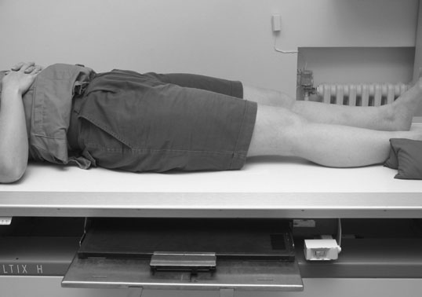
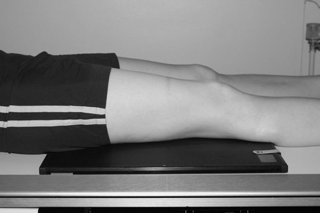
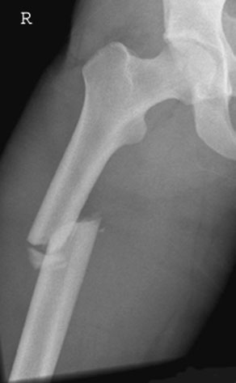
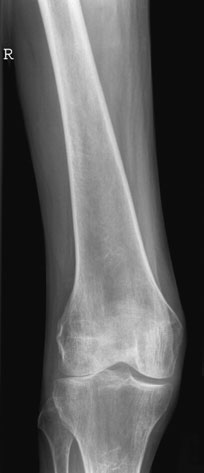

# Rx Diafiză Femurală Incidențe Standard de Bază

  📷 Radiografie Convențională (Rx)
  <strong>Actualizat:</strong> 2026-09-16
  <strong>Autor:</strong> Departamentul de Radiologie / Referință Clark (Ed. 12)

---

-   __1. Rezumat Clinic & Indicații__

    ---

    === "Indicații Clinice"

        - large casetă este plasat în masa de examinare Bucky astfel încât effects de scatter sunt reduced. However, trebuie să only imagine de distal aspect de Femur fie required, then use de Bucky poate fie eliminated în order la reduce pacient dose. Antero-posterior (AP)

    === "Ghid Național IRIS"

        !!! info "Referință Primară: Ghidul Național IRIS (Ordinul MS 1342/2012)"
            - **Capitol Ghid IRIS:** *Ghidul Național IRIS*
            - **Grad de Recomandare:** **De verificat pe indicație; fără grad atribuit automat**
            - **Nivel de Iradiere Estimată:** `De verificat pentru examinarea și populația selectate`

            [:octicons-search-16: Deschide Ghidul IRIS](../../iris.md){ .md-button .md-button--primary } [:material-open-in-new: Aplicația Oficială PWA](https://radiologie-pediatrica.ro/iris/){ .md-button target="_blank" rel="noopener" }
-   __2. Poziționare & Centrare Fascicul__

    ---

    - **Poziție Pacient:** • Pacientul este așezat în decubit dorsal pe masa radiologică, cu ambele membre inferioare extins.
• affected limb este rotit la centralize Rotulă (Patelă) over Femur.
• săculeți cu nisip sunt plasat below Genunchi la help maintain poziție.
• caseta este poziționat în tăvița Bucky immediately under limb, adjacent la posterior aspect de thigh la include ambele Șold și Genunchi articulații.
• Alternatively, caseta este poziționat directly under limb, pe / sprijinit de posterior aspect de thigh pentru include Genunchi.
    - **Punct de Centrare Fascicul:** • Centre la middle de caseta, cu raza centrală verticală centrală la 90 grade la imaginary line joining ambele femoral condyles.
    - **Distanță Focar-Film (DFF / SID):** 100 cm
    - **Comandă Respiratorie:** Apnee pe durata expunerii (apnee în inspir pentru torace; expir pentru Abdomen/bazin).

-   __3. Parametri Tehnici Expunere__

    ---

    | Parametru Tehnic | Valoare Configurare Generator / Tub |
    |:-----------------|:-------------------------------------|
    | **Tensiune Tub (kV)** | DE CONFIGURAT PE APARAT |
    | **Sarcină / Produs Curent-Timp (mAs)** | Conform AEC / grosime anatomică |
    | **Distanță Focar-Film (DFF / SID)** | 100 cm |
    | **Grilă Antidifuzoare (Bucky)** | Cu grilă antidifuzoare Bucky |
    | **Dimensiune Focar** | Focar Mic (0.6 mm) |
    | **Camere de Ionizare AEC** | Camerele laterale (sau camera centrală funcție de regiune) |
    | **Colimare Fascicul** | Colimare strictă la aria anatomică de interes diagnostic |
    | **Filtrare Tub** | Totală ≥ 2.5 mm Al echivalent (conform Clark: 3.0 mm Al eq.) |

-   __4. Criterii de Calitate & Reușită Imagine__

    ---

    - Vizualizarea clară întregii arii anatomice (Diafiză Femurală).
    - Absența artefactelor de mișcare; trabeculație osoasă și contururi nete.
    - Densitate optică și contrast adecvate pentru diferențierea țesuturilor moi de structurile osoase.

-   __5. Protecție Radiologică (ALARA)__

    ---

    - Ecranare gonadică cu șorț plumbat dacă gonadele sunt în apropierea fasciculului util (regula ALARA).
    - Colimare precisă la dimensiunea anatomică strict necesară pentru reducerea dozei și a radiației difuze.
    - Verificarea posibilității unei sarcini la pacientele de vârstă fertilă înainte de expunere.

!!! note "Observații Clinice & Tehnice"
    • în cases de suspected suspiciune de fractură, limb trebuie să nu fie rotit.
• If ambele articulații sunt nu included pe one film radiologic, then single anteroposterior incidență de articulație distal la suspiciune de fractură site trebuie să fie taken. This ensures that fără suspiciune de fractură este missed și allows assessment de orice rotație la suspiciune de fractură site.
• Remember that divergent fascicul will project Șold cranially și Genunchi caudally, și therefore care trebuie să fie taken when positioning caseta la ensure that articulație will fie pe top/bottom de film radiologic.
136 Antero-posterior (AP) radiografie de Femur, Șold down, evidențiind suspiciune de fractură de upper femoral shaft Antero-posterior (AP) radiografie de normal Femur, Genunchi up

### 🖼️ Imagini

<figure class="protocol-image-card" markdown>

<figcaption><strong>• în cases de suspected suspiciune de fractură, limb trebuie să nu fie rotit.</strong> — Poziționare pacient și centrare fascicul conform Clark (Ed. 12)</figcaption>

</figure>

<figure class="protocol-image-card" markdown>

<figcaption><strong>posterior incidență de articulație distal la suspiciune de fractură site trebuie să</strong> — Aspect radiografic / ghid de poziționare conform tratatului Clark (Ed. 12)</figcaption>

</figure>

<figure class="protocol-image-card" markdown>

<figcaption><strong>fie taken. This ensures that fără suspiciune de fractură este missed și allows</strong> — Aspect radiografic / ghid de poziționare conform tratatului Clark (Ed. 12)</figcaption>

</figure>

<figure class="protocol-image-card" markdown>

<figcaption><strong>assessment de orice rotație la suspiciune de fractură site.</strong> — Aspect radiografic / ghid de poziționare conform tratatului Clark (Ed. 12)</figcaption>

</figure>

=== "Ghid Rapid de Execuție"

    1. **Identificarea și verificarea pacientului:** verificare identitate, zonă de examinat, consimțământ conform procedurii și evaluarea posibilității unei sarcini, când este relevantă.
    2. **Pregătire:** îndepărtarea oricăror obiecte radiopace (bijuterii, agrafe, fermoare, proteze, pansamente dense).
    3. **Poziționare precisă:** alinierea receptorului de imagine și a tubului la distanța prescrisă (100 cm).
    4. **Colimare strictă:** adaptarea fasciculului strict la regiunea de diagnostic pentru scăderea iradierii și reducerea radiației difuze.
    5. **Radioprotecție:** verificarea [politicii RX](../radioprotectie.md), cu măsuri distincte pentru pacient, personal și însoțitor.

## Surse de documentare

- [Clark's Positioning in Radiography (Ed. 12), Pagina 151](../../assets/protocols/sources/Clark___Positioning_in_Radiography__12th_edition.pdf#page=151)
