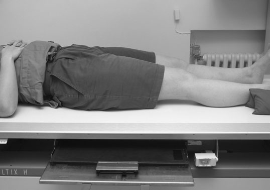
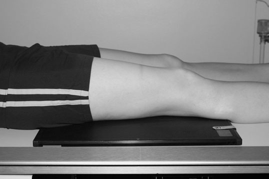
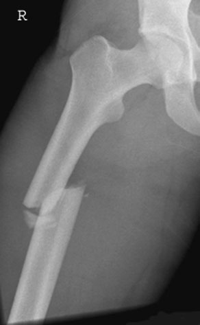
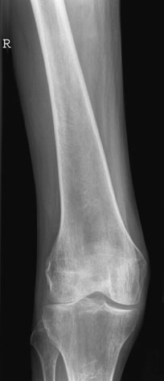

# Rx diafiză femurală — incidențe standard de bază

  📷 Radiografie Convențională (Rx)
  <strong>Actualizat:</strong> 2026-09-16
  <strong>Autor:</strong> Departamentul de Radiologie / Referință Clark (Ed. 12)

---

-   __1. Rezumat Clinic & Indicații__

    ---

    === "Indicații Clinice"

        - Caseta mare este plasată în masa de examinare Bucky, astfel încât efectele radiației împrăștiate să fie reduse. Totuși, dacă este necesară doar imagistica aspectului distal al femurului, utilizarea Bucky poate fi eliminată pentru a reduce doza pacientului. Antero-posterior (AP)

    === "Ghid Național IRIS"

        !!! info "Referință Primară: Ghidul Național IRIS (Ordinul MS 1342/2012)"
            - **Capitol Ghid IRIS:** *Aparat locomotor & Membru inferior*
            - **Grad de Recomandare:** **Grad A**
            - **Nivel de Iradiere Estimată:** `Clasa 1 (Minimă < 0.05 mSv)`

            [:octicons-search-16: Deschide Ghidul IRIS](../../iris.md){ .md-button .md-button--primary } [:material-open-in-new: Aplicația Oficială PWA](https://radiologie-pediatrica.ro/iris/){ .md-button target="_blank" rel="noopener" }

-   __2. Poziționare & Centrare Fascicul__

    ---

    - **Poziție Pacient:**
        - Pacientul este așezat în decubit dorsal pe masa radiologică, cu ambele membre inferioare extinse.
        - Membrul afectat este rotit pentru a centra rotula pe femur.
        - Săculeții cu nisip sunt plasați sub genunchi pentru a ajuta la menținerea poziției.
        - Caseta este poziționată în tăvița Bucky, imediat sub membru, adiacentă aspectului posterior al coapsei, pentru a include ambele articulații, șoldul și genunchiul.
        - Alternativ, caseta este poziționată direct sub membru, pe/sprijinită de aspectul posterior al coapsei, pentru a include genunchiul.
    - **Punct de Centrare Fascicul:** • Se centrează la mijlocul casetei, cu raza centrală verticală la 90 de grade față de linia imaginară care unește ambii condili femurali.
    - **Distanță Focar-Film (DFF / SID):** 100 cm
    - **Comandă Respiratorie:** Apnee pe durata expunerii (apnee în inspir pentru torace; expir pentru Abdomen/bazin).

-   __3. Parametri Tehnici Expunere__

    ---

    | Parametru Tehnic | Valoare Configurare Generator / Tub |
    |:-----------------|:-------------------------------------|
    | **Tensiune Tub (kV)** | DE CONFIGURAT PE APARAT |
    | **Sarcină / Produs Curent-Timp (mAs)** | Conform AEC / grosimii anatomice |
    | **Distanță Focar-Film (DFF / SID)** | 100 cm |
    | **Grilă Antidifuzoare (Bucky)** | Cu grilă antidifuzoare Bucky |
    | **Dimensiune Focar** | Focar Mic (0.6 mm) |
    | **Camere de Ionizare AEC** | Camerele laterale (sau camera centrală, în funcție de regiune) |
    | **Colimare Fascicul** | Colimare strictă la aria anatomică de interes diagnostic |
    | **Filtrare Tub** | Totală ≥ 2.5 mm Al echivalent (conform Clark: 3.0 mm Al echivalent) |

-   __4. Criterii de Calitate & Reușită Imagine__

    ---

    - Vizualizarea clară a întregii arii anatomice (diafiza femurală).
    - Absența artefactelor de mișcare; trabeculație osoasă și contururi nete.
    - Densitate optică și contrast adecvate pentru diferențierea țesuturilor moi de structurile osoase.

-   __5. Protecție Radiologică (ALARA)__

    ---

    - Ecranare gonadică cu șorț plumbat dacă gonadele sunt în apropierea fasciculului util (regula ALARA).
    - Colimare precisă la dimensiunea anatomică strict necesară pentru reducerea dozei și a radiației difuze.
    - Verificarea posibilității unei sarcini la pacientele de vârstă fertilă înainte de expunere.

!!! note "Observații Clinice & Tehnice"
    - În cazurile de suspiciune de fractură, membrul nu trebuie rotit.
    - Dacă ambele articulații nu sunt incluse pe o singură radiografie, atunci trebuie efectuată o singură incidență anteroposterioară a articulației distale față de locul suspect de fractură. Aceasta asigură că nu este omisă nicio fractură și permite evaluarea oricărei rotații la locul suspect de fractură.
    - Rețineți că fasciculul divergent va proiecta șoldul cranial și genunchiul caudal; prin urmare, trebuie avut grijă la poziționarea casetei pentru a asigura că articulația va fi în partea superioară/inferioară a radiografiei. 136 Radiografie antero-posterioară (AP) a femurului, șoldul în jos, evidențiind suspiciunea de fractură a diafizei femurale superioare Radiografie antero-posterioară (AP) a femurului normal, genunchiul în sus

### 🖼️ Imagini

<figure class="protocol-image-card" markdown>

<figcaption><strong>• În cazurile de suspiciune de fractură, membrul nu trebuie rotit.</strong> — Poziționarea pacientului și centrarea fasciculului conform Clark (Ed. 12)</figcaption>

</figure>

<figure class="protocol-image-card" markdown>

<figcaption><strong>Incidența de profil a articulației distale, la nivelul localizării fracturii suspectate, trebuie să</strong> — Aspect radiografic / ghid de poziționare conform tratatului Clark (Ed. 12)</figcaption>

</figure>

<figure class="protocol-image-card" markdown>

<figcaption><strong>fie efectuată. Astfel se asigură că nu este omisă nicio fractură suspectată și se permite</strong> — Aspect radiografic / ghid de poziționare conform tratatului Clark (Ed. 12)</figcaption>

</figure>

<figure class="protocol-image-card" markdown>

<figcaption><strong>evaluarea oricărei rotații la nivelul localizării fracturii suspectate.</strong> — Aspect radiografic / ghid de poziționare conform tratatului Clark (Ed. 12)</figcaption>

</figure>

=== "Ghid Rapid de Execuție"

    1. **Identificarea și verificarea pacientului:** verificare identitate, zonă de examinat, consimțământ conform procedurii și evaluarea posibilității unei sarcini, când este relevantă.
    2. **Pregătire:** îndepărtarea oricăror obiecte radiopace (bijuterii, agrafe, fermoare, proteze, pansamente dense).
    3. **Poziționare precisă:** alinierea receptorului de imagine și a tubului la distanța prescrisă (100 cm).
    4. **Colimare strictă:** adaptarea fasciculului strict la regiunea de diagnostic pentru scăderea iradierii și reducerea radiației difuze.
    5. **Radioprotecție:** verificarea [politicii RX](../radioprotectie.md), cu măsuri distincte pentru pacient, personal și însoțitor.

## Surse de documentare

- [Clark's Positioning in Radiography (Ed. 12), Pagina 151](https://books.google.com/books/about/Clark_s_Positioning_in_Radiography.html?id=Xxu6MwEACAAJ)
