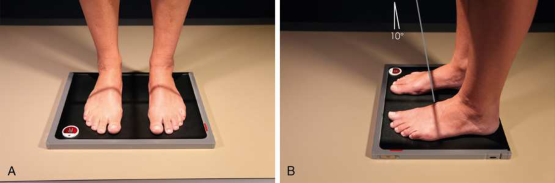

# Rx Feet — Incidență AP Axială — În Încărcare (Ortostatism) Method Standing (Merrill)

  📷 Radiografie Convențională (Rx)
  <strong>Actualizat:</strong> 2026-09-16
  <strong>Autor:</strong> Referință Merrill

---

-   __1. Rezumat Clinic & Indicații__

    ---

    === "Indicații Clinice"

        - Conform reperelor anatomice standard din tratat

    === "Ghid Național IRIS"

        !!! info "Referință Primară: Ghidul Național IRIS (Ordinul MS 1342/2012)"
            - **Capitol Ghid IRIS:** *Ghidul Național IRIS*
            - **Grad de Recomandare:** **De verificat pe indicație; fără grad atribuit automat**
            - **Nivel de Iradiere Estimată:** `De verificat pentru examinarea și populația selectate`

            [:octicons-search-16: Deschide Ghidul IRIS](../../iris.md){ .md-button .md-button--primary } [:material-open-in-new: Aplicația Oficială PWA](https://radiologie-pediatrica.ro/iris/){ .md-button target="_blank" rel="noopener" }
-   __2. Poziționare & Centrare Fascicul__

    ---

    - **Poziție Pacient:** se așază pacientul în ortostatism-ortostatism.; Place receptorul de imagine pe floor și Se instruiește pacientul să stand pe receptorul de imagine cu picioarele centrat pe fiecare side. Pull pacientul’s pant membre inferioare up la Genunchi level, if necessary. Ensure that drept și stâng markeri și în ortostatism marker sunt plasat pe receptorul de imagine. Ensure that pacientul’s weight este distributed equally pe fiecare Picior (Fig. 7.57). pacientul poate hold x-ray tube crane pentru stability. se efectuează ecranarea gonadelor cu șorț plumbat.
    - **Punct de Centrare Fascicul:** înclinat 10 grade spre heel este optim. minimum de 15 grade este usually necessary la have enough room la poziție tubul și allow pacientul la stand. raza centrală este poziționat între picioare și la nivelul base de third metatarsal.
    - **Distanță Focar-Film (DFF / SID):** 48 inches (122 cm). This SID is used to reduce magnification and improve spatial resolution in the image.
    - **Comandă Respiratorie:** Conform reperelor anatomice standard din tratat

-   __3. Parametri Tehnici Expunere__

    ---

    | Parametru Tehnic | Valoare Configurare Generator / Tub |
    |:-----------------|:-------------------------------------|
    | **Tensiune Tub (kV)** | DE CONFIGURAT PE APARAT |
    | **Sarcină / Produs Curent-Timp (mAs)** | DE CONFIGURAT PE APARAT |
    | **Distanță Focar-Film (DFF / SID)** | 48 inches (122 cm). This SID is used to reduce magnification and improve spatial resolution in the image. |
    | **Grilă Antidifuzoare (Bucky)** | DE CONFIGURAT PE APARAT |
    | **Dimensiune Focar** | DE CONFIGURAT PE APARAT |
    | **Camere de Ionizare AEC** | DE CONFIGURAT PE APARAT |
    | **Colimare Fascicul** | se ajustează câmp de iradiere la 1 inch (2.5 cm) pe toate sides și 1 inch (2.5 cm) beyond Calcaneu și distal tip de Degete Picior. Place marker de lateralitate (D/S) în collimated expunere field. |
    | **Filtrare Tub** | DE CONFIGURAT PE APARAT |

-   __4. Criterii de Calitate & Reușită Imagine__

    ---

    - Criterii radiologice de calitate imaginii:
    - Evidence de corect collimation și presence de marker de lateralitate (D/S) plasat clear de anatomy de interest
    - ambele picioare centrat pe one imagine
    - Anatomy de la Degete Picior la oase tarsiene; poate include portions de astragal (talus) și Calcaneu
    - Correct drept și stâng marker placement și În Încărcare (Ortostatism) marker
    - Bony detalii trabeculare osoase și surrounding soft tissues

-   __5. Protecție Radiologică (ALARA)__

    ---

    - Nespecificat în fragmentul extras; de verificat în sursă

!!! note "Observații Clinice & Tehnice"
    Conform reperelor anatomice standard din tratat

### 🖼️ Imagini

<figure class="protocol-image-card" markdown>

<figcaption><strong>Merrill — pagina PDF 493, imaginea 1</strong> — Imagine din fragmentul sursă; asocierea necesită revizie.</figcaption>

</figure>

=== "Ghid Rapid de Execuție"

    1. **Identificarea și verificarea pacientului:** verificare identitate, zonă de examinat, consimțământ conform procedurii și evaluarea posibilității unei sarcini, când este relevantă.
    2. **Pregătire:** îndepărtarea oricăror obiecte radiopace (bijuterii, agrafe, fermoare, proteze, pansamente dense).
    3. **Poziționare precisă:** alinierea receptorului de imagine și a tubului la distanța prescrisă (48 inches (122 cm). This SID is used to reduce magnification and improve spatial resolution in the image.).
    4. **Colimare strictă:** adaptarea fasciculului strict la regiunea de diagnostic pentru scăderea iradierii și reducerea radiației difuze.
    5. **Radioprotecție:** verificarea [politicii RX](../radioprotectie.md), cu măsuri distincte pentru pacient, personal și însoțitor.

## Surse de documentare

- [Merrill’s Atlas, 7. Lower Extremity, pagini PDF 492–493](../../assets/protocols/sources/a56d45c16829_Merrills_Atlas_of_Radiographic_Positioning__Procedures_3Vol_Set.pdf#page=492)

## Fragmente sursă traduse (referință tehnică)

### anatomy

weight-bearing AP axial incidență de ambele picioare, permitting precis evaluation și comparison de oase tarsiene și oase metatarsiene (Fig. 7.58).

### collimation

• se ajustează câmp de iradiere la 1 inch (2.5 cm) pe toate sides și 1 inch (2.5 cm) beyond calcaneu și distal tip de toes. Place side
marker în collimated expunere field.

### cr

• înclinat 10 grade spre heel este optim. minimum de 15 grade este usually necessary la have enough room la poziție tubul
și allow pacientul la stand. raza centrală este poziționat între picioare și la nivelul base de third metatarsal.

### criteria

Criterii radiologice de calitate imaginii:
• Evidence de corect collimation și presence de marker de lateralitate (D/S) plasat clear de anatomy de interest
• ambele picioare centrat pe one imagine
• Anatomy de la toes la oase tarsiene; poate include portions de astragal (talus) și calcaneu
• Correct drept și stâng marker placement și weight-bearing marker
• Bony detalii trabeculare osoase și surrounding soft tissues

### part_pos

• Place receptorul de imagine pe floor și Se instruiește pacientul să stand pe receptorul de imagine cu picioarele centrat pe fiecare side.
• Pull pacientul’s pant membre inferioare up la genunchi level, if necessary.
• Ensure that drept și stâng markeri și în ortostatism marker sunt plasat pe receptorul de imagine.
• Ensure that pacientul’s weight este distributed equally pe fiecare picior (Fig. 7.57).
• pacientul poate hold x-ray tube crane pentru stability.
• se efectuează ecranarea gonadelor cu șorț plumbat.

### patient_pos

• se așază pacientul în ortostatism-ortostatism.

### sid

48 inches (122 cm). This SID este used la reduce magnification și improve spatial resolution în imagine.

### tech

poziționat prin manufacturer sau department protocol pentru corect anatomy display orientation; raza centrală plate: 10 ×12 inches (24 × 30 cm) transversal.

