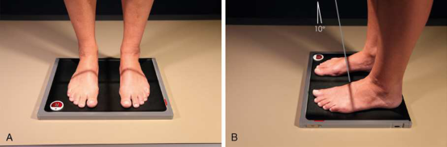

# Rx picioare — incidență AP axială — în încărcare (ortostatism) — metoda în ortostatism (Merrill)

  📷 Radiografie Convențională (Rx)
  <strong>Actualizat:</strong> 2026-09-16
  <strong>Autor:</strong> Referință Merrill

---

-   __1. Rezumat Clinic & Indicații__

    ---

    === "Indicații Clinice"

        - Conform reperelor anatomice standard din tratat

    === "Ghid Național IRIS"

        !!! info "Referință Primară: Ghidul Național IRIS (Ordinul MS 1342/2012)"
            - **Capitol Ghid IRIS:** *Aparat locomotor & Membru inferior*
            - **Grad de Recomandare:** **Grad A**
            - **Nivel de Iradiere Estimată:** `Clasa 1 (Minimă < 0.01 mSv)`

            [:octicons-search-16: Deschide Ghidul IRIS](../../iris.md){ .md-button .md-button--primary } [:material-open-in-new: Aplicația Oficială PWA](https://radiologie-pediatrica.ro/iris/){ .md-button target="_blank" rel="noopener" }

-   __2. Poziționare & Centrare Fascicul__

    ---

    - **Poziție Pacient:** Se așază pacientul în ortostatism. Se plasează receptorul de imagine pe podea și se instruiește pacientul să stea pe receptorul de imagine, cu picioarele centrate de fiecare parte. Se ridică pantalonii pacientului până la nivelul genunchilor, dacă este necesar. Se verifică plasarea markerilor drept și stâng și a markerului de ortostatism pe receptorul de imagine. Se verifică distribuirea egală a greutății pacientului pe fiecare picior (Fig. 7.57). Pacientul se poate ține de brațul macaralei tubului de raze X pentru stabilitate. Se efectuează ecranarea gonadelor cu șorț plumbat.
    - **Punct de Centrare Fascicul:** Înclinarea cu 10 grade spre călcâi este optimă. Este de obicei necesară o înclinare de minimum 15 grade pentru a avea suficient spațiu pentru poziționarea tubului și pentru a permite pacientului să stea în picioare. Raza centrală este poziționată între picioare și la nivelul bazei celui de-al treilea metatarsian.
    - **Distanță Focar-Film (DFF / SID):** 48 inci (122 cm). Această SID se utilizează pentru a reduce magnificarea și a îmbunătăți rezoluția spațială a imaginii.
    - **Comandă Respiratorie:** Conform reperelor anatomice standard din tratat

-   __3. Parametri Tehnici Expunere__

    ---

    | Parametru Tehnic | Valoare Configurare Generator / Tub |
    |:-----------------|:-------------------------------------|
    | **Tensiune Tub (kV)** | DE CONFIGURAT PE APARAT |
    | **Sarcină / Produs Curent-Timp (mAs)** | DE CONFIGURAT PE APARAT |
    | **Distanță Focar-Film (DFF / SID)** | 48 inci (122 cm). Această SID se utilizează pentru a reduce magnificarea și a îmbunătăți rezoluția spațială a imaginii. |
    | **Grilă Antidifuzoare (Bucky)** | DE CONFIGURAT PE APARAT |
    | **Dimensiune Focar** | DE CONFIGURAT PE APARAT |
    | **Camere de Ionizare AEC** | DE CONFIGURAT PE APARAT |
    | **Colimare Fascicul** | Se ajustează câmpul de iradiere la 1 țol (2.5 cm) pe toate laturile și la 1 țol (2.5 cm) dincolo de calcaneu și de vârful distal al degetelor piciorului. Se plasează markerul de lateralitate (D/S) în câmpul de expunere colimat. |
    | **Filtrare Tub** | DE CONFIGURAT PE APARAT |

-   __4. Criterii de Calitate & Reușită Imagine__

    ---

    - Criterii radiologice de calitate a imaginii:
    - Evidențierea colimării corecte și prezența markerului de lateralitate (D/S), plasat fără a se suprapune peste anatomia de interes
    - Ambele picioare centrate pe o singură imagine
    - Anatomia de la degetele piciorului până la oasele tarsiene; poate include porțiuni ale astragalului (talusului) și calcaneului
    - Plasarea corectă a markerilor drept și stâng și a markerului de încărcare
    - Detalii trabeculare osoase și țesuturile moi înconjurătoare

-   __5. Protecție Radiologică (ALARA)__

    ---

    - Nespecificat în fragmentul extras; de verificat în sursă

!!! note "Observații Clinice & Tehnice"
    Conform reperelor anatomice standard din tratat

### 🖼️ Imagini

<figure class="protocol-image-card" markdown>

<figcaption><strong>Merrill — pagina 493, imaginea 1</strong> — Imagine din fragmentul sursă; asocierea necesită revizie.</figcaption>

</figure>

=== "Ghid Rapid de Execuție"

    1. **Identificarea și verificarea pacientului:** verificare identitate, zonă de examinat, consimțământ conform procedurii și evaluarea posibilității unei sarcini, când este relevantă.
    2. **Pregătire:** îndepărtarea oricăror obiecte radiopace (bijuterii, agrafe, fermoare, proteze, pansamente dense).
    3. **Poziționare precisă:** alinierea receptorului de imagine și a tubului la distanța prescrisă (48 inci (122 cm). Această SID se utilizează pentru a reduce magnificarea și a îmbunătăți rezoluția spațială a imaginii.).
    4. **Colimare strictă:** adaptarea fasciculului strict la regiunea de diagnostic pentru scăderea iradierii și reducerea radiației difuze.
    5. **Radioprotecție:** verificarea [politicii RX](../radioprotectie.md), cu măsuri distincte pentru pacient, personal și însoțitor.

## Surse de documentare

- [Merrill’s Atlas, 7. Lower Extremity, pagini 492–493](https://books.google.com/books/about/Merrill_s_Atlas_of_Radiographic_Position.html?id=BM0lEQAAQBAJ)
