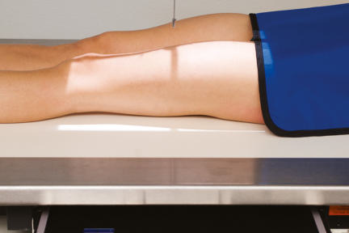
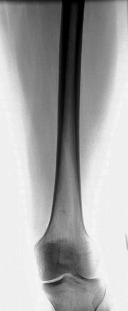

# Rx Femur AP (Antero-Posterior) (MID AND DISTAL)

  📷 Radiografie Convențională (Rx)
  <strong>Actualizat:</strong> 2026-09-15
  <strong>Autor:</strong> Departamentul de Radiologie / Referință Bontrager

---

-   __1. Rezumat Clinic & Indicații__

    ---

    === "Indicații Clinice"

        - Mid and distal Femur, including Genunchi joint, for detection and evaluation of suspiciune de fractură and/or bone lesions

    === "Ghid Național IRIS"

        !!! info "Referință Primară: Ghidul Național IRIS (Ordinul MS 1342/2012)"
            - **Capitol Ghid IRIS:** *Ghidul Național IRIS*
            - **Grad de Recomandare:** **De verificat pe indicație; fără grad atribuit automat**
            - **Nivel de Iradiere Estimată:** `De verificat pentru examinarea și populația selectate`

            [:octicons-search-16: Deschide Ghidul IRIS](../../iris.md){ .md-button .md-button--primary } [:material-open-in-new: Aplicația Oficială PWA](https://radiologie-pediatrica.ro/iris/){ .md-button target="_blank" rel="noopener" }
-   __2. Poziționare & Centrare Fascicul__

    ---

    - **Poziție Pacient:** Pacient: Place patient in the Decubit Dorsal position, with Femur centered to midline of table; give pillow for head. (This projection also may be done on a stretcher with a portable grid placed under the Femur.); Regiune anatomică: Align Femur to CR and midline of table or IR. Rotate leg internally approximately 5 degrees for a true AP, as for an AP Genunchi. (For proximal Femur, 15 to 20 degrees internal leg rotation is required, as for an AP Șold.) Ensure that Genunchi joint is included on IR, considering the divergence of the xray beam (Fig. 7.36). (Lower IR margin should be approximately 2 inches [5 cm] below Genunchi joint.)
    - **Punct de Centrare Fascicul:** is perpendicular to Femur and IR. Direct CR to midpoint of iR.
    - **Distanță Focar-Film (DFF / SID):** 100 cm
    - **Comandă Respiratorie:** Apnee pe durata expunerii (sau conform cooperării pacientului)

-   __3. Parametri Tehnici Expunere__

    ---

    | Parametru Tehnic | Valoare Configurare Generator / Tub |
    |:-----------------|:-------------------------------------|
    | **Tensiune Tub (kV)** | 75-85 kV |
    | **Sarcină / Produs Curent-Timp (mAs)** | DE CONFIGURAT PE APARAT |
    | **Distanță Focar-Film (DFF / SID)** | 100 cm |
    | **Grilă Antidifuzoare (Bucky)** | Cu grilă antidifuzoare Bucky |
    | **Dimensiune Focar** | Focar Mic (0.6 mm) |
    | **Camere de Ionizare AEC** | Camerele laterale (sau camera centrală funcție de regiune) |
    | **Colimare Fascicul** | Collimate on four sides to anatomy of interest. Including Both Joints Common departmental routines include both joints on all initial Femur exams. For a large adult, a second smaller IR then should be used for an AP of the Genunchi or Șold, ensuring that both Șold and Genunchi joints are included. If the Șold is included, the leg should be rotated 15° to 20° internally to place the femoral neck in profile. Femur—Mid and Distal ROUTINE AP Lateral Fig. 7.36 AP—mid and distal Femur (head at cathode end). |
    | **Filtrare Tub** | Totală ≥ 2.5 mm Al echivalent |

-   __4. Criterii de Calitate & Reușită Imagine__

    ---

    - Distal twothirds of distal Femur, including Genunchi joint, is shown.
    - Genunchi joint space will not appear fully open because of divergent xray beam (Fig. 7.37). Position:
    - Absența rotației anatomice: clavicule echidistante față de linia apofizelor spinoase is evidenced; femoral and tibial condyles should appear symmetric in size and shape with the outline of Rotulă (Patelă) slightly toward medial side of Femur.
    - The approximate medial half of fibular head should be superimposed by tibia. Femur should be centered to collimation field size field and aligned with long axis of IR with Genunchi joint space a minimum of 1 inch (2.5 cm) from distal IR margin.
    - Collimation field size to area of interest. Exposure:
    - Optimal exposure with correct use of anode heel effect or use of compensating filter will result in near uniformity
    - Optimal image receptor exposure and contrast of the entire Femur.
    - no motion should occur; fine trabecular markings should be clear and sharp throughout length of Femur. 35 43 L L Fig. 7.37 AP—mid and distal Femur.

-   __5. Protecție Radiologică (ALARA)__

    ---

    - Ecranare gonadică și a organelor radiosensibile conform procedurilor locale de radioprotecție ALARA.
    - Colimare strictă la aria de interes pentru limitarea radiației difuze.
    - Verificarea posibilității unei sarcini la pacientele de vârstă fertilă înainte de expunere.

!!! note "Observații Clinice & Tehnice"
    If the site of interest is in the area of the proximal Femur, a unilateral Șold routine or Bazin (Pelvis) is recommended, as described in this chapter.

### 🖼️ Imagini

<figure class="protocol-image-card" markdown>

<figcaption><strong>Fig. 7.36 AP—mid and distal Femur (head at cathode end).</strong> — Poziționare pacient conform Ghidului Bontrager (Fig. 7.36 AP—mid and distal femur (head at cathode end).)</figcaption>

</figure>

<figure class="protocol-image-card" markdown>

<figcaption><strong>Fig. 7.37 AP—mid and distal Femur.</strong> — Aspect radiografic de referință conform Ghidului Bontrager (Fig. 7.37 AP—mid and distal femur.)</figcaption>

</figure>

=== "Ghid Rapid de Execuție"

    1. **Identificarea și verificarea pacientului:** verificare identitate, zonă de examinat, consimțământ conform procedurii și evaluarea posibilității unei sarcini, când este relevantă.
    2. **Pregătire:** îndepărtarea oricăror obiecte radiopace (bijuterii, agrafe, fermoare, proteze, pansamente dense).
    3. **Poziționare precisă:** alinierea receptorului de imagine și a tubului la distanța prescrisă (100 cm).
    4. **Colimare strictă:** adaptarea fasciculului strict la regiunea de diagnostic pentru scăderea iradierii și reducerea radiației difuze.
    5. **Radioprotecție:** verificarea [politicii RX](../radioprotectie.md), cu măsuri distincte pentru pacient, personal și însoțitor.

## Surse de documentare

- [Bontrager's Textbook of Radiographic Positioning (Ed. 9/10), Pagina 294](https://www.elsevier.com/books/textbook-of-radiographic-positioning-and-related-anatomy/lampignano/978-0-323-65367-1)
