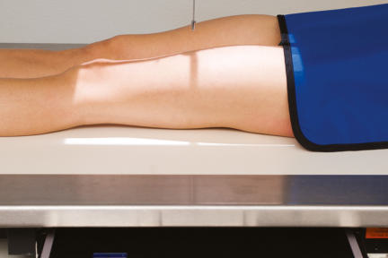
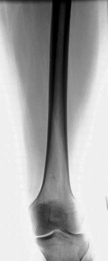

# Rx femur AP (anteroposterior) (MIJLOCIU ȘI DISTAL)

  📷 Radiografie Convențională (Rx)
  <strong>Actualizat:</strong> 2026-09-15
  <strong>Autor:</strong> Departamentul de Radiologie / Referință Bontrager

---

-   __1. Rezumat Clinic & Indicații__

    ---

    === "Indicații Clinice"

        - Treimea mijlocie și distală a femurului, inclusiv articulația genunchiului, pentru detectarea și evaluarea suspiciunii de fractură și/sau a leziunilor osoase

    === "Ghid Național IRIS"

        !!! info "Referință Primară: Ghidul Național IRIS (Ordinul MS 1342/2012)"
            - **Capitol Ghid IRIS:** *Aparat locomotor & Membru inferior*
            - **Grad de Recomandare:** **Grad A**
            - **Nivel de Iradiere Estimată:** `Clasa 1 (Minimă < 0.05 mSv)`

            [:octicons-search-16: Deschide Ghidul IRIS](../../iris.md){ .md-button .md-button--primary } [:material-open-in-new: Aplicația Oficială PWA](https://radiologie-pediatrica.ro/iris/){ .md-button target="_blank" rel="noopener" }

-   __2. Poziționare & Centrare Fascicul__

    ---

    - **Poziție Pacient:** Pacient: Așezați pacientul în decubit dorsal, cu femurul centrat pe linia mediană a mesei; puneți o pernă sub cap. (Această incidență poate fi efectuată și pe targă, cu o grilă mobilă plasată sub femur.); Regiune anatomică: Aliniați femurul cu raza centrală și cu linia mediană a mesei sau a receptorului de imagine. Rotiți membrul inferior intern cu aproximativ 5 grade pentru o incidență AP adevărată, ca pentru genunchiul AP. (Pentru femurul proximal, este necesară o rotație internă a membrului inferior de 15 la 20 de grade, ca pentru șoldul AP.) Asigurați includerea articulației genunchiului pe receptorul de imagine, ținând cont de divergența fasciculului de raze X (Fig. 7.36). (Marginea inferioară a receptorului de imagine trebuie să fie la aproximativ 2 țoli [5 cm] sub articulația genunchiului.)
    - **Punct de Centrare Fascicul:** Este perpendiculară pe femur și pe receptorul de imagine. Raza centrală se orientează spre mijlocul receptorului de imagine.
    - **Distanță Focar-Film (DFF / SID):** 100 cm
    - **Comandă Respiratorie:** Apnee pe durata expunerii (sau conform cooperării pacientului)

-   __3. Parametri Tehnici Expunere__

    ---

    | Parametru Tehnic | Valoare Configurare Generator / Tub |
    |:-----------------|:-------------------------------------|
    | **Tensiune Tub (kV)** | 75-85 kV |
    | **Sarcină / Produs Curent-Timp (mAs)** | DE CONFIGURAT PE APARAT |
    | **Distanță Focar-Film (DFF / SID)** | 100 cm |
    | **Grilă Antidifuzoare (Bucky)** | Cu grilă antidifuzoare Bucky |
    | **Dimensiune Focar** | Focar Mic (0.6 mm) |
    | **Camere de Ionizare AEC** | Camerele laterale (sau camera centrală, în funcție de regiune) |
    | **Colimare Fascicul** | Colimați pe cele patru laturi până la nivelul anatomiei de interes. Includerea ambelor articulații: protocoalele departamentale de rutină includ ambele articulații la toate examinările inițiale ale femurului. Pentru adultul de talie mare, trebuie utilizat apoi un al doilea receptor de imagine, mai mic, pentru AP de genunchi sau șold, asigurând includerea atât a articulației șoldului, cât și a genunchiului. Dacă este inclus șoldul, membrul inferior trebuie rotit intern cu 15° la 20° pentru a plasa colul femural în profil. Femur — mijlociu și distal, de rutină, AP, profil. Fig. 7.36 AP — femurul mijlociu și distal (capul la extremitatea catodică). |
    | **Filtrare Tub** | Totală ≥ 2.5 mm Al echivalent |

-   __4. Criterii de Calitate & Reușită Imagine__

    ---

    - Sunt vizualizate cele două treimi distale ale femurului distal, inclusiv articulația genunchiului.
    - Spațiile articulare ale genunchiului nu vor apărea complet deschise din cauza fasciculului divergent de raze X (Fig. 7.37). Poziție:
    - Absența rotației anatomice: claviculele echidistante față de linia apofizelor spinoase sunt evidențiate; condilii femurali și tibiali trebuie să apară simetric ca dimensiune și formă, cu conturul rotulei ușor spre partea medială a femurului.
    - Aproximativ jumătatea medială a capului peronier (fibular) trebuie să fie suprapusă peste tibie. Femurul trebuie să fie centrat în câmpul de colimare și aliniat cu axa longitudinală a receptorului de imagine, cu spațiul articular al genunchiului la minimum 1 țol (2.5 cm) de marginea distală a receptorului de imagine.
    - Dimensiunea câmpului de colimare până la aria de interes diagnostic. Expunere:
    - Expunerea optimă, cu utilizarea corectă a efectului anodo-călcâi sau a unui filtru compensator, va avea ca rezultat o uniformitate aproape
    - optimă a expunerii receptorului de imagine și a contrastului întregului femur.
    - Nu trebuie să apară mișcare; desenul trabecular fin trebuie să fie clar și net pe întreaga lungime a femurului. 35 43 L L Fig. 7.37 AP — femurul mijlociu și distal.

-   __5. Protecție Radiologică (ALARA)__

    ---

    - Ecranare gonadică și a organelor radiosensibile conform procedurilor locale de radioprotecție ALARA.
    - Colimare strictă la aria de interes pentru limitarea radiației difuze.
    - Verificarea posibilității unei sarcini la pacientele de vârstă fertilă înainte de expunere.

!!! note "Observații Clinice & Tehnice"
    Dacă locul de interes se află în regiunea femurului proximal, se recomandă o examinare de rutină unilaterală a șoldului sau a bazinului (pelvisului), conform descrierii din acest capitol.

### 🖼️ Imagini

<figure class="protocol-image-card" markdown>

<figcaption><strong>Fig. 7.36 AP — femurul mijlociu și distal (capul la extremitatea catodică).</strong> — Poziționarea pacientului conform Ghidului Bontrager (Fig. 7.36 AP — femurul mijlociu și distal (capul la extremitatea catodică)).</figcaption>

</figure>

<figure class="protocol-image-card" markdown>

<figcaption><strong>Fig. 7.37 AP — femurul mijlociu și distal.</strong> — Aspect radiografic de referință conform Ghidului Bontrager (Fig. 7.37 AP — femurul mijlociu și distal).</figcaption>

</figure>

=== "Ghid Rapid de Execuție"

    1. **Identificarea și verificarea pacientului:** verificare identitate, zonă de examinat, consimțământ conform procedurii și evaluarea posibilității unei sarcini, când este relevantă.
    2. **Pregătire:** îndepărtarea oricăror obiecte radiopace (bijuterii, agrafe, fermoare, proteze, pansamente dense).
    3. **Poziționare precisă:** alinierea receptorului de imagine și a tubului la distanța prescrisă (100 cm).
    4. **Colimare strictă:** adaptarea fasciculului strict la regiunea de diagnostic pentru scăderea iradierii și reducerea radiației difuze.
    5. **Radioprotecție:** verificarea [politicii RX](../radioprotectie.md), cu măsuri distincte pentru pacient, personal și însoțitor.

## Surse de documentare

- [Bontrager's Textbook of Radiographic Positioning (Ed. 9/10), Pagina 294](https://www.elsevier.com/books/textbook-of-radiographic-positioning-and-related-anatomy/lampignano/978-0-323-65367-1)
