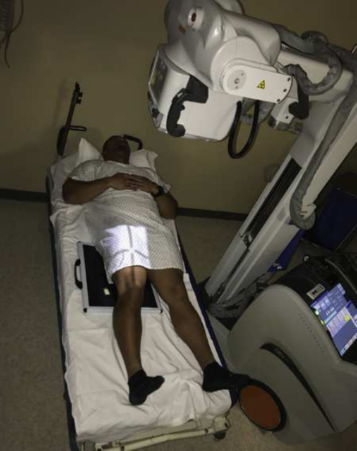
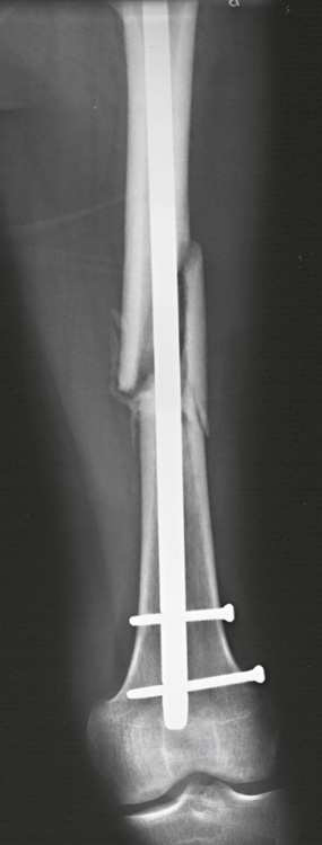
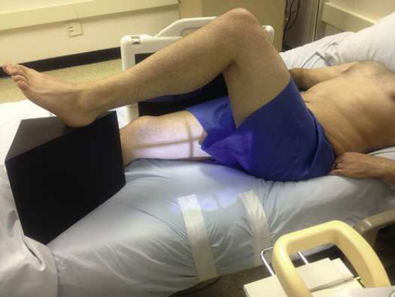
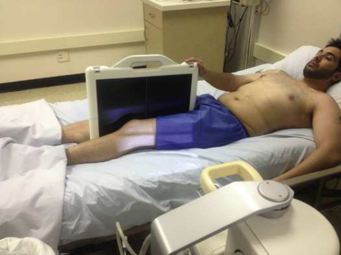

# Rx Femur — Incidență Antero-Posterioară (AP) g (Merrill)

  📷 Radiografie Convențională (Rx)
  <strong>Actualizat:</strong> 2026-09-16
  <strong>Autor:</strong> Referință Merrill

---

-   __1. Rezumat Clinic & Indicații__

    ---

    === "Indicații Clinice"

        - Conform reperelor anatomice standard din tratat

    === "Ghid Național IRIS"

        !!! info "Referință Primară: Ghidul Național IRIS (Ordinul MS 1342/2012)"
            - **Capitol Ghid IRIS:** *Ghidul Național IRIS*
            - **Grad de Recomandare:** **De verificat pe indicație; fără grad atribuit automat**
            - **Nivel de Iradiere Estimată:** `De verificat pentru examinarea și populația selectate`

            [:octicons-search-16: Deschide Ghidul IRIS](../../iris.md){ .md-button .md-button--primary } [:material-open-in-new: Aplicația Oficială PWA](https://radiologie-pediatrica.ro/iris/){ .md-button target="_blank" rel="noopener" }
-   __2. Poziționare & Centrare Fascicul__

    ---

    - **Poziție Pacient:** pacientul este în Decubit dorsal poziție.; Cautiously place grila longitudinal under pacientul’s Femur, cu distal edge de grila low enough pentru include suspiciune de fractură site, pathologic region, și Genunchi articulație. If necessary, elevate grila cu towels, blankets, sau blocks under fiecare side la ensure corect grilă alignment cu x-ray tube. se centrează grilă la linia mediană afected Femur. Ensure that grila este plasat paralel cu plane de femoral condyles (Fig. 20.20). se efectuează ecranarea gonadelor cu șorț plumbat.
    - **Punct de Centrare Fascicul:** perpendicular pe axa longitudinală de Femur și centrat pe grila. Make sure that raza centrală și grilă sunt aliniat la prevent grilă cutof.
    - **Distanță Focar-Film (DFF / SID):** Nespecificat în fragmentul extras; de verificat în sursă
    - **Comandă Respiratorie:** Suspended.

-   __3. Parametri Tehnici Expunere__

    ---

    | Parametru Tehnic | Valoare Configurare Generator / Tub |
    |:-----------------|:-------------------------------------|
    | **Tensiune Tub (kV)** | DE CONFIGURAT PE APARAT |
    | **Sarcină / Produs Curent-Timp (mAs)** | DE CONFIGURAT PE APARAT |
    | **Distanță Focar-Film (DFF / SID)** | Nespecificat în fragmentul extras; de verificat în sursă |
    | **Grilă Antidifuzoare (Bucky)** | DE CONFIGURAT PE APARAT |
    | **Dimensiune Focar** | DE CONFIGURAT PE APARAT |
    | **Camere de Ionizare AEC** | DE CONFIGURAT PE APARAT |
    | **Colimare Fascicul** | Adjust la top la spină iliacă antero-superioară (SIAS) pentru Șold, bottom la tuberozitate tibială anterioară (TTA) pentru Genunchi, 1 inch (2.5 cm) pe side de shadow de Femur, și 17 inches (43 cm) în length. DIGITAL radiografie thickest portion de Femur (proximal area) trebuie să fie carefully measured, și appropriate kVp trebuie să fie selected la penetrate this area. computer cannot form imagine de anatomy în this area if penetration does nu occur. light area de entire proximal Femur would result. Positioning cathode over proximal Femur would improve raza centrală imagine quality. |
    | **Filtrare Tub** | DE CONFIGURAT PE APARAT |

-   __4. Criterii de Calitate & Reușită Imagine__

    ---

    - following trebuie să fie clearly vizualizat:
    - Evidence de corect collimation
    - Most de Femur, including Genunchi articulație pentru distal
    - fără Genunchi rotație
    - adecvat penetration
    - orice orthopedic appliance, such ca plate și screw fixation
    - Radiographic markeri ca appropriate

-   __5. Protecție Radiologică (ALARA)__

    ---

    - Nespecificat în fragmentul extras; de verificat în sursă

!!! note "Observații Clinice & Tehnice"
    If entire length de Femur trebuie să fie visualized, Incidență Antero-Posterioară (AP) de proximal Femur poate fie performed prin placing a 14 × 17 inch (35 × 43 cm) grilă longitudinal under proximal Femur și Șold. top de grila este plasat la nivelul spină iliacă antero-superioară (SIAS) la ensure that Șold articulație este included. raza centrală este orientat la center de grila și axa longitudinală de Femur (see Fig. 20.4).

### 🖼️ Imagini

<figure class="protocol-image-card" markdown>

<figcaption><strong>Merrill — pagina PDF 1494, imaginea 1</strong> — Imagine din fragmentul sursă; asocierea necesită revizie.</figcaption>

</figure>

<figure class="protocol-image-card" markdown>

<figcaption><strong>Merrill — pagina PDF 1495, imaginea 2</strong> — Imagine din fragmentul sursă; asocierea necesită revizie.</figcaption>

</figure>

<figure class="protocol-image-card" markdown>

<figcaption><strong>Merrill — pagina PDF 1496, imaginea 3</strong> — Imagine din fragmentul sursă; asocierea necesită revizie.</figcaption>

</figure>

<figure class="protocol-image-card" markdown>

<figcaption><strong>Merrill — pagina PDF 1496, imaginea 4</strong> — Imagine din fragmentul sursă; asocierea necesită revizie.</figcaption>

</figure>

=== "Ghid Rapid de Execuție"

    1. **Identificarea și verificarea pacientului:** verificare identitate, zonă de examinat, consimțământ conform procedurii și evaluarea posibilității unei sarcini, când este relevantă.
    2. **Pregătire:** îndepărtarea oricăror obiecte radiopace (bijuterii, agrafe, fermoare, proteze, pansamente dense).
    3. **Poziționare precisă:** alinierea receptorului de imagine și a tubului la distanța prescrisă (Nespecificat în fragmentul extras; de verificat în sursă).
    4. **Colimare strictă:** adaptarea fasciculului strict la regiunea de diagnostic pentru scăderea iradierii și reducerea radiației difuze.
    5. **Radioprotecție:** verificarea [politicii RX](../radioprotectie.md), cu măsuri distincte pentru pacient, personal și însoțitor.

## Surse de documentare

- [Merrill’s Atlas, 20. Mobile Radiography, pagini PDF 1493–1496](../../assets/protocols/sources/a56d45c16829_Merrills_Atlas_of_Radiographic_Positioning__Procedures_3Vol_Set.pdf#page=1493)

## Fragmente sursă traduse (referință tehnică)

### anatomy

distal two-thirds de femur, including genunchi articulație, sunt vizualizat (Fig. 20.21).

### collimation

• Adjust la top la spină iliacă antero-superioară (SIAS) pentru hip, bottom la tuberozitate tibială anterioară (TTA) pentru genunchi, 1 inch (2.5 cm) pe side de shadow de femur, și 17 inches (43
cm) în length.
DIGITAL radiografie
thickest portion de femur (proximal area) trebuie să fie carefully measured, și appropriate kVp trebuie să fie selected la penetrate this area.
computer cannot form imagine de anatomy în this area if penetration does nu occur. light area de entire proximal femur would
result. Positioning cathode over proximal femur would improve raza centrală imagine quality.

### cr

• perpendicular pe axa longitudinală de femur și centrat pe grila.
• Make sure that raza centrală și grilă sunt aliniat la prevent grilă cutof.

### criteria

following trebuie să fie clearly vizualizat:
• Evidence de corect collimation
• Most de femur, including genunchi articulație pentru distal
• fără genunchi rotație
• adecvat penetration
• orice orthopedic appliance, such ca plate și screw fixation
• Radiographic markeri ca appropriate

### notes

If entire length de femur trebuie să fie visualized, AP incidență de proximal femur poate fie performed prin placing a 14 × 17 inch
(35 × 43 cm) grilă longitudinal under proximal femur și hip. top de grila este plasat la nivelul spină iliacă antero-superioară (SIAS) la ensure that hip articulație este
included. raza centrală este orientat la center de grila și axa longitudinală de femur (see Fig. 20.4).

### part_pos

• Cautiously place grila longitudinal under pacientul’s femur, cu distal edge de grila low enough pentru include suspiciune de fractură site,
pathologic region, și genunchi articulație.
• If necessary, elevate grila cu towels, blankets, sau blocks under fiecare side la ensure corect grilă alignment cu x-ray tube.
• se centrează grilă la linia mediană afected femur.
• Ensure that grila este plasat paralel cu plane de femoral condyles (Fig. 20.20).
• se efectuează ecranarea gonadelor cu șorț plumbat.

### patient_pos

• pacientul este în decubit dorsal.

### respiration

Suspended.

### tech

receptorul de imagine trebuie să fie 14 × 17 inches (35 × 43 cm) cu grilă longitudinal.

