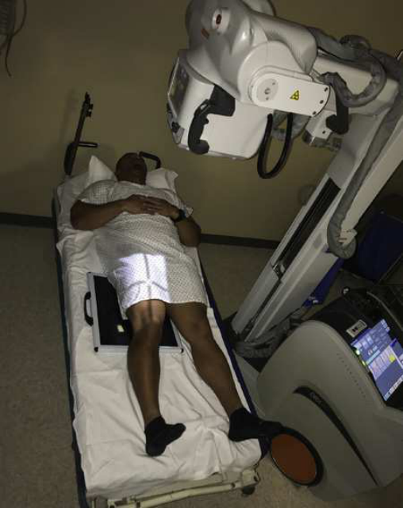
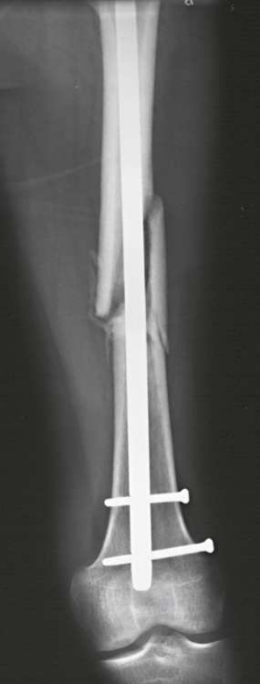
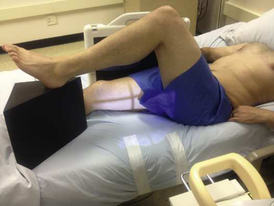
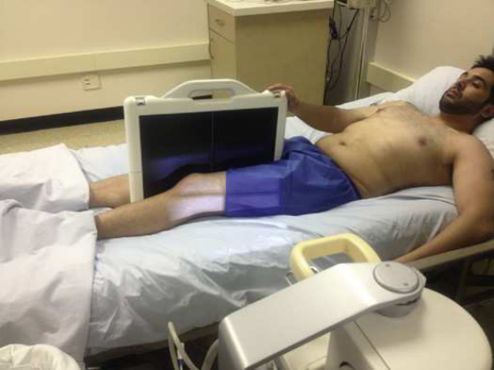

# Rx femur — Incidență antero-posterioară (AP) g (Merrill)

  📷 Radiografie Convențională (Rx)
  <strong>Actualizat:</strong> 2026-09-16
  <strong>Autor:</strong> Referință Merrill

---

-   __1. Rezumat Clinic & Indicații__

    ---

    === "Indicații Clinice"

        - Conform reperelor anatomice standard din tratat

    === "Ghid Național IRIS"

        !!! info "Referință Primară: Ghidul Național IRIS (Ordinul MS 1342/2012)"
            - **Capitol Ghid IRIS:** *Aparat locomotor & Membru inferior*
            - **Grad de Recomandare:** **Grad A**
            - **Nivel de Iradiere Estimată:** `Clasa 1 (Minimă < 0.05 mSv)`

            [:octicons-search-16: Deschide Ghidul IRIS](../../iris.md){ .md-button .md-button--primary } [:material-open-in-new: Aplicația Oficială PWA](https://radiologie-pediatrica.ro/iris/){ .md-button target="_blank" rel="noopener" }

-   __2. Poziționare & Centrare Fascicul__

    ---

    - **Poziție Pacient:** Pacientul este în decubit dorsal. Plasați cu grijă grila longitudinal sub femurul pacientului, cu marginea distală a grilei suficient de jos pentru a include locul fracturii suspectate, regiunea patologică și articulația genunchiului. Dacă este necesar, ridicați grila cu prosoape, pături sau blocuri sub fiecare parte pentru a asigura alinierea corectă a grilei cu tubul de raze X. Centrați grila pe linia mediană a femurului afectat. Asigurați-vă că grila este plasată paralel cu planul condililor femurali (Fig. 20.20). Efectuați ecranarea gonadelor cu șorț plumbat.
    - **Punct de Centrare Fascicul:** perpendicular pe axa longitudinală a femurului și centrat pe grilă. Asigurați-vă că raza centrală și grila sunt aliniate pentru a preveni tăierea grilei.
    - **Distanță Focar-Film (DFF / SID):** Nespecificat în fragmentul extras; de verificat în sursă
    - **Comandă Respiratorie:** Suspendat.

-   __3. Parametri Tehnici Expunere__

    ---

    | Parametru Tehnic | Valoare Configurare Generator / Tub |
    |:-----------------|:-------------------------------------|
    | **Tensiune Tub (kV)** | DE CONFIGURAT PE APARAT |
    | **Sarcină / Produs Curent-Timp (mAs)** | DE CONFIGURAT PE APARAT |
    | **Distanță Focar-Film (DFF / SID)** | Nespecificat în fragmentul extras; de verificat în sursă |
    | **Grilă Antidifuzoare (Bucky)** | DE CONFIGURAT PE APARAT |
    | **Dimensiune Focar** | DE CONFIGURAT PE APARAT |
    | **Camere de Ionizare AEC** | DE CONFIGURAT PE APARAT |
    | **Colimare Fascicul** | Ajustați partea superioară la spina iliacă antero-superioară (SIAS) pentru șold, partea inferioară la tuberozitatea tibială anterioară (TTA) pentru genunchi, 1 țol (2.5 cm) de fiecare parte a umbrei femurului și 17 țoli (43 cm) în lungime. RADIOGRAFIE DIGITALĂ. Cea mai groasă porțiune a femurului (regiunea proximală) trebuie măsurată cu atenție, iar kVp adecvat trebuie selectat pentru a penetra această zonă. Computerul nu poate forma imaginea anatomiei din această zonă dacă penetrarea nu are loc. Ar rezulta o zonă albă a întregului femur proximal. Poziționarea catodului deasupra femurului proximal ar îmbunătăți calitatea imaginii razei centrale. |
    | **Filtrare Tub** | DE CONFIGURAT PE APARAT |

-   __4. Criterii de Calitate & Reușită Imagine__

    ---

    - Următoarele trebuie să fie clar vizualizate:
    - Dovada unei colimări corecte
    - Cea mai mare parte a femurului, inclusiv articulația genunchiului distal
    - fără rotația genunchiului
    - penetrabilitate adecvată
    - orice dispozitiv ortopedic, precum placa și șuruburile de fixare
    - markeri radiografici, după caz

-   __5. Protecție Radiologică (ALARA)__

    ---

    - Nespecificat în fragmentul extras; de verificat în sursă

!!! note "Observații Clinice & Tehnice"
    Dacă trebuie vizualizată întreaga lungime a femurului, incidența AP a femurului proximal poate fi efectuată prin plasarea unei grile longitudinale de 14 × 17 țol (35 × 43 cm) sub femurul proximal și șold. Partea superioară a grilei este plasată la nivelul spinei iliace antero-superioare (SIAS) pentru a asigura includerea articulației șoldului. Raza centrală este orientată spre centrul grilei și axa longitudinală a femurului (vezi Fig. 20.4).

### 🖼️ Imagini

<figure class="protocol-image-card" markdown>

<figcaption><strong>Merrill — pagina 1494, imaginea 1</strong> — Imagine din fragmentul sursă; asocierea necesită revizie.</figcaption>

</figure>

<figure class="protocol-image-card" markdown>

<figcaption><strong>Merrill — pagina 1495, imaginea 2</strong> — Imagine din fragmentul sursă; asocierea necesită revizie.</figcaption>

</figure>

<figure class="protocol-image-card" markdown>

<figcaption><strong>Merrill — pagina 1496, imaginea 3</strong> — Imagine din fragmentul sursă; asocierea necesită revizie.</figcaption>

</figure>

<figure class="protocol-image-card" markdown>

<figcaption><strong>Merrill — pagina 1496, imaginea 4</strong> — Imagine din fragmentul sursă; asocierea necesită revizie.</figcaption>

</figure>

=== "Ghid Rapid de Execuție"

    1. **Identificarea și verificarea pacientului:** verificare identitate, zonă de examinat, consimțământ conform procedurii și evaluarea posibilității unei sarcini, când este relevantă.
    2. **Pregătire:** îndepărtarea oricăror obiecte radiopace (bijuterii, agrafe, fermoare, proteze, pansamente dense).
    3. **Poziționare precisă:** alinierea receptorului de imagine și a tubului la distanța prescrisă (Nespecificat în fragmentul extras; de verificat în sursă).
    4. **Colimare strictă:** adaptarea fasciculului strict la regiunea de diagnostic pentru scăderea iradierii și reducerea radiației difuze.
    5. **Radioprotecție:** verificarea [politicii RX](../radioprotectie.md), cu măsuri distincte pentru pacient, personal și însoțitor.

## Surse de documentare

- [Merrill’s Atlas, 20. Mobile Radiography, pagini 1493–1496](https://books.google.com/books/about/Merrill_s_Atlas_of_Radiographic_Position.html?id=BM0lEQAAQBAJ)
