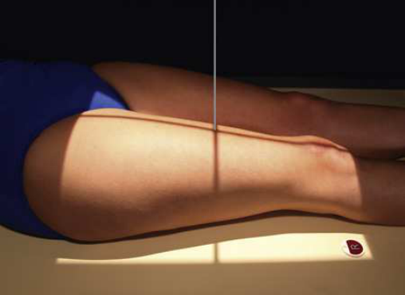
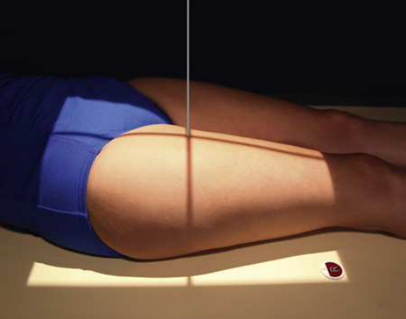
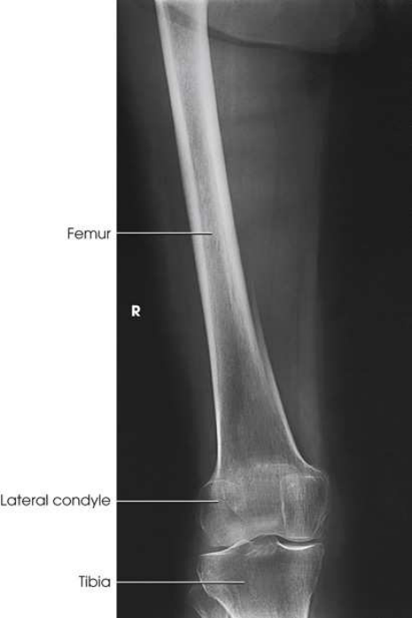
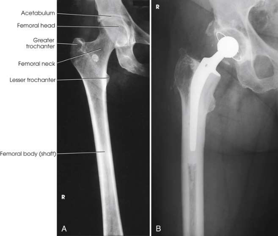

# Rx Femur — Incidență Antero-Posterioară (AP) (Merrill)

  📷 Radiografie Convențională (Rx)
  <strong>Actualizat:</strong> 2026-09-16
  <strong>Autor:</strong> Referință Merrill

---

-   __1. Rezumat Clinic & Indicații__

    ---

    === "Indicații Clinice"

        - Conform reperelor anatomice standard din tratat

    === "Ghid Național IRIS"

        !!! info "Referință Primară: Ghidul Național IRIS (Ordinul MS 1342/2012)"
            - **Capitol Ghid IRIS:** *Ghidul Național IRIS*
            - **Grad de Recomandare:** **De verificat pe indicație; fără grad atribuit automat**
            - **Nivel de Iradiere Estimată:** `De verificat pentru examinarea și populația selectate`

            [:octicons-search-16: Deschide Ghidul IRIS](../../iris.md){ .md-button .md-button--primary } [:material-open-in-new: Aplicația Oficială PWA](https://radiologie-pediatrica.ro/iris/){ .md-button target="_blank" rel="noopener" }
-   __2. Poziționare & Centrare Fascicul__

    ---

    - **Poziție Pacient:** se așază pacientul în Decubit dorsal poziție. Check Bazin (bazin (pelvis)) la ensure it este nu rotit.; se centrează afected thigh la linia mediană receptorul de imagine. When pacientul este too tall pentru include entire Femur, include pe single imagine articulație cel mai apropiat de aria de interes diagnostic. cu Genunchi included pentru incidență de dis̍ al Femur, se rotește pacient’s extremity internally la place it în true anatomic poziție. extremity este naturally turned externally when pacientul este culcat pe masa de examinare. Ensure that epicondyles sunt paralel cu receptorul de imagine. Place bottom de receptorul de imagine 2 inches (5 cm) below Genunchi articulație (Fig. 7.164). cu Șold included pentru incidență de proximal Femur, which trebuie să include Șold articulație, place top de receptorul de imagine la nivelul spină iliacă antero-superioară (SIAS) (Fig. 7.165). se rotește extremity internally 10 la 15 grade la place col femural în profile. se efectuează ecranarea gonadelor cu șorț plumbat.
    - **Punct de Centrare Fascicul:** perpendicular pe midfemur și center de receptorul de imagine.
    - **Distanță Focar-Film (DFF / SID):** Nespecificat în fragmentul extras; de verificat în sursă
    - **Comandă Respiratorie:** Conform reperelor anatomice standard din tratat

-   __3. Parametri Tehnici Expunere__

    ---

    | Parametru Tehnic | Valoare Configurare Generator / Tub |
    |:-----------------|:-------------------------------------|
    | **Tensiune Tub (kV)** | DE CONFIGURAT PE APARAT |
    | **Sarcină / Produs Curent-Timp (mAs)** | DE CONFIGURAT PE APARAT |
    | **Distanță Focar-Film (DFF / SID)** | Nespecificat în fragmentul extras; de verificat în sursă |
    | **Grilă Antidifuzoare (Bucky)** | DE CONFIGURAT PE APARAT |
    | **Dimensiune Focar** | DE CONFIGURAT PE APARAT |
    | **Camere de Ionizare AEC** | DE CONFIGURAT PE APARAT |
    | **Colimare Fascicul** | se ajustează câmp de iradiere la 1 inch (2.5 cm) pe sides de shadow de thigh și 17 inches (43 cm) în length. Place marker de lateralitate (D/S) în collimated expunere field. |
    | **Filtrare Tub** | DE CONFIGURAT PE APARAT |

-   __4. Criterii de Calitate & Reușită Imagine__

    ---

    - Criterii radiologice de calitate imaginii:
    - Evidence de corect collimation și presence de marker de lateralitate (D/S) plasat clear de anatomy de interest
    - Most de Femur și articulație cel mai apropiat de pathologic condition sau site de injury (second incidență de other articulație este recommended)
    - col femural nu foreshortened pe proximal Femur
    - mic trohanter nu seen beyond medial margine de Femur sau only very small portion seen pe proximal Femur
    - fără Genunchi rotație pe distal Femur
    - orice orthopedic appliance în its entirety
    - Bony detalii trabeculare osoase și surrounding soft tissues

-   __5. Protecție Radiologică (ALARA)__

    ---

    - Nespecificat în fragmentul extras; de verificat în sursă

!!! note "Observații Clinice & Tehnice"
    Conform reperelor anatomice standard din tratat

### 🖼️ Imagini

<figure class="protocol-image-card" markdown>

<figcaption><strong>Merrill — pagina PDF 577, imaginea 1</strong> — Imagine din fragmentul sursă; asocierea necesită revizie.</figcaption>

</figure>

<figure class="protocol-image-card" markdown>

<figcaption><strong>Merrill — pagina PDF 578, imaginea 2</strong> — Imagine din fragmentul sursă; asocierea necesită revizie.</figcaption>

</figure>

<figure class="protocol-image-card" markdown>

<figcaption><strong>Merrill — pagina PDF 579, imaginea 3</strong> — Imagine din fragmentul sursă; asocierea necesită revizie.</figcaption>

</figure>

<figure class="protocol-image-card" markdown>

<figcaption><strong>Merrill — pagina PDF 580, imaginea 4</strong> — Imagine din fragmentul sursă; asocierea necesită revizie.</figcaption>

</figure>

=== "Ghid Rapid de Execuție"

    1. **Identificarea și verificarea pacientului:** verificare identitate, zonă de examinat, consimțământ conform procedurii și evaluarea posibilității unei sarcini, când este relevantă.
    2. **Pregătire:** îndepărtarea oricăror obiecte radiopace (bijuterii, agrafe, fermoare, proteze, pansamente dense).
    3. **Poziționare precisă:** alinierea receptorului de imagine și a tubului la distanța prescrisă (Nespecificat în fragmentul extras; de verificat în sursă).
    4. **Colimare strictă:** adaptarea fasciculului strict la regiunea de diagnostic pentru scăderea iradierii și reducerea radiației difuze.
    5. **Radioprotecție:** verificarea [politicii RX](../radioprotectie.md), cu măsuri distincte pentru pacient, personal și însoțitor.

## Surse de documentare

- [Merrill’s Atlas, 7. Lower Extremity, pagini PDF 576–580](../../assets/protocols/sources/a56d45c16829_Merrills_Atlas_of_Radiographic_Positioning__Procedures_3Vol_Set.pdf#page=576)

## Fragmente sursă traduse (referință tehnică)

### anatomy

AP incidență de femur, including genunchi articulație sau hip sau ambele (Figs. 7.166 și 7.167).

### collimation

• se ajustează câmp de iradiere la 1 inch (2.5 cm) pe sides de shadow de thigh și 17 inches (43 cm) în length. Place marker de lateralitate (D/S)
în collimated expunere field.

### cr

• perpendicular pe midfemur și center de receptorul de imagine.

### criteria

Criterii radiologice de calitate imaginii:
• Evidence de corect collimation și presence de marker de lateralitate (D/S) plasat clear de anatomy de interest
• Most de femur și articulație cel mai apropiat de pathologic condition sau site de injury (second incidență de other articulație este
recommended)
• col femural nu foreshortened pe proximal femur
• mic trohanter nu seen beyond medial margine de femur sau only very small portion seen pe proximal femur
• fără genunchi rotație pe distal femur
• orice orthopedic appliance în its entirety
• Bony detalii trabeculare osoase și surrounding soft tissues

### part_pos

• se centrează afected thigh la linia mediană receptorul de imagine. When pacientul este too tall pentru include entire femur, include pe single imagine
articulație cel mai apropiat de aria de interes diagnostic.
cu genunchi included
• pentru incidență de dis̍ al femur, se rotește pacient’s extremity internally la place it în true anatomic poziție. extremity este
naturally turned externally when pacientul este culcat pe masa de examinare. Ensure that epicondyles sunt paralel cu receptorul de imagine.
• Place bottom de receptorul de imagine 2 inches (5 cm) below genunchi articulație (Fig. 7.164).
cu hip included
• pentru incidență de proximal femur, which trebuie să include hip articulație, place top de receptorul de imagine la nivelul spină iliacă antero-superioară (SIAS) (Fig. 7.165).
• se rotește extremity internally 10 la 15 grade la place col femural în profile.
• se efectuează ecranarea gonadelor cu șorț plumbat.

### patient_pos

• se așază pacientul în decubit dorsal.
• Check bazinul la ensure it este nu rotit.

### tech

poziționat prin manufacturer sau department protocol pentru corect anatomy display orientation; raza centrală plate: 14 × 17 inches (35 × 43 cm) longitudinal.

