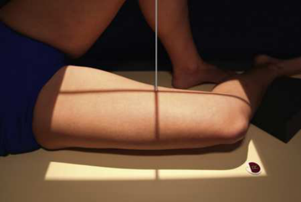
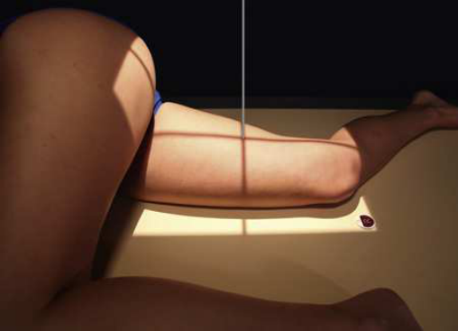
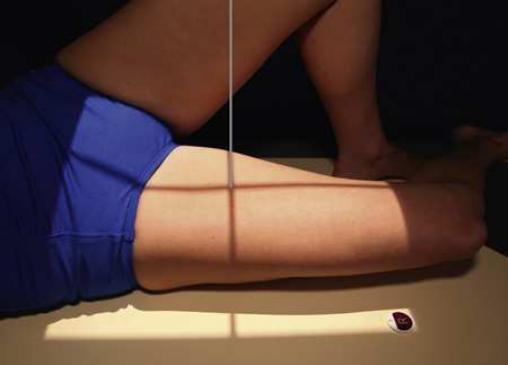
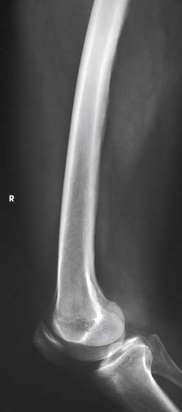

# Rx Femur — Incidență de Profil (Lateral) — Medio-Lateral (Merrill)

  📷 Radiografie Convențională (Rx)
  <strong>Actualizat:</strong> 2026-09-16
  <strong>Autor:</strong> Referință Merrill

---

-   __1. Rezumat Clinic & Indicații__

    ---

    === "Indicații Clinice"

        - Conform reperelor anatomice standard din tratat

    === "Ghid Național IRIS"

        !!! info "Referință Primară: Ghidul Național IRIS (Ordinul MS 1342/2012)"
            - **Capitol Ghid IRIS:** *Ghidul Național IRIS*
            - **Grad de Recomandare:** **De verificat pe indicație; fără grad atribuit automat**
            - **Nivel de Iradiere Estimată:** `De verificat pentru examinarea și populația selectate`

            [:octicons-search-16: Deschide Ghidul IRIS](../../iris.md){ .md-button .md-button--primary } [:material-open-in-new: Aplicația Oficială PWA](https://radiologie-pediatrica.ro/iris/){ .md-button target="_blank" rel="noopener" }
-   __2. Poziționare & Centrare Fascicul__

    ---

    - **Poziție Pacient:** Se instruiește pacientul să turn onto afected side. se ajustează corp poziție la se centrează afected thigh la linia mediană grilă.; cu Genunchi included pentru incidență de dis̍ al Femur, draw pacientul’s uppermost extremity posterior și support it (Fig. 7.168). This poziție poate also fie accomplished prin drawing upper extremity forward și supporting it la Șold level (Fig. 7.169). se ajustează Bazin (bazin (pelvis)) în true Incidență de Profil (lateral). se flectează afected Genunchi about 45 grade, place săculeți cu nisip under Gleznă (Articulație Talocrurală), și se ajustează corp rotație la place epicondyles perpendicular pe tabletop. se ajustează poziție de tăvița Bucky astfel încât receptorul de imagine projects approximately 2 inches (5 cm) beyond Genunchi la fie included. cu Șold included pentru incidență de proximal Femur, place top de receptorul de imagine la nivelul spină iliacă antero-superioară (SIAS). Draw upper most extremity posteriorly și support it. se ajustează Bazin (bazin (pelvis)) so that it este rolled posteriorly just enough la prevent superimposition; 10 la 15 grade de la Incidență de Profil (lateral) este suficient (Fig. 7.170). se efectuează ecranarea gonadelor cu șorț plumbat.
    - **Punct de Centrare Fascicul:** perpendicular pe midfemur și center de receptorul de imagine.
    - **Distanță Focar-Film (DFF / SID):** Nespecificat în fragmentul extras; de verificat în sursă
    - **Comandă Respiratorie:** Conform reperelor anatomice standard din tratat

-   __3. Parametri Tehnici Expunere__

    ---

    | Parametru Tehnic | Valoare Configurare Generator / Tub |
    |:-----------------|:-------------------------------------|
    | **Tensiune Tub (kV)** | DE CONFIGURAT PE APARAT |
    | **Sarcină / Produs Curent-Timp (mAs)** | DE CONFIGURAT PE APARAT |
    | **Distanță Focar-Film (DFF / SID)** | Nespecificat în fragmentul extras; de verificat în sursă |
    | **Grilă Antidifuzoare (Bucky)** | DE CONFIGURAT PE APARAT |
    | **Dimensiune Focar** | DE CONFIGURAT PE APARAT |
    | **Camere de Ionizare AEC** | DE CONFIGURAT PE APARAT |
    | **Colimare Fascicul** | se ajustează câmp de iradiere la 1 inch (2.5 cm) pe sides de shadow de thigh și 17 inches (43 cm) în length. Place marker de lateralitate (D/S) în collimated expunere field. |
    | **Filtrare Tub** | DE CONFIGURAT PE APARAT |

-   __4. Criterii de Calitate & Reușită Imagine__

    ---

    - Criterii radiologice de calitate imaginii:
    - Evidence de corect collimation și presence de marker de lateralitate (D/S) plasat clear de anatomy de interest
    - Most de Femur și articulație cel mai apropiat de pathologic condition sau site de injury (second radiografie de other end de Femur este recommended)
    - orice orthopedic appliance în its entirety
    - Bony detalii trabeculare osoase și surrounding soft tissues cu Genunchi included
    - Superimposed anterior surface de femoral condyles
    - Rotulă (Patelă) în profile
    - Open patellofemoral space
    - inferior surface de femoral condyles nu superimposed because de divergent rays cu Șold included
    - Opposite thigh nu over proximal Femur și Șold articulație
    - mare trohanter superimposed over distal col femural
    - mic trohanter vizibil pe medial aspect de proximal Femur

-   __5. Protecție Radiologică (ALARA)__

    ---

    - Nespecificat în fragmentul extras; de verificat în sursă

!!! note "Observații Clinice & Tehnice"
    Because de danger de fragment displacement, aforementioned poziție este nu recommended pentru pacienți cu suspiciune de fractură sau pacienți who poate have destructive disease. pacienți cu these conditions trebuie să fie examined în Decubit dorsal poziție prin placing receptorul de imagine vertically along medial sau lateral aspect de thigh și Genunchi și then directing raza centrală horizontally. wafer grilă sau grilă-front receptorul de imagine trebuie să fie used la minimize scattered radiation.

### 🖼️ Imagini

<figure class="protocol-image-card" markdown>

<figcaption><strong>Merrill — pagina PDF 581, imaginea 1</strong> — Imagine din fragmentul sursă; asocierea necesită revizie.</figcaption>

</figure>

<figure class="protocol-image-card" markdown>

<figcaption><strong>Merrill — pagina PDF 581, imaginea 2</strong> — Imagine din fragmentul sursă; asocierea necesită revizie.</figcaption>

</figure>

<figure class="protocol-image-card" markdown>

<figcaption><strong>Merrill — pagina PDF 582, imaginea 3</strong> — Imagine din fragmentul sursă; asocierea necesită revizie.</figcaption>

</figure>

<figure class="protocol-image-card" markdown>

<figcaption><strong>Merrill — pagina PDF 583, imaginea 4</strong> — Imagine din fragmentul sursă; asocierea necesită revizie.</figcaption>

</figure>

=== "Ghid Rapid de Execuție"

    1. **Identificarea și verificarea pacientului:** verificare identitate, zonă de examinat, consimțământ conform procedurii și evaluarea posibilității unei sarcini, când este relevantă.
    2. **Pregătire:** îndepărtarea oricăror obiecte radiopace (bijuterii, agrafe, fermoare, proteze, pansamente dense).
    3. **Poziționare precisă:** alinierea receptorului de imagine și a tubului la distanța prescrisă (Nespecificat în fragmentul extras; de verificat în sursă).
    4. **Colimare strictă:** adaptarea fasciculului strict la regiunea de diagnostic pentru scăderea iradierii și reducerea radiației difuze.
    5. **Radioprotecție:** verificarea [politicii RX](../radioprotectie.md), cu măsuri distincte pentru pacient, personal și însoțitor.

## Surse de documentare

- [Merrill’s Atlas, 7. Lower Extremity, pagini PDF 580–583](../../assets/protocols/sources/a56d45c16829_Merrills_Atlas_of_Radiographic_Positioning__Procedures_3Vol_Set.pdf#page=580)

## Fragmente sursă traduse (referință tehnică)

### anatomy

lateral incidență de about three-quarters de femur și adjacent articulație. If needed, use two IRs la show entire length de adult
femur (Figs. 7.171 și 7.172).

### collimation

• se ajustează câmp de iradiere la 1 inch (2.5 cm) pe sides de shadow de thigh și 17 inches (43 cm) în length. Place marker de lateralitate (D/S)
în collimated expunere field.

### cr

• perpendicular pe midfemur și center de receptorul de imagine.

### criteria

Criterii radiologice de calitate imaginii:
• Evidence de corect collimation și presence de marker de lateralitate (D/S) plasat clear de anatomy de interest
• Most de femur și articulație cel mai apropiat de pathologic condition sau site de injury (second radiografie de other end de femur
este recommended)
• orice orthopedic appliance în its entirety
• Bony detalii trabeculare osoase și surrounding soft tissues
cu genunchi included
• Superimposed anterior surface de femoral condyles
• rotulă (patelă) în profile
• Open patellofemoral space
• inferior surface de femoral condyles nu superimposed because de divergent rays
cu hip included
• Opposite thigh nu over proximal femur și hip articulație
• mare trohanter superimposed over distal col femural
• mic trohanter vizibil pe medial aspect de proximal femur

### notes

Because de danger de fragment displacement, aforementioned poziție este nu recommended pentru pacienți cu suspiciune de fractură sau
pacienți who poate have destructive disease. pacienți cu these conditions trebuie să fie examined în decubit dorsal prin placing receptorul de imagine vertically
along medial sau lateral aspect de thigh și genunchi și then directing raza centrală horizontally. wafer grilă sau grilă-front receptorul de imagine trebuie să fie
used la minimize scattered radiation.

### part_pos

cu genunchi included
• pentru incidență de dis̍ al femur, draw pacientul’s uppermost extremity posterior și support it (Fig. 7.168). This poziție poate also fie
accomplished prin drawing upper extremity forward și supporting it la hip level (Fig. 7.169).
• se ajustează bazin (pelvis) în true poziție de profil (lateral).
• se flectează afected genunchi about 45 grade, place săculeți cu nisip under ankle, și se ajustează corp rotație la place epicondyles
perpendicular pe tabletop.
• se ajustează poziție de tăvița Bucky astfel încât receptorul de imagine projects approximately 2 inches (5 cm) beyond genunchi la fie included.
cu hip included
• pentru incidență de proximal femur, place top de receptorul de imagine la nivelul spină iliacă antero-superioară (SIAS).
• Draw upper most extremity posteriorly și support it.
• se ajustează bazin (pelvis) so that it este rolled posteriorly just enough la prevent superimposition; 10 la 15 grade de la poziție de profil (lateral) este
suficient (Fig. 7.170).
• se efectuează ecranarea gonadelor cu șorț plumbat.

### patient_pos

• Se instruiește pacientul să turn onto afected side.
• se ajustează corp poziție la se centrează afected thigh la linia mediană grilă.

### tech

poziționat prin manufacturer sau department protocol pentru corect anatomy display orientation; raza centrală plate: 14 × 17 inches (35 × 43 cm) longitudinal.

