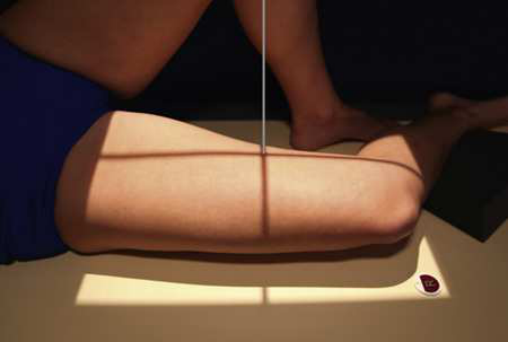
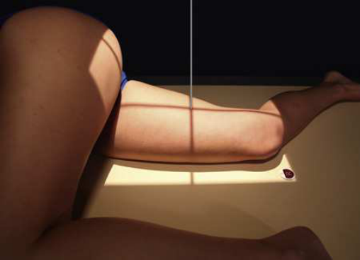
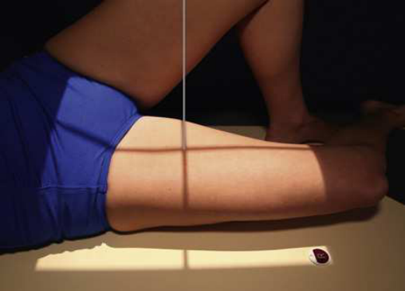
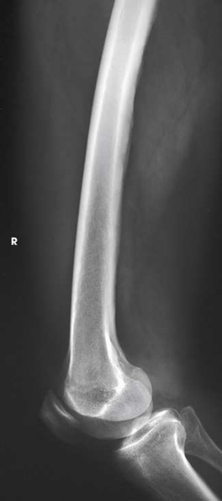

# Rx corp femural — incidență de profil — mediolaterală (Merrill)

  📷 Radiografie Convențională (Rx)
  <strong>Actualizat:</strong> 2026-09-16
  <strong>Autor:</strong> Referință Merrill

---

-   __1. Rezumat Clinic & Indicații__

    ---

    === "Indicații Clinice"

        - Conform reperelor anatomice standard din tratat

    === "Ghid Național IRIS"

        !!! info "Referință Primară: Ghidul Național IRIS (Ordinul MS 1342/2012)"
            - **Capitol Ghid IRIS:** *Aparat locomotor & Membru inferior*
            - **Grad de Recomandare:** **Grad A**
            - **Nivel de Iradiere Estimată:** `Clasa 1 (Minimă < 0.05 mSv)`

            [:octicons-search-16: Deschide Ghidul IRIS](../../iris.md){ .md-button .md-button--primary } [:material-open-in-new: Aplicația Oficială PWA](https://radiologie-pediatrica.ro/iris/){ .md-button target="_blank" rel="noopener" }

-   __2. Poziționare & Centrare Fascicul__

    ---

    - **Poziție Pacient:** Instruiți pacientul să se întoarcă pe partea afectată. Ajustați poziția corpului pentru a centra coapsa afectată pe linia mediană a grilei. Cu genunchiul inclus pentru incidența femurului distal, trageți extremitatea superioară a pacientului posterior și susțineți-o (Fig. 7.168). Această poziție poate fi obținută și prin tragerea extremității superioare anterior și susținerea ei la nivelul șoldului (Fig. 7.169). Ajustați bazinul în adevărata incidență de profil. Flectați genunchiul afectat la aproximativ 45 de grade, plasați saci cu nisip sub gleznă (articulația talocrurală) și ajustați rotația corpului pentru a plasa epicondilii perpendicular pe masa de examinare. Ajustați poziția tăviței Bucky astfel încât receptorul de imagine să depășească aproximativ 2 țoli (5 cm) dincolo de genunchi, pentru a-l include. Cu șoldul inclus pentru incidența femurului proximal, plasați partea superioară a receptorului de imagine la nivelul spinei iliace antero-superioare (SIAS). Trageți extremitatea superioară posterior și susțineți-o. Ajustați bazinul astfel încât să fie rulat posterior exact atât cât este necesar pentru a preveni suprapunerea; 10 la 15 grade față de incidența de profil sunt suficiente (Fig. 7.170). Efectuați ecranarea gonadelor cu șorț plumbat.
    - **Punct de Centrare Fascicul:** perpendicular pe mijlocul femurului și pe centrul receptorului de imagine.
    - **Distanță Focar-Film (DFF / SID):** Nespecificat în fragmentul extras; de verificat în sursă
    - **Comandă Respiratorie:** Conform reperelor anatomice standard din tratat

-   __3. Parametri Tehnici Expunere__

    ---

    | Parametru Tehnic | Valoare Configurare Generator / Tub |
    |:-----------------|:-------------------------------------|
    | **Tensiune Tub (kV)** | DE CONFIGURAT PE APARAT |
    | **Sarcină / Produs Curent-Timp (mAs)** | DE CONFIGURAT PE APARAT |
    | **Distanță Focar-Film (DFF / SID)** | Nespecificat în fragmentul extras; de verificat în sursă |
    | **Grilă Antidifuzoare (Bucky)** | DE CONFIGURAT PE APARAT |
    | **Dimensiune Focar** | DE CONFIGURAT PE APARAT |
    | **Camere de Ionizare AEC** | DE CONFIGURAT PE APARAT |
    | **Colimare Fascicul** | Ajustați câmpul de iradiere la 1 țol (2.5 cm) de fiecare parte a umbrei coapsei și 17 țoli (43 cm) în lungime. Plasați markerul de lateralitate (D/S) în câmpul de expunere colimat. |
    | **Filtrare Tub** | DE CONFIGURAT PE APARAT |

-   __4. Criterii de Calitate & Reușită Imagine__

    ---

    - Criterii radiologice de calitate a imaginii:
    - Evidențierea colimării corecte și prezența markerului de lateralitate (D/S), plasat fără a se suprapune peste anatomia de interes
    - Cea mai mare parte a femurului și articulația cea mai apropiată de afecțiunea patologică sau de locul leziunii (se recomandă o a doua radiografie a celuilalt capăt al femurului)
    - orice dispozitiv ortopedic în întregime
    - Detalii trabeculare osoase și țesuturile moi înconjurătoare, cu genunchiul inclus
    - suprafața anterioară suprapusă a condililor femurali
    - rotula în profil
    - spațiul patelofemural deschis
    - suprafața inferioară a condililor femurali nu este suprapusă din cauza razelor divergente, cu șoldul inclus
    - coapsa opusă nu se suprapune peste femurul proximal și articulația șoldului
    - marele trohanter suprapus peste colul femural distal
    - micul trohanter vizibil pe aspectul medial al femurului proximal

-   __5. Protecție Radiologică (ALARA)__

    ---

    - Nespecificat în fragmentul extras; de verificat în sursă

!!! note "Observații Clinice & Tehnice"
    Din cauza pericolului deplasării fragmentelor, poziția menționată anterior nu este recomandată pentru pacienții cu suspiciune de fractură sau pentru pacienții care pot avea boală distructivă. Pacienții cu aceste afecțiuni trebuie examinați în decubit dorsal, prin plasarea verticală a receptorului de imagine de-a lungul aspectului medial sau lateral al coapsei și genunchiului și apoi orientarea orizontală a razei centrale. Pentru minimizarea radiației împrăștiate trebuie utilizat un receptor de imagine cu grilă tip wafer sau cu grilă frontală.

### 🖼️ Imagini

<figure class="protocol-image-card" markdown>

<figcaption><strong>Merrill — pagina 581, imaginea 1</strong> — Imagine din fragmentul sursă; asocierea necesită revizie.</figcaption>

</figure>

<figure class="protocol-image-card" markdown>

<figcaption><strong>Merrill — pagina 581, imaginea 2</strong> — Imagine din fragmentul sursă; asocierea necesită revizie.</figcaption>

</figure>

<figure class="protocol-image-card" markdown>

<figcaption><strong>Merrill — pagina 582, imaginea 3</strong> — Imagine din fragmentul sursă; asocierea necesită revizie.</figcaption>

</figure>

<figure class="protocol-image-card" markdown>

<figcaption><strong>Merrill — pagina 583, imaginea 4</strong> — Imagine din fragmentul sursă; asocierea necesită revizie.</figcaption>

</figure>

=== "Ghid Rapid de Execuție"

    1. **Identificarea și verificarea pacientului:** verificare identitate, zonă de examinat, consimțământ conform procedurii și evaluarea posibilității unei sarcini, când este relevantă.
    2. **Pregătire:** îndepărtarea oricăror obiecte radiopace (bijuterii, agrafe, fermoare, proteze, pansamente dense).
    3. **Poziționare precisă:** alinierea receptorului de imagine și a tubului la distanța prescrisă (Nespecificat în fragmentul extras; de verificat în sursă).
    4. **Colimare strictă:** adaptarea fasciculului strict la regiunea de diagnostic pentru scăderea iradierii și reducerea radiației difuze.
    5. **Radioprotecție:** verificarea [politicii RX](../radioprotectie.md), cu măsuri distincte pentru pacient, personal și însoțitor.

## Surse de documentare

- [Merrill’s Atlas, 7. Lower Extremity, pagini 580–583](https://books.google.com/books/about/Merrill_s_Atlas_of_Radiographic_Position.html?id=BM0lEQAAQBAJ)
