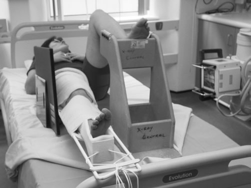
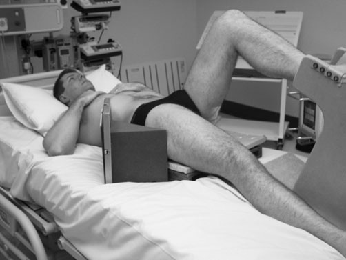
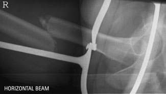
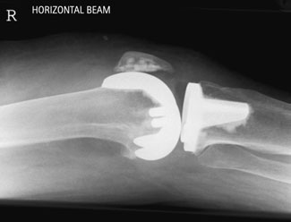

# Rx fractură de femur — profil

  📷 Radiografie Convențională (Rx)
  <strong>Actualizat:</strong> 2026-09-16
  <strong>Autor:</strong> Departamentul de Radiologie / Referință Clark (Ed. 12)

---

-   __1. Rezumat Clinic & Indicații__

    ---

    === "Indicații Clinice"

        - Evaluarea radiografică a regiunii: fractură de femur (profil).
        - Suspiciune de leziuni traumatice (fracturi, luxații sau diastazis articular).
        - Bilanț osteoarticular / visceral conform recomandării medicale de trimitere.

    === "Ghid Național IRIS"

        !!! info "Referință Primară: Ghidul Național IRIS (Ordinul MS 1342/2012)"
            - **Capitol Ghid IRIS:** *Aparat locomotor & Membru inferior*
            - **Grad de Recomandare:** **Grad A**
            - **Nivel de Iradiere Estimată:** `Clasa 1 (Minimă < 0.05 mSv)`

            [:octicons-search-16: Deschide Ghidul IRIS](../../iris.md){ .md-button .md-button--primary } [:material-open-in-new: Aplicația Oficială PWA](https://radiologie-pediatrica.ro/iris/){ .md-button target="_blank" rel="noopener" }

-   __2. Poziționare & Centrare Fascicul__

    ---

    - **Poziție Pacient:**
        - Echipamentul mobil de radiografie este repoziționat cu atenție pentru a permite radiografia cu fascicul orizontal.
        - Când examinarea vizează cele două treimi distale ale femurului, caseta poate fi poziționată vertical pe partea medială a coapsei, iar fasciculul orizontal orientat lateromedial.
        - Când se examinează partea proximală a diafizei sau colul femurului, caseta este poziționată vertical pe partea de profil a coapsei, iar fasciculul este orientat mediolateral, cu membrul inferior opus ridicat pe un suport adecvat, astfel încât coapsa neafectată să fie aproape verticală.
        - Pentru colul femural, caseta cu grilă antidifuzoare este poziționată vertical, cu o margine sprijinită pe talie, deasupra crestelor iliace, pe partea examinată, și ajustată cu axa longitudinală paralelă cu colul femural.
        - Pentru evidențierea unei suspiciuni de fractură a femurului superior, este esențial ca pacientul să fie ridicat de pe pat pe o structură rigidă adecvată, cum ar fi o pernă din spumă fermă sau un dispozitiv tunel pentru casetă.
    - **Punct de Centrare Fascicul:**
        - Pentru cele două treimi distale ale femurului, raza centrală orizontală este centrată la mijlocul casetei și paralelă cu linia care unește marginile anterioare ale condililor femurali.
        - Pentru evidențierea colului femural, incluzând șoldul (articulația coxofemurală), se centrează la jumătatea distanței dintre pulsul femural și proeminența palpabilă a marelui trohanter, cu raza centrală orientată orizontal și perpendicular pe casetă.
    - **Distanță Focar-Film (DFF / SID):** 100 cm
    - **Comandă Respiratorie:** Apnee pe durata expunerii (apnee în inspir pentru torace; expir pentru Abdomen/bazin).

-   __3. Parametri Tehnici Expunere__

    ---

    | Parametru Tehnic | Valoare Configurare Generator / Tub |
    |:-----------------|:-------------------------------------|
    | **Tensiune Tub (kV)** | DE CONFIGURAT PE APARAT |
    | **Sarcină / Produs Curent-Timp (mAs)** | Conform AEC / grosimii anatomice |
    | **Distanță Focar-Film (DFF / SID)** | 100 cm |
    | **Grilă Antidifuzoare (Bucky)** | Conform grosimii anatomice (> 10-12 cm cu grilă) |
    | **Dimensiune Focar** | Focar Mic (0.6 mm) |
    | **Camere de Ionizare AEC** | DE CONFIGURAT PE APARAT |
    | **Colimare Fascicul** | Colimare strictă la aria anatomică de interes diagnostic |
    | **Filtrare Tub** | Totală ≥ 2.5 mm Al echivalent (conform Clark: 3.0 mm Al echivalent) |

-   __4. Criterii de Calitate & Reușită Imagine__

    ---

    - Vizualizarea clară a întregii arii anatomice (fractură de femur).
    - Absența artefactelor de mișcare; trabeculație osoasă și contururi nete.
    - Densitate optică și contrast adecvate pentru diferențierea țesuturilor moi de structurile osoase.

-   __5. Protecție Radiologică (ALARA)__

    ---

    - Ecranare gonadică cu șorț plumbat dacă gonadele sunt în apropierea fasciculului util (regula ALARA).
    - Colimare precisă la dimensiunea anatomică strict necesară pentru reducerea dozei și a radiației difuze.
    - Verificarea posibilității unei sarcini la pacientele de vârstă fertilă înainte de expunere.

!!! note "Observații Clinice & Tehnice"
    La utilizarea grilei, este esențial ca aceasta să rămână verticală pentru a evita tăierea grilei. Radiografia postoperatorie pentru artroplastie: incidența antero-posterioară (AP) a șoldului se efectuează în 24 hours de la intervenție pentru a include treimea superioară a femurului și a evidenția proteza și restrictorul de ciment, care este distal față de proteză. Acesta poate fi evidențiat printr-un marker radioopac sub formă de bilă metalică, care trebuie să apară în toate imaginile ulterioare de urmărire ale șoldului (articulației coxofemurale), dacă a fost utilizat. Slăbirea protezei poate apărea prin impactarea tijei femurale a protezei în femurul nativ. Aceasta este detectată cel mai ușor prin observarea reducerii distanței dintre restrictorul de ciment și vârful protezei. Prin urmare, este foarte important ca prima imagine să includă restrictorul de ciment. Managementul nursing este, de asemenea, determinat prin confirmarea faptului că șoldul (articulația coxofemurală) nu s-a luxat. Incidențele antero-posterioară (AP) și de profil se obțin la genunchi după protezarea genunchiului. Pacient poziționat pentru femur de profil (genunchiul în sus) după aplicarea atelei Thomas; pacient poziționat pentru șold de profil, cu bazinul ridicat și sprijinit pe dispozitivul tunel pentru casetă; imagine de profil a femurului drept fracturat în atelă Thomas; imagine postoperatorie de profil a genunchiului folosind fascicul orizontal după protezarea articulației.

### 🖼️ Imagini

<figure class="protocol-image-card" markdown>

<figcaption><strong>Radiografie cu fascicul orizontal.</strong> — Poziționarea pacientului și centrarea fasciculului conform Clark (Ed. 12)</figcaption>

</figure>

<figure class="protocol-image-card" markdown>

<figcaption><strong>• Pentru evidențierea unei suspiciuni de fractură a femurului superior, este esențial</strong> — Aspect radiografic / ghid de poziționare conform tratatului Clark (Ed. 12)</figcaption>

</figure>

<figure class="protocol-image-card" markdown>

<figcaption><strong>Imagine de profil a femurului drept fracturat în atelă Thomas</strong> — Aspect radiografic / ghid de poziționare conform tratatului Clark (Ed. 12)</figcaption>

</figure>

<figure class="protocol-image-card" markdown>

<figcaption><strong>Figura 4: Aspect radiografic / Poziționare (Clark Ed. 12)</strong> — Aspect radiografic / ghid de poziționare conform tratatului Clark (Ed. 12)</figcaption>

</figure>

=== "Ghid Rapid de Execuție"

    1. **Identificarea și verificarea pacientului:** verificare identitate, zonă de examinat, consimțământ conform procedurii și evaluarea posibilității unei sarcini, când este relevantă.
    2. **Pregătire:** îndepărtarea oricăror obiecte radiopace (bijuterii, agrafe, fermoare, proteze, pansamente dense).
    3. **Poziționare precisă:** alinierea receptorului de imagine și a tubului la distanța prescrisă (100 cm).
    4. **Colimare strictă:** adaptarea fasciculului strict la regiunea de diagnostic pentru scăderea iradierii și reducerea radiației difuze.
    5. **Radioprotecție:** verificarea [politicii RX](../radioprotectie.md), cu măsuri distincte pentru pacient, personal și însoțitor.

## Surse de documentare

- [Clark's Positioning in Radiography (Ed. 12), Pagina 378](https://books.google.com/books/about/Clark_s_Positioning_in_Radiography.html?id=Xxu6MwEACAAJ)
