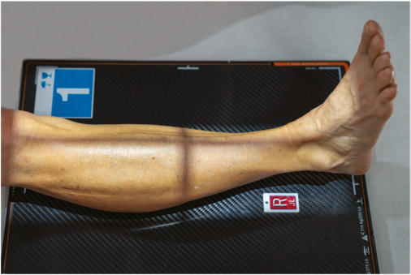
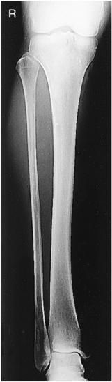
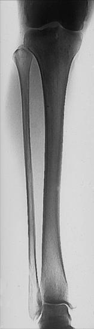

# Rx Gambă (TIBIA AND FIBULA) AP (Antero-Posterior)

  📷 Radiografie Convențională (Rx)
  <strong>Actualizat:</strong> 2026-09-15
  <strong>Autor:</strong> Departamentul de Radiologie / Referință Bontrager

---

-   __1. Rezumat Clinic & Indicații__

    ---

    === "Indicații Clinice"

        - Pathologies involving suspiciune de fractură, foreign bodies, or lesions of the bone

    === "Ghid Național IRIS"

        !!! info "Referință Primară: Ghidul Național IRIS (Ordinul MS 1342/2012)"
            - **Capitol Ghid IRIS:** *Ghidul Național IRIS*
            - **Grad de Recomandare:** **De verificat pe indicație; fără grad atribuit automat**
            - **Nivel de Iradiere Estimată:** `De verificat pentru examinarea și populația selectate`

            [:octicons-search-16: Deschide Ghidul IRIS](../../iris.md){ .md-button .md-button--primary } [:material-open-in-new: Aplicația Oficială PWA](https://radiologie-pediatrica.ro/iris/){ .md-button target="_blank" rel="noopener" }
-   __2. Poziționare & Centrare Fascicul__

    ---

    - **Poziție Pacient:** Pacient: Place patient in the Decubit Dorsal position; provide a pillow for patient’s head; entire leg should be fully extended.; Regiune anatomică: Adjust Bazin (Pelvis), Genunchi, and leg into true AP with Absența rotației anatomice: clavicule echidistante față de linia apofizelor spinoase (Fig. 6.98). Place sandbag against Picior if needed for stabilization, and dorsiflex Picior to 90° to Gambă if possible. Ensure that both Gleznă (Articulație Talocrurală) and Genunchi joints are 1 to 2 inches (2.5 to 5 cm) from ends of IR (so that divergent rays do not project either joint off IR). If limb is too long, place the Gambă diagonally (corner to corner) on one 14 × 17inch (35 × 43- cm) IR to ensure that both joints are included. (Also, if needed, a second smaller IR may be taken of the joint farthest from the injury site.)
    - **Punct de Centrare Fascicul:** perpendicular to IR, directed to midpoint of Gambă
    - **Distanță Focar-Film (DFF / SID):** 100 cm
    - **Comandă Respiratorie:** Apnee pe durata expunerii (sau conform cooperării pacientului)

-   __3. Parametri Tehnici Expunere__

    ---

    | Parametru Tehnic | Valoare Configurare Generator / Tub |
    |:-----------------|:-------------------------------------|
    | **Tensiune Tub (kV)** | 70-80 kV |
    | **Sarcină / Produs Curent-Timp (mAs)** | DE CONFIGURAT PE APARAT |
    | **Distanță Focar-Film (DFF / SID)** | 100 cm |
    | **Grilă Antidifuzoare (Bucky)** | Fără grilă (expunere directă) |
    | **Dimensiune Focar** | Focar Mic (0.6 mm) |
    | **Camere de Ionizare AEC** | DE CONFIGURAT PE APARAT |
    | **Colimare Fascicul** | Collimate on both sides to skin margins, with full collimation at ends of IR borders to include maximum Genunchi and Gleznă (Articulație Talocrurală) joints. Alternative FollowUp Examination Routine The routine for followup examinations of long bones in some departments is to include only the joint that is nearest the site of injury and to place this joint a minimum of 2 inches (5 cm) from the end of the IR for better demonstration of the joint. However, for initial examinations, it is important, especially when the injury site is in the distal leg, to include the proximal tibiofibular joint area because it is common to have a second suspiciune de fractură at this site. For large patients, a second Incidență Antero-Posterioară (AP) of the Genunchi and proximal Gambă may be needed on a smaller IR. Lateral condyle Head of fibula Fibula Lateral malleolus Talus Medial malleolus Tibia Medial condyle Femur Intercondylar eminence Fig. 6.100 AP Gambă—both joints. (Courtesy J. Sanderson, RT.) Fig. 6.99 AP lower legboth joints. (Courtesy J. Sanderson, RT.) Gambă AP Lateral Fig. 6.98 AP Gambă—include both joints. |
    | **Filtrare Tub** | Totală ≥ 2.5 mm Al echivalent |

-   __4. Criterii de Calitate & Reușită Imagine__

    ---

    - Entire tibia and fibula must include Gleznă (Articulație Talocrurală) and Genunchi joints on this projection (or two if needed).
    - The exception is an alternative routine on followup examinations (Figs. 6.99 and 6.100). Position:
    - Absența rotației anatomice: clavicule echidistante față de linia apofizelor spinoase as evidenced by demonstration of femoral and tibial condyles in profile with intercondylar eminence centered within intercondylar fossa.
    - Some overlap of the fibula and tibia is visible at both proximal and distal ends.
    - Collimation to area of interest. Exposure:
    - Correct use of anode heel effect results in an image with nearerequal visualization of anatomy at both ends of IR.
    - No motion is present, as evidenced by sharp cortical margins and trabecular patterns.
    - Optimal image receptor exposure and contrast should be optimum to visualize soft tissue and bony trabecular markings at both ends of tibia.

-   __5. Protecție Radiologică (ALARA)__

    ---

    - Ecranare gonadică și a organelor radiosensibile conform procedurilor locale de radioprotecție ALARA.
    - Colimare strictă la aria de interes pentru limitarea radiației difuze.
    - Verificarea posibilității unei sarcini la pacientele de vârstă fertilă înainte de expunere.

### 🖼️ Imagini

<figure class="protocol-image-card" markdown>

<figcaption><strong>Fig. 6.100 AP Gambă—both joints.</strong> — Poziționare pacient conform Ghidului Bontrager (Fig. 6.100 AP lower leg—both joints.)</figcaption>

</figure>

<figure class="protocol-image-card" markdown>

<figcaption><strong>Fig. 6.99 AP Gambă—</strong> — Aspect radiografic de referință conform Ghidului Bontrager (Fig. 6.99 AP lower leg—)</figcaption>

</figure>

<figure class="protocol-image-card" markdown>

<figcaption><strong>Fig. 6.98 AP Gambă—include both joints.</strong> — Aspect radiografic de referință conform Ghidului Bontrager (Fig. 6.98 AP lower leg—include both joints.)</figcaption>

</figure>

=== "Ghid Rapid de Execuție"

    1. **Identificarea și verificarea pacientului:** verificare identitate, zonă de examinat, consimțământ conform procedurii și evaluarea posibilității unei sarcini, când este relevantă.
    2. **Pregătire:** îndepărtarea oricăror obiecte radiopace (bijuterii, agrafe, fermoare, proteze, pansamente dense).
    3. **Poziționare precisă:** alinierea receptorului de imagine și a tubului la distanța prescrisă (100 cm).
    4. **Colimare strictă:** adaptarea fasciculului strict la regiunea de diagnostic pentru scăderea iradierii și reducerea radiației difuze.
    5. **Radioprotecție:** verificarea [politicii RX](../radioprotectie.md), cu măsuri distincte pentru pacient, personal și însoțitor.

## Surse de documentare

- [Bontrager's Textbook of Radiographic Positioning (Ed. 9/10), Pagina 259](https://www.elsevier.com/books/textbook-of-radiographic-positioning-and-related-anatomy/lampignano/978-0-323-65367-1)
